# Protecting Your Voice from Speech Synthesis Attacks

Zihao Liu Iowa State University Ames,Iowa,USA zihaoliu@iastate.edu

Yan Zhang Iowa State University Ames,Iowa,USA yanzh@iastate.edu

Chenglin Miao Iowa State University Ames,Iowa, USA cmiao@iastate.edu

# ABSTRACT

In recent years, much attention has been paid to speech synthesis, which aims to generate synthetic speeches in a voice of a target speaker.Although the speech synthesis technique has facilitated a wide spectrum of applications that positively impact our daily lives, it can also be used by attackers to perform speech synthesis attacks.An attacker can use this technique to mimic the voice of a victim and transform arbitrarily chosen text or voice samples into the same content spoken by the victim. To protect a speaker's voice from speech synthesis attacks,in this paper, we propose two novel defense schemes that can be used by the speaker to process his or her speeches before publishing them on social media platforms or sending them to others.The processed speeches cannot only significantly degrade the performance of speech synthesis systems but also keep the sound of the speaker's voice so that they can still be used for normal purposes. The desirable performance of the pro-posed defense schemes is verified through extensive experiments conducted on several real-world speaker recognition (SR) systems and a user study on a public crowdsourcing platform.

# CCS CONCEPTS

· Computing methodologies Machine learning; $\bullet$ Security and privacy Human and societal aspects of security and privacy.

# KEYWORDS

speech synthesis, malicious atacks, biometric security

# ACMReference Format:

Zihao Liu, Yan Zhang,and Chenglin Miao.2023.Protecting Your Voice from Speech Synthesis Attacks.In Annual Computer Security Applications Conference (ACSAC '23),December 04-08,2023,Austin,TX,USA.ACM,New York,NY,USA,15 pages.https://doi.org/10.1145/3627106.3627183

# 1INTRODUCTION

Today,we are living in a voice-driven world.The consumption of audio content and voice-based automated services are penetrating every corner of human society and becoming a necessary part of our lives.Many content creators are moving to audio platforms such as SoundCloud [9] and Audible 6]. The tech giants like Google,Amazon,and Apple are investing heavily in their voice-based services. Inaddition, the pervasive social media platforms (e.g.,Facebook,

WhatsApp,and TikTok) make it very easy for us to share and enjoy various audio contents.

With the above advancements,more and more users expect to be able to customize the voice of various voice agents as they like. For example,some users may like to hear their familiar voice when using audiobooks or voice-based traffic navigation.To address this need, much attention has been paid to speech synthesis,which aims to generate synthetic speech ina voice of a target speaker.The stateof-the-art speech synthesis methods mainly rely on deep neural networks (DNNs) to achieve outstanding performance,and these methods can be divided into two categories: voice conversion (VC) [19,22,37,40,41,52] and text-to-speech (TTS)[16,29,30,36,51,57].

The goal of VC is to convert the voice samples of a source speaker into the same content spoken by a target speaker, while TTS aims to transformarbitrary text into the spoken words of the target speaker. Speech synthesis has enabled a wide spectrum of applications with positive effects on our daily life.For example,this technology can help people who have lost their voice communicate with others [10,43].It can also benefit spoken language translation [35,47] and increase human trust in healthcare robots [33].

While we are enjoying the positive uses of speech synthesis, we should not neglect the fact that it can also be used by attackers to perform malicious attacks.According to the Wall Street Journal, in August 2019,criminals used artificial intelligence-based software to impersonate the voice of a CEO who worked in a U.K.-based energy firm and successfully swindled more than $\$ 243,000$ by speaking on the phone [2].In October 2021,Forbes reported that speech synthesis had been used ina huge heist,where fraudsters cloned a company director's speech based on this technology and finally stole $\$ 35$ million from a bank [3].These reports show that speech synthesis has been misused by malicious partiesand brought severe damage in practice.In this paper,we refer to the above attack as speech synthesis attack,where an attacker aims to mimic the voice of a target speaker and transform his chosen text or voice samples into the same content spoken by the target.Besides carrying out a heist,speech synthesis attack can also be used for many other malicious purposes.For example,it can fool the voice-based authentication systems built in various devices (e.g.,laptops, tablets,or smartphones) and allow the attacker to gain access to these devices [14,50,54,55,60,62,65,70,71].

While many defense schemes have been developed to mitigate the abuse of speech synthesis,the majority concentrate on fake speech detection [12,13,18,20,23,27,63,68,69].To the best of our knowledge,only one work,Attack-VC [31],focuses on fake speech prevention.Existing detection algorithms usually achieve the detection goalby discovering artifacts [12,13,26,39,64] of fake speeches or identifying unique evidence of real speeches,such as liveness evidence [18,63,69].These defenses have been shown to rely heavily on some specific assumptions and recording conditions.

In addition, the detection algorithm is usually implemented after severe consequences have already occurred. The above issues have significantly limited the application of existing detection algorithms. Attack-VC studies the prevention of unauthorized speech synthesis byadding carefully-designed perturbations to the target speaker's speeches before the attacker obtains them.Despite the significant contributions of Attack-VC to this new area,it does have certain limitations.First,Attack-VC faces a challenge in simultaneously reducing the attack's effectiveness while maintaining the normal usability of the target speaker's speeches.Second, this scheme primarily follows awhite-box setting,requiring the defender to have full knowledge of a speech synthesis system.However, in reality,users may only have access to the system's API and cannot get its details. Third,Attack-VC lacks efficiency in protectig a speaker's voice,as it necessitates a separate optimization process for each of the target speaker's speech samples to create a protected version.

To address the above limitations, in this paper, we propose a novel defense scheme that aims to prevent the attacker from generating synthetic speeches with high quality.The proposed scheme is based on a black-box setting,and it does not require the details of potential speech synthesis systems.The basic idea of our defense scheme is to modify the target speaker's speeches in the frequency domain before publishing them or sending them to others.Our investigation shows that the speech signal contains some specifc frequencies on which the modification can significantly degrade the performance of the speech synthesis models but has little impact on human perception. By identifying these important frequencies for each speech sample and modifying the signal accordingly, the target speaker can effectively protect his or her voice from speech synthesis attacks.Besides,to make the defense efficient,we also propose a speaker-level defense scheme, based on which the target speaker does not need to identify the important frequencies for each of his or her speeches.Instead, the target speaker can use a universal defense strategy to effciently process any speech.The performance of the proposed defense schemes is evaluated on several real-world speaker recognition (SR) systems.We also conduct a user study to evaluate the impact of these schemes on human perception. Extensive experimental results demonstrate that our defense schemes can significantly degrade the performance of existing speech synthesis systems while guaranteeing that the processed speeches can still be used for their normal purposes.

# 2BACKGROUND AND RELATED WORK

# 2.1 Speech Synthesis

In speech synthesis attacks,the attacker aims to steal a target speaker's voice identity and generate a synthetic version of the target's voice,speaking some specific words chosen by the attacker. The history of generating synthetic speech can be traced back to the 1930s [45],and many speech synthesis methods have been proposed since then [15,38,58].In recent years,with the rapid development of deep learning techniques,deep neural network (DNN)-based speech synthesis has drawn much attention and has significantly improved the quality of the synthesized speech [16,19,22,29,30, 36,37,40,41,51,52,57].However, the outstanding performance of DNN-based speech synthesis also strengthens the attackers who want to perform speech synthesis attacks and brings more security concerns.In this paper, we mainly focus on two types of DNN-based speech synthesis systems that can be used to perform the speech synthesis attacks: voice conversion (VC) and text-to-speech (TTS).

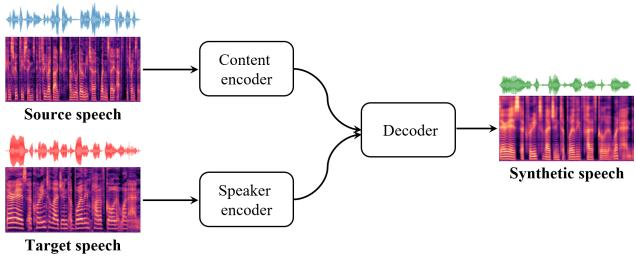  
Figure 1: Voice conversion framework.

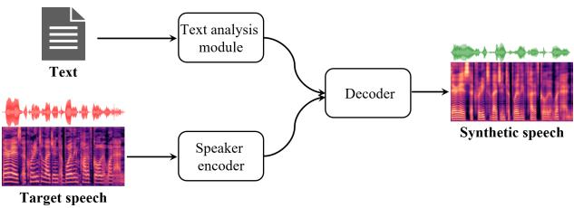  
Figure 2: Text-to-speech framework.

2.1.1Voice conversion. The VC systems aim to convert a speech signal uttered by a source speaker to sound as if it was uttered by a target speaker while keeping the linguistic contents unchanged. Figure 1 shows the general framework of state-of-the-art voice conversion models [32],which mainly contains a content encoder, a speaker encoder,and a decoder. The inputs of the content encoder and the speaker encoder are the speeches provided by the source speaker and the target speaker, respectively.The goal of the content encoder is to extract the content information from the source speech,and the speaker encoder aims to embed the voice characteristics of the target speaker as a latent vector.The outputs of the two encoders are fed into the decoder,which can generate the synthetic speech.The sound of the synthetic speech is similar to that of the target speech, but the content information is the same as that of the source speech.VC has been widely adopted to perform speech synthesis attacks [42,44,67],where the source speech is chosen by the attacker,and the target speech is collected by the attacker from the victim speaker. In practice, there are many ways that can be used by the attacker to collect the victim's speech.For example,the attacker may obtain the victim's speech from public or private media. He can also collect the speech samples by recording the victim's speech in a public setting.

2.1.2Text-to-speech.Similar to VC,TTS takes arbitrary texts and the target utterance that provides voice characteristics as inputs to synthesize a speech [16,24,30,36,51,53].The general framework for the DNN-based TTS systems is shown in Figure 2.The speaker encoder here is similar to that in Figure 1,and it outputs an embedding that captures the voice characteristics of the target speaker. The text analysis module is used to extract the linguistic features from the input text,which is chosen by the attacker. Both the embedding and linguistic features are fed into the decoder to generate the synthetic speech.

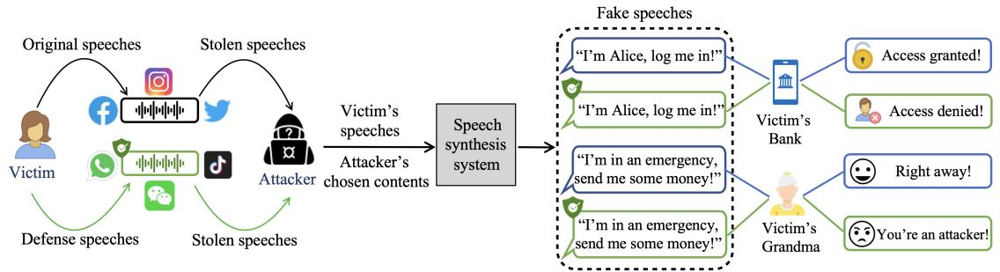  
Figure 3: Workflow of the speech synthesis attack and the defense scheme.

# 2.2Defending against Speech Synthesis Attacks

To mitigate speech synthesis attacks,many defense methods have been developed.Most focus on the post-detection of synthetic speeches while only one work,Attack-VC [31],studies how to prevent the attacker from generating synthetic speeches.

Existing detection methods focus either on identifying the speaker or detecting the artifacts of fake speeches. SR systems are engineered to detect speakers.They typically enroll a speaker's voice identity and then verify if a new voice sample matches the enrolled voice identity.However,a recent work [67] found that modern SR systems are vulnerable to speech synthesis attacks [42,44,67],highlighting the need for more advanced algorithms to enhance the reliability of SRs.In addition to considering the biometrics embedded in speeches,many works detect fake speeches by searching for supporting evidence.Some of them [18,63,69] verify the evidence of whether a speech is spoken by a live person or is uttered bya registered fraudster [23].Other detection algorithms [12,13,56,68] focus on identifying the traces produced by machines.However, these works usually rely on specific assumptions or recording conditions,such as specific devices and distances between the microphone and the speaker. Additionally, existing detection algorithms are sometimes sensitive to contents and languages [26].The above issues have significantly limited the application of existing detection algorithms in practice.

Unlike the fake speech detection algorithms implemented after the speech synthesis process,Attack-VC focuses on defense beforehand.This mechanism mitigates the attack by adding carefullydesigned perturbations to speech samples.However, to achieve good defense performance,Attack-VC needs to add large perturbations to speeches.As a result,the perturbed speeches do not sound like the original speeches,which may affect the normal usability of these speeches.Besides,Attack-VC is based on white-box setting, where the defender needs to know the details about the speech synthesis system (e.g.,model parameters) adopted by the attacker, which are usually diffcult to obtain in practice.Additionally, this mechanism requires optimization to generate perturbations for each speech sample,making it inefficient for time-sensitive applications such as sending instant voice messages.

# 3PROBLEM SETTING

As shown in Figure 3,we considera scenario where an attacker aims to imitate a target speaker's voice by launching speech synthesis attacks.We assume that the attacker can obtain some speech samples of the target speaker (i.e.,the victim) from public or private media.For example,the attacker can obtain these speech samples from the video/audio published by the target speaker on some social media platforms (e.g.,Facebook, Instagram,and TikTok).In addition, the attacker may be a friend of the target speaker and they may send voice messages to each other via messaging apps (e.g.,WhatsApp and WeChat).It is easy for the attacker to extract some speech samples from the video/audio or voice messages he obtained.After collecting the speech samples,the attacker uses the speech synthesis system based on either VC or TTS to generate the synthetic speech with arbitrary chosen contents.

Our goal in this paper is to develop a defense scheme that can be used to protect the target speaker's voice from speech synthesis attacks.As shown in Figure 3,the target speaker can use our proposed scheme to process his or her speeches to generate defense speeches before publishing them on social media platforms or sending them to others.Even if the attacker obtains the processed speech samples,he cannot generate his desirable synthetic speeches based on existing speech synthesis systems.In addition, we hope that the proposed defense scheme has little impact on the sound of the target speaker's voice so that the processed speeches can still be used for normal purposes.For example,the processed speeches should be normal for human perception.

We formally define the problem targeted in this paper as follows. Suppose $_ x$ is the speech sample collected by the attacker from the target speaker. $\mathcal { D }$ denotes the defense strategy that is derived based on our proposed scheme,and it is used to process the target's speeches,and $x _ { d }$ denotes the processed speech after applying $\mathcal { D }$ to $_ x$ (i.e., $\boldsymbol { x } _ { d } = \mathcal { D } ( \boldsymbol { x } ) ,$ .To measure the impact of $\mathcal { D }$ on $_ { x }$ we define the quality change of $_ x$ after applying the defense strategy as

$$
\Delta Q _ { d } ( x ) = 1 - S ( E _ { s } ( x _ { d } ) , E _ { s } ( x ) ) ,
$$

where $E _ { s }$ is the speaker encoder. $E _ { s } ( { \boldsymbol { x } } _ { d } )$ and $E _ { s } ( x )$ are the embeddings of $x _ { d }$ and $_ { x }$ ,respectively. $S ( E _ { s } ( x _ { d } ) , E _ { s } ( x ) ) \in [ 0 , 1 ]$ is the similarity score between $E _ { s } ( { \boldsymbol { x } } _ { d } )$ and $E _ { s } ( x )$ .Obviously,the smaller the $\Delta Q _ { d } ( x )$ ,the less impact the defense strategy has on $_ { x }$ .Weuse $\mathcal { W }$ to denote the speech synthesis model. Please note that in this paper we consider a black-box setting,where we do not know the details about the speech synthesis model (e.g.,model architecture and parameters), but we can obtain the model output (i.e., the synthetic speech) given an input. Similarly, to measure the impact of $\mathcal { D }$ on the synthetic speech, we define the quality change of the synthetic speech after applying the defense strategy as

$$
\Delta Q _ { I } ( \pmb { x } ) = S ( E _ { s } ( \pmb { \mathcal { W } } ( \pmb { x } ) ) , e _ { s } ) - S ( E _ { s } ( \pmb { \mathcal { W } } ( \pmb { x } _ { d } ) ) , e _ { s } ) ,
$$

where $\mathcal { W } ( \boldsymbol { x } )$ and $\mathcal { W } ( \boldsymbol { x } _ { d } )$ denote the generated synthetic speeches based on $_ { x }$ and $x _ { d }$ ,respectively. $e _ { s }$ is the speaker's average voice embedding,which is derived based on the speaker's real speech samples. $S ( E _ { s } ( \mathcal { W } ( x ) ) , e _ { s } )$ represents the similarity score between the embedding of the generated synthetic sample and $e _ { s }$ .Here $e _ { s }$ is used to measure the quality of the synthetic speech.The larger the $S ( E _ { s } ( \mathcal { W } ( x ) ) , e _ { s } )$ ,the better the synthetic speech. $\Delta Q _ { I } ( x )$ reflects the change of the above similarity score after applying the defense strategy.Our goal hereis to finda defense strategy $\mathcal { D }$ that can maximize $\Delta Q _ { I } ( x )$ while guaranteeing that $\Delta Q _ { d } ( x )$ has little impact on the usability of $_ x$ in benign environments.

# 4METHODOLOGY

# 4.1Defense via Frequency Modification

To protect the target's voice from speech synthesis attacks,we propose to modify the target's speeches in the frequency domain before publishing them or sending them to others.Our investigation shows that the speech signal contains some specific frequencies on which the modification can significantly degrade the performance of speech synthesis models but has little impact on human perception. The basic idea of our proposed defense scheme is to identify these specific frequencies and modify the signal on these frequencies.In this paper, we consider three types of modification methods: Zero Mask,Adaptive Noise Mask (AN-Mask),and Gaussian Blur Mask (GB-Mask).

Zero Mask.This method is intuitive and it aims to mask some frequencies of a target speech signal by setting their amplitudes to 0.Suppose $\pmb { x } \in \mathbb { R } ^ { M \times T }$ is the mel spectrogram of a speech sample produced by the target speaker, where $M$ refers to the dimension of the mel spectrogram in the frequency domain,and the $T$ refers to the dimension in the time domain.We denote such modification method as

$$
\begin{array} { r } { \mathcal { M } _ { Z } ( \boldsymbol { x } , \mathbb { F } ) = \{ \boldsymbol { x } | a _ { f } ^ { t } = 0 , \forall f \in \mathbb { F } \mathrm { a n d } \forall t \in [ 0 , T ] \} , } \end{array}
$$

where $\mathbb { \breve { F } }$ is a set offrequencies that are chosen to modify for $_ { x }$ $a _ { f } ^ { t }$ is the amplitude of the frequency $f$ at time $t$

Adaptive Noise Mask (AN-Mask).In this method, we perturb the speech sample by adding some noises to the amplitudes of the chosen frequencies. Specifically,we denote this method as

$$
\mathcal { M } _ { A N } ( \boldsymbol { x } , \mathbb { F } ) = \{ \boldsymbol { x } | a _ { f } ^ { t } = a _ { f } ^ { t } + C ( \eta ( \cdot ) ) , \forall f \in \mathbb { F } \mathrm { a n d } \forall t \in [ 0 , T ] \} ,
$$

where $\eta ( \cdot )$ is a noise generation function (e.g., Gaussian noise and Laplace noise),and $C ( \cdot )$ refers to the clipping function that constrains the perturbation.To ensure the perturbation remains subtle, we constrain the noise using a constant $\epsilon$ and limit the perturbation to a valid range.

Gaussian Blur Mask (GB-Mask). The third type of modification method is based on Gaussian blur,which is a noise reduction low-pass filter that is widely used in image processing.The intuition behind this method is to filter some details of the target speech signal that may help speech synthesis models capture the speaker's voice characters.Specifically, the Gaussian blur smooths speech signals by convolving them with a Gaussian kernel. The Gaussian function for constructing the kernel can be expressed as

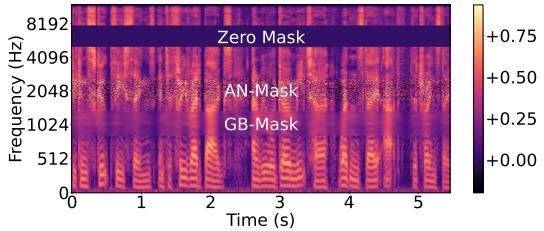  
Figure 4: The mel spectrogram with different modification methods.

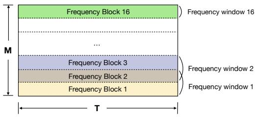  
Figure 5: Frequency partition.

$$
\begin{array} { r } { G ( p , q ) = \frac { 1 } { 2 \pi \sigma ^ { 2 } } e ^ { - \frac { p ^ { 2 } + q ^ { 2 } } { 2 \sigma ^ { 2 } } } , } \end{array}
$$

where $\mathcal { P }$ and $q$ are the distances to the center of the kernel in the horizontal and vertical axis,respectively. Similar to the aforementioned methods,we simplify the process of applying GB-Mask to $_ x$ as:

$$
\mathcal { M } _ { G B } ( \boldsymbol { x } , \mathbb { F } ) = \{ \boldsymbol { x } | \boldsymbol { a } _ { f } ^ { t } = \phi ( \boldsymbol { a } _ { f } ^ { t } , G ) , \forall f \in \mathbb { F } \mathrm { a n d } \forall t \in [ 0 , T ] \} ,
$$

where the $\phi ( \cdot , \cdot )$ refers to the mapping function that converts the original amplitude $a _ { f } ^ { t }$ to a new value based on the given Gaussian function $G$

Figure 4 shows the spectrogram of a speech sample after applying the above three types of modifications to different frequency bands. We can see that different modifications have different impacts on the speech signal,and they can obviously change the pattern of the signal.

To demonstrate the effectiveness of the above modification methods on defending against the speech synthesis attack,we next conduct a case study that aims to answer the following three key questions.

(1)Are the above modification methods effective for different speech synthesis models?   
(2) Do the three types of modification methods have different defense effectiveness fora given speech synthesis model?   
(3)Does the selection of frequency bands affect the defense effectiveness?

In this case study,we consider three widely used speech synthesis models: Chou's model [22],AutoVC [52],and SV2TTS [36].The first two modelsare used forVC,and the third one is used forTTS.In addition,we use the VCTK dataset [59] to study the effectiveness of different modification methods.This dataset contains the speeches of 109 English speakers.For each speech sample $_ { x }$ ,we uniformly partition it into 16 blocks in the frequency domain.As shown in Figure 5,the frequency band that combines two continuous blocks is called a frequency window. Please note that the last frequency window contains only one block.For each frequency window, we use the aforementioned three modification methods to modify it and feed the modified sample into each of the three adopted speech synthesis models.Here we take each of the aforementioned modification methods as a defense strategy (i.e., $\mathcal { D }$ )and modify one frequency window at a time. Then, we evaluate the quality changes of sample $_ x$ and the generated synthetic speech (i.e., $\Delta Q _ { d } ( x )$ and $\Delta Q _ { I } ( { \pmb x } ) )$ ,respectively.The similarity score between different embeddings in this case study is calculated based on cosine similarity function with a well-known speaker encoder,Resemblyzer [1].For example, if applying Zero-Mask method to a specific frequency window significantly degrades the synthetic speech quality while the speech sample remains nearly unaltered for human perception, we can infer that Zero Mask is effective on defending against the speech synthesis attack. For a given speech synthesis model, we say a modification method $\mathcal { M } \in \{ \mathcal { M } _ { Z } , \mathcal { M } _ { A N } , \mathcal { M } _ { G B } \}$ is effective on frequency window $w _ { i }$ if and only if the following two inequalities are satisfied.

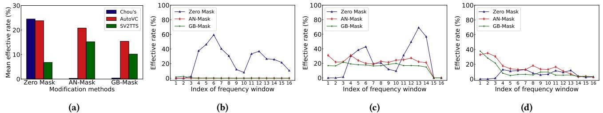  
Figure 6:Effectiveratesof different modifcation methods. (a)Overalleffective rates ofdifferent modification methods.(b) Effective rates ondiferentfrequency windows when Chou's modelisusedforspeechsynthesis.(c)Efective rates ondifrent frequency windows when AutoVC is usedfor speech synthesis. (d)Effctive rates on diffrentfrequency windows when SV2TTs is used for speech synthesis.

$$
\begin{array} { l } { { \Delta Q _ { I } ( { \boldsymbol x } ) > \tau _ { 1 } , } } \\ { { \ } } \\ { { \Delta Q _ { d } ( { \boldsymbol x } ) < \tau _ { 2 } , } } \end{array}
$$

where $\tau _ { 1 }$ and $\tau _ { 2 }$ are two thresholds that imply a noticeable quality decrease on the synthetic speech with an acceptable distortion on the original sample.The parameters in the case study can be found in Section 8.1 of the Appendix.

To quantitatively analyze the effectiveness of the aforementioned modification methods,we further define the efective rate of a given modification method $\mathcal { M }$ on a specific frequency window $w _ { i }$ as

$$
\begin{array} { r } { r _ { i } ^ { M } = \frac { \sum _ { j = 1 } ^ { N } n _ { j } ^ { i } } { N } , } \end{array}
$$

where $N$ is the total number of considered speech samples (1000 in this case study). $n _ { j } ^ { i }$ equals to 1 ifEq.(7)and Eq.(8)are satisfied after applying $\mathcal { M }$ to frequency window $w _ { i }$ of the $j$ -th sample,otherwise $n _ { j } ^ { i }$ equals to $0$

Figure 6a shows the average effective rates of the three modification methods over all frequency windows.We can observe that the modification methods can be effective in defendingagainst different speech synthesis models,but they have different effective rates for every speech synthesis model.For example, Zero Mask can be very effective on Chou's model while the effective rates of AN-Mask and GB-Mask are very low on this model. Figure 6b,Figure 6c, and Figure 6d report the effective rates of the considered modification methods on different frequency windows when Chou's model, AutoVC,and SV2TTS are used for speech synthesis,respectively. These figures show that the selection of the frequency bands plays an important role in defending against the speech synthesis attack. The aforementioned modification methods can be very effective on some specific frequency bands.

In summary, different modification methods have different defense effectiveness not only on a specific speech synthesis model but also on a specific frequency band.In addition,a specific modification method can behave differently on different speech synthesis models or on different frequency bands.These findings indicate that itis necessary to identify the most important frequency bands and derive the optimal combination of different modification methods to maximize the possibility of achieving the defense goal.

# 4.2 The Optimal Defense Strategy

Next we discuss how to derive an optimal defense strategy to protect the target speaker's voice from speech synthesis attacks.Recall that our goal in this paper is to maximize the quality change of the synthetic speech after applying the defense strategy while guaranteeing that the processed speech sample can still be used for its normal purposes.We formulate the problem of finding the optimal defense strategy as the following optimization problem.

$$
\begin{array} { r } { \underset { \mathcal { D } } { \operatorname* { m a x } } ~ \Delta Q _ { I } ( \boldsymbol { x } ) } \\ { \mathrm { s . t . } ~ \Delta Q _ { d } ( \boldsymbol { x } ) < \tau _ { d } , } \end{array}
$$

where $_ x$ is a speech sample of the target speaker, and $\tau _ { d }$ is a customized threshold that reflects how much the quality change (distortion) on $_ x$ the target speaker can accept. In practice, $\tau _ { d }$ can be selected based on the variance observed in the target speaker's voice across different sentences. The method used to select $\tau _ { d }$ in our experiments is discussed in Section 5.3.

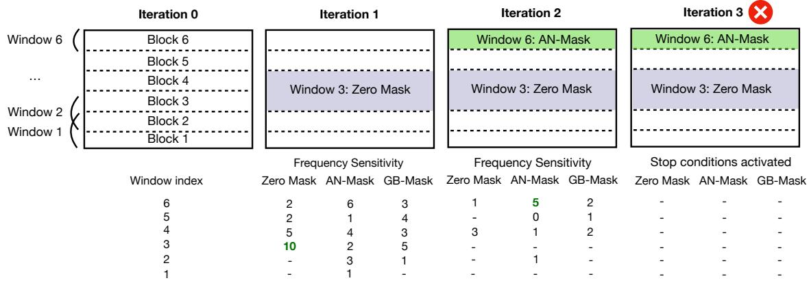  
Figure 7: An example for iteration search.

Suppose sample $_ { x }$ is uniformly partitioned into $B$ blocks in the frequency domain,and two consecutive blocks form a frequency window (as shown in Figure 5). We represent the defense strategy $\mathcal { D }$ as a sequence that contains a series of pairs, i.e., $\mathcal { D } = \{ ( b _ { i } , M _ { i } ) \} _ { i = 1 } ^ { P }$ ,where $b _ { i } ~ \in ~ \left[ 1 , B \right]$ is the block number, and $M _ { i } \in \{ M _ { Z } , M _ { A N } , M _ { G B } \}$ is one of the modification methods introduced in Section 4.1. $P$ is the number of pairs in the sequence. Givena specific speech synthesis model, the defense strategy $\mathcal { D }$ provides a guidance on how to process the target speaker's speeches so that the attacker cannot use them to generate synthetic speeches with high quality. Specifically, before uploading $_ x$ to public social media platforms or sending it to others,the target speaker can process $_ { x }$ by modifying the frequency blocks in sequence $\mathcal { D }$ using corresponding modification methods.

Since the selection of the modification method for each frequency block is not a continuous process,it is difficult to directly use the gradient-based method to solve the optimization problem in Eq.(10). To address this challenge,we develop an effective solution based on iterative search.The basic idea of this solution is to iteratively search a pair $( w _ { j } , M _ { j } )$ that can maximize $\Delta Q _ { I } ( x )$ while guaranteeing that $\Delta Q _ { d } ( { \boldsymbol { x } } )$ is less than threshold $\tau _ { d } . \boldsymbol { w } _ { j }$ is a frequency window as shown in Figure 5. $M _ { j }$ is one of the aforementioned modification methods,which is used to modify sample $_ { x }$ within frequency window $w _ { j }$ .The reason why we use the frequency window instead of the frequency block during the iterative search is that we want to search some overlapped areas to enhance the search robustness while two consecutive frequency blocks are independent.

To measure the effect of a pair $( w _ { j } , M _ { j } )$ in the $t$ -th iteration, we introduce a metric called frequency sensitivity that is defined as

$$
\begin{array} { r } { s _ { j } ^ { t } = \frac { \Delta Q _ { I } ^ { t } ( x ) - \Delta Q _ { I } ^ { t - 1 } ( x ) } { \Delta Q _ { d } ^ { t } ( x ) - \Delta Q _ { d } ^ { t - 1 } ( x ) } , } \end{array}
$$

where $\Delta Q _ { I } ^ { t } ( x )$ and $\Delta Q _ { d } ^ { t } ( x )$ are calculated after taking into account $( w _ { j } , M _ { j } )$ in the $t$ -th iteration. $s _ { j } ^ { t }$ reflects how much $( w _ { j } , M _ { j } )$ can change the values of $\Delta Q _ { I } ^ { t } ( x )$ and $\Delta Q _ { d } ^ { t } ( x )$ compared with that in the $( t - 1 )$ -th iteration. The larger the value of $s _ { j } ^ { t }$ ,the better the pair $( w _ { j } , M _ { j } )$ .In each iteration,we apply different modification methods to each of the frequency windows that are not selected in previous iterations and calculate the corresponding frequency sensitivities. Then, we select the pair with the largest frequency sensitivity and add the corresponding frequency block and modification method pairs to sequence $\mathcal { D }$ .For example,if $( w _ { j } , M _ { j } )$ is selected in iteration $t$ ,the pairs $( b _ { j } , M _ { j } )$ and $( b _ { j + 1 } , \mathcal { M } _ { j } )$ will be added to sequence $\mathcal { D }$ if $w _ { j }$ is not the last frequency window. If $w _ { j }$ is the last frequency window, $( b _ { j } , M _ { j } )$ will be added to sequence $\mathcal { D }$ .The iteration search will stop if $\dot { \Delta } Q _ { I } ^ { t } ( x ) - \Delta Q _ { I } ^ { t - 1 } ( x ) \leq 0$ or $\Delta Q _ { d } ^ { t } ( x ) \geq \tau _ { d }$

Figure 7 presents an example of our proposed solution. Here we divide the sample into six frequency blocks,which form 6 frequency windows.Both $\Delta Q _ { I } ^ { 0 } ( x )$ and $\Delta Q _ { d } ^ { 0 } ( x )$ are set to zero in the initial state (i.e.,iteration O).In the first iteration,we scan the frequency window ina specific order, for instance,from the bottom to the top,calculating the frequency sensitivities for all possible $( w _ { j } , M _ { j } )$ . There are a total of $6 \times 3$ sensitivities generated in this iteration.We then compare these values and identify the $( w _ { j } , M _ { j } )$ that results in the largest frequency sensitivity. For instance, $( w _ { 3 } , M _ { Z } )$ has the largest frequency sensitivity $( s _ { 3 } ^ { 1 } \substack { = } 1 0 )$ ,s0 we add $( b _ { 3 } , M _ { Z } )$ and $( b _ { 4 } , M _ { Z } )$ to $\mathcal { D }$ .The symbol“-”in the example denotes a frequency window that has already been masked or where the sample distortion exceeds $\tau _ { d }$ with that pair,and it will not be selected. Using the sample generated in the first iteration, we repeat the process in the second iteration and find $s _ { 6 } ^ { 2 } { = } 5$ with AN-Mask. Then, we add $( b _ { 6 } , \mathcal { M } _ { A N } )$ to $\mathcal { D }$ .In the third iteration, we find that the sample distortion with any pair exceeds $\tau _ { d }$ ,triggering the stop condition.In this case,the final defense strategy $\mathcal { D }$ would be $\{ ( b _ { 3 } , M _ { Z } ) , ( b _ { 4 } , M _ { Z } ) , ( b _ { 6 } , M _ { A N } ) \}$

Since using a fixed threshold may causea considerable variance of sample distortion,in our implementation,we increase the stability of the defense sample generation by flexibly controlling the sample distortion into the range of $[ \tau _ { d } - \rho , \tau _ { d } + \rho ]$ ,where parameter $\rho$ has a small value.If the sample distortion does not fall into that range when the search stops based on the above stopping conditions,we can further mask half area of the block in the last iteration based on binary search until the requirement is satisfied or reaches the last split.

Although the above solution can effectively derive an optimal defense strategy, it has high complexity because it needs to iteratively search all frequency windows, even some windows that cannot benefit the defense according to the results in previous iterations.To make the solution more effcient,we can utilize the Tree-structured Parzen Estimator (TPE)[17],a widely-used algorithm for hyperparameter optimization. The TPE algorithm is an iterative process that uses the historical information of the evaluated hyperparameters to construct a probabilistic model, guiding the selection of the next hyperparameter set to optimize a given objective function.By taking historical information into account, TPE usually requires fewer function evaluations (trails) than traditional grid search methods,yet delivers comparable results.In this paper, we consider the pair consisting of the frequency window index and the modification method as the hyperparameters to optimize. The frequency sensitivity (i.e., $s _ { j } ^ { t } )$ serves as the predefined objective function.Based on the TPE algorithm,we first sample a few random configurations of the hyperparameters and evaluate the objective function.Then,we split the results into more successful and less successful based ona threshold (e.g., the median of the objective values).Next,we fita Gaussian Mixture Model (GMM) to the configurations of each group and propose a new configuration of the hyperparameters based on the ratio of the two GMMs. After proposing the new configuration,we evaluate the objective function and update the above GMMs.The aforementioned steps will continue until a stopping criterion is met.This procedure will guide the search towards regions of the configuration space that are more likely to yield good results (i.e.,larger values of $s _ { j } ^ { t } )$ based on the GMMs'understanding of the observed data.

# 4.3Speaker-level Defense

In the above section, we mainly discuss how to derive the optimal defense strategy for a single speech sample.To defend against the speech synthesis attack, the speaker can use the above algorithm to derive an optimal defense strategy for each of his or her speech samples,and then modify each sample based on the corresponding defense strategy before uploading it to social media platforms or sending it to others.However, in some cases,a speaker needs to send instant audio messages to others,and the above algorithm is still not efficient enough.To address this challenge,we further propose to derive a speaker-level defense strategy that is general enough to be directly applied to any speech of the speaker.

To derive the speaker-level defense strategy,we first collect $K$ speech samples of the speaker.Then,we apply the above algorithm to each sample $k$ and derive the corresponding optimal defense strategy (denoted as sequence $\mathcal { D } _ { k }$ ). Next we combine the $K$ sequences and derive a new sequence $\mathcal { D } ^ { \prime } = \{ ( b _ { i } , M _ { i } , m _ { i } ) \} _ { i = 1 } ^ { Q }$ where $m _ { i }$ is the total times that $( b _ { i } , M _ { i } )$ appears in the derived sequences for all $K$ samples.We then rank the pairs in $\mathcal { D } ^ { \prime }$ based on descending order of $m _ { i }$ .Please note that the derivation of $\mathcal { D } ^ { \prime }$ can be conducted offline.Aftera speaker obtains his or her defense strategy $\mathcal { D } ^ { \prime }$ ,the speaker can directly apply the ranked $\mathcal { D } ^ { \prime }$ to process an arbitrary speech sample.Specifically, the speaker first modifies the sample based on the first pair in the ranked $\mathcal { D } ^ { \prime }$ and then modifies it using the following pairs in order until the stopping condition is satisfied. Here the stopping condition is the same as that in Section 4.2.

# 5PERFORMANCE EVALUATION

# 5.1Speech Synthesis Models

Weevaluate our defense schemes under a realistic and high-risk scenario where the attacker uses zero-shot style speech synthesis models to clone unseen target speakers’voices.Specifically, we chose two VC models,Chou's model [22] and AutoVC [52],and one TTS model, SV2TTS [36],as they have been widely used and demonstrated strong generalization to unseen speakers.They all share the general VC or TTS frameworks introduced in Section 2.

Chou's model. This model employs adaptive instance normalization to achieve the goal of generating the voice of unseen speakers.It utilizes an encoder-decoder structure.The speaker encoder takes a 512-dim mel spectrogram as input and generates a 128-dim speaker embedding as the representation of the target speaker's speech.The decoder takes the content embedding extracted from the content module and the speaker embedding as inputs to output a synthesized 512-dim mel spectrogram.To recover the waveform from the synthesized spectrogram, Chou's model leverages Griffin-Lim [28] as the vocoder. In this paper, we adopted the same pretrained model used in the official implementation of Attack-VC [4].

AutoVC.AutoVC also utilizes an encoder-decoder structure.The author design an encoder bottleneck to match unseen speakers' distribution. The speaker encoder adapts a pre-trained d-vector using the generalized end-to-end (GE2E)loss [61] to generate a 256- dim speaker embedding,with an 80-dim mel spectrogram as input. The AutoVC model used in this paper is trained on the VoxCeleb1 [46] and LibriSpeech datasets [49].

SV2TTS.SV2TTS isa text-dependent TTS model that carries out speech synthesis in three stages.First, it uses an LSTM speaker encoder to capture the speaker's voice characteristics.Then,it applies Tatocron 2 [66] for spectrogram synthesis,and finally,it employs the WaveNet Vocoder [48] for waveform generation.The speaker encoder in this model takes a 40-dim mel spectrogram as the input and generates a 256-dim speaker embedding.Here we adopt the public implementation of this model [34],where the speaker encoder is trained on VoxCeleb1/2 [46]and LibriSpeech [49],and the synthesis network Tatocron 2 is trained on LibriSpeech.In our implementation of SV2TTS,we adopt one of ten phrases of normal conversation as text input for synthesizing each speech,with detail listed in the Section 8.2 of the Appendix.

# 5.2Dataset and Baselines

We conduct our experiments using CSTR VCTK corpus [59],which contains 109 speakers with different genders and accents.The samples are collected by reading short newspaper phrases,Rainbow passages [25],and elicitation paragraphs.

In our experiments, we consider the following two baselines.

· Raw.In this baseline,we do not consider any defense scheme. The attacker uses the raw speech samples of the target speaker to generate synthetic speeches.We follow the same baseline implementation as described in [31,67]. ·Attack-VC.Attack-VC [31] is the only method in the literature that studies the same problem as ours.Attack-VC achieves the defense goal by adding carefully designed noise to the speech samples before uploading them to social media platforms and sending them to others.

Table 1: Attack success rate (ASR) on Resemblyzer $( \% )$   

<table><tr><td></td><td colspan="3">Chou&#x27;s</td><td colspan="3">AutoVC</td><td colspan="2">SV2TTS</td></tr><tr><td></td><td>Attack-VC</td><td>SampleMask</td><td>SpeakerMask</td><td>Attack-VC</td><td>SampleMask</td><td>SpeakerMask</td><td>SampleMask</td><td>SpeakerMask</td></tr><tr><td>Td = 0.06</td><td>69.7</td><td>18.2</td><td>38.8</td><td>34.3</td><td>19.1</td><td>24.8</td><td>19.4</td><td>49.0</td></tr><tr><td>Td = 0.12</td><td>46.3</td><td>9.2</td><td>17.1</td><td>29.3</td><td>13.0</td><td>15.1</td><td>8.3</td><td>29.9</td></tr><tr><td>Td =0.18</td><td>30.3</td><td>0.9</td><td>9.4</td><td>17.2</td><td>6.5</td><td>10.9</td><td>3.5</td><td>13.5</td></tr></table>

Please note that our proposed defense scheme for single speech samples in Section 4.2 is denoted as SampleMask,and the proposed speaker-level defense scheme in Section 4.3 is denoted as SpeakerMask.

# 5.3 Experimental Setup

Speaker encoder $E _ { s }$ and embedding $e _ { s }$ . To calculate the quality changes described in Eq.(1)and Eq.(2),we use the LSTM speaker encoder trained by Resembylzer [1]as $E _ { s }$ .This encoder is widely adopted and it shows a remarkable ability to distinguish different speakers.For a speaker's average voice embedding $e _ { s }$ ,we calculate it with the above speaker encoder using the speaker's 10 speech samples that are randomly selected from the VCTK dataset.The threshold $\tau _ { d }$ . This threshold reflects how much the quality change on the speech sample the target speaker can accept after applying the defense strategy. In our experiments,we determine $\tau _ { d }$ based on the following method.For each speaker in the VCTK dataset, we randomly select10 speech samples and calculate the similarity score between the embedding of each sample and the average voice embedding $e _ { s }$ .Here cosine similarity is used to calculate the similarity score.Then, we can derive an average similarity score over the randomly selected 10 speech samples for each speaker. Finally, we calculate the average similarity score over the 109 speakers in the dataset and its value is O.88,based onwhich we can derive that theaverage difference between a speaker's speech embeddings and his or her $e _ { s }$ is 0.12.We set $\tau _ { d }$ to 0.12 in our experiments.Since all the speech samples in the VCTK dataset are collected without any modification, the above difference reflects the variance of a speaker's voice when he or she say different sentences.

Other parameters.In the paper, we partition the spectrogram into 16 frequency blocks.We generate standard Gaussian noise for the AN-Mask and clip the noise with a magnitude constraint of 0.1.We use (11,11) as kernel size and set the standard deviation to 1.5 for generating GB-Mask.We apply the modification on a 512- dim mel spectrogram in all experiments, using the same parameter configuration as in [31].The relax bound $\rho$ is set to 0.02.

Ethics.To study the performance of our proposed defense schemes on real-world SR systems,we recruit some English speakers and collect some of their voice recordings.We also conduct a user study with human participants to assess the impact of our defense on human perception.These studies have received approval from the IRB.The details of them can be found in Section 5.4 and Section 5.5.

# 5.4 Experimental Results

We first use real-world SR systems to evaluate the performance of the proposed defense schemes. Specifically,we study whether the synthetic speeches generated by the attacker can fool SR systems or let SR systems believe that the synthetic speech is from the target speaker.We use the attack success rate (ASR) as the evaluation metric,which is defined as the percentage of the synthetic speeches that successfully fool a specific SR system.The lower the ASR, the better the defense scheme.In our paper,we consider four state-ofthe-art SR systems: Resemblyzer [1],Microsoft Azure [7],Amazon Alexa [5],and WeChat [11].

Resemblyzer.Resemblyzer is an open-source speaker encoder that is widely adopted for SR.It enrolls each speaker with his or her real speeches and generates an embedding to represent the speaker's voice identity.To recognize a speaker, Resemblyzer calculates the embedding of the input speech and compare it with the enrolled embeddings,using cosine similarity as a metric.Then a threshold is used to determine whether two embeddings belong to the same speaker.

For each speaker from VCTK dataset,we randomly select their 100 speech samples and derive 10o synthetic speeches based on the selected samples.Then,we calculate the ASR of all synthetic speeches.Table 1 reports the ASRs of the different speech synthesis models when different defense schemes are applied.Here we consider three cases where the values of $\tau _ { d }$ are set to 0.06,0.12,and 0.18,respectively. Since parameter $\tau _ { d }$ does not have impact on Raw, we do not show the results of Raw in the table.With Raw, the ASRs of Chou's model, AutoVC,and SV2TTS are $8 4 . 1 \%$ ， $5 2 . 4 \%$ ,and $5 7 . 1 \%$ respectively.For Attack-VC, the added noise to a speech sample is determined by parameter $\epsilon$ ，which is a constraint making the perturbation subtle.Here we assign appropriate values to $\epsilon$ in the above three scenarios so that Attack-VC and our proposed schemes can generate similar distortion on the speech sample when they are applied to the same case.The results in Table 1 show that our proposed defense schemes perform much better than Attack-VC in all cases.For example,when the value of $\tau _ { d }$ is 0.12, SampleMask can reduce the ASR of Chou's model from $8 4 . 1 \%$ to $9 . 2 \%$ while Attack-VC can only reduce that to $4 6 . 3 \%$ .When being applied to unseen speech samples,our scheme SpeakerMask can reduce the ASR of Chou's model from $8 4 . 1 \%$ to $1 7 . 1 \%$ The results demonstrate that our scheme can still achieve good performance even though the test sample is not involved in the optimization,indicating the good effectiveness and generalizability of our defense.Although the authors in[31] do not evaluate theperformance ofAttack-VC on SV2TTS,we explore the possibility of using Attack-VC to defend against SV2TTS.However, we find that all defense samples are beyond human perception. So we only show the results of our schemes on SV2TTS in Table 1.

Microsoft Azure.Azure is a real-world, open-API SR system that has been officially adopted by many international entrepreneurs. Users can register their voice profiles using approximately 20-50 seconds of authentic speech.For an input speech sample,Azure's backend can clearly display a message indicating whether the sample is accepted or rejected.An attack is considered successful against Azure if the backend indicates that the test speech has been accepted. In this experiment,we still consider the 109 speakers in the VCTK dataset and enroll them with their speeches.We feed the same 109o0 synthetic speeches generated in the experiment for Resemblyzer into Azure.Here we only evaluate our speaker-level defense scheme SpeakerMask and set the value of $\tau _ { d }$ to 0.12.Please note that the derived defense strategy for each speaker is a combination of the three modification methods discussed in Section 4.1. The results are shown in Figure 8.We can observe that the speech synthesis models still can easily fool Azure when there is no defense,but they have lower ASRs compared with Resemblyzer.However,our proposed defense scheme SpeakerMask can significantly reduce the ASR of different speech synthesis models and outperform Attack-VC on both Chou's model and AutoVC.

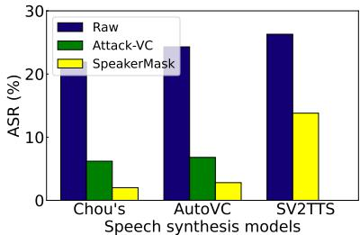  
Figure 8: Attack success rate (ASR) on Microsoft Azure.

In addition,we study the effect of our proposed defense on the usability of speakers’speeches.Specifically,we feed the modified speeches of the 109 speakers into both Resemblyzer and Azure, and evaluate the acceptance rate (ACR),which is defined as the percentage of the modified speeches that are successfully recognized by the SR system.The results are shown in Table 2.Here we modify speeches using the defense strategies derived based on Chou's model, AutoVC,and SV2TTS,respectively.Please note that the ACRs of Resemblyzer and Azure on unmodified speeches are $1 0 0 \%$ and $9 4 . 1 \%$ ,respectively.We can observe that the two SR systems exhibit high ACRs when using the modified speeches.This indicates that speeches processed by our proposed defense retain high usability.

Amazon Alexa.As a popular virtual assistant embedded in Ama-Zon's smart speaker, Alexa has been widely used for customizing user interactions and control access to sensitive apps like email and calendar [5].Alexa does not provide an API for our evaluation, and its speaker verification mechanism is black-box for users.Alexa allows users to enroll their voice by uttering simple phrases, utilizing a text-dependent speaker verification system accessible on mobile apps or various IoT devices [5].It differs from the above SR systems, as Alexa does not explicitly indicate if an attack is successful.In this experiment,we follow the design in 67] and deem an attack successful if Alexa responds to the synthetic speech the same way it responds to a non-synthesized version of the speech.We recruit 12 English speaks (7 males/5 females)and gathera small collection of their voice recordings as the target speeches to synthesize test commands.Each participant is asked to read 20 phrases from the Rainbow Passage,a resource widely utilized in linguistic studies. The detailed phrases are listed in Section 8.2 of the Appendix. 8 participants record their speeches using a voice memo app on an iPhone $1 1 +$ ,and 4 participants use MacBook Pros.The distance between each participant and the microphone is 6 inches.Here we still evaluate our speaker-level defense scheme SpeakerMask.For each speaker,we use the first ten phrases to generate the defense strategy and then apply it to the remaining phrases.The modified speeches are then fed into different speech synthesis models to generate synthetic commands.

Table 2: Acceptance Rate (ACR) of modified speeches $( \% )$   

<table><tr><td></td><td>Chou&#x27;s</td><td>AutoVC</td><td>SV2TTS</td></tr><tr><td>Resemblyzer</td><td>100</td><td>100</td><td>100</td></tr><tr><td>Azure</td><td>89.9</td><td>84.7</td><td>90.1</td></tr></table>

As shown in Table 3,for each participant,we test7commands that may disclose users'private information if the attack succeeds. The results in Table 3 show that the Chou's model achieves an overall ASR of $4 8 . 8 \%$ without any defense scheme. After we applyAttack-VC and SpeakerMask, the ASR of the Chou's model is decreased to $3 6 . 9 \%$ and $8 . 3 \%$ ,respectively.In this experiment,we only consider the scenario where $\tau _ { d } = 0 . 1 2$ ForAutoVC,its overall ASR without any defense is $2 1 . 4 \%$ .However,after applying the defense schemes,the ASR is increased to $2 3 . 8 \%$ with Attack-VC while SpeakerMask can reduce it to $1 . 2 \%$ .These results demonstrate the good performance of our proposed defense scheme in defending against speech synthesis attacks based on VC models.When the attacker uses SV2TTS to perform the attack,our defense scheme SpeakerMask canreduce the overall ASR from $6 9 . 0 \%$ to $5 2 . 4 \%$ We can observe that the performance of SpeakerMask on SV2TTS is not as good as that on the above two VC models. The reason may be that Alexa is more sensitive to the content of the command than voice identity,and SV2TTS can generate more understandable content compared with the above VC models.

WeChat. WeChat is a popular chatting and payment App. It employs a“voice lock”to be an alternative option for entering the password. Users can log in to their accounts by speaking a systemassigned 8-digit number,with a maximum of six daily attempts.If a speech matches the enrolled voice of a speaker and the assigned number,the system will allow the speaker to log in.In this experiment,we also recruit 12 English speakers (7 males/5 females) as the users and collect 20 voice recordings for each user using the same method discussed in the experiment for Alexa.We still use the first 10 recordings of each user to generate the speaker-lever defense scheme and then test the scheme on the remaining 10 samples of each user. Our experiment synthesizes six login numbers using different source samples spoken by a same-gender speaker in two VC modelsand thenumber textin SV2TTS.Anattackis considered successful if at least one attempt enables the user to log in with the synthetic commands.Our results show that none of the users can log in with the synthetic commands generated by Chou's model and AutoVC.So there is no need to perform the defense on the two VC models.However,5 of 12 $( \mathrm { A S R } = 4 1 . 6 \% )$ users can successfully log in to their accounts with the synthetic speeches generated by SV2TTS where there is no defense.After applying our speaker-level defense SpeakerMask $' _ { \tau _ { d } } = 0 . 1 2 )$ ,only one user can log in to the account,i.e., theASRis decreased from $4 1 . 6 \%$ to $8 . 3 \%$ ,which further demonstrates the effectiveness of our proposed scheme.

Table 3: Attack success rate (ASR) on Amazon Alexa $( \% )$   

<table><tr><td rowspan="2">Commands</td><td colspan="3">Chou&#x27;s</td><td colspan="3">AutoVC</td><td colspan="2">SV2TTS</td></tr><tr><td>Raw</td><td>Attack-VC</td><td>SpeakerMask</td><td>Raw</td><td>Attack-VC</td><td>SpeakerMask</td><td>Raw</td><td>SpeakerMask</td></tr><tr><td>Hey Alexa add an event to my calendar for tomorow at 5.</td><td>50.0</td><td>16.7</td><td>8.3</td><td>16.7</td><td>0.0</td><td>0.0</td><td>83.3</td><td>75.0</td></tr><tr><td>Hey Alexa check my email</td><td>41.7</td><td>25.0</td><td>0.0</td><td>25.0</td><td>33.3</td><td>0.0</td><td>41.7</td><td>41.7</td></tr><tr><td>Alexa say who is talking with you now</td><td>50.0</td><td>33.3</td><td>16.7</td><td>16.7</td><td>16.7</td><td>0.0</td><td>50.0</td><td>33.3</td></tr><tr><td>Alexa tellme what is on my calendar</td><td>66.7</td><td>75.0</td><td>16.7</td><td>33.3</td><td>41.7</td><td>8.3</td><td>91.7</td><td>66.7</td></tr><tr><td>Tell me what is on my calendar for this week</td><td>58.3</td><td>66.7</td><td>8.3</td><td>25.0</td><td>41.7</td><td>0.0</td><td>75.0</td><td>58.3</td></tr><tr><td>Alexa make an appointment with my doctor</td><td>50.0</td><td>41.7</td><td>8.3</td><td>33.3</td><td>25.0</td><td>0.0</td><td>83.3</td><td>50.0</td></tr><tr><td>Hey Alexa make a donation to the American Cancer Institute</td><td>25.0</td><td>0.0</td><td>0.0</td><td>0.0</td><td>8.3</td><td>0.0</td><td>58.3</td><td>41.7</td></tr><tr><td>&lt;Average across the above 7 commands &gt;</td><td>48.8</td><td>36.9</td><td>8.3</td><td>21.4</td><td>23.8</td><td>1.2</td><td>69.0</td><td>52.4</td></tr></table>

Table 4: User study for real samples.   

<table><tr><td>Answers</td><td>Yes (%)</td><td>Unsure (%)</td><td>No (%)</td></tr><tr><td>Real A/Real A</td><td>80.9</td><td>14.2</td><td>4.9</td></tr><tr><td>Real A/Real B</td><td>6.2</td><td>11.5</td><td>82.3</td></tr></table>

# 5.5User Study

Next, we conduct a user study to evaluate the impact of our defense on human perception. Specifically, we aim to answer two questions: (1) Can the proposed defense affect the normal usability ofa speaker's speeches?(2) Can the synthetic speeches generated by speech synthesis attacks stillfool many humans after performing our proposed defense?In this study, we recruit 80 self-identified English-speaking participants from a public crowdsourcing platform: Amazon Mechanical Turk (Mturk) [8],which has been widely used in research and business [21].Mturk accommodates participants from various age groups and genders,and all participants were 18 years old or older.We ask the participants to complete an online survey,which is designed to take an average of 5 minutes to complete,and each participant receives a compensation of 1 dollar.We also requested participants to input a predefined task code to eliminate potential bots.

Survey details.In the online survey,we provide 16 audio pairs to each participant.The participants are asked to listen to each audio pair first and then answer the question: Are the two audio samples from the same speaker? The candidate answers are“Yes”,“Unsure", and “No".Each audio pair is one of the following combinations: (1) Real A/Real A (two real speech samples from the same speaker); (2) Real A/Real B (two real speech samples from different speakers); (3)Real A/Defense A (one real speech sample from a speaker and its corresponding defense sample generated by a defense scheme); (4)Real A/Fake A (one real speech sample from a speaker and its corresponding synthetic speech sample generated by a speech synthesis model).

Table 5: User study for defense samples.   

<table><tr><td></td><td colspan="2">Chou&#x27;s</td><td colspan="2">AutoVC</td><td>SV2TTS</td></tr><tr><td></td><td>Attack-VC</td><td>SpeakerMask</td><td>Attack-VC</td><td>SpeakerMask</td><td>SpeakerMask</td></tr><tr><td>Yes (%)</td><td>70.9</td><td>71.5</td><td>70.4</td><td>69.9</td><td>73.7</td></tr><tr><td>Unsure (%)</td><td>13.1</td><td>12.8</td><td>16.6</td><td>13.5</td><td>15.4</td></tr><tr><td>No (%)</td><td>16.0</td><td>15.7</td><td>13.0</td><td>16.6</td><td>10.9</td></tr></table>

Results.The benchmark in this study is users’ response to“Real A/Real A"and “Real A/Real B",which can reflect users'ability to distinguish different speakers.As shown in Table 4, $8 0 . 9 \%$ users choose“Yes” for two samples from the same speaker (Real A/Real A), and $8 2 . 3 \%$ users choose“No” for two samples from different speakers (Real A/Real B).

Can the proposed defense affect the normal usability of a speaker's speeches? Table 5 shows the answers for “Real A/Defense $A ^ { \ast }$ .The speech samples here are generated by Attack-VC and SpeakerMask when the speech synthesis models are Chou's model,AutoVC,and SV2TTS,respectively.We canobserve that both Attack-VC and our proposed defense can slightly affect the usability of speeches,but the effects are acceptable.For instance, when the attack model is Chou's model and $\tau _ { d } = 0 . 1 2$ ， $7 0 . 9 \%$ and $7 1 . 5 \%$ of the users still choose“Yes”for the defense samples generated byAttack-VC and SpeakerMask,respectively.These results are $1 0 . 0 \%$ and $9 . 4 \%$ lower than that for unprocessed speeches $( 8 0 . 9 \% )$ ， which demonstrates that our proposed defense has little impact on the normal usability of a speaker's speeches.

Can the synthetic speeches generated by speech synthesis attacks still fool many humans after performing our proposed defense? The answers for “Real A/Fake $\boldsymbol { \mathrm { A } } ^ { \flat }$ are shown in Figure 9, in which $2 0 . 4 \%$ ， $3 6 . 2 \%$ ,and $2 7 . 8 \%$ of the users choose“Yes” for the synthetic speeches generated by Chou's model,AutoVC,and SV2TTS, respectively, when there is not any defense (Raw).Although all participants are told that fake speeches may exist before filling out the survey,many of them are still fooled by the synthetic speeches. These results again demonstrate the threats of speech synthesis attacks.After performing the defense,both Attack-VC and SpeakerMask can reduce the chance that the participants are fooled,and many participants choose“Unsure”and “No”when being asked whether the two audio sample are from the same speaker.The results also show that our scheme can outperform Attack-VC in all cases.There are fewer participants believing that the real speech sample and the corresponding synthetic speech are from the same speaker after applying our proposed defense.For example,when AutoVC is adopted as the attack model, the participants who believe the target speech and the corresponding synthetic speech are from the same speaker is decreased from $3 6 . 2 \%$ to $4 . 5 \%$

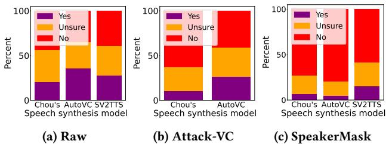  
Figure 9: User study for synthetic samples.

# 5.6Transferability

In this experiment,we study the transferability of our proposed defense.Specifically, we study whether the derived defense strategy based on a specific speech synthesis model can be applied to defend against other synthesis models.Here we still take Chou's model, AutoVC,and SV2TTS as the speech synthesis models,and use the VCTK dataset for our study.We first generate defense samples using SpeakerMask based on a specific speech synthesis model and feed these defense samples into different speech synthesis models to generate corresponding synthetic speeches. Then we use Resemblyzer as a SR system to evaluate the attack performance.We consider the case where $\tau _ { d } = 0 . 1 2$ ,and the setting in this experiment is similar to that in the experiment for Resemblyzer.The results are shown in Table 6.The models in the first column are used for deriving the defense samples,and the models in the first row are used for generating synthetic speeches.We can observe that the defense performance is slightly degraded when the strategy derived based ona specific synthesis model is used to defend against other synthesis models.However, the defense is still effective and the ASRs are much lower than that without any defense scheme (the ASRs of Chou's model,AutoVC,and SV2TTS without any defense are $8 4 . 1 \%$ ， $5 2 . 4 \%$ and $5 7 . 1 \%$ ,respectively).These results demonstrate that our proposed defense has good transferability.Even though a speaker cannot know which speech synthesis model will be used by the attacker, the speaker can still use the proposed defense scheme to protect his or her voice.

# 5.7 Efficiency

The efficiency of generating defense samples is also an important factor.In this experiment,we evaluate the average time it takes to generate a defense sample using our speaker-level defense SpeakerMask and Attack-VC (sample lengths are typically between 3-10 seconds) based on 10o0 samples.The results are shown in Table 7.

Table 6: ASR for defense transferability $( \% )$   

<table><tr><td colspan="2">Chou&#x27;s</td><td>AutoVC</td><td>SV2TTS</td></tr><tr><td>Chou&#x27;s</td><td>17.1</td><td>21.1</td><td>33.3</td></tr><tr><td>AutoVC</td><td>40.0</td><td>15.1</td><td>32.1</td></tr><tr><td>SV2TTS</td><td>42.4</td><td>25.6</td><td>29.9</td></tr></table>

Here we consider three cases where the values of $\tau _ { d }$ are set to 0.06,0.12,and 0.18,respectively.We can observe that SpeakerMask takes around only one second to generate a defense sample while Attack-VC takes more than 30 seconds.The results show that our speaker-level defense is efficient in processing speeches,and it enables a speaker to send instant messages to others.

Table 7: Average time of generating a defense sample (s).   

<table><tr><td></td><td>Chou&#x27;s</td><td>AutoVC</td><td>SV2TTS</td></tr><tr><td>Td = 0.06</td><td>0.9</td><td>1.0</td><td>1.2</td></tr><tr><td>Td = 0.12</td><td>1.1</td><td>1.3</td><td>1.4</td></tr><tr><td>Td = 0.18</td><td>1.3</td><td>1.5</td><td>2.0</td></tr><tr><td>Attack-VC</td><td>31.2</td><td>49.2</td><td>-</td></tr></table>

# 6LIMITATIONS AND FUTURE WORK

In this paper, we consider speech synthesis models based on English corpora,and our evaluation involves only English speakers.We have not assessed the defense performance on other languages.Further study on other languages will be our future work.In addition, the voice samples mentioned in Section 5.4 were collected in indoor settings.The experimental results demonstrate that our defense is effective with natural indoor noise levels.In our future work, we will further study the performance of the proposed schemes in diverse settings with significant noise levels.

# 7CONCLUSION

In this paper, we study how to protect a speaker's voice from speech synthesis attacks. We propose a novel defense scheme that can significantly degrade the performance of existing speech synthesis models by modifying the speaker's speeches in the frequency domain.The modification in the proposed defense scheme has little impact on the quality of speeches,and the modified speeches can still be used for their normal purposes. To improve the efficiency of the defense,we also propose a speaker-level scheme that can produce a universal defense strategy for each speaker. Based on this universal defense strategy, the speaker can efficiently process any of his or her speeches.Extensive experiments are conducted on real-world SR systems to evaluate the performance of the proposed schemes.We also conduct a user study using a public crowdsourcing platform to evaluate the impact of the proposed schemes on human perception.The experimental results show that the speech synthesis attack can be easily recognized by SR systems and humans after applying our defense.

# REFERENCES

[1] 2019.Resemblyzer.https://github.com/resemble-ai/Resemblyzer.   
[2]2019.The WallStreet Journal.htps://www.wsj.com/articles/fraudsters-use-aito-mimic-ceos-voice-in-unusual-cybercrime-case-11567157402.   
[3] 2021.Forbes.https://www.forbes.com/sites/thomasbrewster/2021/10/14/hugebank-fraud-uses-deep-fake-voice-tech-to-steal-millons/?sh=2fdfoc417559.   
[4]2021.vc-github.https://github.com/cyhuang-tw/attack-vc.   
[5]2023.Alexa.https://www.amazon.com/gp/help/customer/display.html?noded= GYCXKY2AB2QWZT2X.   
[6] 2023.audible.https://www.audible.com/.   
[7] 2023.Azure.https://azure.microsoft.com/en-us/services/cognitive-services/ speaker-recognition/.   
[8] 2023.Mturk.https://www.mturk.com/.   
[9] 2023.soundcloud.https://soundcloud.com.   
[10] 2023.speechify. https://www.speechify.com/.   
[11] 2023.WeChat.https://help.wechat.com/cgi-bin/micromsg-bin/oshelpcenter? opcode $\mathrel { \mathop : } = \mathrel { \mathop : }$ 2&plat=ios&lang=en&id=150819uqYnUR150819YzINVb.   
[12]Muhammad Ejaz Ahmed,Il-Youp Kwak,JunHo Huh,Iljoo Kim, Taekkyung Oh, and Hyoungshick Kim. 202o. Void: A fast and light voice liveness detection system.In 29th USENIX Security Symposium (USENIX Security 20).2685-2702.   
[13] Ehab A AlBadawy,SiweiLyu,and Hany Farid.2019.Detecting AI-Synthesized Speech Using Bispectral Analysis.In CVPR Workshops.104-109.   
[14]S Abhishek Anand,Jian Liu, Chen Wang,Maliheh Shirvanian,Nitesh Saxena, and Yingying Chen. 2021. Echovib: Exploring voice authentication via unique non-linear vibrations of short replayed speech.In Proceedings of the 2021ACM Asia Conference on Computer and Communications Security.67-81.   
[15] Gopala Krishna Anumanchipali, Kishore Prahallad,and Alan W Black. 2011. Festvox: Tools for creation and analyses of large speech corpora.In Workshop on VeryLargeScalehoneticsResearch,UPenn,ladelphia,Vol.70   
[16] Sercan Arik,JitongChen,KainanPeng,WeiPing,andYanqi Zhou.2018.Neural voicecloning withafewsamples.Advances inNeural Information Procesng Systems 31 (2018).   
[17] James Bergstra,RemiBardenet,Yoshua Bengio,andBalazs Kegl.2011.Algorithms forhyper-parameteroptimization.Advances in neural information processng systems 24 (2011).   
[18] Logan Blue,Kevin Warren,Hadi Abdullah,Cassidy Gibson,Luis Vargas,Jessica O'Dell,Kevin Butler,and Patrick Traynor. 2022.Who Are You (IReally Wanna Know)?Detecting Audio {DeepFakes} Through Vocal Tract Reconstruction. In 31st USENIX Security Symposium (USENIX Security 22).2691-2708.   
[19] Edresson Casanova,Julian Weber, ChristopherD Shulby,Arnaldo Candido Junior, Eren Golge,and Moacir A Ponti. 2022.Yourtts: Towards zero-shot multi-speaker tts and zero-shot voice conversion for everyone.In International Conference on MachineLearning.PMLR,2709-2720.   
[20] Si Chen,KuiRen,SixuPiao,Cong Wang,Qian Wang,Jian Weng,LuSu,and Aziz Mohaisen.2017.Youcan hear but you cannot steal: Defending against voice impersonationattacks on smartphones.In 2017IEEE 37th International Conference on Distributed Computing Systems (ICDCS).IEEE,183-195.   
[21] Janelle HCheung,Deanna K Burns,Robert R Sinclair,and Michael Sliter. 2017. Amazon Mechanical Turk in organizational psychology:An evaluation and practical recommendations.Journal of Business and Psychology 32 (2017),347-361.   
[22] Ju-chieh Chou, Cheng-chieh Yeh,and Hung-yiLee.2019. One-shot voice conversion by separating speaker and content representations with instance normalization.arXiv preprint arXiv:1904.05742 (2019).   
[23] JiangyiDeng,Yanjiao Chen,Yinan Zhong,Qianhao Miao, Xueluan Gong,and Wenyuan Xu.2023. Catch You and ICan: Revealing Source Voiceprint Against Voice Conversion.arXiv preprint arXiv:2302.12434 (2023).   
[24]ThierryDutoit.1997Anintroductiontotexttospeechsynthesis.Vol.3.Sprger Science & Business Media.   
[25] Grant Fairbanks.196o.The rainbow passage.Voice and articulation drillbook 2 (1960), 127-127.   
[26] Joel Frank andLea Schonherr.2021.Wavefake:Adata setto facilitate audio deepfake detection. arXiv preprint arXiv:2111.02813 (2021).   
[27]Haichang Gao,Honggang Liu,DanYao,XiyangLiu,and Uwe Aickelin.2010.An audio CAPTCHA to distinguish humans from computers.In 2010 Third International Symposium on Electronic Commerce and Security.IEEE,265-269.   
[28] Daniel Griffn and Jae Lim.1984. Signal estimation from modified short-time FouriertranfoEasactiscosticseechdigaln 32,2 (1984),236-243.   
[29]Wei-Ning Hsu,YuZhang,RonJWeis,Heiga Zen, YonghuiWu,Yuxuan Wang, Yuan Cao,Ye Jia, Zhifeng Chen,Jonathan Shen, etal.2018.Hierarchical generative modeling for controllable speech synthesis.arXiv preprint arXiv:1810.07217 (2018).   
[30] QiongHu,Erik Marchi,David Winarsky, Yannis Stylianou,Devang Naik,and Sachin Kajarekar. 2019. Neural text-to-speech adaptation from low quality public recordings.In Speech Synthesis Workshop,Vol.10.   
[31]Chien-yu Huang,YistYLin,Hung-yiLeeandLin-shanLee2021.Defending yourvoice:Adversarialatack onvoiceconversion.In221IEESpokenLanguage vugy   
[32] Tzu-hsien Huang,Jheng-hao Lin,and Hung-yiLee.2021.How far are we from robustvoiceconversion:Asurvey.In 202i IEEE Spoken Language Technology Workshop (SLT). IEEE, 514-521.   
[33] Jesin James,BT Balamurali,Catherine I Watson,and Bruce MacDonald. 2021. Empathetic speech synthesis and testing for healthcare robots. International Journal ofSocial Robotics13 (2021),2119-217.   
[34] Corentin Jemine et al. 2019. Master thesis: Real-time voice cloning. (2019).   
[35] YeJia,RonJWeiss,Fadi BiadsyWolfgang Macherey,MelvinJohnson,Zien Chen,and Yonghui Wu. 2019.Direct speech-to-speech translation with a sequence-to-sequence model. arXiv preprint arXiv:1904.06037 (2019).   
[36]Ye Jia,YuZhang,RonWeissQuan WangJonathanShen,FeRenPatrickNguyen Ruoming Pang,Ignacio Lopez Moreno,Yonghui Wu,etal.2018. Tansferlearning from speaker verification to multispeaker text-to-speech synthesis.Advances in neural information processing systems 31(2018).   
[37] Hirokazu Kameoka,Takuhiro Kaneko,Kou Tanaka,and Nobukatsu Hojo.2018. Stargan-vc: Non-parallel many-to-many voice conversion using star generative adversarial networks.In 2018 IEEE Spoken Language Technology Workshop (SLT). IEEE,266-273.   
[38] Pierre Lanchantin, Gilles Degottex,and Xavier Rodet.2010.AHMM-based speech synthesis system using a new glottal source and vocal-tract separation method. In2010IEEEteatioalCferenceocousticspeechnignalrin IEEE,4630-4633.   
[39] Alessndro Lieto,Daniele Moro,Francesco Devoti, Claudia Parera, Vincenzo Lipari,Paolo Bestagini,and Stefano Tubaro.2019."Hello? Who AmITalking to?" A Shallow CNN Approach for Human vs. Bot Speech Classfication. In ICASSP 2019-2019Eteatialferececousticpediasin (ICASSP).IEEE,2577-2581.   
[40] Jheng-hao Lin, Yist YLin,Chung-Ming Chien,and Hung-yi Lee.2021.S2VC: A Framework for Any-to-Any Voice Conversion with Self-Supervised Pretrained Representations. arXiv preprint arXiv:2104.02901(2021).   
[41] Yist Y Lin,Chung-Ming Chien,Jheng-Hao Lin,Hung-yiLee,and Lin-shan Lee. 2021.Fragmentvc:Any-to-any voice conversion by end-to-end extracting and fusing fine-grained voice fragments with atention.In ICASSP 2021-2021 IEEE International ConferenceonAcoustics,Speechand Signal Processing (ICASSP).IEEE, 5939-5943.   
[42] Takashi Masuko,Takafumi Hitotsumatsu,Keiichi Tokuda,and Takao Kobayashi. 1999. Onthesecurityof HMM-basedspeaker verificationsystems againstimpos tureusing synthetic speech.In Sixth European conference on speech communication and technology.   
[43] Jiri Mertl,Eva Zackova,and Barbora Repova.2018.Quality of life of patients after total laryngectomy: the struggle against stigmatization and social exclusion using speech synthesis.Disability and Rehabilitation:Assistive Technology 13,4 (2018),342-352.   
[44]Dibya Mukhopadhyay,Maliheh Shirvanian,and Nitesh Saxena.2015.All your voices are belong to us: Stealing voices to fool humans and machines.In Com puter Security-ESORICS 2015:20th European Symposiumon ResearchinComputer Security 599-621.   
[45]JohnMullennixandStevenStern.2010.ComputerSynthesizedSpeechTechnologies: Tools for Aiding Impairment: Tools for Aiding Impairment.IGI Global.   
[46] Arsha Nagrani, Joon Son Chung,and Andrew Zisserman. 2017.Voxceleb: a large-scale speaker identification dataset.arXiv preprint arXiv:1706.08612 (2017).   
[47]SatoshiNakamura.2o9.Overcoming thelanguage barrerwithspeechtranslation technology. Technical Report. Citeseer.   
[48]Aaron van den Oord, Sander Dieleman,Heiga Zen,Karen Simonyan,Oriol Vinyals,Alex Graves,Nal Kalchbrenner,Andrew Senior,and Koray Kavukcuoglu. 2016.Wavenet: A generative modelfor raw audio.arXiv preprint arXiv:1609.03499 (2016).   
[49] Vassil Panayotov, Guoguo Chen, Daniel Povey,and Sanjeev Khudanpur. 2015. Librispeech:an asr corpus based on public domain audio books.In 2015 IEEE international conference on acoustics,speech and signal processing (ICAsSP).IEEE, 5206-5210.   
[50] Sharbani Pandit,Jienan Liu,Roberto Perdisci,and Mustaque Ahamad.2020.Fighting VoiceSpamwithaVirtual AsistantPrototype.arXiv preprintarXiv:2008.03554 (2020).   
[51] Wei Ping, Kainan Peng, Andrew Gibiansky, Sercan Omer Arik, Ajay Kannan, Sharan Narang,Jonathan Raiman,and John Miler. 2017.Deep Voice 3: 2000- Speaker Neural Text-to-Speech. (2017).   
[52] Kaizhi Qian, Yang Zhang,Shiyu Chang,Xuesong Yang,and Mark Hasegawa-Johnson. 2o19.Autovc: Zero-shot voice style transfer with only autoencoder loss. In InternationalConferenceon Machine Learning.PMLR,5210-5219.   
[53] YiRen, Yangjun Ruan,Xu Tan,Tao Qin,Sheng Zhao,Zhou Zhao,and Tie-Yan Liu.2019.Fastspeech: Fast,robust and controllable text to speech.Advances in Neural Information Processing Systems 32(2019).   
[54] Faysal Hossain Shezan,Hang Hu,Jiamin Wang,Gang Wang,and Yuan Tian. 2020. Dand hatwaan tha linae: An amnirinnl maneuramant nf caneitiva nnnlinntinne Ul voice personal assistant systes. I roceeungs uj ine wvev Conjerence zuzu. 1006-1017.   
[55] CongShi,Xiangyu Xu,Tianfang Zhang,Payton Walker, Yi Wu,JianLiu,Nitesh Saxena,Yingying Chen,and Jiadi Yu. 2o21. Face-Mic: inferring live speech and speaker identity via subtle facial dynamics captured by AR/VR motion sensors. InProceedingsofthe2thAnnualInternationalConferenceonMobileComputing and Networking. 478-490.   
[56] Maliheh Shirvanian,Manar Mohammed, Nitesh Saxena,and S Abhishek Anand. 2020.Voicefox: Leveraging inbuilt transcription to enhance the security of machine-human speaker verification against voice synthesis attacks.In Annual Computer Security Applications Conference. 870-883.   
[57]Xu Tan,JaweiChen,HaoheLi,JanConghenZang,YanqingLiuXiWang, YichongLeng,Yuanhao Yi,LeiHe,etal.2022.Naturalspeech: End-to-end text to speech synthesis with human-level quality.arXiv preprint arXiv:2205.04421 (2022).   
[58]Keichi Tokuda, Yoshihiko Nankaku,Tomoki Toda,Heiga Zen,Junichi Yamagishi, and Keiichiro Oura. 2013. Speech synthesis based on hidden Markov models. Proc.IEEE 101,5 (2013),1234-1252.   
[59] Christophe Veaux,Junichi Yamagishi, Kirsten MacDonald,et al.2017.CSTR VCTK corpus: English multi-speaker corpus for CSTR voice cloning toolkit. University ofEdinburgh.The Centre for Speech Technology Research (CSTR)(2017).   
[60] Payton Walker and Nitesh Saxena.2021. SoK: assessing the threat potential of vibration-based attacks against live speech using mobile sensors.In Proceedings of the14thACMConferenceon Security and Privacy in Wireless and MobileNetworks. 273-287.   
[61]Li Wan, Quan Wang,Alan Papir,and Ignacio Lopez Moreno.2018.Generalized end-to-end loss for speaker verification.In 2018 IEEE International Conference on Acoustics,Speech and Signal Processing (ICASSP).IEEE,4879-4883.   
[62] Chen Wang,Cong Shi, Yingying Chen, Yan Wang,and Nitesh Saxena. 2020. WearID: Wearable-assisted low-effort authentication to voice assistants using cross-domain speech similarity.arXiv preprint arXiv:2003.09083 (2020).   
[63] Qian Wang,Xiu Lin,Man Zhou,Yanjiao Chen,Cong Wang,QiLiand Xiangyang Luo.2019. Voicepop: A pop noise based anti-spoofing system for voice authentication on smartphones.In IEEE INFOCOM 2019-IEEE Conference on Computer Communications.IEEE,2062-2070.   
[64] Run Wang,FelixJuefei-Xu, Yihao Huang,Qing Guo,Xiaofei Xie,Lei Ma,and Yang Liu. 2020.Deepsonar: Towards effective and robust detection of ai-synthesized fake voices.In Proceedings of the 28th ACM internationalconference on multimedia. 1207-1216.   
[65] Shu Wang,Jiahao Cao,Xu He,Kun Sun,and Qi Li.202o.When the differences in frequency domain are compensated: Understanding and defeating modulated replayattacks on automatic speech recognition.In Proceedings of the 2020 ACM SIGSACConference on Computer and Communications Security.1103-1119.   
[66]Yuxuan Wang,RJ Skerry-Ryan,Daisy Stanton, YonghuiWu,RonJWeiss,Navdeep Jaitly,Zongheng Yang,Ying Xiao, Zhifeng Chen, Samy Bengio,et al. 2017. Tacotron: Towards end-to-end speech synthesis.arXiv preprint arXiv:1703.10135 (2017).   
[67] Emily Wenger, Max Bronckers,Christian Cianfarani, Jenna Cryan,Angela Sha Haitao Zheng,and BenY Zhao.2021."Hello, It's Me": Deep Learning-based Speech Synthesis Attacks in theReal World.In Proceedingsof the 2021 ACM SIGSAC Conference on Computer and Communications Security.235-251.   
[68] Chen Yan,Yan Long,Xiaoyu Ji,and Wenyuan Xu.2019.The catcher in the field: A fieldprint based spoofing detection for text-independent speaker verification. In Proceedings of the 2019 ACMSIGSAC Conference on Computer and Communications Security. 1215-1229.   
[69] Linghan Zhang,Sheng Tan,and Jie Yang. 2017. Hearing your voice is not enough: An articulatory gesture based liveness detection for voice authentication. In Proceedings ofthe 2017ACM SIGSAC Conferenceon Computer and Communications Security. 57-71.   
[70] Linghan Zhang,Sheng Tan,Jie Yang,and Yingying Chen. 2016. Voicelive: A phoneme localization based liveness detection for voice authentication on smartphones.In Proceedings of the 2016 ACM SIGSAC Conference on Computer and Communications Security.1080-1091.   
[71] Yangyong Zhang,Lei Xu,Abner Mendoza, Guangliang Yang,Phakpoom Chinpruthiwong,and Guofei Gu.2019.Lifeafter speech recognition: Fuzzing semantic misinterpretation for voice assistant applications.In Proc.of the Network and Distributed System Security Symposium (NDSS'19).

# 8APPENDIX

# 8.1 Other Experimental Settings

In the case study in Section 4.1,we evaluate both Gaussian and Laplace distribution noise,and they show similar effective rates. We thus use Gaussian noise to generate AN-Mask for the remaining experiments.To evaluate whether the proposed modification methods are effective on a frequency window,we set the value of $\tau _ { 1 }$ to 0.05.The values of $\tau _ { 2 }$ for Zero Mask,AN-Mask,and GB-Mask are set to 0.12,0.20,and 0.20,respectively.

In Section 5.4,we match the perturbation constraint $\epsilon$ used in Attack-VC with $\tau _ { d }$ by generating enough (1ooo) defense samples with different values of $\epsilon$ and then calculating the average sample distortion.Figure 10 shows the values of $\epsilon$ and $\tau _ { d }$ that can generate similar distortions on speech samples.

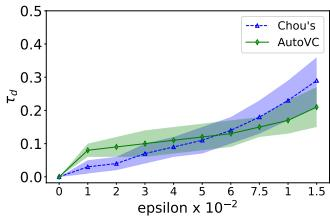  
Figure 10: The relationship between $\epsilon$ and $\tau _ { d }$

According to Figure 10,we match $\epsilon \ : = \ : 0 . 0 3$ with $\tau _ { d } ~ = ~ 0 . 0 6$ $\epsilon { = } 0 . 0 5 5$ with $\tau _ { d } = 0 . 1 2$ ,and $\epsilon { = } 0 . 0 7 5$ with $\tau _ { d } = 0 . 1 8$ for Chou's Model. For AutoVC,we match $\epsilon = 0 . 0 1$ with $\tau _ { d } = 0 . 0 6$ $\epsilon { = } 0 . 0 5$ with $\tau _ { d } = 0 . 1 2$ ,and $\epsilon { = } 0 . 1 3$ with $\tau _ { d } = 0 . 1 8$ .We also study whether the defense samples derived in Section 5.4 meet the matching requirement.Table 8 provides the average sample distortion in Section 5.4. We can see that Attack-VC and SpeakerMask can generate similar distortions based on the assigned values of ε.Thus,the comparison between Attack-VC and SpeakerMask is undera fair condition.

Table 8: Sample distortion.   

<table><tr><td rowspan="2"></td><td colspan="2">Chou&#x27;s</td><td colspan="2">AutoVC</td><td>SV2TTS</td></tr><tr><td>Attack-VC</td><td>SpecMask</td><td>Attack-VC</td><td>SpecMask</td><td>SpecMask</td></tr><tr><td>τ = 0.06</td><td>0.06± 0.02</td><td>0.06 ± 0.01</td><td>0.08± 0.03</td><td>0.06± 0.01</td><td>0.06± 0.01</td></tr><tr><td>τ = 0.12</td><td>0.13 ± 0.04</td><td>0.12 ± 0.01</td><td>0.11 ± 0.04</td><td>0.12 ± 0.01</td><td>0.12 ± 0.01</td></tr><tr><td>τ =0.18</td><td>0.18 ± 0.05</td><td>0.18 ± 0.01</td><td>0.19 ± 0.06</td><td>0.18± 0.01</td><td>0.18 ± 0.01</td></tr></table>

# 8.2Phrases for Speech Synthesis

All participants involved in Section 5.4 are asked to read the below rainbow passage containing 20 phrases. The first 10 phrases are used for determining their personal defense strategies.To demonstrate generalizability of our scheme,we apply the defense strategy to the remaining 10 phrases. The following is the passage read by them.

When the sunlight strikes raindrops in the air, they act as a prism and form a rainbow.The rainbow is a division of white light into many beautiful colors.These take the shape of a long round arch, with its path high above,and its two ends apparently beyond the horizon.There is,according to legend,a boiling pot of gold at one end.People look,but no one ever finds it.When a man looks for something beyond hisreach,his friendssay heis looking for the pot ofgold at the end of the rainbow. Throughout the centuries people have explained the rainbow in various ways.Some have accepted it as a miracle without physical explanation. To the Hebrews it was atoken that therewould beno moreuniversal floods.The Greeks used to imagine that it was a sign from the gods to foretell war or heavy rain. The Norsemen considered the rainbow as a bridge overwhich the gods passed from earth to their home in the sky.

Table 9: Phrases used for SV2TTS speech synthesis on Resemblyzer and Azure.   

<table><tr><td rowspan=1 colspan=1>We control complexity by establishing new languages for describing a design,each of which emphasizes particular aspects of the design and deemphasizes others.</td></tr><tr><td rowspan=1 colspan=1>An interpreter raises the machine to the level of the user program.</td></tr><tr><td rowspan=1 colspan=1>Everything should be made as simple as possible,and no simpler.</td></tr><tr><td rowspan=1 colspan=1>The great dividing line between success and failurecan be expressed in five words: &quot;Idid not have time.&quot;</td></tr><tr><td rowspan=1 colspan=1>When your enemy is making a very serious mistake,don&#x27;t be impolite and disturb him.</td></tr><tr><td rowspan=1 colspan=1>A charlatan makes obscure what is clear; a thinker makes clear what is obscure.</td></tr><tr><td rowspan=1 colspan=1>There are two ways of constructing a software design;one way is to make it so simple that there are obviously no deficiencies,and the other way is to make it so complicated that there are noobvious defciencies.</td></tr><tr><td rowspan=1 colspan=1>The three chief virtues of a programmer are: Laziness, Impatience and Hubris.</td></tr><tr><td rowspan=1 colspan=1>All non-trivial abstractions,to some degree,are leaky.</td></tr><tr><td rowspan=1 colspan=1>XML wasn&#x27;t designed to be edited by humans on a regular basis.</td></tr></table>

Others have tried to explain the phenomenon physically.Aristotle thought that the rainbow was caused by reflection of the sun's rays by the rain. Since then physicists have found that it is not reflection,but refraction bythe raindrops which causes the rainbows. Many complicated ideas about the rainbow have been formed.The difference in the rainbow depends considerably upon the size of the drops,and the width of the colored band increases as the size of the drops increases.The actual primary rainbow observed is said to be the effect of super-imposition of a number of bows.If the red ofthe second bow falls upon the green of the first,the result is to give a bow with an abnormally wide yellow band,since red and green lightwhenmixed form yellow. This is a very common type of bow, one showing mainly red and yellow, with little or no green or blue.

For all speech synthesis in SV2TTS,we adopt the same 10 phrases used in [67] for providing linguistic information,as is shown in Table 9.

# 8.3Analysis of the Defense Strategy

We also analyze which frequency-strategy pairs are the most effective (appear most often) in the derived speaker-level defense strategies.Specifically,after deriving the defense strategies for the speakers in the VCTK dataset,we count the number of each frequency block and modification method pair's occurrences.Then, we calculate the appearance rate (percentage) of each pair and show the top 6 pairs in Table 10.

We can see that Zero Mask is highly effective on Chou's model. AN-Mask and GB-Mask are both effective on AutoVC and SV2TTS. In addition,most of the top pairs contain large block numbers, which means modifying high frequencies (above $4 0 0 0 \mathrm { H z }$ can result in better defense effects in most cases.Those high frequencies are usually less perceptible to human beings.

# 8.4Impact of Parameters in AN-Mask and GB-Mask

We next study the impact of noise magnitude constraint (i.e., ε) in AN-Mask and the standard deviation (i.e., $\sigma$ )in GB-Mask on the defense effect.Specifically,we conduct a case study with SV2TTS and test the effective rate (defined in Section 4.1).The results in Figure 11 indicate that a smaller noise magnitude constraint in AN-Mask and a smaller standard deviation in GB-Mask typically result in reduced effective rates.Conversely,larger values of these parameters tend to increase the effective rates.However,higher values of these parameters may introduce noticeable background noise,potentially compromising the usability of the speech.

Table 10: Top 6 pairs and their appearance rates $( \% )$   

<table><tr><td></td><td colspan="2">Chou&#x27;s</td><td colspan="2">AutoVC</td><td colspan="2">SV2TTS</td></tr><tr><td>Rank</td><td>Pair</td><td>Rate</td><td>Pair</td><td>Rate</td><td>Pair</td><td>Rate</td></tr><tr><td>1</td><td>(b15,Mz)</td><td>14.4</td><td>(b13,Mz)</td><td>13.7</td><td>(b16,Mz)</td><td>6.7</td></tr><tr><td>2</td><td>(b16,Mz)</td><td>13.8</td><td>(b14,Mz)</td><td>10.1</td><td>(b14,Mz)</td><td>6.5</td></tr><tr><td>3</td><td>(b14,Mz)</td><td>11.6</td><td>(b13,MAN)</td><td>9.9</td><td>(b16,MAN)</td><td>6.5</td></tr><tr><td>4</td><td>(b6,Mz)</td><td>10.2</td><td>(b12,Mz)</td><td>6.3</td><td>(b15,Mz)</td><td>5.9</td></tr><tr><td>5</td><td>(b7,Mz)</td><td>9.6</td><td>(b12,MAN)</td><td>6.2</td><td>(b15,MAN)</td><td>5.9</td></tr><tr><td>6</td><td>(b13,Mz)</td><td>8.4</td><td>(b14,MGB)</td><td>6.1</td><td>(b13,MGB)</td><td>5.8</td></tr></table>

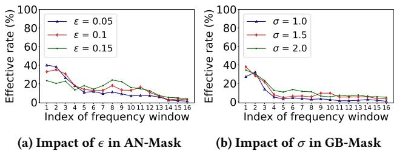  
Figure 11: Impact of parameters in AN-Mask and GB-Mask.

# 8.5Visualization

We further provide some examples of the spectrogram generated by SpeakerMask based on the three speech synthesis models.Here We randomly select two speakers’samples for demonstration. The speaker-sample ID are shown in the following figures.

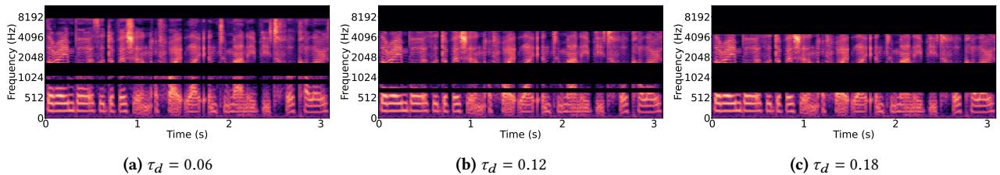  
Figure 12: Speaker-sample ID: p249-007 - Chou' defense samples.

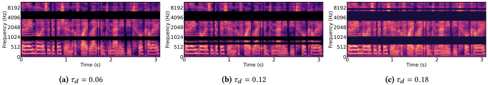  
Figure 13: Speaker-sample ID: p249-007 - AutoVC defense samples.

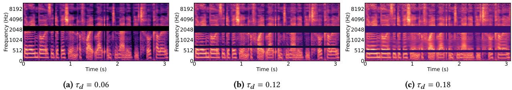  
Figure 14: Speaker-sample ID: p249-007 - SV2TTS defense samples.

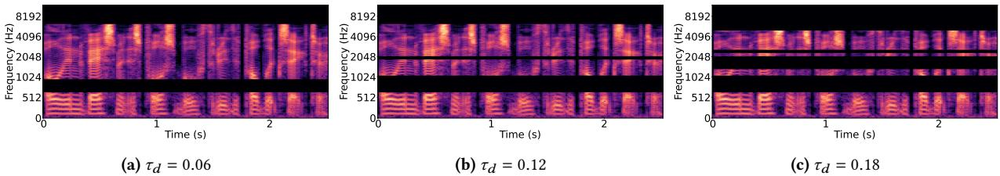  
Figure 15: Speaker-sample ID: p275-360 - Chou's defense samples.

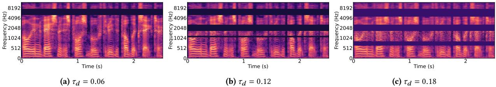  
Figure 16: Speaker-sample ID: p275-360 - AutoVC defense samples.

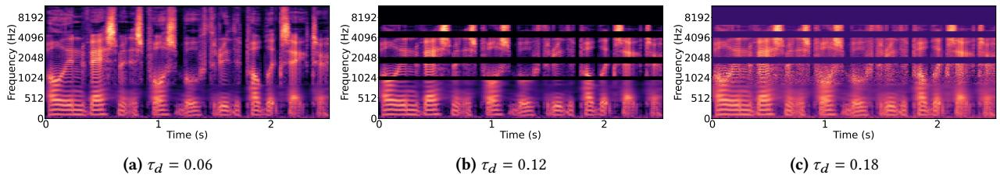  
Figure 17: Speaker-sample ID: p275-360 - SV2TTS defense samples.