# IMPERio: Robust Over-the-Air Adversarial Examples for Automatic Speech Recognition Systems

Lea Schonherr, Thorsten Eisenhofer, Steffen Zeiler, Thorsten Holz,and Dorothea Kolossa Ruhr University Bochum {lea.schoenherr,thorsten.eisenhofer,steffen.zeiler,thorsten.holz,dorothea.kolossa)@rub.de

# ABSTRACT

Automatic speech recognition (ASR) systems can be fooled via targeted adversarial examples,which induce the ASR to produce arbitrary transcriptions in response to altered audio signals.However, state-of-the-art adversarial examples typically have to be fed into the ASR system directly,and are not successful when played in a room.Previously published over-the-air adversarial examples fall into one of three categories: they are either handcrafted examples, they are so conspicuous that human listeners can easily recognize the target transcription once they are alerted to its content,or they require precise information about the room where the attack takes place,and are hence not transferable to other rooms.

In this paper, we demonstrate the first algorithm that produces generic adversarial examples against hybrid ASR systems,which remain robust in an over-the-air attack that is not adapted to the specific environment.Hence,no prior knowledge of the room characteristics is required.Instead, we use room impulse responses (RIRs) to compute robust adversarial examples for arbitrary room characteristics and employ the ASR system Kaldi to demonstrate the attack.Further, our algorithm can utilize psychoacoustic methods to hide changes of the original audio signal below the human thresholds of hearing.In practical experiments,we show that the adversarial examples work for varying room setups,and that no direct line-of-sight between speaker and microphone is necessary. Asaresult,an attacker can create inconspicuous adversarial examples for any target transcription and apply these to arbitrary room setups without any prior knowledge.

# KEYWORDS

adversarial examples,automatic speech recognition, over-the-air attack

# ACMReference Format:

Lea Schonherr, Thorsten Eisenhofer, Steffen Zeiler, Thorsten Holz,and Dorothea Kolossa.2020.IMPERIo:Robust Over-the-Air Adversarial Examples forAutomatic Speech Recognition Systems.In Annual Computer Security Applications Conference (ACSAC 2020),December 7-11,2020,Austin, USA. ACM,New York,NY,USA,13 pages.https://doi.org/10.1145/3427228.3427276

# 1INTRODUCTION

Substantial improvements in speech recognition accuracy have been achieved in recent years by using acoustic models based on deep neural networks (DNNs).Nevertheless,current studies suggest that there can be significant differences in the mechanism of artificial neural network algorithms compared to human expectations. This is a very unfortunate situation,as a rogue party can abuse this knowledge to create input data, which leads to inconsistent recognition results,without being noticed [8,9].As just one example of such attacks,several recent works have demonstrated that it is possible to fool different kinds of ASR systems into outputting a malicious transcription chosen by the attacker[1,7,9,27,29,32,37,39].

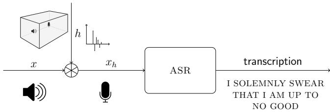  
Figure 1: For an over-the-air attack against automatic speech recognition (AsR) systems,the attack should remain viable after the transmission over the air.This transmission can be modeled as a convolution of the original audio signal $x$ with the room impulse response (RIR) $h$

The practical implications and real-world impact of the demonstrated attacks are unclear at the moment.On the one hand,earlier work fed the adversarial audio examples directly into the ASR system[9,29,39],hence ignoring all side effects (e.g.,echo or reverberation) of a real-world environment,where the sound is transmitted from a loudspeaker to the input microphone of the recognition engine.On the other hand,some works demonstrated adversarial examples that can be played over-the-air [1,7,32,37],but these proof-of-concept attacks are either tailored to a single, static room setup or are hard to reproduce systematically with a proven success rate in a different environment like the attack sketched in CommanderSong [39].Recently and independently, Chen et al.[1o] showed a first over-the-air attack.Their attack was evaluated against Deep-Speech [16].In contrast,we are showing an attack against Kaldi,a hybrid ASR system,based on a combination of a DNN-based acoustic model and a subsequent search for the optimal word sequence in a weighted-finite-state-transducer model. This approach is conceptually completely different from the end-to-end approach in DeepSpeech,as used by Chen et al.Hybrid systems such as Kaldi are significant here as they show the best performance on many speech recognition tasks,require comparatively little training material, allow for an easy replacement of task-specific grammars,and are therefore widely adopted in the industry.

In cases where over-the-air adversarial examples have been used in black-box settings,the target transcription is easily perceived by human listeners,once the intended attack is known [1,7].We argue that adversarial examples for ASR systems can only be considered a real threat if the targeted recognition is produced even when the signal is played over the air. Compared to previous attacks,where the manipulated speech signal is fed directly into the ASR system, over-the-air attacks are more challenging,as the transmission over the air significantly alters the signal.

Our key insight that forms the basis of this paper is that this transmission can be modeled as a convolution of the original audio signal with the room impulse response (RIR),which describes the alterations of an acoustic signal by the transmission via loudspeaker to the microphone (see Figure 1 for an illustration),where the RIR depends on various factors [2].In practice,it is nearly impossible to estimate an exact RIR without having access to the actual room. Therefore,robust adversarial examples need to take a range of possible RIRs into account to increase the success rate.Nevertheless, we show that for a successful attack,it is not necessary to acquire precise knowledge about the attack setup; instead,a generic adversarial example computed fora large variety of possible rooms is enough.

Robust Adversarial Examples.The first adversarial audio examples imperceptible to humans, even if they know the target tran-scription,have been described by Carlini and Wagner [9]. Other approaches [27, 29] have been successful at embedding most changes below the human threshold of hearing,which makes them much harder to notice.On the downside,none of these attacks were successfully demonstrated when played over the air as the adversarial examples need to be fed directly into the ASR system.

Approaches,which did work over the air,have only been tested in a static setup(i.e.,fixed position of speaker and microphone with a fixed distance).Yakura's and Sakuma's [37] approach can hide the target transcription but requires physical access to the room to playback the audio while optimizing the adversarial example, which limits their attack to one very specific room setup and is very time costly.Szurley and Kolter [32] published room-dependent robust adversarial examples,which even worked under constraints given by a psychoacoustic model, describing the human perception of sound.However, their adversarial examples have only been evaluated in an anechoic chamber (i.e.,a room specifically designed to absorb reflections).The attack can, therefore,not be used in real-world scenarios,but only in carefully constructed laboratories with properties that are never given in natural environments.In other successful over-the-air attacks,human listeners can easily recognize the target transcription once they are alerted to its content [1,7].Chen et al.[10] showed a first over-the-air attack against the end-to-end recognition system DeepSpeech [16],relying on a database of measured room transfer functions.

In contrast,our approach is inspired by Athalye et al's seminal work:A real-world 3D-printed turtle,which is recognized as arifle from almost every point of view due to an adversarial perturbation [4].The algorithm for creating this 3D object not only minimizes the distortion for one image,but for all possible projections of a 3D object into a 2D image.We borrow the idea and transfer it to the audio domain,replacing the projections by convolutions with RIRs,thereby hardening the audio adversarial example against the transmission through varying rooms.

Contributions.With IMPERio,we introduce the first method to compute generic and robust over-the-air adversarial examples against hybrid ASR systems.We achieve this by utilizing an RIR generator to sample from different room setups.We implement a full, end-to-end attack that works in both cases,with and without psychoacoustic hiding.In either case,we can produce successful robust adversarial examples.With our generic approach,it is possible to induce an arbitrary target transcription in any kind of audio without physical access to the target room.

More specifically,for the simulation,the convolution with the sampled RIR is added as an additional layer to the ASR's underlying neural network,which enables us to update the original audio signal directly under the constraints given by the simulated RIR. For this purpose,the RIRs are drawn out of a distribution of room setups to simulate the over-the-air attack.Using this approach, adversarial examples are hardened to remain robust in real overthe-air attacks across various room setups.We also show a reduction of the added perturbations based on psychoacoustic hiding [41],by including hearing thresholds in the backpropagation,as proposed by Schonherr et al. [29].

We have implemented the proposed algorithm to attack the hybrid DNN-HMM ASR system Kaldi [26] under varying room conditions.We demonstrate that generic adversarial examples can be computed that are transferable to different rooms and work without line-of-sight,distances in the range of meters,and even if the microphone records no direct sound but only a reflection.In fact, we even show that our generic approach,using only simulated RIRs,creates more robust adversarial examples compared to real measured examples indicating that no prior knowledge about the attack setup isrequired for our attack.

In summary, we make the following three key contributions:

· Robust Over-The-Air Attack. We propose a generic approach to generate robust over-the-air adversarial examples for DNN-HMM-based ASR systems.The attack uses a DNN convolution layer to simulate the effect of arbitrary RIRs, which allows us to alter the raw audio signal directly.   
·Psychoacoustics.We show that the attack can be combined with psychoacoustic methods for reducing the perceived distortions.   
·Performance Analysis.We evaluate the success rate of the adversarial attack and analyze the amount of added perturbation.We investigate the influence of increasing reverberation time,increasing microphone-to-speaker distances,different rooms,and no direct line-of-sight between speaker and microphone.

A demonstration of our IMPERio attack is available online at http://imperio.adversarial-attacks.net,where we present several adversarial audio files which have been successfully tested when played over-the-air.

# 2BACKGROUND

In the following,we provide an overview of the ASR system that we used in the attack and describe the general approach to calculate audio adversarial examples.Furthermore,we discuss how room simulations can be performed with the help of RIRs and briefly introduce the necessary background from psychoacoustics as these are used to hide the attack.

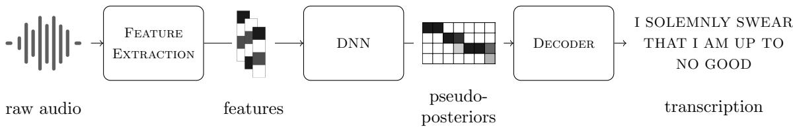  
Figure 2: Overviewof a state-of-the-art hybrid ASR system with the three main components of the ASR system:feature ex-traction, calculating pseudo-posteriors with a DNN, and decoding.

# 2.1 Automatic Speech Recognition

For the demonstration of an end-to-end attack,we chose the opensource speech recognition toolkit Kaldi [26],which has been used in previous attacks [29,39] and is also used in commercial tools like Amazon's Alexa [29].In Figure 2,a high-level overview of this system is given.The DNN-HMM-based ASR system can be divided into three parts: the feature extraction,which transforms the raw input data into representative features,the DNN as the acoustic model of the system,and the decoding step,which returns the recognized transcription.

Feature Extraction.For the feature extraction, the raw audio is divided into frames (e.g.,20 ms long) with a certain overlap (e.g., $1 0 \mathrm { m s }$ between two neighboured frames.For each of these frames,a discrete Fourier transform (DFT) is performed to retrieve afrequency representation of the audio input.Next, the magnitude and the logarithm of the resulting complex signal are calculated.The result is a common representation of audio features in the frequency domain.In Schonherr et al.'s approach,this feature extraction is integrated into the DNN,allowing them to directly modify the raw audio data when computing adversarial examples (see Figure 3 for an illustration).

Acoustic Model DNN. The features described above are used as the input for the acoustic model DNN.Based on these, the DNN calculates a matrix of so-called pseudo-posteriors,which describe the probabilities for each of the phones of the language-English, in this case-being present in each time step $t = 1 \dots T$

Decoding.Finally,the pseudo-posteriors are used to calculate the most likely transcription via Viterbi decoding and an HMM-based language model.

This so-called hybrid approach, which realizes speech recognition through a search for the most likely path through a matrix of phone posteriors,is easier to train and still achieves better results in comparison to end-to-end approaches [22].

# 2.2Adversarial Audio Examples

For the calculation of adversarial examples,the ASR system can be described as the function

$$
y = \arg \operatorname* { m a x } _ { \tilde { y } } P ( \tilde { y } | x ) = f ( x ) ,
$$

mapping an audio signal $x$ to its corresponding, most likely transcription $y$ .An adversarial example is generated by modifying the original input

$$
x ^ { \prime } = x + \delta , \quad { \mathrm { s u c h ~ t h a t } } \quad f ( x ) \neq f ( x ^ { \prime } ) .
$$

The added distortions $\delta$ can also be restricted, e.g. via hearing thresholds.In this work,only targeted attacks are considered, where the target transcription $y ^ { \prime } \overset { ! } { = } f ( x ^ { \prime } )$ is defined by the attacker. The optimization can, therefore,be described as

$$
x ^ { \prime } = \arg \operatorname* { m a x } _ { \tilde { x } } P ( y ^ { \prime } | \tilde { x } ) .
$$

To calculate robust over-the-air adversarial examples,we base our work on the approach proposed by Schonherr etal. [29] and similar works.The method can be divided into three steps: forced alignment, gradient descent,and restriction of the perturbations via hearing thresholds.

Forced Alignment.Forced alignment is typically used during the training of the ASR systems when no exact alignments between the audio and the transcription data are available.In our case,we utilize this algorithm to find the best possible alignment of the original audio input and the malicious target transcription.

Gradient Descent.For the attack,the feature extraction is integrated into the DNN,so that the raw audio data can be updated directly via gradient descent.For this purpose,the cross-entropy loss is measured between the target output-the pseudo-posteriors一 and the actual DNN output,and is used to compute gradients for the optimization algorithm.

Psychoacoustic Hearing Thresholds.Theadded noise isrestricted to those time-frequency ranges,where noise perceptibility is minimal.For this,we use psychoacoustic hearing thresholds described by Zwicker and Fastl [41].

# 2.3 Room Impulse Response

When an audio signal is transmitted through a room,as visualized in Figures 1 and 4, the recorded signal can be approximated by convolving the room's impulse response $h$ with the original audio signal $x$ as

$$
x _ { h } = x * h .
$$

Here,the convolution operator $^ *$ is a shorthand notation for the multi-path transmission model

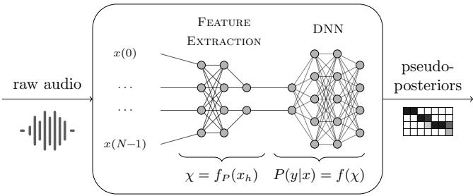  
Figure 3: Augmented DNN,which gets the raw audio as input and integrates the feature extraction into the recognizer's DNN. This enables us to update the raw audio signal directly via gradient descent.

$$
x _ { h } ( n ) = \sum _ { m = n - M + 1 \atop { \mathrm { w i t h } } \quad n = 0 , \ldots , N - 1 , } ^ { n } x ( m ) \cdot h ( n - m )
$$

where $N$ is the length of the audio signal, $M$ the length of the RIR $h$ and all $x ( n )$ with $n < 0$ are assumed to be zero.

In general, the RIR $h$ depends on the size of the room, the positions of the source and the receiver,and other room characteristics such as the sound reflection properties of the walls,any furniture, people,or other contents of the room.Hence, the audio signal received by the ASR system is never identical to the original audio, and an exact RIR is practically impossible to predict.We describe a possible solution for a sufficient approximation in Section 3.

# 2.4Psychoacoustics

Psychoacoustics yields an effective measure of(in-)audibility,which is also helpful for the calculation of inconspicuous audio adversarial examples [27,29].Psychoacoustic hearing thresholds describe how the dependencies between frequencies and across time lead to masking effects in human perception [41].Probably the bestknown example for an application of these effects is found in MP3 compression [18],where the compression algorithm uses empirical hearing thresholds to minimize bandwidth or storage requirements. For this purpose,the original input signal is transformed into a smaller but lossy representation.

For an attack,the psychoacoustic hearing thresholds are used to limit the changes in the audio signal to time-frequency-ranges, where the added perturbations are not,or barely,perceptible by humans.To calculate the hearing thresholds,we use the approach described by Schonherr et al. [29].

# 3OVER-THE-AIR ADVERSARIAL EXAMPLES

Our goal is to compute robust audio adversarial examples,which still work after transmission froma loudspeaker.For this,we simulate different RIRs and employ an iterative algorithm to compute adversarial examples robust against signal modifications that are incurred during playback in a room.

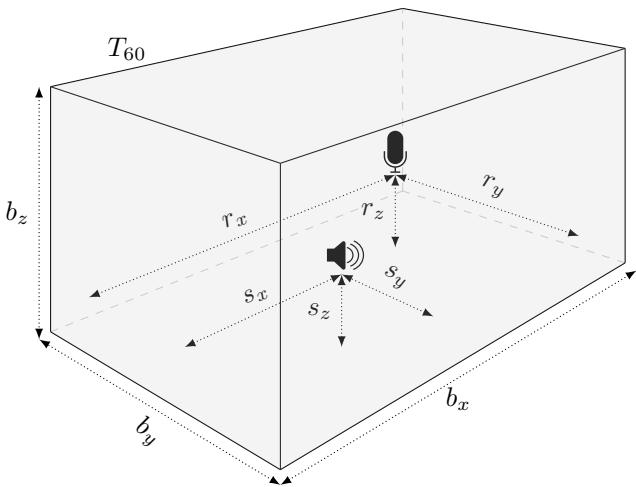  
Figure 4: For the room simulation model, we assume a probability distribution over all possible rooms by defining relevant simulation parameters like the room geometry, the reverberation time $T _ { 6 0 }$ ,and positions of source and receiver as random variables.To optimize our over-the-air adversarial examples,we sample from this distribution to get a variety of possible RIRs.

# 3.1 Threat Model

Throughout the rest of this paper, we consider the following threat model similar to prior work in this area.We assumea white-box attack, where the adversary knows the internals of the ASR system, including all its model parameters.This requirement is in line with prior work on this topic [9,29,39].Using this knowledge,the attacker generates malicious audio samples ofline before the actual attack takes place,i.e.,the attacker exploits the ASR system to create an audio file that produces the desired recognition result,which is then played via a loudspeaker.Additionally,we assume that the trained ASR system,including the DNN,remains unchanged over time.Finally,we assume that the adversarial examples are played over the air.Note that we only consider targeted attacks,where the target transcription is predefined (i.e., the adversary chooses the target transcription).Finally,we assume a threat model where a potential attacker can run an extensive search. Specifically, the attacker is able to calculatea batch of potential adversarial examples and select those examples that are especially robust.

# 3.2Room Impulse Response Simulator

To simulate RIRs,we use the AudioLabs implementation based on the image method from Allen and Berkley [2].The simulator takes as input the room dimensions,the reverberation time $T _ { 6 0 }$ ,and the position of source and receiver and approximates the corresponding RIR for the given parameters.

For our attack,we model cuboid-shaped rooms,which can be described by their length $b _ { x }$ ,width $b _ { y }$ ,height $b _ { z }$ defined as $\mathbf { b } =$ $[ b _ { x } , b _ { y } , b _ { z } ]$ .In addition to this,we model the three-dimensional source position $\mathbf { \boldsymbol { s } } = \left[ s _ { x } , s _ { y } , s _ { z } \right]$ ,receiver position $\mathbf { r } = [ r _ { x } , r _ { y } , r _ { z } ] ,$ and the reverberation time $T _ { 6 0 }$ ,which isa standard measure for the audio decay time,defined as the time it takes for the sound pressure level to reduce by $6 0 \mathrm { d B }$ .This results in ten freely selectable parameters.All parameters are also sketched in Figure 4.Even though this might seem like an overly simple model,we show that the computed adversarial examples are indeed robust for real rooms that are more complex.

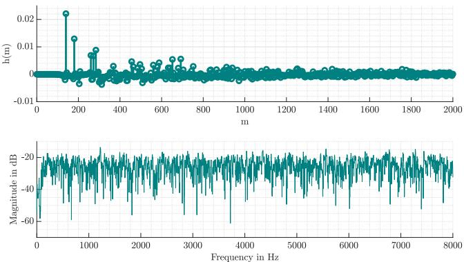  
Figure 5: Simulated RIR for $\begin{array} { r l r } { \mathbf { b } } & { { } = } & { [ 8 \mathbf { m } , 7 \mathbf { m } , 2 . 8 \mathbf { m } ] , \ s } \end{array}$ $\begin{array} { r l } { \pmb { \mathscr { S } } } & { { } = } \end{array}$ $[ 3 . 9 \mathbf { m } , 3 . 4 \mathbf { m } , 1 . 2 \mathbf { m } ]$ and $\mathbf { r } = \left[ 1 . 4 \mathbf { m } , 1 . 8 \mathbf { m } , 1 . 2 \mathbf { m } \right]$ ,and $T _ { 6 0 } = 0 . 4$ in the time domain (top) and the frequency domain (bottom).

In order to sample random RIRs,we interpret these ten parameters to be random variables.We draw each value froma uniform distribution betweena minimum and a maximum allowed value. For the room size and for $T _ { 6 0 }$ ,the minimum and the maximum values can be chosenarbitrarily and are thus selected first.After those parameters are drawn, the ranges for source and receiver positions are drawn to guarantee that the source and the receiver are located inside the room.

To simplify the notation, we use the 10-dimensional parameter vector $\theta$ in the following to describe all of these parameters.The RIR $h$ can be considered as a sample of the distribution $H _ { \theta }$ . An example of a simulated RIR in the time and the frequency domain is shown in Figure 5.

# 3.3Robust Audio Adversarial Examples

Unlike earlier approaches that feed adversarial examples directly into the ASR system [9,29],we explicitly include characteristics of the room,in the form of RIRs,in the optimization problem.This hardens the adversarial examples to remain functional in an overthe-air attack.

For the attack,we therefore extend the optimization criterion given in (3) by

$$
x ^ { \prime } = \arg \operatorname* { m a x } _ { \tilde { x } } \quad \mathbb { E } _ { h \sim H _ { \theta } } [ P ( y ^ { \prime } | \tilde { x } _ { h } ) ] .
$$

This approach is derived from the Expectation Over Transformation (EOT)approach in the visual domain,where it is used to consider different two-and three-dimensional transformations,which leads to robust real-world adversarial examples [4]. In our case,instead of visual transformations,we use the convolution with RIRs, drawn from $H _ { \theta }$ ,to maximize the expectation over varying RIRs,as shown in Equation (6).

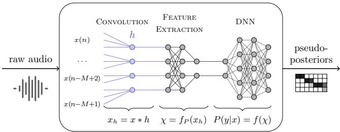  
Figure 6: To simulate any RIR and to update the time domain audio signal directly, the RIR is integrated as an additional layer into the DNN.

For the implementation, we use a DNN that already has been augmented to include the feature extraction and prepend an additional layer to the DNN.This layer simulates the convolution from the input audio fle with the RIR $h$ to model the transmission through the room.Integrating this convolution as an additional layer allows us to apply gradient descent directly to the raw audio signal.A schematic overview of the proposed DNN is given in Figure 6.The first part("Convolution") describes the convolution with the RIR $h$ Note that the RIR simulation layer is only used for the calculation of adversarial examples and removed during testing,as the actual RIR will then act during the transmission over the air. The center and right part("Feature extraction"and “DNN") show the feature extraction and the acoustic model DNN,which is used to obtain the pseudo-posteriors for the decoding stage.

The inclusion of the convolution as a layer in the DNN requires it to be differentiable.Using (5),the derivative can be written as

$$
\frac { \partial x _ { h } ( n ) } { \partial x ( m ) } = h ( n - m ) \quad \forall n , m .
$$

This can be integrated for the calculation of the gradient $\nabla x$ as

$$
\nabla x = \frac { \partial L ( y , y ^ { \prime } ) } { \partial f ( \chi ) } \cdot \frac { \partial f ( \chi ) } { \partial f _ { p } ( x _ { h } ) } \cdot \frac { \partial f _ { p } ( x _ { h } ) } { \partial x _ { h } } \cdot \frac { \partial x _ { h } } { \partial x } ,
$$

where the function $f _ { p } ( \cdot )$ describes the feature extraction. This is an extension of the approach in [29],where

$$
\nabla x = { \frac { \partial L ( y , y ^ { \prime } ) } { \partial f ( \chi ) } } \cdot { \frac { \partial f ( \chi ) } { \partial f _ { p } ( x ) } } \cdot { \frac { \partial f _ { p } ( x ) } { \partial x } }
$$

is defined for the calculation of adversarial examples via gradient descent using the objective function $L ( \cdot )$

# 3.4Over-the-Air Adversarial Examples

Toassess the robustness of the hardened over-the-air adversarial attack, the adversarial examples $x ^ { \prime }$ have to be played back via a loudspeaker,and the recorded audio signals are used to determine the accuracy.For the calculation,we implemented the optimization as defined in (6),by sampling a new RIR $h$ after every set of $Q$ gradient descent iterations.This simulates different rooms and recording conditions.Therefore,the generated adversarial example depends on the distribution $H _ { \theta }$ ,from which the RIR $h$ is drawn. After each gradient descent step,the audio signal $x ^ { \prime }$ is updated via the calculated gradient $\nabla x$ at the learning rate $\alpha$

The total maximum number of iterations is limited to at most $G$ iterations.However, if a successful robust adversarial example is created before the maximum number of iterations is reached, the algorithm does not need to continue.To efficiently calculate adversarial examples,we use an RIR $h _ { \mathrm { t e s t } }$ to simulate the over-the-air scenario during the calculation to verify whether the example has already achieved over-the-air robustness.This RIR is only used for verification and can,for example,be drawn out of $H _ { \theta }$ once at the beginning of the algorithm.

Algorithm 1 Calculation of robust adversarial examples.   

<table><tr><td>olds Φ,distribution He</td><td>1:input:original audio x,target transcription y&#x27;,hearing thresh</td></tr><tr><td>2:</td><td>result: robust adversarial example x&#x27;</td></tr><tr><td>3:</td><td>initialize:g←0,x&#x27;←x</td></tr><tr><td>4:</td><td>while g&lt;Gand y≠y&#x27;do</td></tr><tr><td>5:</td><td>g←g+1</td></tr><tr><td>6:</td><td>draw random sample h~ Hθ</td></tr><tr><td>7:</td><td>update first layer of DNN with h</td></tr><tr><td>8:</td><td>for 1 to Q do</td></tr><tr><td>9:</td><td>// gradient descent,optionally constrained by</td></tr><tr><td>10:</td><td>//hearing thresholdsΦ</td></tr><tr><td>11:</td><td>Vx← aL(y,y&#x27;) dx</td></tr><tr><td>12:</td><td>x&#x27;←x&#x27;+α·Vx</td></tr><tr><td>13:</td><td>xh← x&#x27;* htest</td></tr><tr><td>14:</td><td>y ← decode(xh) with DNNo</td></tr></table>

The entire approach is summarized with Algorithm1.As can be seen, the psychoacoustic hearing thresholds $\Phi$ are optionally used during the gradient descent to limit modifications of the signal to those time-frequency ranges,where they are (mostly)imperceptible. Here, $\mathrm { D N N } _ { 0 }$ describes the augmented DNN("Feature extraction" and“DNN") in Figure 3 without the RIR simulation since,for the algorithm, this is replaced by the simulated RIR $h _ { \mathrm { t e s t } }$

# 4EXPERIMENTALEVALUATION

In the following,we evaluate the performance of the proposed algorithm for adversarial examples played over-the-air and compare the performance for varying reverberation times, distances,and adversarial examples restricted by psychoacoustic hearing thresholds. Additionally,we compare the generic approach with an adapted version of the attack where an attacker has prior knowledge of the target room.Finally,we measure the changes of generic adversarial examples replayed in different rooms and,even if there is no direct line-of-sight between the microphone and the speaker.

Forapractical demonstration of the attack,exemplary adversarial examples are available online at http://imperio.adversarialattacks.net.

# 4.1 Metrics

We use the following standard measures to assess the quality of the computed adversarial examples.

4.1.1Word Error Rate.To measure performance,we use the word error rate(WER) with respect to the target transcription.For its computation, the standard metric for this purpose,the Levenshtein distance [23] $\mathcal { L }$ ,is used,summing up the number of deleted $D$ inserted $I$ ,and substituted $S$ words for the best possible alignment between target text and recognition output. The Levenshtein distance is finally divided by the total number of words $N$ to obtain

$$
W E R = 1 0 0 \cdot { \frac { \mathcal { L } } { N } } = 1 0 0 \cdot { \frac { D + I + S } { N } } .
$$

Forareal attack,anadversarial example can only be considered successful if a WER of $0 \%$ is achieved (i.e., the hypothesis of the system matches with the attacker chosen target transcription).

4.1.2Segmental Signal-to-Noise Ratio. The segmental signal-tonoise ratio (SNRseg) measures the amount of noise $\sigma$ added from an attacker to the original signal $x$ and is computed as

$$
\mathrm { S N R s e g } ( \mathrm { d B } ) = \frac { 1 0 } { K } \sum _ { k = 0 } ^ { K - 1 } \log _ { 1 0 } \frac { \sum _ { t = T k } ^ { T k + T - 1 } x ^ { 2 } ( t ) } { \sum _ { t = T k } ^ { T k + T - 1 } \sigma ^ { 2 } ( t ) } ,
$$

where $T$ is the segment length and $K$ the number of segments. Thus, the higher the SNRseg,the less noise was added.

In contrast to the signal-to-noise ratio (SNR), the SNRseg [35] is computed frame-wise and gives a better assessment of an audio signal if the original and the added noise are aligned [38] as it is the case in our experiments.

# 4.2 Calculation Time

All experiments were performed on a machine with an Intel Xeon Gold 6130 CPU and 128 GB of DDR4 memory.

For our experiments,we limit the maximum number of iterations to 2000 since in every iteration more distortions are added to the audio file,which decreases the audio qualityof the adversarial examples. Also, this number is sufficient for the attack to converge, as can be seen in Figure 8,where the WER is plotted as a function of the maximum numbers of iterations $G$

Computing an adversarial example for 10 seconds of audio with the maximum number of $G = 2 0 0 0$ iterations and $M = 5 1 2$ takes about 80 minutes.Note that the computation for a single audio file is limited by the single-core performance of the machine,and the attack is fully parallelizable for multiple audio files.

# 4.3Over-the-Air Attacks

We evaluate the attack for the lab setup as shown in Figure 7.The approximate dimensions of this room are $\mathbf { b } _ { \mathrm { r e a l } } \approx [ 8 \mathrm { m } , 7 \mathrm { m } , 2 . 8 \mathrm { m } ]$ and the positions of the loudspeaker and the microphone are $\mathbf { s } _ { \mathrm { r e a l } } =$ $[ 3 . 9 \mathrm { m } , 3 . 4 \mathrm { m } , 1 . 2 \mathrm { m } ]$ and $\mathbf { r } _ { \mathrm { r e a l } } = \left[ 1 . 4 \mathrm { m } , 1 . 8 \mathrm { m } , 1 . 2 \mathrm { m } \right]$ ,respectively.

Wecompute all adversarial examples with Algorithm1.Based on preliminary experiments,we set $G = 2 0 0 0$ and $Q = 1 0$ .For the distributions $H _ { \theta }$ ,we used two different versions, shown in Table 1. $H _ { \theta _ { \mathrm { g e n } } }$ describes a generic room, while $H _ { \theta _ { \mathrm { a d p } } }$ is used as an approximation to reassemble the real room from Figure 7.If not specified otherwise, $h _ { \mathrm { t e s t } }$ ,which is used for testing during the attack,is drawn once at the beginning of the algorithm from the same distribution $H _ { \theta }$

The WER is measured for the recorded adversarial examples after playing them via loudspeaker. The SNRseg is calculated after applying a measured RIR $h _ { \mathrm { r e a l } }$ to both the original signal and the adversarial example.We chose this approach since it corresponds to the actual signal perceived by human listeners if the adversarial examples are played over the air.

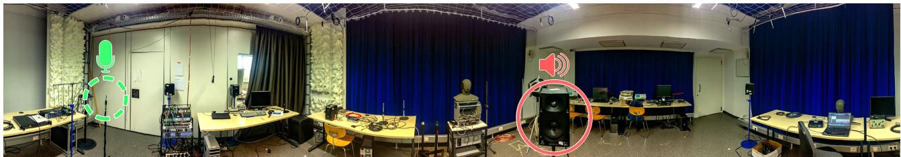

Figure 7:360 degree panorama shotof thelab setup used fortheover-the-air recordings.Thegreendashed circle shows the microphone position and the red solid circle shows the position of the loudspeaker.

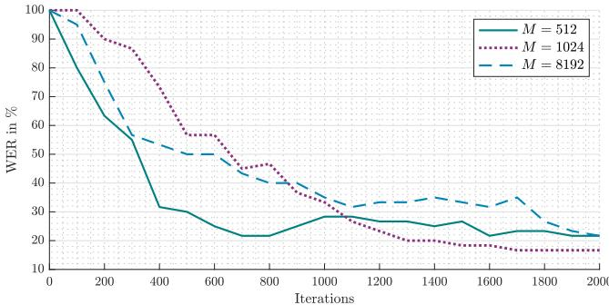  
Figure 8: WERs for simulated over-the-air attacks as a function of the maximum number of iterations $G$

For all cases,we calculated 20 adversarial examples.In some cases, the audio samples clipped too much (exceeded the maximum defined value of the audio,after the additionof the adversarial distortion).As it would not be possible to replay those examples, we removed them from the evaluation of the real over-the-air attack. Each of the remaining adversarial examples were played five times, and we reported the number of adversarial examples that could be transcribed with $0 \%$ WER.

4.3.1Generic Over-the-Air Attack.First,we evaluate the attack under the assumption that the attacker has no prior knowledge about the attack setup. Specifically, we use $H _ { \theta _ { \mathrm { g e n } } }$ and calculate adversarial examples for different reverberation times $T _ { 6 0 }$ and varying length $M$ of RIRs. $M$ describes how many past sampling values are considered,and the larger the reverberation time,the more important are the past sampling values.We assume that,especially in setups with high reverberation times $T _ { 6 0 }$ ,alarger $M$ will result in more robust adversarial examples,as it isa better match to the real-world conditions.

For the experiments,we used the variable-acoustics lab in Figure 7to adjust the reverberation time and tested three versions of the RIR length $M = 5 1 2$ ， $M = 1 0 2 4$ ,and $M = 8 1 9 2$ for speech data. The results in Table 2 confirm the above assumption: for $M = 8 1 9 2$ we canobtain the best WERs,especially for the longer reverberation times.Note that even if the WER seems to be high,for an attacker,itis suffcient toplayone successful adversarial example with $0 \% \mathrm { W E R }$ ,which is also in line with the definition in Section 3.1 and,in fact possible.The SNRseg decreases with increasing values for $M$ ,which indicates that more noise needs to be added to these adversarial examples.However, the calculation time of the adversarial examples increases by the factor of four from $M = 5 1 2$ to $M = 8 1 9 2$

Table 1: Range of room dimensions for sampling the different distributions. H0gen describes a generic room,which is used for the generic version of the attack,where we assume theattackertohave nopriorknowledge.Incaseof Hadp' the distributions are adapted to the lab setup in Figure 7.   

<table><tr><td></td><td colspan="2">bx</td><td colspan="2">v</td><td colspan="2">bz</td><td colspan="2">T60</td></tr><tr><td></td><td>min</td><td>max</td><td>min</td><td>max</td><td>min</td><td>max</td><td>min</td><td>max</td></tr><tr><td>H0gen</td><td>2.0m</td><td>15.0m</td><td>2.0m</td><td>15.0m</td><td>2.0m</td><td>5.0m</td><td>0.0s</td><td>1.0s</td></tr><tr><td>Hadp</td><td>6.0m</td><td>10.0m</td><td>5.0m</td><td>9.0m</td><td>3.0m</td><td>5.0m</td><td>0.2s</td><td>0.6s</td></tr></table>

Table 2: WER, number of successful adversarial examples, andSNRsegforgenericover-the-airatacks using $H _ { \theta _ { \mathbf { g e n } } }$ with speech data for different $M$ and varying $T _ { 6 0 }$ ·   

<table><tr><td></td><td colspan="2">M=512 AEs</td><td colspan="2">M=1024 AEs</td></tr><tr><td></td><td>WER</td><td>WER</td><td>WER</td><td>M=8192 AEs</td></tr><tr><td>T60 = 0.42 s</td><td>42.2% 5/20</td><td>34.9%</td><td>5/20</td><td>33.3% 2/20</td></tr><tr><td>T60 = 0.51 s</td><td>68.9% 1/20</td><td>56.4%</td><td>2/20 42.0%</td><td>2/20</td></tr><tr><td>T60 = 0.65 s</td><td>91.6% 0/20</td><td>88.0%</td><td>0/20</td><td>68.7% 2/20</td></tr><tr><td>SNRseg</td><td>7.6±6.7dB</td><td>7.7±6.7dB</td><td></td><td>3.2±6.1dB</td></tr></table>

4.3.2Hearing Thresholds.To measure the impactof hearing thresholds,we conducted the same experiments as for Table 2 with $T _ { 6 0 } = 0 . 4 2$ and hearing thresholds.The results are shown in Table 3. Compared to the version without hearing thresholds,the WER and the total number of successful adversarial examples decrease.Nevertheless,it was possible to find successful adversarial examples for $M = 8 1 9 2$ .At the same time,the SNRseg has improved values. Additionally, the SNRseg measures any added noise,not only the perceptible noise components.Therefore,the perceptible noise is even lower than the SNRseg would suggest for the versions where hearing thresholds are used.

4.3.3Distance between Speaker and Microphone.In Figure 9,we measured the effect of an increasing distance between the microphone and loudspeaker.We used the shortest reverberation time $T _ { 6 0 } = 0 . 4 2 s$ and varied the distance from $1 \mathrm { m }$ to $_ { 6 \mathrm { m } }$ for $M = 8 1 9 2$ with and without hearing thresholds.

Table 3: WER,number of successful adversarial examples, adSsee $H _ { \theta _ { \mathbf { g e n } } }$ and hearing thresholds with speech data for different $M$   

<table><tr><td rowspan=1 colspan=1></td><td rowspan=1 colspan=1>M= 512WER AEs</td><td rowspan=1 colspan=1>M= 1024WER AEs</td><td rowspan=1 colspan=1>M=8192WER AEs</td></tr><tr><td rowspan=1 colspan=1>T60 = 0.42 s</td><td rowspan=1 colspan=1>70.0%0/20</td><td rowspan=1 colspan=1>62.7%0/20</td><td rowspan=1 colspan=1>69.6%2/20</td></tr><tr><td rowspan=1 colspan=1>SNRseg</td><td rowspan=1 colspan=1>11.5±5.2 dB</td><td rowspan=1 colspan=1>10.4±6.9 dB</td><td rowspan=1 colspan=1>5.5±4.8dB</td></tr></table>

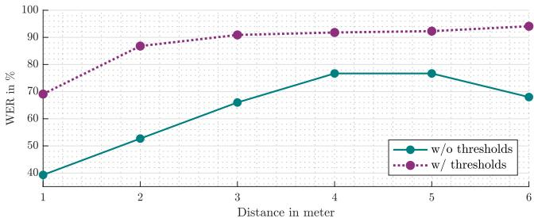  
Figure 9: WERs for over-the-air attacks plotted over the distance between microphone and speaker for $M = 8 1 9 2$ with and without hearing thresholds.

In general, we find that the WER increases with increasing distance.Nevertheless, starting from a distance of approximately $2 \mathrm { m }$ ， the WER does not increase as rapidly as for smaller distances if we use hearing thresholds.In cases where no hearing thresholds are used, the WER even decreases for larger distances.

4.3.4Varying Audio Content.In Table 4,we evaluated the effect of varying audio contents of the original audio samples.For this, we used speech,music,and bird chirping data.Using speech audio samples for the attack results in the best WERs.

The average SNRseg indicates that most distortions have to be added to the original audio samples for bird chirping while we achieve better results for music and speech data.

4.3.5Adaptive Attack.In the following,we compare the generic attack,where the attacker has no prior knowledge about the attack setup,with an adapted version of the attack.Note that the generic attack is the more powerful attack compared to the adapted version, as it requires no access nor any information about the room where the attack is conducted.

For theevaluation, we used Hadpa and $H _ { \theta _ { \mathrm { g e n } } }$ in Table 1,combined with a measured RIR $h _ { \mathrm { r e a l } }$ and a simulated RIR $h _ { \mathrm { g e n } }$ for $h _ { \mathrm { t e s t } }$ in Algorithm 1. $h _ { \mathrm { g e n } }$ was drawn once at the beginning of the algorithm from the same distribution, described via $H _ { \theta _ { \mathrm { g e n } } }$ $h _ { \mathrm { r e a l } }$ is a measured RIR,obtained from the recording setup that is actually used during the attack. Consequently, the version with $H _ { \theta _ { \mathrm { g e n } } }$ and $h _ { \mathrm { g e n } }$ does not use any prior knowledge of the room or the recording setup, while the version with $H _ { \theta _ { \mathrm { a d p } } }$ and $h _ { \mathrm { r e a l } }$ is tailored to the room. Surprisingly, thegenericversionclearlyoutperformsteadaptedversions $( H _ { \theta _ { \mathrm { a d p } } }$ $h _ { \mathrm { r e a l } } )$ in Table 5,and we were able to find fully successful adversarial examples for those cases,i.e.,adversarial examples witha WER of $0 \%$

Table 4: WER,number of successful adversarial examples, and SNRseg for different audio content for $M = 5 1 2$   

<table><tr><td></td><td>Music</td><td>Speech</td><td>Birds</td></tr><tr><td>Sucessful AEs</td><td>1/20</td><td>5/20</td><td>0/20</td></tr><tr><td>WER</td><td>61.1%</td><td>42.2%</td><td>71.7%</td></tr><tr><td>SNRseg</td><td>10.7±2.7 dB</td><td>7.6±6.7dB</td><td>1.2±3.0 dB</td></tr></table>

Table 5: WER, number of successful adversarial examples, and SNRseg for different audio content for $M = 5 1 2$ Comparing generic over-the-air attacks with adapted over-theairattacks.   

<table><tr><td></td><td colspan="2">Music</td><td colspan="2">Speech</td><td colspan="2">Birds</td></tr><tr><td></td><td>WER</td><td>AEs</td><td>WER</td><td>AEs</td><td>WER</td><td>AEs</td></tr><tr><td>Hgen,hgen</td><td>61.1%</td><td>1/20</td><td>42.2%</td><td>5/20</td><td>71.7%</td><td>0/20</td></tr><tr><td>Headp,hadp</td><td>63.2%</td><td>2/20</td><td>65.0%</td><td>2/20</td><td>84.5%</td><td>2/20</td></tr><tr><td>△ in WER</td><td>+ 2.1%</td><td></td><td>+ 22.8%</td><td></td><td>+ 12.8%</td><td></td></tr></table>

Table 6: WER and number of successful adversarial examples for generic over-the-air attacks with and without direct line-of-sight in varying rooms based on speech data for $M = 8 1 9 2$   

<table><tr><td></td><td colspan="2">Lecture Room</td><td colspan="2">Meeting Room</td><td colspan="2">Office</td></tr><tr><td></td><td>WER</td><td>AEs</td><td>WER</td><td>AEs</td><td>WER</td><td>AEs</td></tr><tr><td>w/line-of-sight</td><td>40.0%</td><td>2/20</td><td>55.3%</td><td>1/20</td><td>74.0%</td><td>1/20</td></tr><tr><td>w/o line-of-sight</td><td>71.3%</td><td>0/20</td><td>62.0%</td><td>0/20</td><td>82.7%</td><td>1/20</td></tr><tr><td>△in WER</td><td> + 31.3%</td><td></td><td>+6.7%</td><td></td><td>+8.7%</td><td></td></tr></table>

As a consequence,for an attacker,it is not only unnecessary to acquire prior knowledge about the room characteristics,but the likelihood of success is even higher if a generic attack is chosen.

4.3.6Varying Room Conditions.To evaluate the adversarial examples in varying rooms,we chose three rooms of differing sizes: a lecture room with approximately $7 7 { \mathrm m } ^ { 2 }$ ,a meeting room with approximately $3 8 \mathrm { m } ^ { 2 }$ ,and an offce with approximately $3 1 \mathrm { m } ^ { 2 }$ . Layout plans of the rooms are shown in Appendix A,including positions of the speaker and microphone for all recording setups and the measured reverberation time.

Direct Line-of-Sight Attack.The first attacks were conducted with a direct line-of-sight between the microphone and the speaker. The results are shown in Table 6. Even though the results vary depending on the room, the WERs remain approximately in the same range as the experiments with varying reverberation times in Table 2 would indicate.Surprisingly, the room with the highest reverberation time,the lecture room,actually gave the best results.

Overall, the results show that our generic adversarial examples remain robust for different kinds of rooms and setups and that it is sufficient to calculate one version of an adversarial example to covera wide range of rooms (i.e., the attack is transferable).

No Line-of-Sight Attack.For the rooms in Table 6,we also performed experiments where no line-of-sight between the microphone and the speaker exists by blocking the direct over-the-air connection with different kinds of furniture.As a consequence, not the direct sound, but a reflected version of the audio is recorded. Animplication is that theseattacks could be carried out without being visible to people in the vicinity of the ASR input microphone. We tested different scenarios for our setup:In the lecture and the meeting room, the source and the receiver were separated bya table by simplyplacing the speaker under the table.In the office, the speaker was even placed outside the room.For this recording setup, the door between the rooms was left open.For all other setups, the doors of the respective rooms were closed.A detailed description of the no line-of-sight setups is given in Appendix A.

In cases where no line-of-sight exists,the distortions that occur through the transmission can be considered more complex,and consequentially,a prediction of the recorded audio signal is hard.A blocked line-of-sight will most likely decrease the WER,but it is in general possible to find adversarial examples with $0 \%$ WER, even where the source was placed outside the room.This again shows that our generic version of the attack can successfully model a wide range of acoustic environments simultaneously,without any prior knowledge about the room setup.

# 5RELATED WORK

In addition to the prior work that we have already discussed, we want to providea broader and more detailed overview of related work in the following.

Generally speaking,adversarial attacks on ASR systems focus either on hiding a target transcription [1,7]or on obfuscating the original transcription [12].Almost all previous works on attacks against ASR systems did not focus on real-world attacks [7,40] or were only successful for simulated over-the-air attacks [27].

Carlini etal.[7] have shown that targeted attacks against HMMonly ASR systems are possible.They use an inverse feature extraction to create adversarial audio samples.However, the resulting audio samples are not intelligible by humans in most cases and may be considered as noise,but may make thoughtful listeners suspicious once they are alerted to its hidden voice command.An approach to overcome this limitation was proposed by Zhang et al. [40]. They have shown that an adversary can hide a transcription by utilizing non-linearities of microphones to modulate the baseband audio signals with ultrasound above $2 0 \mathrm { k H z }$ ,which they inject into the environment.The main downside of this attack,hence,is that the attacker needs to place an ultrasound transmitter in the vicinity of the voice-controlled system under attack and that the attacker needs to retrieve information from the audio signal, recorded with the specific microphone,which is costly in practice and tailors the attack to one specific setup.Song and Mittael [31] and Roy et al. [28] introduced similar ultrasound-based attacks that are not adversarial examples, but rather interact with the ASR system in a frequency range inaudible to humans.Nevertheless,for the attack hours of audio recordings are required to adjust the attack to the setup [31] or specially designed speakers are necessary [28].

Carlini and Wagner [9] published a general targeted attack on ASR systems using CTC-loss.The attacker creates the optimal attack via gradient-descent-based minimization [8] (similarto previous adversarial attacks on image classification),but the adversarial examples are fed directly into the recognizer. CommanderSong [39] is evaluated against Kaldi and uses backpropagation to find an adversarial example.However, the verylimited and non-systematic over-the-air attack highly depends on the speakers and recording devices,as the attack parameters have to be adjusted, especially for these components.Yakura and Sakuma [37] published a technical report,which describes an algorithm to create over-the-air robust adversarial examples,but with the limitation that it is necessary to have physical access to the room where the attack takes place. Also,they did not evaluate their room-dependent results for varying room conditions and were unable to create generic adversarial examples systematically.Concurrently, Szuley and Kolter [32] also published a work on room-dependent robust adversarial examples, which worked under constraints given by a psychoacoustic model. However, their adversarial examples only work in an anechoic chamber,a room specifically designed to eliminate the effect of an RIR.The attack can, therefore,not be compared with a real-world scenario,as the anechoic chamber effectively reproduces the effect of directly feeding the attack into the ASR system,which is never given in real room environments.Li et al.[2o] published a work to obfuscate Amazon's Alexa wake word via specifically crafted music. However, their approach was not successful at creating targeted adversarial examples that work over the air.

Alzantot etal.[3] proposed a black-box attack,which does not require knowledge about the model. For this, the authors use a genetic algorithm to create their adversarial examples for a keyword spotting system,which differs from general speech recognition due to a much simpler architecture and far fewer possible recognition outcomes.For DeepSpeech [16] and Kaldi,Khare et al.[30] proposed a black-box attack based on evolutionary optimization,and also Taori et al. [33] present a similar approach in their paper.

Schonherr et al. [29] published an approach where psychoacoustic modeling, borrowed from the MP3 compression algorithm, was used to re-shape the perturbations of the adversarial examples in such a way as to hide the changes to the original audio below the human hearing thresholds.However, the adversarial examples created in that work need to be fed into the recognizer directly. Concurrently,Abdullah et al.[1] showed a black-box attack in which psychoacoustics is used to calculate adversarial examples empirically.Their approach focuses on over-the-air attacks,but in many cases,humans can perceive the hidden message once they arealerted to its content.Note that ouradversarial examples are conceptually completely different,as we use a target audio file, where we embed the target transcription via backpropagation. The changes,therefore,sound like random noise (see examples available at http://imperio.adversarial-attacks.net).With Abdullah et al.'s approach,an audio file with the spoken target text is taken and changed ina way to be unintelligible for unbiased human listeners, but not for humans aware of the target transcription. This is equally the case for Chen et al.'s [11] recently published black-box attack against several commercial devices, where humans can perceive the target text.As an extension of Carlini's and Wagner's attack [9], Qin etal.[27] introduced the first implementation of RIRindependent adversarial examples.Unfortunately, their approach only worked in a simulated environment and not for real over-theair attacks,but the authors also utilize psychoacoustics to limit the perturbations.

In the visual domain,Evtimov et al.[14] showed one of the first real-world adversarial attacks.They created and printed stickers, which can be used to obfuscate traffic signs.Forhumans,the stickers are visible.However, they seem very inconspicuous and could possibly fool autonomous cars.Athalye et al.[4] presented another real-world adversarial perturbation ona 3D-printed turtle,which is recognized as a rifle from almost every point of view.The algorithm to create this 3D object not only minimizes the distortion for one image but for all possible projections of a 3D object into a D image, hence producing a robust adversarial example.

Recently and independently, Chen etal.[1o] showed a first overthe-air attack. Their attack was evaluated against DeepSpeech [16]. Note that we focus on generic adversarial examples that work overthe-air for different kinds of rooms.Additionally,we used Kaldi,a hybrid DNN-HMM ASR system that works in a fundamentally different manner than the end-to-end approach of DeepSpeech,which is attacked by Chen et al.

Our approach is the first targeted attack that provides roomindependent,robust adversarial examples against a hybrid ASR system.We demonstrate how to generate adversarial examples that are mostly unaffected by the environment,as ascertained by verifying their success in a broad range of room characteristics.We utilize the same psychoacoustics-based approach proposed by Schonherr et al. [29] to limit the perturbations of the audio signal to remain under,orat least close to,the human thresholds of hearing,and we show that the examples remain robust to playback over the air. The perturbations that remain audible in the adversarial examples that we create,are non-structured noise,so that human listeners cannot perceive any content related to the targeted recognition output.Hence,our attack can be successful in a broad range of possible rooms,without any physical access to the environment (e.g.,by playback of inconspicuous media from the Internet),and for which the target recognition output is not at all perceptible by human listeners.It shows the possibility and risk of a new attack vector,as no specialized hardware is needed for the playback and by being insensitive to the rooms in which the attacked systems are being operated.

# 6DISCUSSION

Our experiments show that the adversarial examples,which we calculated with the proposed algorithm,remain robust even for high reverberation times or large distances between speaker and microphone.Also,the same adversarial examples can be successfully played over the air,even for setups where no direct line-of-sight exists.

Attack Parameters. Our comparison between the generic and the adapted version of the attack shows that the more powerful generic attack does not only have a similar success rate but can even outperform an adapted version where the attacker has prior knowledge of the target room. Consequently,an attacker only needs to calculate one generic adversarial example to cover a wide range of possible recording setups simultaneously.

For an attack,one successful adversarial example,which remains robust after being replayed (with a WER of $0 \%$ ),isalready enough.Therefore,the best strategy for an actual attack would be to calculate a set of adversarial examples containing the malicious transcription and to choose the most robust ones.In general, the results indicate a trade-off between the WER and the noise level: if no hearing thresholds are used,the WER is significantly better in comparison to examples with hearing thresholds.Nevertheless,even if the WER is better in cases without hearing thresholds,we have shown that it is indeed possible to calculate over-the-air-robust adversarial examples with hearing thresholds.Those adversarial examples contain less perceptible noise and are,therefore,less likely to be detected by human listeners.

End-to-end ASR systems.End-to-end ASR systems differ widely from the hybrid ASR systems used in this paper.However, the proposed attack only requires the possibility for backpropagation from the output to the input of the recognition network,and can therefore be applied to end-to-end systems.A simulated version of a similar attack with RIRs has been shown by Qin et al.[27].An adaptation of this attackis,therefore,most likely transferable to end-to-end ASR systems in the real world.

Black-Box Attack.In a black-box scenario,the attacker has no access to the ASR system. However, even for this more challnging attack,it has been shown that itis possible to calculate adversarial examples,with the caveat that humans can perceive the hidden transcription if they are made aware of it [11]. The proposed approach is not easy to apply to black-box adversarial examples like commercial ASR systems such as Amazon's Alexa.Nevertheless,it should be feasible to use a similar approach in combination with a parameter-stealing attack [17,24,25,34, 36]. Once the attacker can rebuild their own system,which reassembles the black-box system, the proposed algorithm can be used with that system as well.

Countermeasures.To effectively prevent adversarial attacks, an ASR system needs either some kind of detection mechanism or needs to be hardened againstadversarial examples.The detection of adversarial examples for known attacks might be feasible.However, no guarantees can be given against novel attacks in the long term. For this,it is necessary to build the ASR system to be adversarialexample-robust,e.g.,by mimicking the human perception of speech similar to images encoded in JPEG format [5]. One step in this direction can be to focus the ASR system on only those signal components that are perceptible to the human listener and thus carry semantic information.

Additionally, not only the input data can be utilized to detect adversarial examples,but the ASR system's DNN can also serve this purpose.To achieve this,the uncertainty of the DNN estimation can be utilized to predict the reliability of the DNN output [13,15,19,21]. Due to the difficulty to creating robust adversarial example defenses, Carlini etal.proposed a guideline for the evaluation of adversarial robustness,which lists all important properties of a successful countermeasure against adversarial examples [6].

# 7CONCLUSION

In this paper, we have demonstrated that ASR systems are vulnerable against adversarial examples played over the air,and we have introduced an algorithm for the calculation of robust adversarial examples.By simulating varying room setups,we can create highly robust adversarial examples that remain successful over the air in many environments.

To substantiate our claims,we performed over-the-air attacks against Kaldi;a state-of-the-art hybrid recognition framework that is used in Amazon's Alexa and other commercial ASR systems. We presented the results of empirical attacks for different room configurations. Our algorithm can be used with and without psychoacoustic hearing thresholds,limiting the perturbations to being less perceptible by humans.Furthermore,we have shown that it is possible to create targeted robust adversarial examples for varying rooms even if no direct line-of-sight between the microphone and the speakers exists,and even if the test room characteristics are completely unknown during the creation of the example.

Future work should investigate possible countermeasures such as using only the perceptible parts of the audio signal for recognition or using internal statistical information of the hybrid recognizer for detecting attacks.

# ACKNOWLEDGMENTS

Funded by the Deutsche Forschungsgemeinschaft (DFG, German Research Foundation) under Germany's Excellence Strategy - EXC 2092 CASA- 390781972.

# REFERENCES

[1] Hadi Abdullah,Washington Garcia, Christian Peeters,Patrick Traynor, Kevin R.B.Butler,and Joseph Wilson. 2019.Practical Hidden Voice Attacks against Speech and Speaker Recognition Systems.In Network and Distributed System Security Symposium (NDSS).   
[2] Jont B.Allen and David A. Berkley.1979. Image method for effciently simulating smal-room acoustics.The Journal of the Acoustical Society ofAmerica 65,4(1979), 943-950.   
[3] Moustafa Alzantot, Bharathan Balaji,and Mani Srivastava. 2018.Did you hear that?Adversarial examples against automatic speech recognition.arXiv preprint arXiv:1801.00554 (2018).   
[4] Anish Athalye,Logan Engstrom,Andrew Ilyas,and Kevin Kwok.2017.Synthesizing Robust Adversarial Examples.CoRR abs/1707.07397 (July 2017),1-18.   
[5]MitaliBafna,Jack Murtagh,and Nikhil Vyas.2018.Thwarting Adversarial Exam-ples: An $L _ { 1 }$ -RobustSparseFourierTransform.InAdvancesinNeural Information Processing Systems 31.10075-10085.   
[6] Nicholas Carlini,Anish Athalye,Nicolas Papernot,Wieland Brendel, Jonas Rauber, Dimitris Tsipras,Ian Goodfellow,and Aleksander Madry.2019.On evaluating adversarial robustness.arXiv preprint arXiv:1902.06705 (2019).   
[7]Nicholas Carlini,Pratyush Mishra,Tavish Vaidya,Yuankai Zhang,MicahSher, Clay Shields,David A. Wagner,and Wenchao Zhou.2016.Hidden Voice Commands.In USENIX Security Symposium.USENIX,513-530.   
[8] Nicholas Carlini and David Wagner. 2017. Towards Evaluating the Robustness of Neural Networks.In Symposium on Security and Privacy.IEEE,39-57.   
[9] Nicholas Carlini and David Wagner. 2018.Audio adversarial examples: Targeted attacks on speech-to-text.(2018),1-7.   
[10] Tao Chen,Longfei Shangguan, Zhenjiang Li,and Kyle Jamieson. 202o.Metamorph: Injecting Inaudible Commands into Over-the-air Voice Controlld Systems. (2020).   
[11] Yuxuan Chen, Xuejing Yuan,Jiangshan Zhang, Yue Zhao,Shengzhi Zhang, Kai Chen,and XiaoFeng Wang.2020. Devil’s Whisper:A General Approach for PhysicalAdversarial Attcks against Commercial Black-box SpeechRecognition Devices.In USENIX Security Symposium.USENIX.   
[12] Moustapha Cisse,Yossi Adi,Natalia Neverova,and Joseph Keshet.2017.Houdini: Fooling Deep Structured Prediction Models.CoRR abs/1707.05373 (July 2017), 1-12.   
[13] Sina Däubener, Lea Schonherr,Asja Fischer,and Dorothea Kolossa.202o.Detecting Adversarial Examples for Speech Recognition via Uncertainty Quantification. arXiv preprint arXiv:2005.14611(2020).   
[14] Ivan Evtimov,Kevin Eykholt,Earlence Fernandes,Tadayoshi Kohno,Bo Li,Atul Prakash,Amir Rahmati,and Dawn Song.2017. Robust Physical-World Attacks on Machine Learning Models. CoRR abs/1707.08945 (July 2017),1-11.   
[15] Yarin Gal and Zoubin Ghahramani. 2016. Dropout as a bayesian approximation: Representing model uncertainty in deep learning.In International Conference on Machine Learning.1050-1059.   
[16] Awni Hannun, Carl Case,Jared Casper,Bryan Catanzaro,Greg Diamos,Erich Elsen,Ryan Prenger, Sanjeev Satheesh, Shubho Sengupta,Adam Coates,et al. 2014.Deep speech: Scaling up end-to-end speech recognition. arXiv preprint arXiv:1412.5567 (2014).   
[17]Andrew Ilyas,Logan Engstrom,Anish Athalye,and Jessy Lin.2018.Black-box Adversarial Attacks with Limited Queries and Information. CoRR abs/1804.08598 (April 2018), 1-10.   
[18] ISO.1993.Information Technology-Coding of Moving Pictures and Associated Audio forDigital StorageMedia at Upto1.5Mbits/s-Part3:Audio.ISO11172-3. International Organization for Standardization.   
[19] Balaji Lakshminarayanan,Alexander Pritzel, and Charles Blundell. 2017. Simple and scalable predictive uncertainty estimation using deep ensembles.In Advances in Neural Information Processing Systems.6402-6413.   
[20] Juncheng Li,Shuhui Qu,XinjianLi,Joseph Szurley,JZico Kolter,andFlrian Metze.2019.Adversarial Music: Real World Audio Adversary Against Wakeword Detection System.InAdvances in Neural Information Processing Systems (NeurIPS).11908-11918.   
[21] Christos Louizos and Max Welling.2016. Structured and efficient variational deep learning with matrix gaussian posteriors.In International Conference on Machine Learning.1708-1716.   
[22] Christoph Lischer, Eugen Beck,Kazuki Irie,Markus Kitza,Wilfried Michel, Albert Zeyer,Ralf Schluter,and Hermann Ney.2019.RWTHASR systems for LibriSpeech:Hybrid vsAttention.Proceedings of Interspeech (2019),231-35.   
[23] Gonzalo Navarro.20o1.A Guided Tour to Approximate String Matching. Comput. Surveys 33,1(March 2001),31-88.   
[24] Nicolas Papernot,Patrick McDaniel,Ian Goodfellw,Somesh Jha,Z.Berkay Celik, and Ananthram Swami. 2017. Practical Black-Box Attacks Against Machine Learning.InAsia Conference on Computer and Communications Security (ASIA CCS).ACM,506-519.   
[25] Nicolas Papernot,Patrick D.McDaniel,and Ian J. Goodfellow.2016．Transferability in Machine Learning: From Phenomena to Black-Box Atacks using Adversarial Samples. CoRR abs/1605.07277 (May 2016),1-13.   
[26] Daniel Povey,Arnab Ghoshal, Giles Boulianne,Lukas Burget, Ondrej Glembek, NagendraGoel,irkoHanneman,Petrotlicek,anminQian,etrh, Jan Silovsky,Georg Stemmer,and Karel Vesely.2011.The Kaldi Speech RecognitionToolkit.InWorkshoonAutomaticSpeechRecognitionandUnderstanding. IEEE.   
[27]Yao Qin,Nicholas Carlin,Ian Goodfellow, Garrison Cottrell,nd Colinaffel. 2019.Imperceptible,Robust,and Targeted Adversarial Examples for Automatic Speech Recognition.In arXiv preprint arXiv:1903.10346.   
[28] Nirupam Roy,Haitham Hassanieh,and Romit Roy Choudhury.2017.BackDoor: Making Microphones Hear Inaudible Sounds.In Conference on Mobile Systems, Applications, and Services.ACM,2-14.   
[29] Lea Schonher,Katharina Kohls, Steffen Zeiler, Thorsten Holz,and Dorothea Kolossa.2019.Adversarial Attacks Against Automatic Speech Recognition Systemsvia PsychoacousticHiding.InNetwork and Distributed System Security Symposium (NDSS).   
[30] Senthil Mani Shreya Khare,Rahul Aralikatte.2019.Adversarial Black-Box Attacks onAutomaticSpeech RecognitionSystemsusing Multi-ObjectiveEvolutionary Optimization. Proceedings of Interspeech (2019).   
[31] Liwei Song and Prateek Mittal. 2017.Inaudible Voice Commands.CoRR abs/1708.07238 (Aug.2017),1-3.   
[32] Joseph Szurley and J Zico Kolter. 2019. Perceptual Based Adversarial Audio Attacks.arXiv preprint arXiv:1906.06355 (2019).   
[33] Rohan Taori, Amog Kamsetty, Brenton Chu,and Nikita Vemuri.2018.Targeted adversarial examples for black box audio systems.arXiv preprint arXiv:1805.07820 (2018).   
[34] Florian Tramer,Fan Zhang,Ari Juels,Michael K.Reiter,and Thomas Ristenpart. 2016.StealingMachneLearing ModelsviaPredictionAPIs.In USENXecurity Symposium. USENIX,601-618.   
[35] Stephen Voran and Connie Sholl.1995.Perception-based Objective Estimators of Speech.In IEEE Workshop on Speech Coding for Telecommunications.IEEE,13-14.   
[36] Binghui Wang and Neil Zhenqiang Gong. 2018. Stealing Hyperparameters in Machine Learning.In Symposium on Security and Privacy.IEEE.   
[37] Hiromu Yakura and Jun Sakuma.2019.Robust audio adversarial example for a physical attack.arXiv preprint arXiv:1810.11793 (2019).   
[38]Wonho Yang.1999.Enhanced Modified Bark Spectral Distortion (EMBSD): an Objective Speech Quality Measrure Based on Audible Distortion and Cognition Model.Ph.D.Dissertation. Temple University Graduate Board.   
[39] Xuejing Yuan, Yuxuan Chen, Yue Zhao, Yunhui Long, Xiaokang Liu,Kai Chen, Shengzhi Zhang,Heqing Huang, Xiaofeng Wang,and Carl A. Gunter.2018.CommanderSong: A Systematic Approach for Practical Adversarial Voice Recognition. arXiv preprint arXiv:1801.08535 (2018).   
[40] Guoming Zhang,Chen Yan, Xiaoyu Ji, Tianchen Zhang, Taimin Zhang,and Wenyuan Xu.2017.DolphinAttack: Inaudible Voice Commands.In Conference on Computer and Communications Security (CCS).ACM,103-117.   
[41] Eberhard Zwicker and Hugo Fastl.20o7.Psychoacoustics: Facts and Models (third ed.). Springer.

# AROOMLAYOUT PLANS

Table 7: Microphone and Speaker positions and the reverberation time for each room in Table 6.   

<table><tr><td rowspan=1 colspan=1></td><td rowspan=1 colspan=1>T60</td><td rowspan=1 colspan=1>Microphone</td><td rowspan=1 colspan=2>Speakerw/ line-of-sight           w/o line-of-sight</td></tr><tr><td rowspan=1 colspan=1>LectureRoom</td><td rowspan=1 colspan=1>0.80 s</td><td rowspan=1 colspan=1>r =[8.1 m,3.4m,1.2 m]|s =[11.0 m,3.4m,1.2m]</td><td rowspan=1 colspan=1>r =[8.1 m,3.4m,1.2 m]|s =[11.0 m,3.4m,1.2m]</td><td rowspan=1 colspan=1>s = [8.9m,2.2m,0.0 m]</td></tr><tr><td rowspan=1 colspan=1>MeetingRoom</td><td rowspan=1 colspan=1>0.74s</td><td rowspan=1 colspan=1>r = [3.7m,5.7m,1.2m]</td><td rowspan=1 colspan=1>s = [1.8 m,5.7m,1.2 m]</td><td rowspan=1 colspan=1>s = [3.7m,4.9m,0.0 m]</td></tr><tr><td rowspan=1 colspan=1>Office</td><td rowspan=1 colspan=1>0.64 s</td><td rowspan=1 colspan=1>r = [3.8 m,1.8 m,1.2 m]</td><td rowspan=1 colspan=1>s = [1.4m,4.6 m,1.2 m]</td><td rowspan=1 colspan=1>s =[-0.5m,2.0m,1.2 m]</td></tr></table>

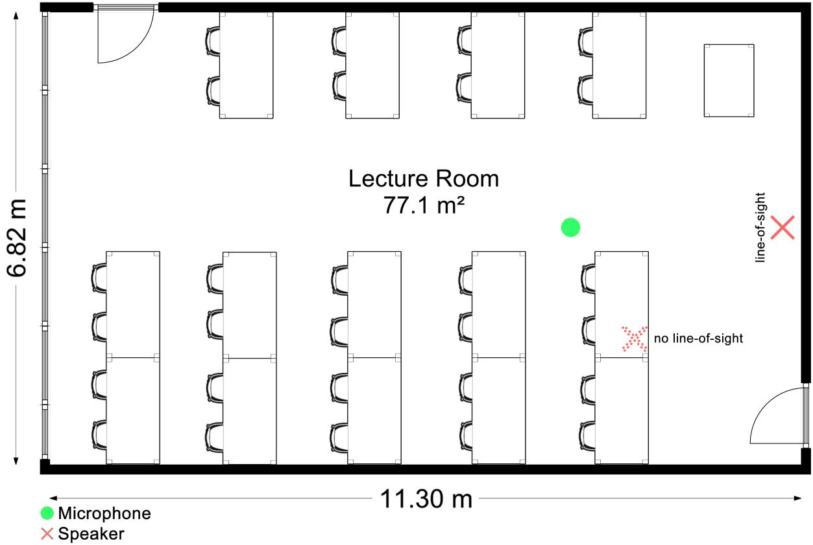  
Figure 10: Room layout of the lecture room.

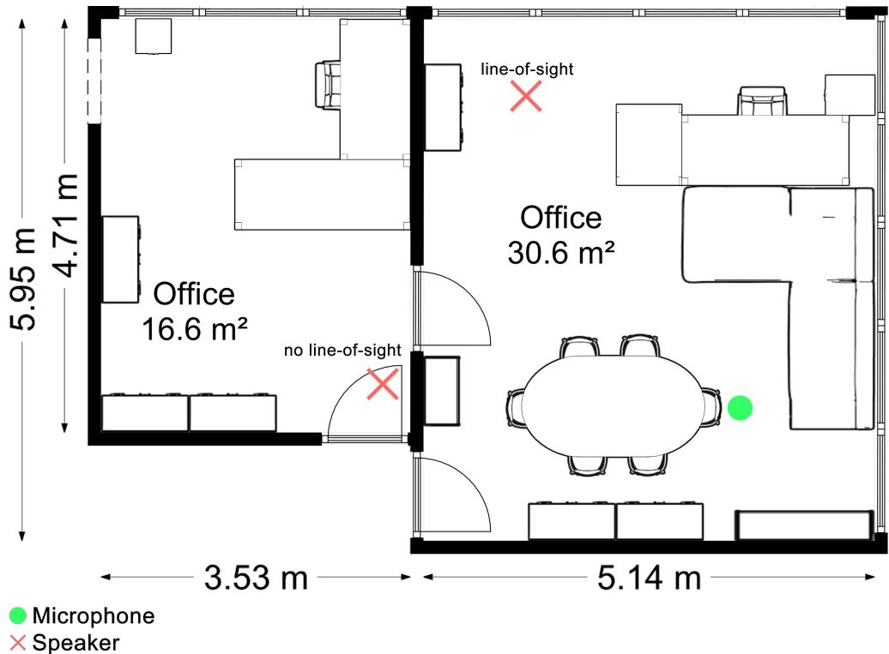  
Figure 11: Room layout of the office room.

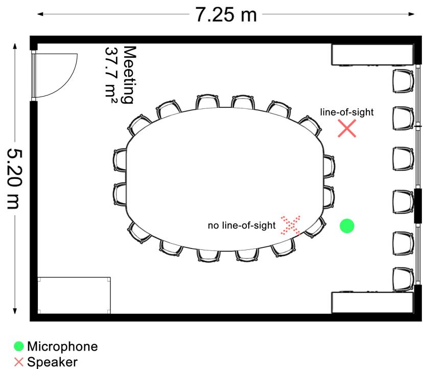  
Figure 12: Room layout of the meeting room.