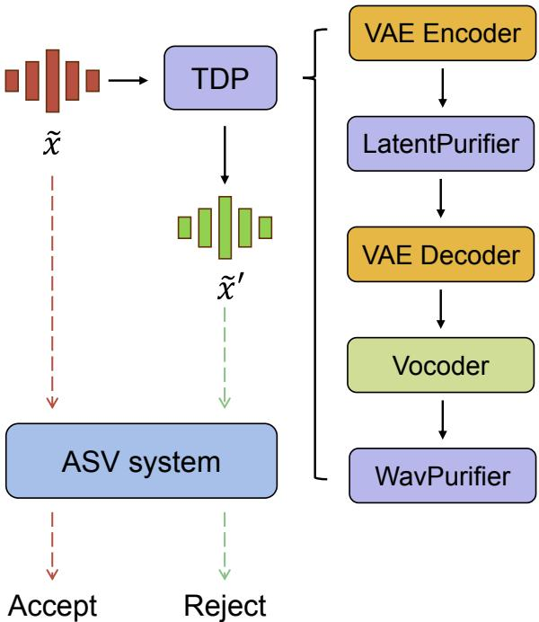
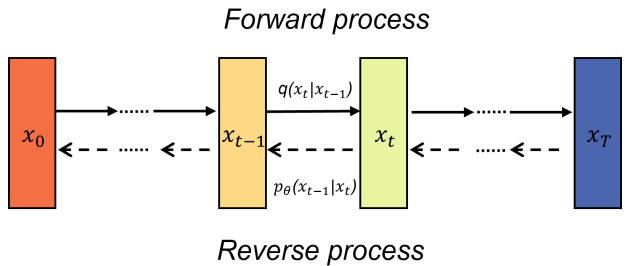

# ADVERSARIAL PURIFICATION FORSPEAKERVERIFICATION BY TWO-STAGE DIFFUSION MODELS

Yibo Bai1, Xiao-Lei Zhang2,3,4\*, Xuelong $L i ^ { 4 }$

1Dept. of Electrical and Electronic Engineering, The University of Hong Kong, Hong Kong, China 2School of Marine Science and Technology, Northwestern Polytechnical University, Xi'an, China 3Research and Development Institute of Northwestern Polytechnical University,Shenzhen,China 4Institute of Artificial Intelligence (TeleAI), China Telecom Corp Ltd, Beijing, China

# ABSTRACT

Existing research has demonstrated that speaker verification systems can be vulnerable to adversarial attacks. In response, numerous adversarial purification techniques have been developed to defend against these attacks. In this study, we introduce TDP,a two-stage diffusion-based purification method, which employs two-stage diffusion models to purify adversarial audio at the waveform and latent space levels. TDP initially transforms the adversarial example into latent space, then removes the adversarial perturbation and converts the low-dimensional vector back to waveform. Subsequently, TDP purifies the utterance once more at the waveform level. Experimental results under white-box and black-box attacks reveal that our TDP adversarial purification method outperforms existing adversarial defense methods for speaker verification.Furthermore,the latent diffusion model in our method significantly reduces purification time.

Index Terms- Speaker verification, adversarial purification,latent diffusion model

# 1.INTRODUCTION

Automatic speaker verification (ASV) is a task aiming to verify an individual with unique voiceprint characteristics. The core technique in ASV systems is the speaker embedding extractor. It can represent speaker information in audio utterances as discrete embeddings. By computing the distance between speaker embeddings,an ASV system is able to determine whether to accept or reject a user. ASV systems have been widely used in various scenarios, such as voiceprint locks and smart homes.These applications in the real world highly demand security and reliability. However, ASV systems are vulnerable to adversarial attackers [1],which poses a challenge in enhancing their safety through different ways.

Adversarial attacks aim to contaminate an ASV system by making it predict incorrectly. By adding imperceptible perturbations to clean audio utterances (also called genuine examples),an adversarial attacker can easily generate polluted audio utterances (also called adversarial examples) [2]. Cleverly designed perturbations make the change imperceptible to human listeners.However, due to the non-linearity of neural networks, the predictions of ASV models can be completely altered. Even the state-of-the-art ASV models can be easily attacked[1,3].Generally,adversarial attacks can be divided into white-box scenarios and black-box scenarios.White-box attacks allow the attacker has full access of victim ASV system, including its architecture,parameters and outputs.But in the case of black-box attacks,the attacker only has access to the outputs,which is more practical. Kreuk et al.[4] conducted transferable black-box FGSM[5] attack under crossdataset and cross-feature settings.Yao et al [6] implement spectral transformation attack based on modified discrete cosine transform (MDCT) on a surrogate ASV model.

In recent years.researchers have recognized the importance of developing techniques to protect ASV systems from adversarial attacks. Currently, three defense approaches exist: adversarial training,adversarial detection and adversarial purification [7]. Adversarial training is similar to data augmentation. This approach adds adversarial examples to the training dataset of ASV systems [5], which seems difficult to be applied in real-world deployment. Adversarial detection and adversarial purification both add a plug-in component in front of the ASV model. The detection head aims to determine whether the inputs are adversarial examples,and only allows genuine examples to be processed by the subsequent ASV model [8]. The purification head accepts all inputs and purifies them to eliminate adversarial perturbations [7]. Compared to the detection-based methods,adversarial purification is capable of utilizing input audio utterances more effciently, which is the focus of this paper.

Adversarial purification for ASV can be implemented by two types of methods: preprocessing and reconstruction. Preprocessing usually uses simple operations in signal processing, such as filtering [9] and adding noise [1O].Although these methods are easy to deploy and computationally efficient,preprocessing methods also introduce external noise into the input and destroy the waveform. Reconstruction focuses on regenerating clean audio utterances with a much larger neural networks. For example,Zhang et al.[11] predicted the adversarial noise and removed it from the adversarial examples.Wu et al. [12] used a pretrained selfsupervised model to eliminate adversarial perturbations in Mel-frequency cepstral coefficients (MFCC） features. Bai et al.[13] reproduced the clean waveform from the adversarial input with a diffusion model conditioned by Melspectrogram. Although the reconstruction-based purification methods decrease distortion during purification, most of them concentrate on only one type of input,waveform,or frequency domain feature.In addition,due to their inference time, these methods are difficult to deploy in real-time ASV systems.

To address the above issues of distortion and inference time,we propose TDP,a two-stage diffusion-based purification method to defend the adversarial attacks.This novel method employs a two-dimensional (2-D） latent diffusion model and a one-dimensional (l-D）waveform diffusion model to purify the adversarial examples in two different spaces.Our main contribution can be summarized as that, we propose the first adversarial defense latent diffusion model for ASV systems,which requires much shorter inference time.We conducted adversarial defense experiments under white-box and black-box attacks.The results show that our method outperforms the state-of-the-art purification methods.

# 2.METHODOLOGY

In this section,we present the framework and two essential components of the proposed TDP method.

# 2.1.Framework

Given an audio utterance $x$ that should be rejected by the ASV system, an adversarial attacker can generate its corresponding adversarial audio $\tilde { x }$ . As illustrated in Figure 1, the ASV system would be deceived by $\tilde { x }$ and accept it.A successful purifier $P ( \cdot )$ can defend against the adversarial attack by ensuring that $\tilde { x } ^ { \prime } : = P ( \tilde { x } ) \approx x$ and allow the ASV system to reject it correctly.

In our TDP method, we employ a series of components to transform the adversarial example $\tilde { x }$ into a purified audio $\tilde { x } ^ { \prime }$ TDP comprises a pretrained variational autoencoder(VAE),a pretrained neural vocoder,and two diffusion models trained in different spaces.The VAE is used for the encoding and decoding between feature space and latent space,while the neural vocoder is used to synthesize an audio wave from the corresponding feature.As depicted in Figure 1,TDP first encodes the logarithmic filter-banks (LogFBank) features into a lower-dimensional latent space and purifies the latent variables,then synthesizes the waveform back,and finally purify the audio wave again at the waveform level.

  
Fig.1. An adversarial defense example for speaker verification using the TDP method.Initially, TDP employs a VAE encoder to transform the adversarial input into latent space and purify it. Subsequently,a VAE decoder and a vocoder are utilized to convert the latent representation back into the waveform.A waveform purifier is then applied to remove the remaining adversarial perturbation and reconstruct the original clean audio. As a result, the ASV system accurately predicts and rejects the input audio utterance.

# 2.2. Waveform purifier

The waveform purifier in TDP is a 1-D general conditional diffusion probabilistic model. It converts adversarial audio ut-terances to clean audio uttrances with Mel-spectrogram condition.

Given an audio input $x _ { 0 } ~ \sim ~ q ( x )$ and timesteps $t \_ =$ $0 , 1 , \cdots , T$ ,as shown in Figure 2,a diffusion model can be divided into two $T$ -step processes: the forward process and the reverse process [14].In the forward process,the diffusion model gradually adds $T$ rounds of white noise to $x _ { 0 }$ to obtain the noised audio $x _ { T }$ . The entire forward process is defined as a fixed Markov Chain:

$$
q ( x _ { 1 } , \cdot \cdot \cdot , x _ { T } | x _ { 0 } ) : = \prod _ { t = 1 } ^ { T } q ( x _ { t } | x _ { t - 1 } ) ,
$$

$$
q ( x _ { t } | x _ { t - 1 } ) : = N ( x _ { t } ; \sqrt { 1 - \beta _ { t } } x _ { t - 1 } , \beta _ { t } \mathbf { I } ) ,
$$

where $\beta _ { t }$ is the noise scheduling function.

  
Fig.2. A simple illustration of forward process and reverse process in a diffusion model.

The reverse process aims to learn a distribution $p _ { \theta } ( x )$ parameterized by $\theta$ and gradually transform $x _ { t }$ to $x _ { 0 }$ . Starting with $p _ { \theta } ( x _ { T } ) = \mathcal { N } ( x _ { T } ; 0 , \mathbf { I } )$ ,the reverse processing is defined as a parameterized Markov Chain:

$$
p _ { \theta } ( x _ { 0 } , \cdot \cdot \cdot , x _ { T - 1 } | x _ { T } ) : = \prod _ { t = 1 } ^ { T } p _ { \theta } ( x _ { t - 1 } | x _ { t } ) ,
$$

$$
p _ { \theta } ( x _ { t - 1 } | x _ { t } ) : = \mathcal { N } ( x _ { t - 1 } ; \mu _ { \theta } ( x _ { t } , t ) , \sigma _ { \theta } ( x _ { t } , t ) ^ { 2 } \mathbf { I } ) ,
$$

where $\mu _ { \theta } ( x _ { t } , t )$ and $\sigma _ { \theta } ( x _ { t } , t )$ are designed to learn the Gaus-sian transitions,and they both take the previous sample $x _ { t }$ and timestep $t$ as input. The corresponding objective function is simplified as:

$$
\mathbb { E } _ { x _ { 0 } , t , \epsilon } \left\| \epsilon - \epsilon _ { \theta } ( x _ { t } , t ) \right\| _ { 2 } ^ { 2 } ,
$$

where $\epsilon \sim \mathcal { N } ( 0 , \mathbf { I } )$ is a Gaussian noise, and $\epsilon _ { \theta } ( x _ { 0 } , t )$ aims to estimate $\epsilon$ from $x _ { t }$ and $t$

Given an adversarial audio example $x _ { \mathrm { a d v } }$ ,we initiate the forward process with $x _ { 0 } = x _ { \mathrm { a d v } }$ . Nie et al. [15] proves that by gradually adding Gaussian noise in the forward process, there exists a timestep $t ^ { * }$ that minimizes the KL divergence between the clean data distribution and the adversarial data distribution.Therefore, starting the reverse process with $t =$ $t ^ { * }$ ,the diffusion model can recover corresponding clean audio of $x _ { \mathrm { a d v } }$

# 2.3. Latent purifer

The latent purifier in TDP refers to a 2-D unconditional latent diffusion model.As a helper,a pretrained VAE which consists of an encoder $\mathcal { E }$ and a decoder $\mathcal { D }$ ,is able to encode LogFBank features into latent representations and decode them back. Given a LogFBank feature input $x$ ,a welltrained VAE can ensure $x \ = \ { \mathcal { D } } ( { \mathcal { E } } ( x ) )$ to recover features without distortion.After encoding,the latent diffusion model takes the compressed variable $z _ { 0 } = \mathcal { E } ( x )$ as the input. Similar to the waveform purifier, it purifies the adversarial example through the forward process and the reverse process in the latent space.Then $\mathcal { D }$ can decode the resulting latent variable back into the feature space. The objective function is as follows:

$$
\mathbb { E } _ { z _ { 0 } , t , \epsilon } \left\| \epsilon - \epsilon _ { \theta } ( z _ { t } , t ) \right\| _ { 2 } ^ { 2 } ,
$$

where $z _ { t }$ is noised $z _ { \mathrm { 0 } }$ ,and $\epsilon _ { \theta } ( z _ { 0 } , t )$ aims to estimate $\epsilon$ from $z _ { t }$ and $t$ . In the lower-dimensional latent space,diffusion models can focus on discrete important information and infer more efficiently.

# 3.RELATEDWORK

# 3.1. Automatic speaker verification

Automatic speaker verification aims to verify if a test utterance is pronounced by a specifc speaker. Given a test audio utterance $x ^ { t }$ and an enrollment audio utterance $x ^ { e }$ ，the ASV system determines whether to accept $x ^ { t }$ based the similarity between them. Current state-of-the-art ASV systems [16,17,18] first extract the corresponding speaker embeddings $E ( x ^ { t } )$ and $E ( x ^ { e } )$ ,and then compute the similarity score to make the decision. The entire process can be defined as:

$$
\mathbf { A S V } { \bigg ( } E \left( x ^ { t } \right) , E ( x ^ { e } ) { \bigg ) } { \gt } { \begin{array} { l } { H _ { 1 } } \\ { \gtrless \theta , } \\ { H _ { 0 } } \end{array} } 
$$

where $H _ { 0 }$ and $H _ { 1 }$ are hypotheses that reject or accept $x ^ { t }$ ,and $\theta$ is a predefined threshold.

# 3.2.Adversarial attacks

Adversarial attacks aim to manipulate ASV systems into making incorrect predictions through small perturbations. Szegedy et al.[19] first introduced adversarial image examples. These inputs look similar to normal data but can deceive classifiers into producing wrong results.In the audio and speech fields,Carlini et al. [2O] first introduced adversarial audio examples.Many ASV systems are vulnerable to classical adversarial attack methods such as the fast gradient sign method (FGSM) [5], projected gradient descent (PGD) [21] and basic iterative method (BIM) [22]. Given an audio input $x$ ,anadversarial attacker generates the adversarial example $x _ { \mathrm { a d v } }$ by combining a perturbation signal $\epsilon$ with $x$ The adversarial perturbation is designed based on the correct prediction of $x$ and constrained by $\left\| x _ { \mathrm { a d v } } - x \right\| _ { p } \leq \varepsilon$ ，where $\lVert \cdot \rVert _ { p }$ is the $\ell _ { p }$ -norm and $\varepsilon$ is a very small positive constant. For examples,the generation process in the FGSM method can be formulated as:

$$
x _ { \mathrm { a d v } } = x + \alpha \cdot \mathrm { s i g n } ( \nabla _ { x } \mathcal { L } ( x , y _ { \mathrm { t r u e } } ) ) ,
$$

where $\alpha$ is the step size, $y _ { \mathrm { t r u e } }$ is the ground truth label of $x$ ， and $\nabla _ { x } \mathcal { L } ( \cdot )$ computes the gradients of the loss function with respect to $x$

# 3.3. Adversarial defense with generative models

Generative models such as generative adversarial networks (GANs) [23] and diffusion models [14], have the capability to learn the distribution of the training data.As a result, many ASV defense methods employ these models to remove the adversarial perturbation and generate clean audio.Joshi et al. [24] utilized a VAE to transform input into the latent space and smooth it randomly [25]. Wu et al. [12] purified the input with cascaded transformer-based self-supervised models. Bai et al. [13] reconstructed the clean audio using a 1-D diffusion model.

# 4.EXPERIMENTS

In this section, we present the experimental settings, main results and an ablation study.

# 4.1. Datasets

In our TDP method,we utilized the VoxCeleb1 dataset [26] for training and evaluating. Additionally,we used the entire VoxCeleb2 dataset [27] to train our ASV systems.The VoxCeleb1 dataset consists of a development set with 1,211 speakers and a test set with 4O speakers.The VoxCeleb2 dataset contains a over 1 million utterances from 6,112 speakers.For the adversarial attack and defense stage,we randomly selected 1,O0O trials from the VoxCeleb1-O subset to generate adversarial examples.The labels in these trials were balanced to ensure the generalization of the experiments.

# 4.2. Victim ASV systems

We employed two victim ASV models for adversarial attacks: the 512-channel ECAPA-TDNN [16] and Fast-ResNet34. The ECAPA-TDNN model utilizes attentive statistical pool-ing，while Fast-ResNet34 adopts attentive average pooling. The similarity scores between speaker embedding results were measured using cosine distance.During the ASV training，we applied various data augmentation techniques,including speed perturbation, superimposed disturbance,and reverberation enhancement.

# 4.3.Adversarial example generation methods

We used two PGD methods [21] with $\ell _ { 2 }$ and $\ell _ { \infty }$ norms to attack the above ASV systems.We refer to them as the PGD-$\ell _ { 2 }$ attacker and the PGD $\ell _ { \infty }$ attacker,respectively,both of which are updated by 30 iteration steps. The PGD- $\ell _ { 2 }$ attacker was parameterized with $\scriptstyle \{ \epsilon = 6 4 0 0 , \alpha = 1 \}$ ，while the PGD- $\ell _ { \infty }$ attacker was parameterized with $\{ \epsilon { = } 3 0 , \ \alpha { = } 1 \}$ . During the attack,we employed the cosine embedding loss function to compute the gradients.

# 4.4.Implement details

For the 2-D latent purifier, we implemented it with the standard unconditional U-net [28] architecture.We implemented the 1-D waveform purifier using the DiffWave (Base） [29] model. They were separately trained on the same adversarial examples from VoxCeleb1-dev dataset. These adversarial data was generated using ECAPA-TDNN model with the PGD- $\ell _ { 2 }$ attacker,and did not overlap with the 1,OOO trials mentioned in Section 4.1.

In the training stage of the latent purifier, we set the learning rate to 2e-4 and the training timestep $t$ to 1000 with a linear noise schedule starting with O.OO15 and ending at 0.0195. During the inference stage, the timestep was set to 2 with the same noise schedule. For the waveform purifier, we set the training timestep $t$ to 10O with a linear noise schedule starting with O.0oO1 and ending at O.035.The initial learning rate was set to le-4,and a cosine annealing schedule was ap-plied. During the inference stage of the waveform purifier, we used a 5-step fast sampling algorithm with a noise schedule of $\{ 0 . 0 0 0 1 , 0 . 0 0 1 , 0 . 0 1 , 0 . 0 5 , 0 . 2 , 0 . 3 5 \}$ Besides,we employed a pretrained HiFi-GAN model [3O] as the vocoder. Both the vocoder and the pretrained VAE take a 64-dimensional LogF-Bank features as input.

We trained the two victim ASV systems with the WeSpeaker [31] toolkit. They both use an 8O-dimensional LogF-Bank feature as the input, and a $2 5 \mathrm { m s }$ hamming window was used to partition the waveform with a step size of 1Oms.Additionally, we applied cepstral mean and variance normalization (CMVN) to the features to improve generalization. The train-ing epochs for ECAPA-TDNN and Fast-ResNet34 were set to 150 and 2O0,respectively. The speaker embedding dimensional of them were set to 192 and 256.

We reproduced two adversarial purification methods as the baseline models: the adding noise [1O] method and diffusion-based adversarial purification (DAP)[13] method. The adding noise method combines the input audio utterance with white noise of different standard deviations.We used the same noise settings $\{ 0 . 0 0 1 , 0 . 0 0 2 , 0 . 0 0 5 \}$ as in the original article,and found that this method performed best with a standard deviation of O.OO5.For the DAP method, we implemented it with the same architecture and training schedule as in the original article,except that we trained it on the VoxCeleb1 dataset instead of the VoxCeleb2 dataset.

# 4.5. Main results

We evaluated the defense performance under white-box and black-box attack scenarios using the equal error rate (EER) as a metric.Lower EER values indicate better ASV accuracy and defense effectiveness.In the white-box attacks,we generated adversarial examples and used them to attack the same model. In the black-box attacks (gray parts in tables), we created adversarial examples from a surrogate model and used them to attack a different model. After obtaining adversarial audio utterances,we applied various defense methods for purification.We then fed the purified audio into the ASV systems to evaluate the EER.Table 1 and Table 2 display the defense performance against adversarial examples generated from ECAPA-TDNN and Fast-ResNet34, respectively. Table 1 presents the results of the white-box ECAPA-TDNN defense and black-box Fast-ResNet34 defense.In Table 2, the black-box surrogate model is replaced by Fast-ResNet34. We observe that the proposed TDP method is capable of defending the ASV systems against different adversarial attacks,and in most of scenarios,it outperforms other adversarial purification techniques.

Table 1. $\mathrm { E E R } ( \% )$ results of defending ECAPA-TDNN and Fast-ResNet34 models against PGD- $\cdot \ell _ { 2 }$ and $\mathrm { P G D - } \ell _ { \infty }$ adversarial examples generated from ECAPA-TDNN. The results in gray indicate a white-box attack scenario.The term "N/A" means that no defense method was applied.   

<table><tr><td>Attacker</td><td>Defender</td><td>ECAPA-TDNN</td><td>Fast-ResNet34</td></tr><tr><td rowspan="5">PGD-l2</td><td>N/A</td><td>97.40</td><td>23.20</td></tr><tr><td>Adding noise</td><td>5.80</td><td>2.80</td></tr><tr><td>DAP</td><td>5.20</td><td>4.40</td></tr><tr><td>TDP(proposed)</td><td>3.40</td><td>2.60</td></tr><tr><td>N/A</td><td>98.00</td><td>23.80</td></tr><tr><td rowspan="4">PGD-loo</td><td>Adding noise</td><td>6.20</td><td>2.80</td></tr><tr><td>DAP</td><td>5.40</td><td>4.20</td></tr><tr><td>TDP(proposed)</td><td>3.60</td><td></td></tr><tr><td></td><td></td><td>3.80</td></tr></table>

Table 2. $\mathrm { E E R } ( \% )$ results of defending ECAPA-TDNN and Fast-ResNet34 models against PGD- $\ell _ { 2 }$ and $\mathrm { P G D - } \ell _ { \infty }$ adversarial examples generated from Fast-ResNet34.   

<table><tr><td>Attacker</td><td>Defender</td><td>ECAPA-TDNN</td><td>Fast-ResNet34</td></tr><tr><td rowspan="5">PGD-l2</td><td>N/A</td><td>16.80</td><td>98.00</td></tr><tr><td>Adding noise</td><td>2.60</td><td>4.60</td></tr><tr><td>DAP</td><td>4.40</td><td>5.40</td></tr><tr><td>TDP(proposed)</td><td>3.80</td><td>4.20</td></tr><tr><td>N/A</td><td>17.20</td><td>98.60</td></tr><tr><td rowspan="4">PGD-lo</td><td>Adding noise</td><td>2.60</td><td>5.40</td></tr><tr><td>DAP</td><td>4.80</td><td>4.20</td></tr><tr><td>TDP(proposed)</td><td>4.20</td><td></td></tr><tr><td></td><td></td><td>3.40</td></tr></table>

Meanwhile,we conducted experiments to evaluate the im-pact of purification methods on clean audio input. In the absence of attackers,we processed clean input with three defense methods.As shown in Table 3,all of the defense methods affect the ASV performance of clean audio utterances, and the TDP method maintains the EER well.

Furthermore,we evaluated the reconstruction performance of the three methods using three objective speech quality metrics: Perceptual Evaluation of Speech Quality (PESQ),

Table3.EER $( \% )$ results of ECAPA-TDNN and Fast-ResNet34 with different defense methods applied to clean input.   

<table><tr><td>Defender</td><td>ECAPA-TDNN</td><td>Fast-ResNet34</td></tr><tr><td>N/A</td><td>0.80</td><td>1.00</td></tr><tr><td>Adding noise</td><td>1.80</td><td>2.00</td></tr><tr><td>DAP</td><td>4.80</td><td>4.40</td></tr><tr><td>TDP(proposed)</td><td>2.60</td><td>2.40</td></tr></table>

Table 4. The quality of the audio utterances corresponding to the gray PGD- $\cdot \ell _ { 2 }$ section in Table 1. "NB”and "WB” denote narrow-band and wide-band,respectively.   

<table><tr><td>Defender</td><td>NB-PESQ</td><td>WB-PESQ</td><td>SI-SDR</td><td>STOI</td></tr><tr><td>N/A</td><td>4.422</td><td>4.344</td><td>39.481</td><td>0.995</td></tr><tr><td>Adding noise</td><td>2.759</td><td>1.798</td><td>17.413</td><td>0.921</td></tr><tr><td>DAP</td><td>3.450</td><td>2.700</td><td>7.459</td><td>0.916</td></tr><tr><td>TDP(proposed)</td><td>3.885</td><td>3.477</td><td>9.439</td><td>0.939</td></tr></table>

Scale-Invariant Signal-to-Distortion Ratio (SI-SDR)，and Short-Time Objective Intelligibility (STOI).As illustrated in Table 4, while SI-SDR indicates that TDP slightly alters the amplitude of input signals, the PESQ and STOI scores show that TDP best preserves intelligibility.

# 4.6. Ablation study

We conducted an ablation study to evaluate the effect of each component in our TDP method. As shown in Table 5,we first removed the waveform purifier and the latent purifier separately, then removed both of them and only kept the VAE and vocoder to reconstruct the input audio. The number of parameters for the latent purifier,waveform purifier,and VAE $^ +$ vocoder models is 263.15M,2.62M,and 55.38M,respectively. We evaluated the defense effectiveness of these three architectures under the white-box PGD $\mathbf { \cdot } { \mathbf { \ell } } _ { 2 }$ ECAPA-TDNN attack.The EER results,inference time of TDP,and number of parameters were collected to evaluate the performance. Experimental results in Table 5 indicate that both of the waveform purifier and the latent purifier are capable of purifying adversarial perturbations given the adversarial inputs.The inference time for the waveform purifier is 1424 seconds.Although the latent purifier has a much shorter inference time,it contains more parameters.After removing the two diffusionbased purifiers,the combination of VAE and vocoder exhibits almost no ability to defend the adversarial attack. Consequently, the ablation study results highlight the effectiveness of integrating the two purifiers.

Table 5. Ablation experiments conducted on defending ECAPA-TDNN models against white-box PGD- $\cdot \ell _ { 2 }$ attack with TDP method. The inference time was measured on a single NVIDIA V100-32GB GPU.The term "w/o" stands for "without".   

<table><tr><td>Method</td><td>EER(%)</td><td>Inference time(s)</td><td>#Params</td></tr><tr><td>TDP</td><td>3.40</td><td>1823</td><td>321.15M</td></tr><tr><td>w/o WavPurifer</td><td>7.20</td><td>399</td><td>318.53M</td></tr><tr><td>w/o LatentPurifer</td><td>14.00</td><td>1713</td><td>58.00M</td></tr><tr><td>w/o WavPurifer</td><td>80.80</td><td>289</td><td>55.38M</td></tr></table>

# 5. CONCLUSION

In this paper,we propose a TDP method to defend ASV systems against adversarial attacks. TDP utilizes two-stage diffusion models to purify adversarial audio examples at both waveform and latent space levels. The complete TDP workflow consists of a pretrained VAE,a pretrained neural vocoder and two diffusion models trained in different data spaces.We conducted experiments under white-box and black-box attack scenarios. The experimental results demonstrate that our method outperforms other adversarial purification techniques. Our ablation study further demonstrate the effectiveness of each component in our method.

# 6.ACKNOWLEDGEMENTS

This work was supported in part by the National Science Foundation of China (NSFC) under Grant 62176211,and in part by the Project of the Science, Technology,and Innovation Commission of Shenzhen Municipality, China under Grant GJHZ20240218114401004 and JSGG20210802152546026.

# 7．REFERENCES

[1] Jesus Villalba, Yuekai Zhang,and Najim Dehak,“xvectors meet adversarial attacks: Benchmarking adversarial robustness in speaker verification.,”in INTER-SPEECH,2020,pp.4233-4237.

[2] Rohan Kumar Das,Xiaohai Tian, Tomi Kinnunen, and Haizhou Li,“The attacker's perspective on automatic speaker verification:An overview,” in INTERSPEECH. 2020, ISCA.

[3] Xu Li, Jinghua Zhong,Xixin Wu, Jianwei Yu, Xunying Liu,and Helen Meng，“Adversarial attacks on gmm i-vector based speaker verification systems,” in 2020 IEEE International Conference on Acoustics, Speech and Signal Processing (ICASSP).IEEE,2020, pp. 6579-6583.

[4] Felix Kreuk,Yossi Adi,Moustapha Cisse,and Joseph Keshet,“Fooling end-to-end speaker verification with adversarial examples,’in 2O18 IEEE international conference on acoustics, speech and signal processing (ICASSP).IEEE,2018,pp.1962-1966.

[5] Ian J Goodfellow,Jonathon Shlens，and Christian Szegedy,“Explaining and harnessing adversarial examples,’ in International Conference on Learning Representations,2014.

[6] Jiadi Yao, Hong Luo, Jun Qi,and Xiao-Lei Zhang,“Interpretable spectrum transformation attacks to speaker recognition systems,” IEEE/ACM Transactions on Audio, Speech, and Language Processing， vol. 32， pp. 1531-1545,2024.

[7] Haibin Wu, Jiawen Kang, Lingwei Meng, Helen Meng, and Hung-yi Lee,“The defender's perspective on automatic speaker verification: An overview,” arXiv preprint arXiv:2305.12804,2023.

[8] Xu Li, Na Li, Jinghua Zhong, Xixin Wu, Xunying Liu, Dan Su, Dong Yu,and Helen Meng，“Investigating robustness of adversarial samples detection for automatic speaker verification,”in INTERSPEECH.2020, ISCA.

[9] Haibin Wu, Songxiang Liu, Helen Meng,and Hung-yi Lee，“Defense against adversarial attacks on spoofing countermeasures of asv,’in ICASSP 2020-2020 IEEE International Conference on Acoustics, Speech and Signal Processing (ICASSP). IEEE,2020, pp. 6564-6568.

[10] Li-Chi Chang,Zesheng Chen, Chao Chen，Guoping Wang,and Zhuming Bi,“Defending against adversarial attacks in speaker verification systems,”in 2021 IEEE International Performance, Computing,and Communications Conference (IPCCC). IEEE,2021, pp. 1-8.

[11] Hanyi Zhang,Longbiao Wang, Yunchun Zhang, Meng Liu, Kong Aik Lee,and Jianguo Wei, “Adversarial separation network for speaker recognition.,”in INTER-SPEECH,2020, pp.951-955.

[12] Haibin Wu,Xu Li,Andy T Liu, Zhiyong Wu,Helen Meng,and Hung-Yi Lee,“Improving the adversarial robustness for speaker verification by self-supervised learning,” IEEE/ACM Transactions on Audio,Speech, and Language Processing,vol.30, pp.202-217,2021.

[13] Yibo Bai, Xiao-Lei Zhang,and Xuelong Li,“Diffusionbased adversarial purification for speaker verification," IEEE Signal Processing Letters,2024.

[14] Jonathan Ho, Ajay Jain,and Pieter Abbeel, “Denoising diffusion probabilistic models,’Advances in neural information processing systems,vol.33,pp. 6840-6851, 2020.

[15] Weili Nie,Brandon Guo, Yujia Huang, Chaowei Xiao, Arash Vahdat,and Animashree Anandkumar,“Diffusion models for adversarial purification,”in International Conference on Machine Learning.PMLR,2022, pp.16805-16827.

[16] Brecht Desplanques, Jenthe Thienpondt,and Kris Demuynck,“Ecapa-tdnn: Emphasized channel attention, propagation and aggregation in tdnn based speaker verification,”in INTERSPEECH.2020,ISCA.

[17] Kong Aik Lee, Qiongqiong Wang,and Takafumi Koshinaka,“Xi-vector embedding for speaker recognition,” IEEE Signal Processing Letters, vol.28, pp.1385-1389, 2021.

[18] Jiadi Yao,Chengdong Liang,Zhendong Peng,Binbin Zhang,and Xiao-Lei Zhang，“Branch-ecapa-tdnn: A parallel branch architecture to capture local and global features for speaker verification,” in Proc.Interspeech, 2023, pp.1943-1947.

[19] Christian Szegedy,Wojciech Zaremba, Ilya Sutskever, Joan Bruna,Dumitru Erhan,Ian Goodfellow,and Rob Fergus，“Intriguing properties of neural networks,” in 2nd International Conference on Learning Representations,ICLR 2014,2014.

[20] Nicholas Carlini and David Wagner,“Audio adversarial examples: Targeted attacks on speech-to-text,” in 2018 IEEE security and privacy workshops (SPW). IEEE, 2018, pp. 1-7.

[21] Aleksander Madry，Aleksandar Makelov,Ludwig Schmidt,Dimitris Tsipras,and Adrian Vladu,“Towards deep learning models resistant to adversarial attacks,”in International Conference on Learning Representations, 2018.

[22] Alexey Kurakin,Ian JGoodfellow,and Samy Bengio, “Adversarial examples in the physical world.,”in Artifcial intelligence safety and security, pp. 99-112. Chapman and Hall/CRC, 2018.

[23] Ian Goodfellow, Jean Pouget-Abadie，Mehdi Mirza, Bing Xu,David Warde-Farley，Sherjil Ozair,Aaron Courville,and Yoshua Bengio,“Generative adversarial nets,” Advances in neural information processing systems,vol.27,2014.

[24] Sonal Joshi, Jesus Villalba,Piotr Zelasko,Laureano Moro-Veläzquez,and Najim Dehak，“Study of preprocessing defenses against adversarial attacks on stateof-the-art speaker recognition systems,’IEEE Transactions on Information Forensics and Security, vol. 16, pp. 4811-4826,2021.

[25] Uiwon Hwang，Jaewoo Park,Hyemi Jang，Sungroh Yoon,and Nam Ik Cho,“Puvae:A variational autoencoder to purify adversarial examples,” IEEE Access,vol. 7,pp.126582-126593,2019.

[26] Arsha Nagrani, Joon Son Chung,and Andrew Zisserman，“Voxceleb: A large-scale speaker identification dataset,’in INTERSPEECH.2017, ISCA.

[27] J Chung,A Nagrani,and A Zisserman，“Voxceleb2: Deep speaker recognition,’ in INTERSPEECH.2018, ISCA.

[28] Olaf Ronneberger,Philipp Fischer,and Thomas Brox, “U-net: Convolutional networks for biomedical image segmentation,” in Medical image computing and computer-assisted intervention-MICCAI 2015:18th international conference,Munich, Germany, October 5-9, 2015,proceedings,part III18. Springer,2015, pp.234- 241.

[29] Zhifeng Kong,Wei Ping, Jiaji Huang,Kexin Zhao,and Bryan Catanzaro,“Diffwave:A versatile diffusion model for audio synthesis,”in International Conference on Learning Representations,2020.

[30] Jungil Kong, Jaehyeon Kim,and Jaekyoung Bae,“Hifigan: Generative adversarial networks for efficient and high fidelity speech synthesis,”Advances in neural information processing systems，vol. 33,pp.17022- 17033,2020.

[31] Hongji Wang， Chengdong Liang， Shuai Wang, Zhengyang Chen，Binbin Zhang，Xu Xiang，Yanlei Deng，and Yanmin Qian，“Wespeaker:A research and production oriented speaker embedding learning toolkit,”in ICASSP 2023-2023 IEEE International Conference on Acoustics, Speech and Signal Processing (ICASSP). IEEE,2023,pp.1-5.