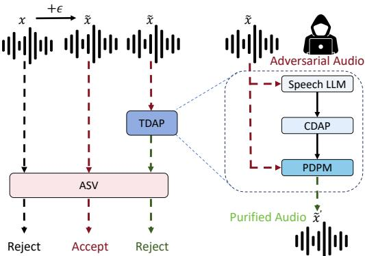
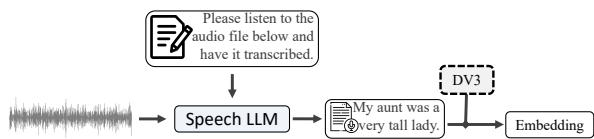
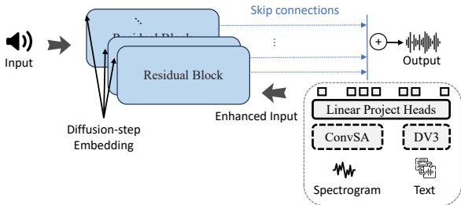
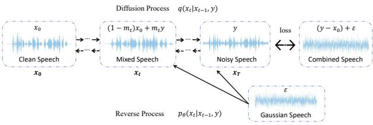
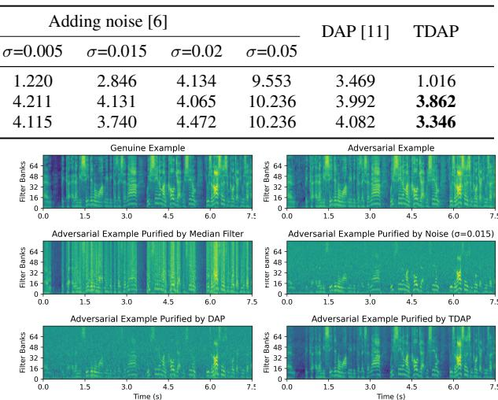

# Textual-Driven Adversarial Purification for Speaker Verification

Sizhou Chen $^ { 1 , * }$ , Yibo Bai2\*, Jiadi Yao3, Xiao-Lei Zhang $^ { 3 , 4 }$ , Xuelong $L i ^ { 4 }$

1Collge of Blockchian Industry, Chengdu University of Information Technology, Chengdu, China 2Dept. of Electrical and Electronic Engineering, The University of Hong Kong, Hong Kong, China 3School of Marine Science and Technology, Northwestern Polytechnical University, Xi'an, China 4Institute of Artificial Intelligence (TeleAI), China Telecom Corp Ltd, Shanghai, China

szchenl005@gmail.com， baiyibo@connect.hku.hk， xiaolei.zhang@nwpu.edu.cn

# Abstract

Adversarial attacks introduce subtle perturbations to audio signals for causing automatic speaker verification (ASV) systems to make mistakes.To address this challenge,adversarial purification techniques have emerged,where diffusion models have been proven effective.However, the latest development with the diffusion models caused a negative effect that the audio generation quality is not high enough.Moreover, these approaches tend to focus solely on audio features,while often neglecting textual information.To overcome these limitations,we propose a textual-driven adversarial purification(TDAP） framework, which integrates diffusion models with pretrained large audio language models for comprehensive defense.TDAP employs textual data extracted from audio to guide the diffusion-based purification process.Extensive experimental results show that TDAP significantly enhances the defense robustness against adversarial attacks.

Index Terms:Speaker verification,adversarial defense,large language model,diffusion model, textual-driven purification

# 1. Introduction

Automatic speaker verification (ASV) systems are essential for ensuring communication security and verifying personal identities[1].However, the rapid advancement in adversarial attacks [2] has made ASV systems increasingly vulnerable.Adversarail attacks,which exploit the weaknesses of ASV systems,potentially lead to false acceptances or rejections and compromise the system's integrity.Although adversarial training is a common defense strategy,it often has difficulties in dealing with new types of attacks [3].To address this issue, researchers have expanded the range of adversarial purification techniques for ASV systems,which can be roughly categorized into the following five kinds: lossy preprocessing [4], noise addition [5],denoising [6],filtering[7],and generative approaches.

In recent years,researchers has applied various generative models to purify adversarial voice samples, given their strong ability in transforming and reconstructing data [8,9,1O].Particularly,diffusion models have received much attention for their superior generative and reconstructive capabilities.However,existing studies have discovered some of their limitations.For example,while diffusion-based adversarial purification (DAP)[11] effectively purifies voice signals,the quality of the generated audio may be poor.AudioPure [12] performs well in addressing various adversarial attacks,however, it relies solely on audio features,which overlooking the potential advantages of integrating textual information.

  
Figure 1:TDAP diagram:A pretrained speech LLM provides text representations for adversarial audio inputs.Conditional diffusion audio purification (CDAP) combines text information to create purified audio through diffusionmodels.Red dashed linesrepresentadversarial audio inputs,and green dashed lines represent purified audio outputs.

This research introduces a novel defense framework, named textual-driven adversarial purification (TDAP).The core idea of TDAP is to utilize the advanced capabilities of diffusion probabilistic models and audio-language models for audio purification against adversarial attacks.Specifically,TDAP first uses pretrained audio-language models to extract text from audio, and then uses diffusion models to purify malicious noises from the test audio given the text information．Unlike traditional attack strategies that often overlook text information,the integrated textual data in the generation process not only effectively avoids the adversarial perturbations,but also improves the quality of the generated audio.Experimental results demonstrate the robustness of TDAP against severe adversarial strategies and non-Gaussian noise.

The structure of this paper is outlined as follows. Section 2 introduces the TDAP framework. Section 3 presents related work. Experimental results and analysis are reported in Section 4,and the paper is concluded in Section 5.

# 2. Methodology

# 2.1．TDAP Framework

Speaker verification is designed to determine whether a given speech sample cames from the claimed speaker. The prevalent ASV systems typically consist of a feature extraction phase,a process for encoding speaker embeddings denoted by $F ( \cdot )$ ,and a function for assessing similarity represented by $S ( \cdot )$ .Fora genuine audio example $x$ ，the similarity score $s$ between the test utterance $\boldsymbol { x } ^ { t }$ and the enrolled speech $x ^ { e }$ is computed as:

$$
s = S ( F ( \boldsymbol { x } ^ { e } ) , F ( \boldsymbol { x } ^ { t } ) ) .
$$

However,attackers often add slight perturbations $\epsilon$ to the input speech signal to deceive ASV systems.To address this issue,we introduce an adversarial purification model $D ( \cdot )$ ,which removes perturbations $\epsilon$ from adversarial voice $\tilde { x }$ ,ensuring the output $\tilde { x } ^ { \prime }$ retains the original speaker's identity:

$$
S \left( x ^ { e } , \tilde { x } ^ { \prime } \right) = S \left( x ^ { e } , x \right) .
$$

This research presents the TDAP method, illustrated in Fig. 1,which integrates a diffusion-denoising process with textual information to rehabilitate adversarial voice. Initially,noise is introduced to the adversarial input. Then,a large language model for speech (Speech LLM) is employed for text extraction,leveraging textual context to enhance the purification process. Subsequently, the conditional diffusion audio purification (CDAP) architecture and the purifying diffusion probabilistic model (PDPM) are applied sequentially for comprehensive audio purification．Finally,a denoising phase extracts a clean audio signal $\tilde { x } ^ { \prime }$ . The aforementioned components will be presented in detail as follows.

# 2.2． Aud2Vec Process

  
Figure 2: The Aud2Vec design process: Adversarial audio samples are input into Speech LLM,guided by prompt words to generate specific semantic text information,which isthen encoded into embeddings by DeBERTaV3 (DV3). The sample is from VoxCelebl,specifically O0ol1.wav under id10270/5r0dWxy17C8.

The design process of Aud2Vec is illustrated in Figure 2.In the Aud2Vec process,we start by employing the Qwen-Audio-Chat model[13] for text extraction from various audio sources. This model combines an audio encoder with a comprehensive language model,effectively translating audio content into text descriptions through its multitask learning framework and instruction fine-tuning strategy. This process is clearly captured by the equation ${ \cal T } ( c ) = A Q ( c , p )$ ，where $T ( c )$ represents the extracted text, $A Q$ stands for the Qwen-Audio-Chat model, $c$ is the input audio signal, and $p$ are the prompts guiding text generation.

Following the above text extraction，we employ the De-BERTaV3 model [14],a pretrained language model based on the transformer architecture,to transform the text into semantic vector representations.This text embedding process is described by $\bar { E } ( T ( c ) ) = D V 3 ( T ( c ) )$ ，where $E ( T ( c ) )$ signifies the text embedding,and $D V 3$ denotes the DeBERTaV3 model.

# 2.3.CDAP Architecture

The CDAP architecture,described in Figure 3,is structurally similar to DiffWave [15].It uses bidirectional dilated convolutions (Bi-DilConv) to accelerate audio generation while maintaining model complexity.The architecture consists of $N$ residual layers divided into $m$ blocks,each with $\begin{array} { r } { n \ = \ \frac { N } { m } } \end{array}$ layers. These layers use a kernel size of 3 for Bi-DilConv and feature dilation rates that exponentially increase within each block as $[ 1 , 2 , 4 , . . . , 2 ^ { n - 1 } ]$ . The model incorporates skip connections to enhance information flow and gradient propagation across layers and to the output.

CDAP differs from DiffWave in that it implements a conditional diffusion mechanism.This mechanism enhances the purification effect by merging (i) the text features that are encoded into the embeddings through DeBERTaV3 with (ii) the features extracted from the audio spectrogram through convolutional self-attention. The combined information from both the text and audio embeddings is then processed through a linear projection head for producing the enhanced input,which is then used for improving the training of the diffusion models in the following subsection.

  
Figure 3:The design framework of the CDAP model:Integrating spectrogram with convolutional self-attention and text with DeBERTaV3,followed by linear projection for enhanced difusion model training.

# 2.4.Purifying Diffusion Probabilistic Model

Our purifying diffusion model starts with noise-free data $q _ { d a t a } ( x _ { 0 } )$ and systematically introduces Gaussian noise into the audio signal． As depicted in Fig.4,with the noisy input $y$ for the diffusion model,we apply the forward diffusion process $q _ { \mathrm { c d i f f } } ( x _ { t } | x _ { 0 } , y )$ and the reverse purifying process $p _ { \mathrm { c d i f f } } ( x _ { t - 1 } | x _ { t } , y )$ ,which are crucial for the generation and purification of the audio signal.

  
Figure 4: Ilustration of the purifying diffusion process.

# 2.4.1.Purifying Diffusion Processes

In the purifying diffusion process,the clean speech $x _ { 0 }$ and the noisy speech $_ y$ are smoothly combined using an interpolation parameter $m _ { t }$ ，as shown by the solid arrows in Fig.4.This approach departs from the traditional Markov chain Gaussian model $q ( x _ { t } | \bar { x } _ { t - 1 } )$ through the adoption of a conditional diffusion model $q ( x _ { t } | x _ { 0 } , y )$ ：

$$
q _ { \mathrm { c d i f f } } ( x _ { t } | x _ { 0 } , y ) = \mathcal { N } ( x _ { t } ; ( 1 - m _ { t } ) \sqrt { \bar { \alpha } _ { t } } x _ { 0 } + m _ { t } \sqrt { \bar { \alpha } _ { t } } y , \delta _ { t } I ) ,
$$

where $\delta _ { t }$ represents the variance and is given by $\delta _ { t } ~ = ~ ( 1 -$ $\bar { \alpha } _ { t } ) - m _ { t } ^ { 2 } \bar { \alpha } _ { t } ^ { - }$ ,where $\bar { \alpha } _ { t }$ ,similar to the variance in standard diffusion [16],dictates the pace of the diffusion process.A linear interpolation between the clean speech $x _ { 0 }$ and the noisy speech $_ y$ is used to determine the mean of $x _ { t }$ ．The interpolation ratio $m _ { t }$ ,transitioning the mean from clean to noisy speech,increases from $m _ { 0 } = 0$ to $m _ { T } \approx 1$ .Here, $T$ represents the final time step in the diffusion process.The distribution $q _ { \mathrm { c d i f f } } ( x _ { t } | x _ { 0 } )$ is derived by integrating over $_ y$ in the product of $q _ { \mathrm { c d i f f } } ( x _ { t } | x _ { 0 } , y )$ and $p _ { y } ( y | x _ { 0 } )$ ,assuming $n \sim \mathcal { N } ( 0 , I )$

When this criterion is fulfilled, $q _ { \mathrm { c d i f f } } ( x _ { t } | x _ { 0 } )$ aligns with the original diffusion model $q ( x _ { t } | x _ { 0 } )$ . This refinement represents an advancement of the standard diffusion probabilistic model. In section 2.4.2,we will introduce a conditional reverse process that allows the purifying diffusion model to incorporate the original difusion model within a broader framework.

# 2.4.2.Purifying Reverse Processes

The refined reverse diffusion process begins with $x _ { T }$ which is a variable derived from the noisy speech signal $_ y$ ：

$$
p _ { \mathrm { c d i f f } } ( x _ { T } | y ) = \mathcal { N } ( x _ { T } ; \sqrt { \bar { \alpha } _ { T } } y , \delta _ { T } I ) ,
$$

where $\delta _ { T }$ is the variance of $x _ { T }$ under the conditional diffusion model with $m _ { T } = 1$

This method uses a Markov chain to sequentially infer each prior state $x _ { t - 1 }$ from the current state $x _ { t }$ and the noisy signal $y$ as defined by:

$$
p _ { \mathrm { c d i f f } } ( x _ { t - 1 } | x _ { t } , y ) = \mathcal { N } ( x _ { t - 1 } ; \mu _ { \boldsymbol { \theta } } ( x _ { t } , y , t ) , \tilde { \delta } _ { t } I ) ,
$$

where the term $\mu _ { \theta } ( x _ { t } , y , t )$ represents the mean estimation for the reverse process,and $\tilde { \delta } _ { t }$ will be detailed later. Through the integration of noisy speech $_ y$ into the reverse process,this enhancement refines the standard model's prediction of $x _ { t - 1 }$

The mean of the reverse step, $\mu _ { \theta } ( x _ { t } , y , t )$ , is determined through an estimated noise $\epsilon$ and a weighted sum of $x _ { t } , y$ ,with coefficients $c _ { x t } , c _ { y t }$ ,and $c _ { \epsilon t }$ ：

$$
\begin{array} { r } { \mu _ { \theta } ( x _ { t } , y , t ) = c _ { x t } x _ { t } + c _ { y t } y - c _ { \epsilon t } \epsilon _ { \theta } ( x _ { t } , y , t ) , } \end{array}
$$

where $\epsilon _ { \theta } ( x _ { t } , y , t )$ is responsible for estimating a mixture of non-Gaussian and Gaussian noise.These coeffcients are derived from the evidence lower bound (ELBO)optimization, which is elaborated below.

$$
\begin{array} { r l r } {  { c ^ { \prime } + \sum _ { t = 1 } ^ { T } \kappa _ { t } ^ { \prime } \mathbb { E } _ { x _ { 0 } , \epsilon , y } \| ( \frac { m _ { t } \sqrt { \bar { \alpha } _ { t } } } { \sqrt { 1 - \bar { \alpha } _ { t } } } ( y - x _ { 0 } )  } } \\ & { } & {  + \frac { \sqrt { \delta _ { t } } } { \sqrt { 1 - \bar { \alpha } _ { t } } } \epsilon ) - \epsilon _ { \theta } ( x _ { t } , y , t ) \| _ { 2 } ^ { 2 } }  \end{array}
$$

Incorporating constants $c ^ { \prime }$ and $\kappa _ { t } ^ { \prime }$ ， $\epsilon$ represents the Gaussian noise in $x _ { t }$ .The model $\epsilon _ { \theta }$ is adept at estimating this specific Gaussian noise $\epsilon$ within $x _ { t }$ . This allows for a balanced and accurate estimation of the reverse process,achieved by adjusting the coefficients for $y - x _ { 0 }$ and $\epsilon$ to account for the noise in y and its standard deviation.

The term $\delta _ { t \mid t - 1 }$ is derived from $\delta _ { t }$ ,and $\tilde { \delta } _ { t }$ corresponds to the variance in $\smash { \dot { p } _ { \mathrm { c d i f f } } ( x _ { t - 1 } \mid x _ { t } , x _ { 0 } , y ) }$ ，The calculations are as follows:

$$
\delta _ { t \mid t - 1 } = \delta _ { t } - \left( \frac { 1 - m _ { t } } { 1 - m _ { t - 1 } } \right) ^ { 2 } \alpha _ { t } \delta _ { t - 1 } ,
$$

$$
\tilde { \delta } _ { t } = \frac { \delta _ { t \mid t - 1 } \cdot \delta _ { t } } { \delta _ { t - 1 } } .
$$

# 3. Related Works

# 3.1. Language-Audio Pretraining

Leveraging unified architectures for audio-text integration. Approaches like SpeechNet [17]and SpeechT5 [18] process a wide range of audio and text using a single encoder-decoder framework.With advancements like WavLM[19] and XLS-R [20], the research direction has been improved in speech processing and cross-lingual capabilities.Qwen-Audio-Chat [13] further expands on this by enabling multi-turn dialogues and supporting diverse audio scenarios,demonstrating the adaptability of pretraining models in audio-text convergence.

# 3.2.Adversarial Training

The pioneering work [21] takes adversarial training as a robust defense mechanism for neural networks against threats. Although its effectiveness was well-established,its adaptability and scalability were further enhanced by integrating principles from metric learning [22] and self-supervised learning paradigms [23].However, the significant computational requirements of adversarial training have led to investigations into more efficient methodologies [24, 25].

# 3.3.Adversarial Purification

Generative models have become pioneers in the domain of adversarial purification.Wu [26] was the first to use SSLMbased reconstruction to reduce adversarial noise while retaining essential information in genuine samples.Following this work,Joshi [5] utilized VAE encoders [27] to align test data with the real manifold's latent posterior,which purifies adversarial noise by regenerating inputs from hidden embeddings. This approach,inspired by DefenseGAN [8] in computer vision,projects data onto a real data manifold for purification.

# 4. Experiments and Results

# 4.1. Experimental Setup

1)Dataset:For the initial pretraining phase,we used the clean subsets of train.1Oo,validation,and test of the LibriSpeech corpus [28]. Building on this foundation,the VoxCeleb [29] dataset plays a pivotal role in both the fine-tuning stage and the evaluation of adversarial attacks and defenses.For fine-tuning,we randomly selected 1O audio utterances per speaker from the VoxCeleb1-dev subset and generate corresponding adversarial examples.For evaluation,we sampled 1,OoO trials randomly from the VoxCeleb1-O metadata to assess the effectiveness of our adversarial attack and defense mechanisms.Additionally, the ASV system utilizes the entire VoxCeleb2 [3O] dataset for training.

2）Model Architecture and Training Recipe: The CDAP model was configured with 3O residual layers,each of which contains 64 residual channels,three dilation cycles $[ 1 , 2 , \ldots , 5 1 2 ]$ with a kernel size set to 3. For the model's architecture,a batch size of16 was utilized,with the text feature dimension configured at 768,the Mel-spectrum dimension at 80, the noisy spectrum at 513,and a 1O24-length window with a 256-length shift.

In the training process,the step $t$ was set to 50,and a linear noise schedule was employed for CDAP,with the scaling of $\beta _ { t }$ ranging from $[ 1 \times 1 0 ^ { - 4 }$ , 0.05].A fixed learning rate of $3 \times 1 0 ^ { - 5 }$ was applied for both pretraining (on clean Mel-spectrum) and fine-tuning the model. The interpolation parameter was set as $m _ { t } = \sqrt { ( 1 - \bar { \alpha } _ { t } ) / \sqrt { \bar { \alpha } _ { t } } }$ to ensure a smooth interpolation from $m _ { 0 } ~ = ~ 0$ to $m _ { t } \approx 1$ ．During inference,the parameter $\gamma$ in the fast sampling method was adjusted according to the variance sequence $\{ 0 . 0 0 0 1 , 0 . 0 0 1 , 0 . 0 1 , 0 . 0 5 , 0 . 2 , 0 . 5 \}$ .The model was pretrained for 1.2 million iterations to ensure a robust initialization,and fine-tuning involved training for 2 to 3 epochs, resulting in satisfactory performance.

3)Adversarial Attack: We employed PGD attacks [31] to generate adversarial examples using $L _ { \infty }$ and $L _ { 2 }$ norms,with $\varepsilon$ set to 30 and 64Oo,respectively,and a common iteration step of 50 and step size $\alpha = 1$ for both norms.To maintain the signal-tonoise ratio (SNR) level between genuine examples and adversarial examples (in this paper, $\mathrm { S N R } = 3 9 \mathrm { d B }$ ),we furtheradded Gaussian white noise into the genuine examples.

Table 1: $E E R ( \% )$ of genuine and adversarial examples on victim AsV model with defense models: spatial smoothing, adding noise, DAP, proposed TDAP, and N/A (no defense).   

<table><tr><td rowspan="2"></td><td rowspan="2">N/A</td><td colspan="3">Spatial smoothing [7]</td><td colspan="5">Adding noise [6]</td><td rowspan="2">DAP [11]</td><td rowspan="2">TDAP</td></tr><tr><td>Median</td><td>Mean</td><td>Gaussian</td><td>g=0.002</td><td>g=0.005</td><td>g=0.015</td><td>g=0.02</td><td>g=0.05</td></tr><tr><td>genuine</td><td>0.813</td><td>25.813</td><td>1.220</td><td>4.331</td><td>0.984</td><td>1.220</td><td>2.846</td><td>4.134</td><td>9.553</td><td>3.469</td><td>1.016</td></tr><tr><td>adv-PGD-L2</td><td>98.780</td><td>29.268</td><td>96.063</td><td>26.829</td><td>26.543</td><td>4.211</td><td>4.131</td><td>4.065</td><td>10.236</td><td>3.992</td><td>3.862</td></tr><tr><td>adv-PGD-Lo</td><td>99.213</td><td>30.285</td><td>97.561</td><td>27.362</td><td>22.947</td><td>4.115</td><td>3.740</td><td>4.472</td><td>10.236</td><td>4.082</td><td>3.346</td></tr></table>

Table 2: Audio signal quality: Generation from PGD $. L _ { 2 }$ adversarial examplesand purification by defensemodels.   

<table><tr><td>Defender</td><td>STOI</td><td>WB-PESQ</td><td>SI-SDR</td><td>CSQI</td></tr><tr><td>N/A</td><td>0.994</td><td>4.301</td><td>38.289</td><td>-</td></tr><tr><td>Median filter [7]</td><td>0.630</td><td>1.139</td><td>1.049</td><td>1.993</td></tr><tr><td>Adding Noise [6]</td><td>0.812</td><td>1.243</td><td>8.548</td><td>10.165</td></tr><tr><td>DAP[11]</td><td>0.746</td><td>1.144</td><td>5.860</td><td>7.441</td></tr><tr><td>TDAP(proposed)</td><td>0.930</td><td>2.962</td><td>10.239</td><td>13.585</td></tr></table>

Table 3:Audio signal quality: Generation from PGD $L _ { \infty }$ adversarial examples and purification by defense models.   

<table><tr><td>Defender</td><td>STOI</td><td>WB-PESQ</td><td>SI-SDR</td><td>CSQI</td></tr><tr><td>N/A</td><td>0.994</td><td>4.290</td><td>38.059</td><td>-</td></tr><tr><td>Median filter [7]</td><td>0.630</td><td>1.138</td><td>-14.741</td><td>-9.044</td></tr><tr><td>Adding Noise [6]</td><td>0.398</td><td>1.040</td><td>-11.476</td><td>-9.663</td></tr><tr><td>DAP[11]</td><td>0.746</td><td>1.148</td><td>5.667</td><td>7.252</td></tr><tr><td>TDAP(proposed)</td><td>0.931</td><td>2.960</td><td>10.271</td><td>13.749</td></tr></table>

4)Evaluation Metrics:We adopted the equal error rate (EER) as our primary metric to assess the effectiveness of defense mechanisms.For evaluating the quality of the reconstructed audio signals,we employed three essential metrics: short-time objective intelligibility (STOI),wideband perceptual evaluation of speech quality (WB-PESQ) and scale-invariant signal-todistortion ratio (SI-SDR). These metrics measure audio clarity and intelligibility,where higher values signify superior quality. Furthermore,we introduce the composite speech quality index (CSQI) to encapsulate both the purification effect and generation quality, calculated as follows:

$$
C S Q I = \sum _ { i = 1 } ^ { N } \mathbf { M e t r i c } _ { i } \times \left( 1 - E E R \right)
$$

where $N$ denotes the total count of evaluation metrics employed,and Metric $_ { ; i }$ denotes the $_ { i }$ -th metric.In this context, the metrics include STOI, WB-PESQ and SI-SDR.

5)ASV System: The victim model for adversarial attacks in our experiment is the ECAPA-TDNN [32],which features layers with 512 convolutional channels.It takes AAMSoftmax [33] $( s ~ = ~ 3 2 , m ~ = ~ 0 . 2 )$ as the training objective and incorporates attentive statistical pooling.For feature standardization, the model employs cepstral mean and variance normalization (CMVN） while processing 8O-dimensional LogFBank inputs with a 25-ms window and a 1O-ms step.Data augmentation techniques include speed alteration,disturbance,and reverberation.The similarity of embeddings is measured using cosine distance.

# 4.2. Results and Analysis

This section presents the comprehensive evaluation results,focusing on the performance of various defense strategies for an ASV model and the audio signal quality under different adversarial attack scenarios.

  
Figure 5:Mel filter bank featuresof an audio signal from Vox-Celebl (id10298-DWT9P35cXT4-00004) produced by comparisondefense methods. 4.2.1.Defense Strategy Evaluation on ASV Model

We compared the defense strategies,spatial smoothing [7], noise addition [6],DAP[11],and our proposed TDAP,on their impact of defending the target ASV model. As shown in Table 1,for genuine samples,the EER is lowest at $0 . 9 8 4 \%$ when adding noise with a standard deviation of $\sigma = 0 . 0 0 2$ ,indicating that the ASV model is strong against subtle noise. For the adversarial samples constrained by $L _ { 2 }$ and $L _ { \infty }$ norms, the TDAP method reduces the EER to $3 . 8 6 2 \%$ and $3 . 3 4 6 \%$ ,respectively, which outperforms the other defense methods.

# 4.2.2. Analysis of Audio Signal Quality

Tables 2 and 3 present the audio quality metrics for PGD- $L _ { 2 }$ and PGD- $L _ { \infty }$ adversarial examples,along with their purification by defense models.Without defense,audio quality remains high．However,if the defense methods are used,the speech quality drops significantly. For example,the median filter defense shows the sharpest decline,while introducing noise into the system enhances quality. Finally, the TDAP method outperforms the other defenses.It achieves the highest metric scores, with the CSQI scores of 13.585 for the PGD- $L _ { 2 }$ attack and 13.749 for the PGD- $L _ { \infty }$ attack,which proves its effectiveness in purifying adversarial examples and preserving audio quality simultaneously.

Figure 5 illustrates the mel filter bank features of an audio signal purified by our TDAP method.From the figure,we see that it highlights the superior ability of retaining the original spectral characteristics,with a remarkable resemblance to genuine audio.

# 5． Conclusion

Our study introduces the textual-driven adversarial purification(TDAP) framework.It effectively enhances the audio defense robustness against adversarial attacks by integrating the pretrained diffusion models with the audio language models. Leveraging audio and textual information,TDAP overcomes the limitations of previous methods and offers a promising solution for both protecting audio data from adversarial threats and maintaining high audio quality.Experimental results show that TDAP method outperforms other purification methods.

6. References   
[1] H.Wu,J.Kang,L.Meng,H. Meng，and H.-y.Lee,“The defender's perspective on automatic speaker verification:An overviewarXiv preprint arXiv:2305.12804,2023.   
[2] J.Villalba,Y. Zhang,and N.Dehak,“x-vectors meet adversarial attacks: Benchmarkingadversarial robustnesinspeaker verification."in Interspeech,2020,pp.4233-4237.   
[3] I.J. Goodfellow,J. Shlens,and C. Szegedy，“Explaining and harnessing adversarial examples,’International Conference on Learning Representations,2015.   
[4]G.Chen,Z.Zhao,F. Song,S.Chen,L.Fan,F. Wang,andJ. Wang, “Towards understanding and mitigating audio adversarial examples for speaker recognition’ IEEE Transactions on Dependable and Secure Computing,2022.   
[5] S.Joshi,J. Villalba,P. Zelasko,L. Moro-Velazquez,and N. Dehak,“Adversarial attacks and defenses for speaker identification systems,arXiv preprint arXiv:2101.08909,2021.   
[6] L.-C. Chang,Z. Chen, C.Chen,G. Wang,and Z. Bi,“Defending against adversarial attacks in speaker verification systems,” in 2021IEEE International Performance,Computing,and Communications Conference (IPCCC). IEEE,2021, pp.1-8.   
[7] H.Wu, S. Liu,H. Meng,and H.-y. Lee,“Defense against adversarial attcks on spoofing countermeasures of asv,”in ICASSP 2020-2020 IEEE International Conference on Acoustics,Speech and Signal Processing (ICASSP). IEEE,2020,pp. 6564-6568.   
[8] P. Samangouei,M. Kabkab,and R. Chellappa,“Defense-gan: Protecting classifiers against adversarial attacks using generative models,” International Conference on Learning Representations, Feb 2018.   
[9] C.Shi, C.Holtz,and G.Mishne,“Online adversarial purification based on self-supervised learning,International Conference on Learning Representations,May 2021.   
[10] J. Yoon,S.J.Hwang,and J.Lee,“Adversarial purification with score-based generative models,’ in International Conference on Machine Learning. PMLR,2021,pp.12 062-12072.   
[11]Y. Bai and X.-L. Zhang,“Diffusion-based adversarial purification for speaker verification,arXiv preprint arXiv:2310.14270,2023.   
[12] S. Wu, J. Wang,W. Ping,W. Nie,and C. Xiao,“Defending against adversarial audio via diffusion model” arXiv preprint arXiv:2303.01507,2023.   
[13]Y.Chu,J. Xu, X. Zhou, Q. Yang,S. Zhang, Z. Yan, C. Zhou, and J. Zhou,“Qwen-audio:Advancing universal audio understanding viaunifiedlarge-scale audio-language models”arXiv preprint arXiv:2311.07919,2023.   
[14]P.He,J.Gao,and W.Chen,“Debertav3:Improving deberta using electra-style pre-training with gradient-disentangled embedding sharing," arXiv preprint arXiv:2111.09543,2021.   
[15] Z. Kong,W. Ping,J. Huang,K. Zhao,and B. Catanzaro,“Diffwave:A versatile diffusion model for audio synthesis,”in International Conference on Learning Representations,2021.   
[16] J.Ho,A. Jain,and P.Abbeel,“Denoising difusion probabilistic models”Advances in neural information processing systems, vol. 33,pp.6840-6851,2020.   
[17]Y.-C.Chen,P.-H. Chi, S.-w. Yang, K.-W.Chang,J.-h. Lin,S.-F Huang,D.-R. Liu, C.-L. Liu, C.-K. Lee, and H.-y. Lee,“Speechnet: A universal modularized model for speech processing tasks," arXiv preprint arXiv:2105.03070,2021.   
[18] J.Ao,R.Wang,L. Zhou,C.Wang,S.Ren,Y.Wu,S.Liu, T. Ko,Q.Li, Y. Zhang et al.,“SpeechT5: Unified-modal encoderdecoder pre-training for spoken language processing,"in Proceedings of the 6Oth Annual Meeting of the Association for Computational Linguistics (Volume l: Long Papers),May 2022.   
[19]S.Chen,C.Wang,Z.Chen,Y.Wu,S.Liu,Z.Chen,J.Li, N. Kanda,T. Yoshioka, X. Xiao et al.,“Wavlm: Large-scale selfsupervised pre-training for full stack speech processing,” IEEE Journal of Selected Topics in Signal Processing,p.1505-151, Oct 2022.   
[20] A.Babu,C.Wang,A. Tjandra,K.Lakhotia,Q.Xu,N. Goyal, K.Singh,P.von Platen,Y. Saraf,J.Pino et al.,“Xls-r: Selfsupervised cross-lingual speech representation learning at scale," arXiv preprint arXiv:2111.09296,2021.   
[21]A.Madry,A.Makelov,L. Schmidt,D.Tsipras,and A.Vladu, “Towards deep learning models resistant to adversarial atcks,” arXiv preprint arXiv:1706.06083,2017.   
[22]C.Mao,Z. Zhong,J. Yang,C.Vondrick,and B.Ray,“Metric learning for adversarial robustness,’Neural InformationProcessing Systems,Sep 2019.   
[23]K. Chen,Y.Chen,H. Zhou,X.Mao,Y.Li,Y.He,H. Xue, W. Zhang,and N. Yu,“Self-supervised adversarial training,”in ICASSP 2020 - 2020 IEEE International Conference on Acoustics,Speech and Signal Processing (ICASSP),May 2020.   
[24]A.Shafahi,M.Najibi,M.A. Ghiasi,Z.Xu,J.Dickerson, C.Studer,L.S.Davis,G. Taylor,and T.Goldstein,“Adversarial training for free!”Advances in Neural Information Processing Systems,vol.32,2019.   
[25]E.Wong,L.Rice,and J.Kolter,“Fast is better than free:Revisitingadversarial training,"Learning,Learning,Jan 2020.   
[26] H. Wu, X. Li, A. T. Liu, Z. Wu, H. Meng, and H.-Y. Lee, “Improving the adversarial robustness for speaker verification by selfsupervised learning,”IEEE/ACM Transactions on Audio,Speech, and Language Processing,p.202-217,Jan 2022.   
[27]D.P. Kingma and M. Welling,“Auto-encoding variational bayes,” arXiv preprint arXiv:1312.6114,2013.   
[28]V.Panayotov,G.Chen,D.Povey，and S.Khudanpur,“Librispeech:An asr corpus based on public domain audio books,” in2015IEEE International Conference on Acoustics,Speech and Signal Processing (ICASSP),Apr 2015.   
[29] A. Nagrani, J. S. Chung,and A. Zisserman,“Voxceleb: A largescale speaker identification dataset”in Interspeech 2O17,Aug 2017.   
[30] J. S.Chung,A. Nagrani,and A. Zisserman,“Voxceleb2:Deep speaker recognition,"in Interspeech 20l8,Aug 2018.   
[31] L.Ruff, J.R.Kauffmann,R.A.Vandermeulen,G.Montavon, W. Samek,M.Kloft,T.G.Dietterich,and K.-R.Muller,“A unifying review of deep and shallow anomaly detection,”Proceedings of the IEEE,p.756-795,May 2021.   
[32] B.Desplanques,J. Thienpondt,and K. Demuynck,“Ecapa-tdnn: Emphasized channel attention, propagation and aggregation in tdnn based speaker verification,"in Interspeech 202o,Oct 2020.   
[33]Y.Liu,L. He,and J.Liu,“Large margin softmax loss for speaker verification,”in Interspeech 2019,Sep 2019.