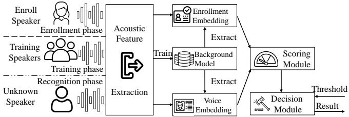
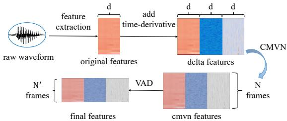
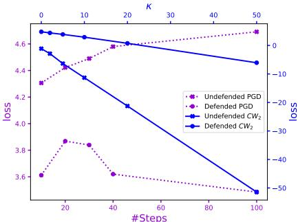
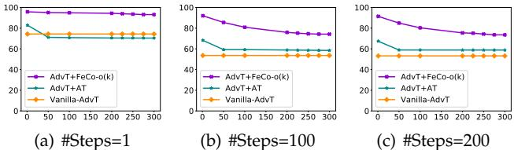
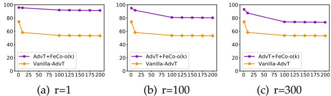
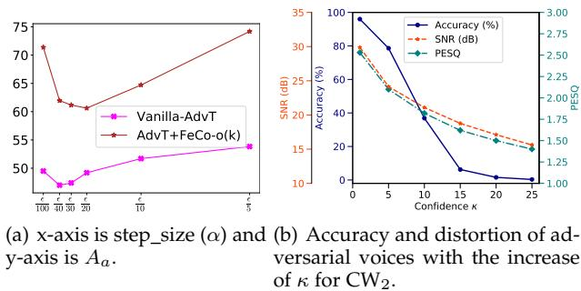
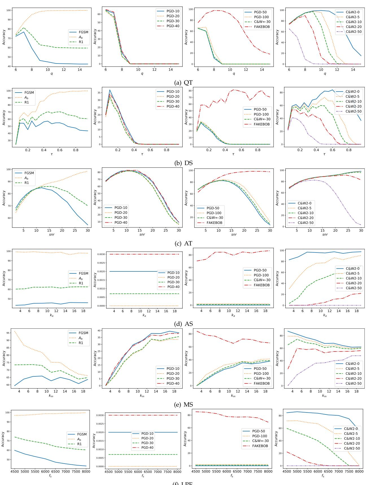
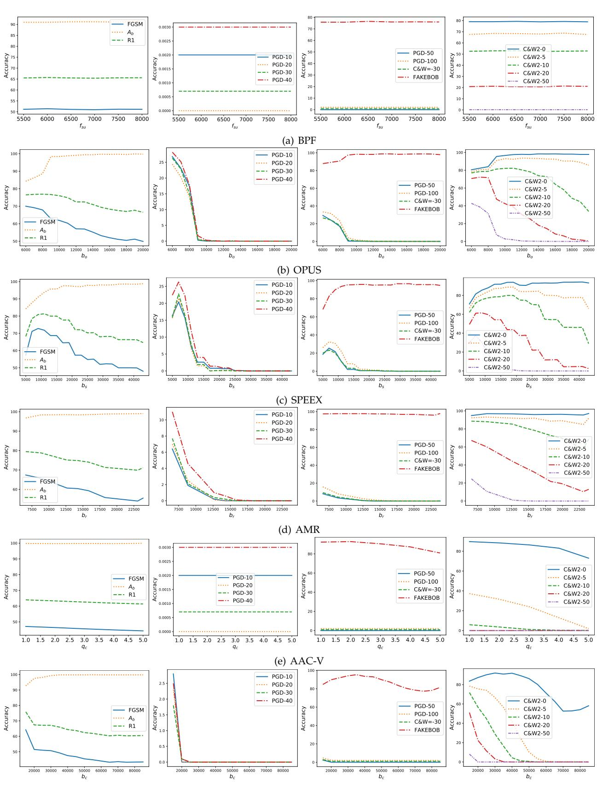
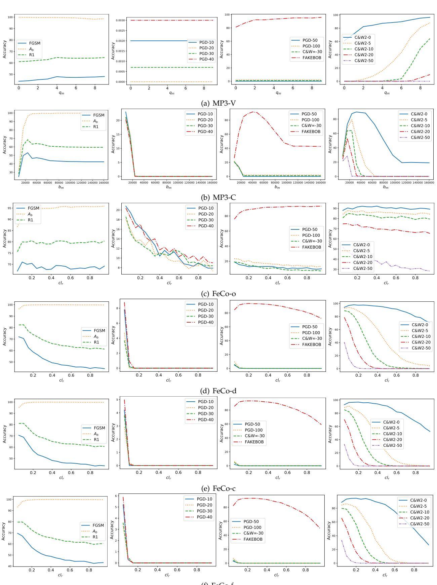
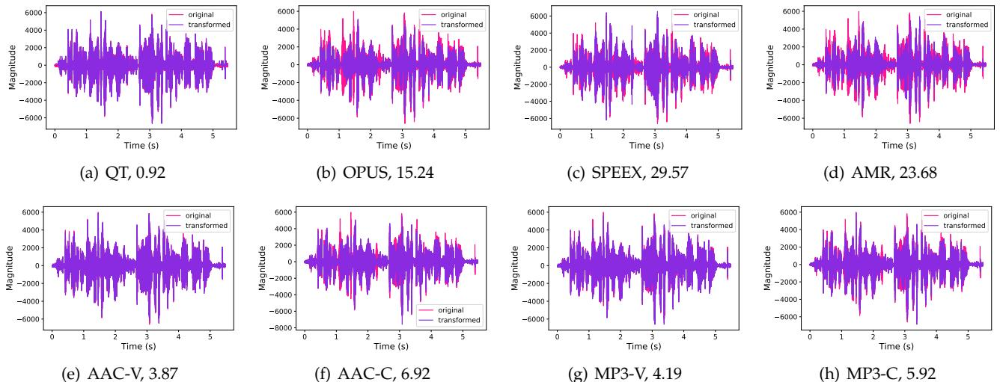

# Towards Understanding and Mitigating Audio Adversarial Examples for Speaker Recognition

Guangke Chen, Zhe Zhao, Fu Song, Sen Chen, Lingling Fan, Feng Wang, and Jiashui Wang

Abstract—Speaker recognition systems (SRSs) have recently been shown to be vulnerable to adversarial attacks, raising significant security concerns. In this work, we systematically investigate transformation and adversarial training based defenses for securing SRSs. According to the characteristic of SRSs, we present 22 diverse transformations and thoroughly evaluate them using 7 recent promising adversarial attacks (4 white-box and 3 black-box) on speaker recognition. With careful regard for best practices in defense evaluations, we analyze the strength of transformations to withstand adaptive attacks. We also evaluate and understand their effectiveness against adaptive attacks when combined with adversarial training. Our study provides lots of useful insights and findings, many of them are new or inconsistent with the conclusions in the image and speech recognition domains, e.g., variable and constant bit rate speech compressions have different performance, and some non-differentiable transformations remain effective against current promising evasion techniques which often work well in the image domain. We demonstrate that the proposed novel feature-level transformation combined with adversarial training is rather effective compared to the sole adversarial training in a complete white-box setting, e.g., increasing the accuracy by $1 3 . 6 2 \%$ and attack cost by two orders of magnitude, while other transformations do not necessarily improve the overall defense capability. This work sheds further light on the research directions in this field. We also release our evaluation platform SPEAKERGUARD to foster further research.

Index Terms—Speaker recognition, adversarial defenses, adversarial examples, input transformation, adversarial training

# 1 INTRODUCTION

Speaker recognition (SR) is the process of automatically verifying or identifying individual speakers by extracting and analyzing their unique acoustic characteristics [1]. Stateof-the-art speaker recognition systems (SRSs), based on machine learning (including deep learning), have been adopted by open-source platforms (e.g., Kaldi [2]) and commercial products (e.g., Microsoft Azure [3] and Amazon Alexa [4]), and used in safety-critical applications such as remote voice authentication in financial transaction [5] and device access control in smart home [6].

The popularity of SRSs has brought new security concerns. Recent studies have shown that both open-source and commercial SRSs are vulnerable to adversarial attacks [7], [8], [9], [10], [11], [12], [13], [14], [15], [16], [17]. To thwart adversarial attacks, five input transformations [15], [16], [18], [19] and two adversarial training [9], derived from other domains, have been studied. However, these defenses are only evaluated against few non-adaptive attacks. Thus, it is impossible to fairly compare their performance and also may lead to a false sense of robustness improvement [20], limiting their usage in practice. Indeed, these defenses become ineffective against adaptive attacks using evasion techniques from the image domain.

In this work, to secure SRSs against adversarial attacks, we systematically investigate transformation and adversarial training based defenses and thoroughly evaluate their effectiveness using both non-adaptive and adaptive attacks under the same settings.

We study transformations according to the characteristic of audio signals and SRS’s architecture. Different from images and image recognition systems, audio can be transformed at both waveform-level and feature-level, where at the waveform-level, audio can be transformed in the timeand frequency-domain while at the feature-level, different types of features in acoustic feature extraction pipeline can be transformed. To be diverse and comprehensive, we consider 22 diverse transformations (4 time-domain and 3 frequency-domain transformations, 7 audio compressions that transform audio at both time- and frequency-domains, and 8 novel feature compressions), covering all the 5 transformations studied in [15], [16], [18], [19]. Furthermore, from the respective of adaptive attacks for evasion, these transformations cover all the differentiable, non-differentiable, deterministic, and randomized types.

To thoroughly evaluate the defenses, we extend and implement all the recent promising adversarial attacks [7], [8], [9], [10], [15], [16], [17], [21], including 4 white-box attacks and 3 black-box attacks. The evaluation on 22 concrete attacks shows that the effectiveness of transformations does not necessarily decrease with increase of both distortion and attack strength, and their effectiveness varies with attacks, e.g., two time-domain transformations are more effective than others against $L _ { \infty }$ attacks (i.e., perturbations are limited in $L _ { \infty }$ norm) and feature-level transformations are often more effective than others against $L _ { 2 }$ white-box attacks.

However, this evaluation does not provide security guarantees against a future adaptive adversary who has knowledge of defenses. To evaluate the robustness of defenses against adaptive attacks, we design adaptive attacks following the most important lessons of [20], incorporating evasion techniques (Backward Pass Differentiable Approximation (BPDA) [22], Expectation over Transformation (EOT) [23], and Natural Evolution Strategy (NES) [24]) that have been shown effective against non-differentiable or randomized transformations in the image domain, and specific techniques targeting feature-level transformations.

We remark that these evasion techniques have never been considered in the speaker recognition domain except that NES was adopted to estimate gradients by the black-box attack FAKEBOB [15]. The evaluation shows that (1) most transformations including the ones from [15], [16], [18], [19] become ineffective, (2) some non-differentiable audio compressions cannot be broken by BPDA which is promising in the image domain, (3) AAC and MP3 with variable bit rate are more difficult (resp. easier) to be bypassed than them with constant bit rate in the black-box (resp. whitebox) setting; and (4) most of the randomized transformations remain resistant to black-box adaptive attacks.

To explore the effectiveness of transformations combined with adversarial training, we consider the promising adversarial training of [9] and evaluate the combined defenses under adaptive attacks. The evaluation shows that while the combination of a transformation and adversarial training does not necessarily bring the best of both worlds, the proposed novel feature-level transformation combined with adversarial training is very effective, improving the accuracy of both benign and adversarial examples in a complete white-box setting. We further evaluate this combined defense by varying various attack parameters. The results show that it is still effective, improving the accuracy by $1 3 . 6 2 \%$ , the attack cost by two orders of magnitude, and the distortion of adversarial examples, compared over vanilla adversarial training.

In summary, we make the following main contributions.

• We perform the most comprehensive investigation of transformation based defenses for securing SRSs according to the characteristic of audio signals and SRS’s architecture and study the impact of their hyper-parameters for mitigating adversarial voices without incurring too much negative impact on the benign voices. • We thoroughly evaluate the proposed transformations for mitigating recent promising adversarial attacks on SRSs. With regard for best practices in defense evaluations, we carefully analyze their strength, on both models trained naturally and adversarially, to withstand adaptive attacks. • Our study provides lots of useful insights and findings, either newly reported or inconsistent with existing findings in other domains, which could advance research on adversarial examples in this domain and assist the maintainers of SRSs to deploy suitable defense solutions to enhance their systems. Particularly, we find that our novel featurelevel transformations combined with adversarial training is the most robust one against adaptive attacks. • We develop the first platform SPEAKERGUARD for systematic and comprehensive evaluation of adversarial attacks and defenses on SRSs. It features mainstream SRSs, datasets, white- and black-box attacks, widelyused evasion techniques for adaptive attacks, evaluation metrics, and diverse defense solutions. We release our platform to foster further research in this direction (https://speakerguard.github.io).

# 2 BACKGROUND

Speaker Recognition Systems (SRSs). State-of-the-art SRSs use speaker embedding [25] to represent acoustic characteristics of speakers as fixed-dimensional vectors. The typical speaker embedding is identity-vector (ivector) [26] based on the Gaussian Mixture Model (GMM) [27]. Recently, deep embedding was also proposed to compete with ivector. It uses deep learning to train a deep neural network from which speaker characteristics are extracted and represented as vectors, e.g. AudioNet [9], [28] and $\mathbf { x }$ -vector [29].

  
Fig. 1. Architecture of SRSs.

A generic architecture of SRSs is shown in Fig. 1, consisting of: training, enrollment, and recognition phases. In the training phase, a background model is trained using tens of thousands of voices from thousands of training speakers, representing the speaker-independent distribution of acoustic features. In the enrollment phase, the background model maps the voice uttered by each enrolling speaker to an enrollment embedding, regarded as the unique identity. In the recognition phase, given a voice of an unknown speaker, the voice embedding is extracted from the background model. The scoring module measures the similarity between the enrollment embedding and voice embedding based on which the decision module outputs the result. There are two typical scoring approaches: Probabilistic Linear Discriminant Analysis (PLDA) [30] and cosine similarity [31], where PLDA works well in most situations but needs to be trained using voices [25] while cosine similarity is a reasonable substitution of PLDA without requiring training.

The acoustic feature extraction module converts the raw audio signals to acoustic features carrying characteristics of the raw audio signals. Common feature extraction algorithms include Mel-Frequency Cepstral Coefficients (MFCC) [32] and Filter-Bank [33].

Recognition task. There are three main tasks: close-set identification (CSI), speaker verification (SV), and open-set identification (OSI). CSI identifies a speaker from a group of speakers. SV verifies if an input voice is uttered by the unique enrolled speaker, according to a preset threshold, where the input voice may be rejected by regarding the speaker as an imposter. OSI utilizes the scores and a preset threshold to identify which enrolled speaker utters the input voice, where if the highest score is less than the threshold, the input voice is rejected by regarding the speaker as an imposter. Moreover, CSI could be classified into two subtasks: CSI with enrollment (CSI-E) and CSI without enrollment (CSI-NE). CSI-E exactly follows the above description. In contrast, CSI-NE does not have the enrollment phase and the background model is directly utilized to identify speakers. Thus, ideally, a recognized speaker in CSI-NE task is involved in the training phase, while a recognized speaker in the CSI-E task should have enrolled in the enrollment phase but may not be involved in the training phase.

Threat model. According to the adversary’s knowledge about the SRS and deployed defense, we classify attacks into: white-box non-adaptive, black-box non-adaptive, white-box adaptive, and black-box adaptive attacks. The adversary for white-box attacks has full access to model architecture, parameters, etc., while the adversary for black-box attacks has no knowledge about the model but can access the target model as an oracle, i.e., providing a series of carefully crafted inputs to the model and observing its outputs. Under both white-box and black-box settings, the adversary may be unaware of the deployed defense, or has complete knowledge of it (e.g., its implementation detail and concrete values for any tunable parameter) and intends to bypass it. We consider non-adaptive attacks for the former adversary and adaptive attacks for the latter adversary.

# 3 DEFENSES

# 3.1 Motivation

Recently, adversarial attacks on speaker recognition have been extensively studied [7], [8], [9], [10], [11], [12], [13], [14], [15], [16], [17]. Results show that both state-of-the-art open-source and commercial SRSs can be fooled by adding small perturbations to the original voice, even playing over the air in the physical world.

In the image and speech recognition domains, studies have proposed transformation based defenses that are able to recover benign counterparts from adversarial examples, e.g., [34], [35], [36]. While such defenses are effective for defending against non-adaptive attacks, they may be evaded by adaptive attacks [20]. Nevertheless, some transformations (but not all) achieve promising results when combined with adversarial training even in a complete white-box setting [20], [37]. However, the same conclusion cannot be drawn on speaker recognition without a careful and rigorous evaluation, because of the difference between speaker recognition and image/speech recognitions. Compared with image recognition systems, SRSs have complicated architectures and individual components, in particular, the acoustic feature extraction pipeline. Also, while the well-trained vision model is directly exploited to classify input images into one of the training classes, the welltrained background model of SRSs is adapted to speakerspecific models during enrollment and used to map input utterances into identity embeddings during recognition, since the enrolled and inference speakers are not necessarily involved in the training phase. While speech recognition minimizes speaker-dependent variations to determine the underlying text or command, speaker recognition treats the phonetic variations as extraneous noise to determine the source of the speech signal. All these differences may lead to inconsistent conclusions in the speaker recognition domain with other domains. In fact, we indeed found such inconsistent findings (cf. Section 7).

Therefore, in the speaker recognition domain, five input transformation [15], [16], [18], [19] and two adversarial training [9] based defenses have been studied. Though promising, these defenses are only evaluated against few attacks on different models, recognition tasks, and datasets, let alone adaptive attacks [20] and combinations of transformation and adversarial training. Thus, it is impossible to fairly compare their performance and also may lead to a false sense of robustness improvement brought by defenses without considering adaptive attacks, limiting their usage in practice. It is also unclear if combining a transformation with adversarial training results in a more effective defense, as many existing defenses combined with adversarial training result in lower robustness than adversarial training on its own in the image domain [20]. Therefore, there is a lack of comprehensive investigation and rigorous quantitative understanding of defenses on speaker recognition, in particular, effective defenses. This work is aimed at filling this gap.

# 3.2 Design Philosophy

According to the architecture of SRSs (cf. Fig. 1), we should consider both robust training and input transformation, where the former is conducted during the training phase and the latter takes effect in the recognition phase. When combined, they may lead to a more robust defense. For input transformation, we design audio transformations based on the following two key characteristics of speaker recognition, compared over image recognition.

Architecture characteristic. For state-of-the-art neural network based image recognition, an image is directly fed to a system without feature engineering. Due to the timevarying non-stationary property of voices, voices are not resilient enough to noises and other variations, and audio waveform signals themselves cannot effectively represent speaker characteristics [38]. Hence, to achieve better feature representative capacity and system performance [39], a modern SRS has an acoustic feature extraction pipeline for extracting acoustic feature from waveforms (cf. Fig. 1). This gives rise to waveform-level input transformations (Wtransformations) and feature-level input transformations (Ftransformations).

Audio signal characteristic. While images are naturally two-dimensional, raw audio samples form a onedimensional time series signal [40]. Even though audio signals are often transformed into two-dimensional timefrequency representations, the two axes, time and frequency, fundamentally differ from the horizontal and vertical axes in an image. Furthermore, images are commonly analyzed as a whole or in patches with little order constraints while audio signals have to be analyzed sequentially in chronological order. These properties give rise to audio-specific W-transformations that can be performed either in timedomain or frequency-domain.

Based on the above characteristics, to be diverse and comprehensive, we investigate both W-transformations and F-transformations, while for the former, we consider both time-domain and frequency-domain ones. When necessary and possible, we also evaluate the effectiveness of transformations combined with robust training. When devising an input transformation based defense, it is also important to consider if it is differentiable1 and deterministic, due to the fact that most white-box attacks leverage gradient to craft adversarial examples. In general, non-differentiable (resp. randomized) input transformations are more difficult to be evaded than differentiable (resp. deterministic) ones. Thus, all the types should be addressed to understand their effectiveness. All the transformations we considered are summarized in Table 1, covering differentiable, nondifferentiable, deterministic, and randomized types.

TABLE 1: Transformations   

<table><tr><td rowspan=1 colspan=2></td><td rowspan=1 colspan=1>Name</td><td rowspan=1 colspan=1>Parameters</td><td rowspan=1 colspan=1>D</td><td rowspan=1 colspan=1>R</td></tr><tr><td rowspan=14 colspan=1>T</td><td rowspan=4 colspan=1>Time</td><td rowspan=1 colspan=1>Quantization (QT)</td><td rowspan=1 colspan=1>q:quantized factor</td><td rowspan=1 colspan=1>X</td><td rowspan=1 colspan=1>X</td></tr><tr><td rowspan=1 colspan=1>Audio Turbulence (AT)</td><td rowspan=1 colspan=1>SNR: signal-to-noise ratio</td><td rowspan=1 colspan=1>√</td><td rowspan=1 colspan=1>√</td></tr><tr><td rowspan=1 colspan=1>Average Smoothing(AS)</td><td rowspan=1 colspan=1>k:kernel size</td><td rowspan=1 colspan=1>√</td><td rowspan=1 colspan=1>X</td></tr><tr><td rowspan=1 colspan=1>Median Smoothing (MS)</td><td rowspan=1 colspan=1>k:kernel size</td><td rowspan=1 colspan=1>√</td><td rowspan=1 colspan=1>X</td></tr><tr><td rowspan=3 colspan=1>Frequency</td><td rowspan=1 colspan=1>Down Sampling (DS)</td><td rowspan=1 colspan=1>T:downsampling freq.</td><td rowspan=1 colspan=1>√</td><td rowspan=1 colspan=1>X</td></tr><tr><td rowspan=1 colspan=1>Low Pass Filter (LPF)</td><td rowspan=1 colspan=1>fp:passband edge freq.fs:stopband edge freq.</td><td rowspan=1 colspan=1>√</td><td rowspan=1 colspan=1>X</td></tr><tr><td rowspan=1 colspan=1>Band Pass Filter (BPF)</td><td rowspan=1 colspan=1>fpt,fpu:passband edge freq.fst,fsu:stopband edge freq.</td><td rowspan=1 colspan=1>√</td><td rowspan=1 colspan=1>X</td></tr><tr><td rowspan=7 colspan=1>CompressionSpeech.</td><td rowspan=1 colspan=1>OPUS</td><td rowspan=1 colspan=1>bo:compression bitrate</td><td rowspan=1 colspan=1>X</td><td rowspan=1 colspan=1>X</td></tr><tr><td rowspan=1 colspan=1>SPEEX</td><td rowspan=1 colspan=1>bs:compression bitrate</td><td rowspan=1 colspan=1>X</td><td rowspan=1 colspan=1>X</td></tr><tr><td rowspan=1 colspan=1>AMR</td><td rowspan=1 colspan=1>br:compression bitrate</td><td rowspan=1 colspan=1>X</td><td rowspan=1 colspan=1>X</td></tr><tr><td rowspan=1 colspan=1>AAC-V</td><td rowspan=1 colspan=1>qc:quality</td><td rowspan=1 colspan=1>X</td><td rowspan=1 colspan=1>X</td></tr><tr><td rowspan=1 colspan=1>AAC-C</td><td rowspan=1 colspan=1>bc:compression bitrate</td><td rowspan=1 colspan=1>X</td><td rowspan=1 colspan=1>X</td></tr><tr><td rowspan=1 colspan=1>MP3-V</td><td rowspan=1 colspan=1>qm:quality</td><td rowspan=1 colspan=1>X</td><td rowspan=1 colspan=1>X</td></tr><tr><td rowspan=1 colspan=1>MP3-C</td><td rowspan=1 colspan=1>bm:compression bitrate</td><td rowspan=1 colspan=1>X</td><td rowspan=1 colspan=1>X</td></tr><tr><td rowspan=1 colspan=2>FeatureLevel</td><td rowspan=1 colspan=1>FEATURECOMPRESSION (FeCo)4 feature types ×2 compression alg.</td><td rowspan=1 colspan=1>clm:cluster methodclr:cluster ratio</td><td rowspan=1 colspan=1>√</td><td rowspan=1 colspan=1>√</td></tr></table>

Note: D=Differentiable and $\mathrm { R = }$ Randomized.

# 3.3 Robust Training

Robust training strengthens the resistance of a model to adversarial examples during training. We adopt adversarial training, one of the most effective techniques in the image domain, which augments the training data with adversarial examples. Formally, adversarial training intends to find the model parameter $\theta$ which minimizes the following loss:

$$
\mathbb { E } _ { ( x , y ) \sim \mathcal { D } } [ \mathtt { m a x } _ { \delta \in S } f ( \theta , x + \delta , y ) ] \approx \frac { 1 } { n } \sum _ { i = 1 } ^ { n } \mathtt { m a x } _ { \delta \in S } f ( \theta , x _ { i } + \delta , y _ { i } )
$$

where $S$ is the set of allowed perturbations, $\mathcal { D }$ is the underlying data distribution over pairs of samples $x$ and corresponding labels $\{ J , \ \{ ( x _ { i } , y _ { i } ) \} _ { i = 1 } ^ { n }$ is the training dataset that mimics the data distribution $\mathcal { D }$ , and $f$ is the training loss function, typically the cross-entropy loss. Efficient adversarial attacks such as FGSM [42] and PGD [43] are widely used to solve the above maximization problem.

# 3.4 W-Transformations

For W-transformations, we consider both time-domain and frequency-domain ones. We also consider various speech compression which can be seen as W-transformations performed both in the time- and frequency-domains.

Time-domain W-transformations. We study four timedomain W-transformations, inspired by image input transformations [34]. (1) Quantization (QT) rounds the amplitude of each sample point of a voice to the nearest integer multiple of a factor $q ,$ intended to disrupt the adversarial perturbation since its amplitude is usually small in the input space. (2) Audio turbulence (AT) adds random noise to an input voice in an element-wise way to disrupt the adversarial perturbation which is assumed to be sensitive to noise. The magnitude of the noise is adjusted by signalto-noise ratio (SNR) 10 log10 PIPn where $P _ { I }$ (resp. $P _ { n }$ ) is the power of input voice (resp. random noise). (3) Average smoothing (AS) and (4) median smoothing (MS) mitigate adversarial examples by smoothing the waveform of the input voice. A mean (resp. median) smooth with kernel size $k$ (must be odd) replaces each element $x _ { k }$ with the mean (resp. median) value of its $k$ neighbors. We remark that QT is non-differentiable due to the round operation while the others are differentiable, and AT is randomized while the others are deterministic.

Frequency-domain W-transformations. We consider three W-transformations in frequency-domain, all of which are differentiable and deterministic. (1) Down sampling (DS) down-samples voices and applies signal recovery to disrupt adversarial perturbations. The down-sample frequency is determined by the ratio, denoted by $\tau _ { \cdot }$ , between the new and original sampling frequencies. (2) Low pass filter (LPF) assumes that human voices are within relatively lower frequencies than adversarial perturbation, and applies a low-pass filter to remove the high-frequent perturbations. A low-pass filter has two parameters: the edge frequencies of the passband $( f _ { p } )$ and the stopband $( f _ { s } )$ . (3) Band pass filter (BPF) combines LPF with a high-pass filter to remove both high-frequent and low-frequent perturbations. BPF has four parameters: the lower and upper edge frequencies of the passband $( f _ { p l }$ and $f _ { p u } )$ , the lower and upper cutoff frequencies of the stopband $( f _ { s l }$ and $f _ { s u } )$ ). We remark that these transformations are derived from the speech recognition domain [34], [44], [45], but only DS has been applied in the speaker recognition against two black-box attacks FAKEBOB [15] and SirenAttack [16].

Speech compression. Based on the psychoacoustic principle, speech compression aims to suppress redundant information within a speech to improve storage or transmission efficiency. When an adversarial perturbation is redundant, it can be eliminated by speech compression. Speech compression achieves the aforementioned purpose by reducing the bit rate, thus can be seen as transformations performed both in the time- and frequency-domains. We investigate 7 standard lossy speech compression techniques, grouped into two categories: Constant Bit Rate (CBR) and Variable Bit Rate (VBR). The former uses a fixed bit rate and the latter exploits a dynamic bit rate schedule controlled by the quality parameter. We consider OPUS [46], SPEEX [47], AMR [48], AAC-C [49], and MP3-C [50] for CBR, and AAC-V [49] and MP3-V [50] for VBR. These transformations are non-differentiable and deterministic.

# 3.5 F-Transformations

The design of F-transformations is motivated by the following research questions: (Q1) What kind of acoustic features can be transformed? and (Q2) How to transform them?.

To address Q1, we have to understand what kind of features are used in SRSs. Fig. 2 shows a typical flow of feature processing. First, the original features (e.g., MFCC or Filter-Bank) are extracted from an input raw waveform. Next, to capture temporal information, time-derivative features [39] are successively extracted from and added into the original features, leading to the delta features. After that, cepstral mean and variance normalization (CMVN) [51] is applied to reduce channel and reverberation effects, resulting in cmvn features. Finally, voice activity detection (VAD) [52] is utilized to remove the unvoiced frames, resulting in final features. Therefore, four types of features could be transformed.

  
Fig. 2. A typical flow of feature processing.

To address Q2, a straightforward idea is to extend W-transformations. However, (1) W-transformations work on audio waveforms in two-dimensional time-frequency representations, while acoustic features are represented by a matrix, one row of features per frame. It prevents frequency-domain W-transformations and speech compression from being extended. (2) The mapping from waveforms to features is not linear, and a small perturbation in the input voice may lead to a large perturbation at the feature level. This difference refuses time-domain Wtransformations where adversarial perturbations are assumed to be small and/or sensitive to noise.

We propose FEATURE COMPRESSION (FeCo) to disrupt adversarial perturbations at the feature level. We regard each feature matrix $\mathcal { M }$ with $N$ frames and each frame ${ \bf a } _ { i }$ consisting of $d$ features as $N$ data points in $d$ -dimensional space and compute a compressed feature matrix with $K$ frames for $K < N$ . Our idea is described in Algorithm 1. The number $K$ of clusters is first computed according to the given cluster ratio $c l _ { r }$ (line 1). Then, we partition $N$ frames into $K$ clusters by invoking the cluster oracle $\mathcal { O }$ (line 2), which returns a list of indices $b _ { 1 } , \cdots , b _ { N }$ such that each frame ${ \bf a } _ { i }$ is assigned to the $b _ { i }$ -th cluster. Next, each cluster $C _ { i }$ is represented by a representative vector $\mathbf { m } _ { i }$ (line 5). Finally, $K$ representative vectors are combined to form the new feature matrix $\mathcal { M } ^ { \prime }$ .

To partition $N$ frames into $K$ clusters, various clustering methods, e.g., kmeans [53] and soft-kmeans [54], could be leveraged. In this work, we use kmeans and its variant warped-kmeans [55] and leave others as future work. Compared to kmeans, warped-kmeans preserves the temporal dependency of the data by imposing some constraints on the partition operation, thus is more suitable to cluster sequential data. Both kmeans and warped-kmeans use the average of all the frames in one cluster as the representative.

Algorithm 1 could be applied to any of original, delta, cmvn, and final features. We use FeCo-o, FeCo-d, FeCo-c, and FeCo-f to denote these four concrete F-transformations, all of which are randomized and differentiable. The randomness of FeCo lies in the initialization of kmeans and warpedkmeans algorithms. At the beginning, they randomly select $K$ vectors from $N$ vectors as the initial cluster centers, which will be used in the later clustering operations. Different initialization may produce different clustering results (Line 2), thus leading to different feature matrix $\mathcal { M } ^ { \prime }$ .

# 4 EVALUATION SETUP AND METRICS

# 4.1 Main Evaluation Setup

To evaluate defenses against adversarial voices on SRSs, we developed a platform, named SPEAKERGUARD.

# Algorithm 1 FeCo

Input: feature matrix $\mathcal { M } = [ { \bf a } _ { 1 } , \cdot \cdot \cdot , { \bf a } _ { N } ] ;$ cluster ratio $0 < c l _ { r } < 1$ ; cluster oracle $\mathcal { O } = 1$ kmeans or warped-kmeans

Output: compressed feature matrix $\bar { \mathcal { M } ^ { \prime } }$

. $K =$ number of clusters . $\mathbf { a } _ { i }$ is assigned to the $b _ { i }$ -th cluster $\triangleright$ compute the $_ i$ -th cluster . compute the representative vector

1: $\bar { K } \gets \lceil N \rceil \lfloor c l _ { r } \rceil$   
2: $[ b _ { 1 } , \cdot \cdot \cdot , b _ { N } ] \gets { \mathcal { O } } ( { \mathcal { M } } , K )$   
3: for $( i = 1 ; i \leq K ; i + + )$ do   
4: ${ C _ { i }  \{ { \bf { a } } _ { k } \ | \ b _ { k } = i \} }$   
5: $\begin{array} { r } { \mathbf { m } _ { i } \gets \frac { 1 } { | C _ { i } | } \sum _ { \mathbf { a } \in C _ { i } } } \end{array}$ a   
6: $\mathcal { M } ^ { \prime } \gets [ \mathbf { m } _ { 1 } , \cdot \cdot \cdot , \mathbf { m } _ { K } ]$ $\triangleright$   
7: return $\mathcal { M } ^ { \prime }$

concatenate the representative vectors

TABLE 2: SR models   

<table><tr><td rowspan=1 colspan=1></td><td rowspan=1 colspan=1>ivector-PLDA [56]</td><td rowspan=1 colspan=1>AudioNet [28]</td></tr><tr><td rowspan=1 colspan=1>Embedding&amp;Featuretypes</td><td rowspan=1 colspan=1>T&amp;MFCC</td><td rowspan=1 colspan=1>D&amp;Filter-Bank</td></tr><tr><td rowspan=1 colspan=1>Add1st&amp;2ndtime-derivative</td><td rowspan=1 colspan=1>√</td><td rowspan=1 colspan=1>X</td></tr><tr><td rowspan=1 colspan=1>Apply CMVN &amp; VAD</td><td rowspan=1 colspan=1>√</td><td rowspan=1 colspan=1>X</td></tr><tr><td rowspan=1 colspan=1>#Featuredim</td><td rowspan=1 colspan=1>72</td><td rowspan=1 colspan=1>32</td></tr><tr><td rowspan=1 colspan=1>Trainingalgorithm</td><td rowspan=1 colspan=1>US</td><td rowspan=1 colspan=1>S</td></tr><tr><td rowspan=1 colspan=1>Scoringmethod</td><td rowspan=1 colspan=1>PLDA</td><td rowspan=1 colspan=1>-</td></tr></table>

Note: T/D means GMM/deep model and (U)S means (un)supervised learning.

Models. We use two mainstream SRSs: a pre-trained model ivector-PLDA [56] from the popular open-source platform KALDI having $1 1 . 5 \mathrm { k }$ stars and $4 . 9 \mathrm { k }$ forks on GitHub [2], and a one-dimension convolution neural network based model AudioNet [9], [28]. Details of two models are shown in TABLE 2. Due to the massive experiments, we only target the CSI task (i.e., CSI-E and CSI-NE). The results on the SV and OSI tasks could be similar, as demonstrated in [15].

Datasets. We use four datasets derived from Librispeech [57]: $\mathrm { S p k _ { 1 0 } }$ -enroll, $\mathrm { S p k _ { 1 0 } }$ -test, $\mathrm { S p k _ { 2 5 1 } }$ -train, and $\mathrm { S p k _ { 2 5 1 } }$ -test. The datasets are summarized in TABLE 3 (details refer to Appendix A.1 in the supplemental material.)

Attacks. To thoroughly evaluate the defenses, we implement 4 promising white-box attacks (i.e., FGSM [42], PGD [43], $\mathrm { C W } _ { \infty , }$ , and $\mathrm { C W _ { 2 } }$ [58]), and 3 state-of-the-art black-box attacks (i.e., FAKEBOB [15], SirenAttack [16], and Kenansville [21]). All of them craft adversarial voices via solving optimization problems using $L _ { \infty }$ norm to limit perturbations, except that Kenansville is a signal processingbased decision-only attack and $\mathrm { C W _ { 2 } }$ minimizes adversarial perturbations in the loss function using $L _ { 2 }$ norm. To solve the optimization problems, FGSM, PGD, $\mathrm { C W } _ { \infty } ,$ and $\mathrm { C W _ { 2 } }$ use gradients, FAKEBOB uses gradient-estimation, and SirenAttack uses the gradient-free particle swarm optimization. Note that $\mathrm { C W } _ { \infty }$ is implemented using the loss function of the CW attack but optimized by PGD, the same as [43], to improve the attack efficiency. Details refer to Appendix A.2.

To avoid fake adversarial voices due to the discretization problem [59], i.e., adversarial voices become benign after being transformed into concrete voices, they are evaluated after storing back into the 16-bit PCM form. We only consider untargeted attacks which are more challenging to be defeated than targeted attacks [22].

We use a machine with Ubuntu 18.04, an Intel Xeon E5- 2697 v2 2.70GHz CPU, 376GiB memory, and a GeForce RTX 2080Ti GPU.

# 4.2 Evaluation Metrics

Attack effectiveness. To evaluate the effectiveness of an attack, we use model accuracy on adversarial examples $( A _ { a } ) _ { \cdot }$ , i.e., the proportion of adversarial examples that are correctly classified by the model. Thus, smaller $A _ { a }$ indicates better attack. Note that $1 0 0 \% - A _ { a }$ is the attack success rate. Defense effectiveness. A usable defense should not only improves resistance to adversarial examples, but also sacrifices accuracy on benign examples as little as possible. Thus, we measure the effectiveness of a defense using model accuracy on adversarial examples $( A _ { a } )$ and model accuracy on benign examples $( A _ { b } )$ , respectively, where the larger $A _ { a }$ (resp. $A _ { b }$ ) is, the better the defense is. We also use the R1 score, 2×Ab×AaA +A [45], which assigns equal importance to $A _ { b }$ and $A _ { a } ,$ to quantify the usability of a defense.

TABLE 3: Voice datasets   

<table><tr><td rowspan=1 colspan=1></td><td rowspan=1 colspan=2>Spk1o-enroll  Spk1o-test</td><td rowspan=1 colspan=2>Spk251-train     Spk251-test</td></tr><tr><td rowspan=1 colspan=1>Task</td><td rowspan=1 colspan=2>CSI-E/SV/OSI</td><td rowspan=1 colspan=2>CSI-NE</td></tr><tr><td rowspan=1 colspan=1>#Speakers</td><td rowspan=1 colspan=1>10 (5M,5F)</td><td rowspan=1 colspan=1>10 (5M,5F)</td><td rowspan=1 colspan=1>251 (126M,125F)</td><td rowspan=1 colspan=1>251 (126M,125F)</td></tr><tr><td rowspan=1 colspan=1>#Voices</td><td rowspan=1 colspan=1>10×10</td><td rowspan=1 colspan=1>100×10</td><td rowspan=1 colspan=1>25652</td><td rowspan=1 colspan=1>2887</td></tr><tr><td rowspan=1 colspan=1>Length</td><td rowspan=1 colspan=1>3-21s (7.2s)</td><td rowspan=1 colspan=1>1-15s (4.3s)</td><td rowspan=1 colspan=1>1-24s (12.3s)</td><td rowspan=1 colspan=1>1-19s (11.7s)</td></tr></table>

Note: $x \ – y$ (z) denotes that the minimal, maximal and average length of voices, and $n \mathrm { M } / m \mathrm { F }$ denotes that the number of male/female speakers is $n / m$ .

Imperceptibility. To measure the imperceptibility, we use Signal-to-Noise Ratio (SNR) [60] and Perceptual Evaluation of Speech Quality (PESQ) [61]. SNR is defined as $\begin{array} { r } { 1 0 \log _ { 1 0 } \frac { P _ { x } } { P _ { \delta } } , } \end{array}$ where $P _ { x }$ (resp. $P _ { \delta }$ ) is the power of the original voice (resp. perturbation). PESQ is one of the objective perceptual measures, simulating human auditory system [62]. The calculation of PESQ is more involved. It first applies an auditory transform to obtain the loudness spectra of the original and adversarial voices, and then compares two loudness spectra to obtain a metric score whose value is in the range of $- 0 . 5$ to 4.5. We refer readers to [61] for more details. Larger SNR and higher PESQ indicate better imperceptibility.

# 5 EVALUATION OF TRANSFORMATIONS

# 5.1 Evaluation Setup

We limit the perturbation budget $\epsilon$ to 0.002 for $L _ { \infty }$ attacks, the same as [9], [15], unless explicitly stated. The number of steps for PGD and $\mathrm { C W } _ { \infty }$ range from 10 to 50 with step size $\alpha = \textstyle { \frac { \epsilon } { 5 } } = 0 . 0 0 0 4$ for each step. For $\mathrm { C W _ { 2 } }$ , we set the initial trade-off constant $c$ to 0.001, use 9 binary search steps to minimize perturbations, run 900-9000 iterations to converge, and vary the confidence parameter $\kappa$ from 0, 2, 5, 10, 20 to 50. For FAKEBOB, we limit the number of iterations to 200 with the parameter samples per draw of NES $m \ = \ 5 0$ and $\kappa ~ = ~ 0 . 5$ . For SirenAttack, we use the optimal parameters reported in [16], i.e., the maximum number of epochs e $\mathrm { \it { p o c h } } _ { m a x } = 3 0 0 _ { \it { i } }$ , the iteration limit of the PSO subroutine $i t e r _ { m a x } = 3 0 ,$ , and the number of particles $n _ { - } p a r t i c l e s = 2 5 . $ . For Kenansville, we use the SSA method to perturb a voice and set the maximal attack factor to 100 and maximal number of iterations to 30, which is sufficient for the attack to converge according to our experiments. FFT method is not considered since it is much less effective than the SSA method [63].

We consider the ivector-PLDA model for the CSI-E task which is enrolled with 10 speakers using the $\mathrm { S p k _ { 1 0 } }$ -enroll dataset. We use the $\mathrm { S p k _ { 1 0 } }$ -test dataset to test the model, resulting in $9 9 . 8 \%$ accuracy on benign examples. We also use the $\mathrm { S p k _ { 1 0 } }$ -test dataset to craft adversarial examples. Though the ivector-PLDA model is pre-trained without any transformations, it still produces sufficient accuracy on benign examples, as shown in column $( A _ { b } )$ of TABLE 4. Thus, we do not re-train it when transformations are deployed. As each transformation contains at least one tunable parameter which may affect the effectiveness, we tune parameters and choose the best ones according to their R1 scores for the remaining experiments. Details are given in Appendix A.3.

# 5.2 Results

The results are reported in TABLE 4, where row (Baseline) shows the accuracy without any defense, indicating the effectiveness of attacks. In general, the effectiveness of transformations significantly varies with attacks. The results provide many interesting and useful findings, including but not limited to the following ones.

Effectiveness versus level/domain. Time-domain Wtransformations (e.g., QT, AT and MS) are often more effective than others on $\mathrm { L } _ { \infty }$ attacks, while F-transformations are often more effective than others on $\mathrm { L _ { 2 } }$ attacks. Among Wtransformations, FeCo-o and FeCo-d often perform slightly better than others, as transformation on preceding features also affects succeeding features. Between kmeans and warped-kmeans, the effectiveness varies with attacks and in general they are almost comparable. In terms of R1 score, FeCo-o with kmeans, i.e., FeCo-o(k), ranks the first place.

Findings 1. Time-domain (resp. feature-level) transformations are often more effective than others on $\mathrm { L } _ { \infty }$ (resp. L2) attacks.

Effectiveness versus distortion. Almost all the transformations perform better against FGSM, FAKEBOB, Kenansville and SirenAttack attacks than PGD, $\mathrm { C W } _ { \infty } ,$ and $\mathrm { C W _ { 2 } } { \cdot } 5 0$ attacks. To find out the reason for this difference, we report the imperceptibility and strength of non-adaptive attacks in TABLE 5. According to the imperceptibility metrics SNR and $\mathrm { P E S Q } ,$ we observe that FGSM, SirenAttack, and Kenansville (resp. FAKEBOB) attacks introduce larger (resp. comparable) levels of distortion than PGD, $\mathrm { C W } _ { \infty } ,$ and $\mathrm { C W _ { 2 } }$ attacks. This indicates that there is no direct correlation between the distortion of adversarial voices and the effectiveness of input transformations. In contrast, according to the loss values of $\mathcal { L } _ { \mathbf { C E } }$ and ${ \mathcal { L } } _ { \mathbf { M } } ,$ we observe that the single-step attack FGSM and the black-box attacks (i.e., FAKEBOB, SirenAttack, and Kenansville) are much weaker than PGD, $\mathrm { C W } _ { \infty }$ , and $\mathrm { C W _ { 2 } }$ attacks. In fact, FGSM is a singlestep attack, FAKEBOB and SirenAttack adopt an earlystop strategy, and Kenansville is a decision-based attack, so adversarial examples crafted by them are weak (i.e., close to the decision boundary), while PGD, $\mathrm { C W } _ { \infty } ,$ , and $\mathrm { C W _ { 2 } } { \cdot } 5 0$ continue searching for strong adversarial examples (i.e., far from the decision boundary) even if an adversarial example has been found.

Findings 2. The effectiveness of input transformations does not necessarily decrease with increase of distortion, since large distortion does not imply stronger adversarial voices.

Effectiveness versus attack strength. With increase of $\kappa$ in $\mathrm { C W _ { 2 } }$ (i.e., attack strength), unsurprisingly, the effectiveness of all the transformations decreases. However, though the attack strength of PGD and $\mathrm { C W } _ { \infty }$ attacks increase with #Steps (cf. TABLE 5), the effectiveness of the input transformations (e.g., QT, AT, MS, OPUS, SPEEX and FeCo-o) does not decrease monotonically. To understand this, we analyze the strength of adversarial voices before/after applying MS in Fig. 3 and find that the strength of the adversarial examples crafted by $\mathrm { C W _ { 2 } }$ remains monotonic after applying MS with increase of $\kappa ,$ while the strength of the adversarial examples crafted by PGD becomes non-monotonic after applying MS with increase of #Steps. This may be because $\mathrm { C W _ { 2 } }$ introduces larger distortion with increase of $\kappa ,$ but PGD does not introduce obviously larger distortion with increase of #Steps, as shown in TABLE 5.

TABLE 4: Results of transformations against non-adaptive attacks   

<table><tr><td rowspan="2">Defense</td><td rowspan="2"></td><td rowspan="2">R1 Ab Score</td><td rowspan="2">Lwhite-box attacks</td><td colspan="5"></td><td colspan="2">A L2white-box attacks</td><td colspan="3">black-boxattacks</td></tr><tr><td>FGSM</td><td></td><td>PGD</td><td></td><td>CW 30</td><td>2</td><td>CW2</td><td>Score-based (Lo) FAKEBOBSirenAttack</td><td></td><td>Decision-only</td></tr><tr><td>Baseline</td><td></td><td>8.3%99.8%</td><td></td><td>10 0%</td><td>20 30 0% 0%</td><td>40 50 100 0% 0% 0%</td><td>10 20 0% 0%</td><td>40 0%</td><td>50 100 0 0% 6.5%</td><td>5 10 20 50 0%</td><td>19.8%</td><td>18.7%</td><td>Kenansville</td></tr><tr><td></td><td></td><td></td><td>42.3%</td><td></td><td>62.5%</td><td>60.7%</td><td>0%</td><td>0% 57.4%</td><td>0% 86.1%86.4%</td><td>0% 0% 0% 86.2% 84.9%</td><td>91.3%</td><td>88.2%</td><td>8.0%</td></tr><tr><td>QT AT</td><td>84.5%</td><td>76.0%86.8% 89.2%</td><td>76.8% 82.9%</td><td>61.2% 77.8%</td><td>55.4% 56.6% 75.9% 75.6% 78.5%</td><td>59.8% 67.2% 76.6% 81.2% 77.9%</td><td>55.0% 55.8%</td><td>62.2% 77.8% 75.5%</td><td>65.0% 86.8%</td><td>49.9% 89.1% 89.2% 88.9% 78.5%</td><td>95.4%</td><td>94.0%</td><td>31.7% 40.6%</td></tr><tr><td></td><td>39.8%</td><td>98.1%</td><td>46.0%</td><td>0.0%</td><td>0.0%</td><td></td><td>76.7% 74.2%</td><td>0.0% 0.0%</td><td>81.2% 89.1% 89.0% 96.8% 95.0%</td><td>87.4% 65.5% 20.1% 0.0%</td><td>47.5%</td><td>69.3%</td><td>21.9%</td></tr><tr><td>AS</td><td>53.9%</td><td>83.9%</td><td>65.6%</td><td>21.3%</td><td>0.0% 0.0% 17.1% 17.3% 22.1%</td><td>0.0% 0.0% 0.0% 18.3% 24.5% 21.2%</td><td>0.0% 0.0%</td><td>23.6% 18.9%</td><td>0.0% 76.4%</td><td>73.2% 68.8% 57.9%26.9%</td><td>71.5%</td><td>70.6%</td><td>41.8%</td></tr><tr><td></td><td></td><td></td><td></td><td></td><td></td><td></td><td>17.9% 17.1%</td><td></td><td>24.4% 77.1%</td><td></td><td></td><td>66.8%</td><td></td></tr><tr><td>DS LPF</td><td>38.2%</td><td>38.3%91.8%</td><td>57.2% 59.8%</td><td>0.3%</td><td>0.2% 0.2% 0.2%</td><td>0.1%0.2% 0.2%</td><td>0.3% 0.3%</td><td>0.1% 0.2%</td><td>0.3% 77.2%</td><td>73.4% 68.1% 59.9% 39.3%0.7% 22.2%</td><td>67.3% 54.3%</td><td>81.5%</td><td>20.2%</td></tr><tr><td></td><td></td><td></td><td>96.9% 51.4%</td><td>0.0%</td><td>0.0% 0.0% 0.0%</td><td>0.0% 0.0% 0.0%</td><td>0.0% 0.0%</td><td>0.0% 0.0%</td><td>0.0% 84.6%</td><td>78.2% 71.7% 59.7% 0.0%</td><td>58.5%</td><td>76.8%</td><td>10.6%</td></tr><tr><td>BPF</td><td></td><td>36.1%</td><td>91.0%</td><td>0.0%</td><td>0.0% 0.0% 0.0%</td><td>0.0% 0.0% 0.0%</td><td>0.1% 0.0%</td><td>0.0% 0.0%</td><td>0.0% 79.0%</td><td>75.9% 68.5% 52.9% 21.2%0.2%</td><td></td><td></td><td>11.6%</td></tr><tr><td>OPUS</td><td></td><td>56.8%88.6%</td><td>67.9%</td><td>17.4%</td><td>14.1% 15.0% 17.9%</td><td>17.1% 23.3% 17.0%</td><td>14.2% 15.3%</td><td>18.5% 17.9%</td><td>22.4% 84.0%</td><td>82.9% 81.0% 78.8% 71.8%31.5%</td><td>87.5%</td><td>86.0%</td><td>37.2%</td></tr><tr><td>SPEEX</td><td></td><td>53.5%</td><td>93.8% 71.8%</td><td>7.2%</td><td>6.6% 7.9% 11.9%</td><td>10.6% 21.8% 6.7%</td><td>6.8% 7.8%</td><td>11.3% 9.6%</td><td>22.5% 88.1%</td><td>87.5% 84.0% 77.4% 59.6% 18.3%</td><td>87.9%</td><td>89.0% 93.6%</td><td>30.0%</td></tr><tr><td>AMR</td><td>29.8%</td><td>55.4%</td><td>96.8% 67.4% 99.8%</td><td>6.4%</td><td>7.0% 7.7% 11.0%</td><td>8.1% 15.9% 5.8%</td><td>8.0% 7.8%</td><td>11.4% 8.7%</td><td>17.3% 94.8% 93.7%</td><td>92.3% 88.6% 67.2% 24.6%</td><td>94.2%</td><td></td><td>22.9%</td></tr><tr><td>AAC-V</td><td>44.7%</td><td></td><td>47.1% 92.7% 64.2%</td><td>0.0% 2.8%</td><td>0.0% 0.0%</td><td>0.0% 0.0% 0.0%</td><td>0.0% 0.0% 0.0%</td><td>0.0% 0.0%</td><td>0.0% 89.7% 72.4%</td><td>37.3% 5.9% 0.0% 0.0%</td><td>34.6%</td><td>87.5% 89.8%</td><td>10.4% 12.6%</td></tr><tr><td>AAC-C</td><td>27.1%</td><td></td><td>99.6% 48.0%</td><td></td><td>2.3% 1.8% 0.0%</td><td>2.5% 2.4% 2.7% 0.0% 0.0% 0.0%</td><td>3.2% 2.3% 1.6%</td><td>2.6% 2.2% 0.0%</td><td>2.6% 83.6%</td><td>82.3% 78.5% 71.8% 51.1% 8.1% 62.2% 15.9% 0.3% 0.0% 0.0%</td><td>76.4%</td><td>90.5%</td><td>8.9%</td></tr><tr><td>MP3-V MP3-C</td><td>40.9%</td><td></td><td>96.4% 53.1%</td><td>8</td><td>8 0.1%</td><td>0.1% 0.0% 0.0%</td><td>0.0% 0.0% 0.0% 0.0% 0.0% 0.1%</td><td>0.0% 0.1% 0.0%</td><td>0.0% 87.4% 87.6%</td><td>84.3% 79.0% 63.9% 29.3% 0.4%</td><td>32.0% 71.1%</td><td>91.1%</td><td>11.4%</td></tr><tr><td></td><td>58.0%</td><td></td><td>94.0% 70.4%</td><td>16.3%</td><td>13.8% 13.0%</td><td>17.0% 12.7%20.8%</td><td></td><td></td><td>0.0%</td><td></td><td></td><td></td><td></td></tr><tr><td>FeCo-o(k)</td><td>49.6%</td><td></td><td>99.4% 70.5%</td><td>0.2%</td><td>0.0% 0.2%</td><td>0.9% 0.3% 1.1%</td><td>14.1% 14.2%15.2% 0.1% 0.1% 0.5%</td><td>15.1% 0.6% 0.8%</td><td>10.7%22.5% 91.4% 1.0% 97.1%</td><td>86.1% 86.5% 83.4% 74.0%42.0% 94.4% 94.1% 87.3% 62.8% 14.7%</td><td>85.5% 85.6%</td><td>92.1% 94.4%</td><td>26.7% 20.1%</td></tr><tr><td>FeCo-d(k) FeCo-c(k)</td><td>48.2%</td><td></td><td>98.8% 68.8%</td><td>0.0%</td><td>0.2% 0.1%</td><td>0.1% 0.1% 0.5%</td><td>0.1% 0.3% 0.1%</td><td>0.2% 0.3%</td><td>1.0% 96.3%</td><td>93.8% 91.0% 82.1% 55.0% 11.2%</td><td>84.0%</td><td>95.1%</td><td>20.8%</td></tr><tr><td>FeCo-f(k)</td><td>47.2%</td><td></td><td>98.2% 67.1%</td><td>0.3%</td><td>0.3% 0.5%</td><td>0.3% 0.4% 0.9%</td><td>0.5% 0.5% 0.6%</td><td>0.6%</td><td>0.7% 1.0% 93.4%</td><td>90.3% 86.6% 78.7% 51.2% 10.8%</td><td>83.6%</td><td>94.8%</td><td>21.0%</td></tr><tr><td>FeCo-o(wk)</td><td>50.5%</td><td></td><td>96.7%</td><td>66.6% 3.9%</td><td>3.5% 3.7%</td><td>4.3% 4.0% 6.5%</td><td>3.6% 3.2% 4.4%</td><td>4.8%</td><td>3.9% 7.0% 91.3%</td><td>88.5% 84.4% 77.5% 58.5% 26.8%</td><td>89.6%</td><td>91.7%</td><td>24.0%</td></tr><tr><td>FeCo-d(wk)</td><td>49.8% 48.5%</td><td></td><td>98.2% 98.0% 68.3%</td><td>70.2% 1.7%</td><td>1.1% 1.1%</td><td>3.0% 1.8% 3.5% 2.4% 1.3% 2.5%</td><td>1.4% 0.6% 1.1%</td><td>2.7%</td><td>2.0% 2.7% 93.9%</td><td>90.9% 88.3% 82.9% 64.0% 23.4%</td><td>88.1%</td><td>88.7%</td><td>19.9%</td></tr><tr><td>FeCo-c(wk)</td><td>49.0%</td><td></td><td>97.6% 68.5%</td><td>1.4% 2.0%</td><td>0.7% 0.7% 1.2% 0.8%</td><td>3.0% 1.5% 3.0%</td><td>1.1% 0.6% 1.0% 2.2%</td><td>2.3% 2.0%</td><td>1.8% 1.8% 93.0% 2.2% 3.2% 91.6%</td><td>89.0% 87.1% 79.4% 58.6% 20.1% 88.7%85.7% 79.5% 60.4%22.1%</td><td>87.6%</td><td>87.9%</td><td>21.2%</td></tr><tr><td>FeCo-f(wk)</td><td></td><td></td><td></td><td></td><td></td><td></td><td>1.5% 1.2%</td><td></td><td></td><td></td><td>88.7%</td><td>88.8%</td><td>22.1%</td></tr></table>

Note: k (resp. wk) denotes kmeans (resp. warped-kmeans). The top-3 highest/lowest results are highlighted in blue/red color except for Baseline where no defense is deployed. The accuracy $A _ { a }$ used for computing R1 Score is the average of all the attacks.

TABLE 5: Imperceptibility and strength of non-adaptive attacks   

<table><tr><td rowspan=2 colspan=2>Attack</td><td rowspan=1 colspan=2>Imperceptibility</td><td rowspan=1 colspan=2>Loss</td></tr><tr><td rowspan=1 colspan=1>SNR</td><td rowspan=1 colspan=1>PESQ</td><td rowspan=1 colspan=1>LCE</td><td rowspan=1 colspan=1>LM</td></tr><tr><td rowspan=1 colspan=2>FGSM</td><td rowspan=1 colspan=1>28.53</td><td rowspan=1 colspan=1>2.23</td><td rowspan=1 colspan=1>3.91</td><td rowspan=1 colspan=1>-1.66</td></tr><tr><td rowspan=6 colspan=1>PGD-x</td><td rowspan=1 colspan=1>x=10</td><td rowspan=1 colspan=1>32.77</td><td rowspan=1 colspan=1>2.85</td><td rowspan=1 colspan=1>45.88</td><td rowspan=1 colspan=1>-45.87</td></tr><tr><td rowspan=1 colspan=1>X=20</td><td rowspan=1 colspan=1>31.57</td><td rowspan=1 colspan=1>2.72</td><td rowspan=1 colspan=1>54.50</td><td rowspan=1 colspan=1>-54.50</td></tr><tr><td rowspan=1 colspan=1>x=30</td><td rowspan=1 colspan=1>31.42</td><td rowspan=1 colspan=1>2.70</td><td rowspan=1 colspan=1>58.38</td><td rowspan=1 colspan=1>-58.38</td></tr><tr><td rowspan=1 colspan=1>x=40</td><td rowspan=1 colspan=1>31.45</td><td rowspan=1 colspan=1>2.71</td><td rowspan=1 colspan=1>60.52</td><td rowspan=1 colspan=1>-60.52</td></tr><tr><td rowspan=1 colspan=1>X=50</td><td rowspan=1 colspan=1>31.31</td><td rowspan=1 colspan=1>2.69</td><td rowspan=1 colspan=1>62.23</td><td rowspan=1 colspan=1>-62.23</td></tr><tr><td rowspan=1 colspan=1>x=100</td><td rowspan=1 colspan=1>31.29</td><td rowspan=1 colspan=1>2.70</td><td rowspan=1 colspan=1>67.10</td><td rowspan=1 colspan=1>-67.10</td></tr><tr><td rowspan=6 colspan=1>CW-X</td><td rowspan=1 colspan=1>x=10</td><td rowspan=1 colspan=1>32.74</td><td rowspan=1 colspan=1>2.85</td><td rowspan=1 colspan=1>44.59</td><td rowspan=1 colspan=1>-44.56</td></tr><tr><td rowspan=1 colspan=1>X=20</td><td rowspan=1 colspan=1>31.88</td><td rowspan=1 colspan=1>2.76</td><td rowspan=1 colspan=1>53.21</td><td rowspan=1 colspan=1>-53.19</td></tr><tr><td rowspan=1 colspan=1>x=30</td><td rowspan=1 colspan=1>31.62</td><td rowspan=1 colspan=1>2.73</td><td rowspan=1 colspan=1>57.36</td><td rowspan=1 colspan=1>-57.35</td></tr><tr><td rowspan=1 colspan=1>x=40</td><td rowspan=1 colspan=1>31.51</td><td rowspan=1 colspan=1>2.72</td><td rowspan=1 colspan=1>59.94</td><td rowspan=1 colspan=1>-59.93</td></tr><tr><td rowspan=1 colspan=1>X=50</td><td rowspan=1 colspan=1>31.45</td><td rowspan=1 colspan=1>2.71</td><td rowspan=1 colspan=1>61.04</td><td rowspan=1 colspan=1>-61.03</td></tr><tr><td rowspan=1 colspan=1>x=100</td><td rowspan=1 colspan=1>31.38</td><td rowspan=1 colspan=1>2.71</td><td rowspan=1 colspan=1>66.36</td><td rowspan=1 colspan=1>-66.36</td></tr><tr><td rowspan=6 colspan=1>CW2-K</td><td rowspan=1 colspan=1>K=0</td><td rowspan=1 colspan=1>52.99</td><td rowspan=1 colspan=1>4.24</td><td rowspan=1 colspan=1>1.54</td><td rowspan=1 colspan=1>-1.12</td></tr><tr><td rowspan=1 colspan=1>K=2</td><td rowspan=1 colspan=1>51.42</td><td rowspan=1 colspan=1>4.19</td><td rowspan=1 colspan=1>2.94</td><td rowspan=1 colspan=1>-2.87</td></tr><tr><td rowspan=1 colspan=1>k=5</td><td rowspan=1 colspan=1>49.73</td><td rowspan=1 colspan=1>4.10</td><td rowspan=1 colspan=1>6.42</td><td rowspan=1 colspan=1>-6.35</td></tr><tr><td rowspan=1 colspan=1>K=10</td><td rowspan=1 colspan=1>47.09</td><td rowspan=1 colspan=1>3.95</td><td rowspan=1 colspan=1>11.28</td><td rowspan=1 colspan=1>-11.31</td></tr><tr><td rowspan=1 colspan=1>K=20</td><td rowspan=1 colspan=1>42.14</td><td rowspan=1 colspan=1>3.60</td><td rowspan=1 colspan=1>21.70</td><td rowspan=1 colspan=1>-21.25</td></tr><tr><td rowspan=1 colspan=1>K=50</td><td rowspan=1 colspan=1>30.44</td><td rowspan=1 colspan=1>2.46</td><td rowspan=1 colspan=1>51.88</td><td rowspan=1 colspan=1>-51.43</td></tr><tr><td rowspan=1 colspan=2>FAKEBOB</td><td rowspan=1 colspan=1>31.40</td><td rowspan=1 colspan=1>2.71</td><td rowspan=1 colspan=1>0.91</td><td rowspan=1 colspan=1>-0.10</td></tr><tr><td rowspan=1 colspan=2>SirenAttack</td><td rowspan=1 colspan=1>31.03</td><td rowspan=1 colspan=1>2.66</td><td rowspan=1 colspan=1>0.91</td><td rowspan=1 colspan=1>-0.10</td></tr></table>

Note: $\scriptstyle { \mathcal { L } } _ { \mathbf { C E } }$ and ${ \mathcal { L } } _ { \mathbf { M } }$ respectively denote cross entropy loss and margin loss. The larger $\scriptstyle { \mathcal { L } } _ { \mathbf { C E } }$ (resp. the smaller ${ \mathcal { L } } _ { \mathbf { M } } $ ), the stronger the attack.

Since the step size $\alpha$ may impact the capacity of the PGD attack, we also adopt another three dynamic strategies $\alpha =$ 5×#Steps , α =  $\begin{array} { r } { \alpha = \frac { \epsilon } { \# \mathrm { S t e p s } } , } \end{array}$ and $\begin{array} { r } { \alpha = \frac { 1 0 \times \epsilon } { \# \mathrm { S t e p s } } } \end{array}$ which reduces the step size $\alpha$ with increase of #Steps (Recall that previously we set $\textstyle \alpha = { \frac { \epsilon } { 5 } } )$ . The same phenomenon also occurs (cf. TABLE 9 in Appendix A.4.1), indicating this phenomenon is not due to unsuitable step size.

Findings 3. The effectiveness of input transformations does not necessarily decrease with increase of attack strength.

Overall effectiveness. Transformations are often more effective against $\mathrm { L _ { 2 } }$ white-box, $\mathrm { L } _ { \infty }$ black-box, and signal processing attacks than $\mathrm { L } _ { \infty }$ white-box attacks. For instance, AS,

  
Fig. 3. The loss values (i.e., strength) of the adversarial voices on the model without/with the MS input transformation versus #Steps of PGD and $\kappa$ of $\mathsf { C W _ { 2 } }$ . The larger the loss of PGD (resp. the smaller the loss of $\mathsf { C W _ { 2 } }$ ), the stronger the adversarial examples. The loss of PGD is scaled for better visualization.

LPF, AAC-V, and MP3-V cannot improve any robustness against the PGD and $\mathrm { C W } _ { \infty }$ attacks regardless of #Steps, and the $\mathrm { C W _ { 2 } } { \cdot } 5 0$ attack. By analyzing the strength of adversarial voices in TABLE 5, we found that:

Findings 4. AS, LPF, AAC-V, and MP3-V are completely ineffective against attacks that craft high-confidence adversarial voices (i.e., PGD, $\mathrm { C W } _ { \infty }$ and $\mathrm { C W _ { 2 } }$ with $\kappa = 5 0$ ), in non-adaptive setting.

VBR and CBR in speech compression. We noticed significant difference of effectiveness between VBR speech compression (e.g., AAC-V and MP3-V) and CBR speech compression (OPUS, SPEEX, AMR, AAC-C, and MP3-C). For instance, the accuracy of MP3-C (resp. AAC-C) against $C W _ { 2 } – 1 0$ is 212 (resp. 11) times larger than that of MP3-V (resp. AAC-V). Compared to CBR speech compression, VBR speech compression dynamically adjusts the bit rate of the voices to better fit to the psychoacoustic perception of the human ear and thus achieves better quality. As a result, although they incur less side effect on the benign voices $[ A _ { b }$ of AAC-V and MP3-V only drops by $0 \%$ and $0 . 2 \%$ compared to the Baseline), they are limited in disrupting the adversarial perturbation.

Findings 5. VBR speech compression has less side-effect, but are less effective in mitigating adversarial voices.

More findings in the non-adaptive setting refer to Appendix A.4.2.

To evaluate the robustness of transformations in the adaptive setting where the adversary has complete knowledge of defense and attempts to bypass the defense, we design adaptive attacks tailored to input transformations, following the suggestions of [20], i.e., being as simple as possible while resolving any potential optimization difficulties.

To bypass a certain input transformation $g ( \cdot ) .$ , the adversary attempts to find an adversarial voice $x ^ { a d v }$ from a benign voice $x$ such that $x ^ { a d v }$ remains adversarial after being transformed by $g ( \cdot ) .$ , namely, solving the following optimization problem:

$$
\begin{array} { r } { \operatorname * { a r g m i n } _ { x ^ { a d v } } \mathcal { L } ( g ( x ^ { a d v } ) , y ) \quad \mathrm { s u c h ~ t h a t } \quad \| x ^ { a d v } - x \| _ { p } \leq \epsilon } \end{array}
$$

where $\mathcal { L }$ is the loss function used in non-adaptive attack (cross-entropy loss for FGSM, PGD, and margin loss for $\mathrm { C W } _ { \infty }$ , $\mathrm { C W _ { 2 } }$ , FAKEBOB, and SirenAttack), $p = 2 , \infty$ is the $\mathrm { L } _ { p }$ norm-based distance, and $y$ is the ground-truth label of $x$ for untargeted attack.

FAKEBOB, SirenAttack, and Kenansville solve the optimization problem without gradient back-propagation, thus can be directly mounted, except that the adaptive version goes through the deployed transformation when querying the model, while the non-adaptive one does not. For differentiable and deterministic transformations (i.e., AS, MS, DS, LPF, and BPF) on which reliable and informative gradients can be computed via back-propagation, the optimization problem can be easily solved by white-box attacks using gradient descents. However, the gradient of the loss function $\mathcal { L }$ w.r.t. $x ^ { a d v }$ cannot be back-propagated for non-differentiable transformations (e.g., QT and speech compressions) while the gradient is less reliable and informative for randomized transformations (e.g., AT and FeCo). To address this issue, we adopt evasion techniques for white-box attacks (i.e., FGSM, PGD, $\mathrm { C W } _ { \infty , }$ , and $\mathrm { C W _ { 2 } }$ attacks).

# 6.1 Bypassing W-Transformations

To enable backpropagation of the gradient from a nondifferentiable but deterministic W-transformation $g ,$ , the adversary may utilize Backward Pass Differentiable Approximation (BPDA) [22]. Specifically, during the forward pass, the adversary directly uses $g$ to compute the loss, while uses a differentiable function $\hat { g }$ in the backward pass, i.e., approximating $\nabla _ { x } g ( x )$ with $\nabla _ { x } \hat { g } ( x )$ . We set $\hat { g } ( x ) \ = \ x ,$ i.e., the identity function, which has been shown effective for breaking non-differentiable input transformations in the image domain [20].

To tackle randomized transformations, the adversary may exploit Expectation over Transformation (EOT) [23], i.e., the loss function is reformulated as $\mathbb { E } _ { \boldsymbol { r } } [ \mathcal { L } ( \boldsymbol { g } _ { \boldsymbol { r } } ( \boldsymbol { x } ) , \boldsymbol { y } ) ] \approx$ $\begin{array} { r } { \frac { 1 } { R } \sum _ { i = 1 } ^ { R } \mathcal { L } ( g _ { r _ { i } } ( x ) , y ) } \end{array}$ where $r$ denotes the randomness of $^ { g , }$ $r _ { i }$ is an independent draw of the randomness, and $R$ is the number of independent draws. Intuitively, a randomized transformation is independently sampled multiple times and the average of the loss function is used during gradient descent. It reduces the variance of the gradient and enables a more stable search direction. We remark that four differentiable and randomized transformation based defenses have been broken using EOT in the image domain [20], [22].

# Algorithm 2 Replicating features

Input: feature matrix $M = [ { \bf a } _ { 1 } , \cdot \cdot \cdot , { \bf a } _ { N } ] ;$ cluster ratio $0 < c l _ { r } < 1$ ; cluster oracle $\mathcal { O } = \mathrm { l }$ kmeans or warped-kmeans   
Output: replicated feature matrix $\mathcal { M } ^ { \prime }$   
1: k ← b 1cl c   
2: for $( i = \dot { 1 } ; i \le N ; i + + )$ do $A _ { i } $ matrix that replicats the vector $\mathbf { a } _ { i }$ k times   
3: for $\mathit { i } = 1 ; \lceil ( N \times k + i - 1 ) \times c l _ { r } \rceil \neq N ; i + + )$ do append the vector $\mathbf { a } _ { i }$ to $\mathbf { \mathcal { A } } _ { i }$   
4: $\mathcal { M } _ { 1 } \gets [ \mathcal { A } _ { 1 } , \cdot \cdot \cdot , \mathcal { A } _ { N } ]$ . concatenate the replicated vectors   
5: $[ b _ { 1 } , \cdot \cdot \cdot , b _ { | \mathcal { M } _ { 1 } | } ] \gets \mathcal { O } ( \mathcal { M } _ { 1 } , N )$   
6: Let $i _ { 1 } , \cdots , i _ { N }$ be a permutation of $1 , \cdots , N$ s.t. for each $1 \leq j \leq N ,$ most of vectors of $\bar { \mathcal { A } } _ { i _ { j } }$ are divided into the $b _ { i _ { j } }$ -cluster   
7: $\mathcal { M } ^ { \prime }  [ A _ { i _ { 1 } } , \cdot \cdot \cdot , A _ { i _ { N } } ]$   
8: return $\mathbf { \mathcal { M } ^ { \prime } }$

# 6.2 Bypassing F-Transformations

Since FeCo is differentiable and randomized, one could use EOT to bypass FeCo (cf. Section 6.1). Below, we design more specific evasion techniques for white-box attacks, tailored to FeCo, called Replicate attack, including Replicate-F(feature) and Replicate-W(ave).

Replicate-F. To bypass ${ \mathrm { F e C o } } ,$ the adversary first crafts an adversarial voice $x ^ { \prime }$ on the model without ${ \mathrm { F e C o } } ,$ and then builds a new feature matrix $\mathcal { M } ^ { \prime }$ from the feature matrix $\mathcal { M }$ of $x ^ { \prime }$ with the goal $\mathrm { F e C o } ( { \mathcal M } ^ { \prime } ) = { \mathcal M } ,$ i.e., when $\mathcal { M } ^ { \prime }$ is fed to the model defended by FeCo, $\mathcal { M } ^ { \prime }$ is likely compressed to $\mathcal { M } ,$ , leading to a successful attack.

The desired feature matrix $\mathcal { M } ^ { \prime }$ is built by applying Algorithm 2. Suppose $\mathcal { M } = [ { \bf a } _ { 1 } , \cdots , { \bf a } _ { N } ]$ where ${ \bf a } _ { i }$ is the feature vector of the $i$ -th frame. It first replicates each feature vector ${ \bf a } _ { i }$ of $\mathcal { M }$ by $\begin{array} { r l r } { k } & { { } = } & { \lfloor \frac { 1 } { c l _ { r } } \rfloor } \end{array}$ times and then appends vectors to the replicated vectors $A _ { i }$ ’s until the concatenated matrix $\mathcal { M } _ { 1 }$ of $[ \mathcal { A } _ { 1 } , \cdots , \mathcal { A } _ { N } ]$ will lead to a feature matrix with $N$ frames after applying FeCo. It is expected that $\mathrm { F e C o } ( \mathcal { M } _ { 1 } )$ has the same frames as $\mathcal { M }$ . However, the order of frames of $\mathrm { F e C o } ( \mathcal { M } _ { 1 } )$ may differ from that of $\mathcal { M }$ . To overcome this problem, we run the clustering algorithm with the parameter $c l _ { r }$ on the matrix $\mathcal { M } _ { 1 }$ to get the order of the frames of $\mathrm { F e C o } ( \mathcal { M } _ { 1 } )$ . This order is used to permute the replicated vectors $A _ { i }$ ’s intended to make $\mathrm { F e C o } ( \mathcal { M } ^ { \prime } ) = [ \frac { \sum \mathcal { A } _ { i _ { 1 } } ^ { \texttt { a } } } { | \mathcal { A } _ { i _ { 1 } } | } , \cdot \cdot \cdot , \frac { \sum \mathcal { A } _ { i _ { N } } } { | \mathcal { A } _ { i _ { N } } | } ]$ , P AiN ] being M.

Replicate-W. Replicate-F is infeasible in practice, as the API exposed by a SRS only accepts waveforms. Therefore, we introduce Replicate-W, which is similar to Replicate-F except that the adversarial voice $x ^ { a d v }$ is reconstructed from $\bar { \mathcal { M } ^ { \prime } }$ using Griffin-Lim algorithm [64] and fed to SRS defended with FeCo.

# 7 EVALUATION OF ADAPTIVE ATTACKS

# 7.1 Evaluation Setup

We evaluate transformations in the same setup as in Section 5 against adaptive attacks derived from a subset of representative attacks according to Section 6. For adaptive attacks derived from FGSM, $\mathrm { C W _ { 2 } \mathrm { - } 0 }$ , FAKEBOB, SirenAttack and Kenansville, we consider all the transformations, as they are effective in the non-adaptive setting, but the effectiveness varies. For adaptive attacks derived from PGD-10, PGD-100, ${ \mathrm { C W } } _ { \infty } – 1 0$ , and $\mathrm { C W } _ { \infty } – 1 0 0 ,$ , we do not consider AS, DS, LPF, and BPF, as they are differentiable, deterministic, and almost completely ineffective in the non-adaptive setting. The $\mathrm { C W _ { 2 } } { - } 2$ (resp. $\mathrm { C W _ { 2 } } { \cdot } 5 0 $ ) attack is considered only when a transformation is effective (i.e., at least $5 \%$ accuracy) against $\mathrm { C W _ { 2 } \mathrm { - } 0 }$ (resp. $\mathrm { C W _ { 2 ^ { - } } }$ 2). We do not consider all the combinations of attacks and transformations, as the current experiments already require substantial effort.

TABLE 6: Results $\textstyle | A _ { a }$ , SNR, PESQ) of transformations against adaptive attack   

<table><tr><td rowspan="2">Defense</td><td rowspan="2">Adaptive Techniques</td><td colspan="6">Lwhite-box attacks PGD-10PGD-100CW-10</td><td colspan="8">L2 white-box attacks CW2-50</td><td colspan="2">black-box attacks SirenAttackKenansville</td></tr><tr><td rowspan="2">FGSM</td><td colspan="4"></td><td colspan="8">CW2-0 CW2-2</td><td colspan="2">FAKEBOB</td></tr><tr><td>Aa</td><td>A</td><td>A</td><td>A</td><td>CWoo-100 A</td><td>Aa</td><td>SNRPESQ</td><td></td><td>Aa</td><td>SNR</td><td>PESQ</td><td>Aa SNRPESQ</td><td></td><td>Aa</td><td>Aa</td><td>Aa</td></tr><tr><td>QT</td><td>BPDA</td><td>18.6%</td><td>0%</td><td>0%</td><td>0%</td><td>0%</td><td>14.6%</td><td>46.81</td><td>3.86</td><td>0%</td><td>44.04 3.71</td><td></td><td>·</td><td>40.1%</td><td></td><td>75.0%</td><td>9.9%</td></tr><tr><td>AT</td><td>EOT</td><td>18.7%</td><td>4.3%</td><td>1.8%</td><td>4.5%</td><td>1.9%</td><td>64.4%</td><td>37.47</td><td>3.03</td><td>26.2%</td><td>35.45 2.88</td><td>0%</td><td>20.71 1.70</td><td>96.67%</td><td></td><td>95.0%</td><td>18.5%</td></tr><tr><td>AS</td><td>X</td><td>31.5%</td><td>-</td><td>-</td><td>-</td><td>：</td><td>19.0%</td><td>49.70</td><td>4.16</td><td>0%</td><td>48.49</td><td>4.11</td><td>-</td><td>14.5%</td><td></td><td>93.0%</td><td>9.8%</td></tr><tr><td>MS</td><td>X</td><td>1.6%</td><td>0%</td><td>0%</td><td>0%</td><td>0%</td><td>4.7%</td><td>61.76</td><td>4.45</td><td></td><td>·</td><td></td><td>:</td><td></td><td>0.3%</td><td>23.0%</td><td>6.5%</td></tr><tr><td></td><td>X</td><td>24.2%</td><td>·</td><td>-</td><td>-</td><td>-</td><td>18.2%</td><td>57.28</td><td>4.35</td><td>0%</td><td>55.02</td><td>4.29</td><td>-</td><td></td><td>15.0%</td><td>93.0%</td><td>8.5%</td></tr><tr><td>品</td><td>X</td><td>32.6%</td><td>-</td><td>-</td><td>-</td><td>-</td><td>20.2%</td><td>55.34</td><td>4.35</td><td>0%</td><td>53.46</td><td>4.29</td><td>·</td><td></td><td>18.8%</td><td>95.9%</td><td>7.1%</td></tr><tr><td>BPF</td><td>X</td><td>26.4%</td><td>·</td><td>-</td><td>-</td><td>-</td><td>17.3%</td><td>57.98</td><td>4.37</td><td>0%</td><td>55.99</td><td>4.31</td><td>-</td><td></td><td>12.3%</td><td>82.7%</td><td>6.8%</td></tr><tr><td>OPUS</td><td>BPDA</td><td>89.1%</td><td>86.8%</td><td>84.4%</td><td>86.5%</td><td>84.0%</td><td>25.1%</td><td>20.97</td><td>1.89</td><td>0%</td><td>15.94</td><td>1.71</td><td>·</td><td></td><td>82.3%</td><td>73.2%</td><td>8.7%</td></tr><tr><td>SPEEX</td><td>BPDA</td><td>89.7%</td><td>80.6%</td><td>75.4%</td><td>80.0%</td><td>75.2%</td><td>1.9%</td><td>24.33</td><td>1.92</td><td></td><td>-</td><td></td><td>·</td><td></td><td>87.7%</td><td>72.0%</td><td>7.2%</td></tr><tr><td>AMR</td><td>BPDA</td><td>90.4%</td><td>73.2%</td><td>63.4%</td><td>73.5%</td><td>63.5%</td><td>2.1%</td><td>24.30</td><td>1.96</td><td></td><td>-</td><td></td><td>·</td><td></td><td>92.0%</td><td>80.1%</td><td>6.3%</td></tr><tr><td>AAC-V</td><td>BPDA</td><td>51.9%</td><td>0%</td><td>0%</td><td>0%</td><td>0%</td><td>2.3%</td><td>48.96</td><td>4.06</td><td></td><td></td><td></td><td>·</td><td></td><td>44.9%</td><td>97.0%</td><td>9.1%</td></tr><tr><td>AAC-C</td><td>BPDA</td><td>88.8%</td><td>43.2%</td><td>6.2%</td><td>44.5%</td><td>6.7%</td><td>19.9%</td><td>32.67</td><td>2.59</td><td>0%</td><td>29.23</td><td>2.36</td><td>·</td><td></td><td>23.1%</td><td>65.0%</td><td>8.3%</td></tr><tr><td>MP3-V</td><td>BPDA BPDA</td><td>52.2%</td><td>0%</td><td>0%</td><td>0%</td><td>0%</td><td>2.4%</td><td>49.95</td><td>4.12</td><td></td><td>-</td><td></td><td>-</td><td></td><td>46.4%</td><td>96.1%</td><td>6.9%</td></tr><tr><td rowspan="3">MP3-C</td><td></td><td>89.4%</td><td>10.2%</td><td>0.9%</td><td>10.5%</td><td>1.2%</td><td>15.5%</td><td>34.70</td><td>2.88</td><td>0%</td><td>31.11</td><td>2.64</td><td></td><td></td><td>54.2%</td><td>64.2%</td><td></td></tr><tr><td>EOT</td><td>54.1%</td><td>0%</td><td>0%</td><td>0%</td><td>0%</td><td>90.4%</td><td>56.20</td><td>4.14</td><td>88.0%</td><td>53.54</td><td>4.05</td><td></td><td>1.57</td><td>92.17%</td><td></td><td>7.3%</td></tr><tr><td>Replicate-W</td><td>68.0%</td><td>39.4%</td><td>49.0%</td><td>39.3%</td><td>49.9%</td><td>82.7%</td><td>-</td><td>-</td><td>78.7%</td><td>-</td><td>1.2% -</td><td>18.38</td><td></td><td>87.8%</td><td>96.4% 83.9%</td><td>31.0% 20.0%</td></tr><tr><td rowspan="2">FeCo-o(k)</td><td>Replicate-F</td><td>72.4%</td><td>7.9%</td><td>15.6%</td><td>7.3%</td><td>14.5%</td><td>92.8%</td><td>-</td><td></td><td>88.6%</td><td>·</td><td>58.6% 36.7%</td><td>-</td><td>：</td><td></td><td></td><td></td></tr><tr><td></td><td></td><td></td><td></td><td></td><td></td><td></td><td></td><td></td><td></td><td></td><td></td><td></td><td>-</td><td>98.1%</td><td>93.2%</td><td>22.6%</td></tr></table>

Note: The accuracy in red indicates that an adaptive attack is not stronger than its non-adaptive version. The cells with gray (resp. green) color indicate that the transformations are non-differentiable (resp. randomized). Distortion levels of $L _ { \infty }$ attacks are not reported since they are similar. The distortion levels of Replicate attacks are not reported since the benign and adversarial voices do not align with each other due to the replication operation.

# 7.2 Results

The results are shown in TABLE 6. Overall, the effectiveness varies with transformations and attacks. Below, we compare the results with those obtained in the non-adaptive setting (i.e., TABLE 4), by distinguishing if the transformations are differentiable or not.

Results of non-differentiable transformations (gray color in TABLE 6). First, QT becomes less effective against both white-box and black-box attacks, indicating both BPDA and adaptive black-box attacks are able to circumvent QT.

Second, against adaptive white-box attacks, the effectiveness of CBR speech compressions (i.e., OPUS, SPEEX, AMR, AAC/MP3-C) does not decrease, indicating that BPDA is not able to circumvent them. Indeed, (1) BPDA cannot reduce the accuracy of speech CBR compressions on the adversarial examples crafted by FGSM, PGD, and $\mathrm { C W } _ { \infty }$ - 0 when compared with the results in TABLE 4. (2) Though BPDA can reduce the accuracy on the adversarial examples crafted by $\mathrm { C W _ { 2 } }$ -0 and $\mathrm { C W } _ { 2 } – 2 ,$ much more distortions are introduced than the non-adaptive $\boldsymbol { \mathrm { C W _ { 2 } } }$ attack, e.g., the SNR of the adaptive $\mathrm { C W _ { 2 } \mathrm { - } 0 }$ (with BPDA) on AAC-C (resp. MP3- C) is 32.67 dB (resp. 34.70 dB), 20 dB (resp. 18 dB) smaller than that of the non-adaptive $\mathrm { C W _ { 2 } \mathrm { - } 0 }$ (52.99 dB, cf. TABLE 5). Recall that $\mathrm { C W _ { 2 } }$ does not have any perturbation threshold, while other attacks have. Thus, adaptive $\mathrm { C W _ { 2 } }$ attacks still achieve high attack success rate at the cost of distortion.

In contrast, we found that BPDA with the identity function is effective in breaking VBR speech compression (i.e., AAC/MP3-V). Compared with the result of non-adaptive $\mathrm { C W _ { 2 } \mathrm { - } 0 }$ attack in TABLE 4, the adaptive $\mathrm { C W _ { 2 } \mathrm { - } 0 }$ attack equipped with BPDA reduces the accuracy of AAC-V (resp. MP3-V) by $7 0 . 1 \%$ (resp. $5 9 . 8 \%$ ) with no more than 0.2 and 4.1 dB decrease in PESQ and SNR, respectively.

To understand why BPDA has different effectiveness between QT, CBR and VBR speech compressions, we checked the appropriateness of approximating non-differentiable transformations by the identity function and found that

QT and VBR speech compressions are much closer to the identity function than CBR speech compressions (cf. Appendix A.5), indicating that BPDA with the identity function is not strong enough to bypass CBR speech compressions, and better approximation functions are required to circumvent them. We leave this as future work (cf. Section 9.1 for discussion).

Findings 6. BPDA with identity function can evade nondifferentiable QT and VBR speech compressions, but fail to evade CBR speech compressions.

We highlight that in the image domain, [22] and [20] successfully evade all the seven input transformation-based adversarial defenses using BPDA with the identity function, which is inconsistent with our Findings 6. Also, while [65] showed MP3 robust audio adversarial examples against speech recognition models can be crafted with BPDA at the cost of approximately 15dB larger distortion (close to our result of MP3-C), Findings 6 shows that MP3-V can be easily evaded with BPDA without obvious distortion increase.

Third, CBR speech compressions become less effective against adaptive FAKEBOB and SirenAttack, especially, AAC-C and MP3-C reduce $5 3 . 3 \%$ and $1 6 . 9 0 \%$ accuracy against adaptive FAKEBOB, respectively. However, AAC/MP3-V achieve higher accuracy, indicating that adaptive FAKEBOB and SirenAttack are limited in circumventing VBR speech compressions. It is because the gradients estimated by NES of FAKEBOB for AAC/MP3-V are not informative enough, and the particles moving direction of PSO in SirenAttack is not stable, due to the variable bit rate of AAC/MP3-V.

Findings 7. Variable bit rate (VBR) makes speech compressions more resistant against adaptive black-box attacks.

Results of differentiable transformations (non-gray color in TABLE 6). All the deterministic transformations become less effective against white-box and black-box adaptive attacks, except for AS, DS, LPF, and BPF against SirenAttack because the perturbation budget $\epsilon = 0 . 0 0 2$ is not sufficient enough for SirenAttack to evade these transformations. When $\epsilon = 0 . 0 2$ , the adaptive SirenAttack becomes stronger than the non-adaptive one, reducing at least $1 6 \%$ accuracy, on these transformations (cf. Appendix A.6).

Randomized transformations (i.e., AT and FeCo-o(k)) can also be evaded by the white-box adaptive attacks with EOT or larger parameter $\kappa$ . However, AT and FeCoo(k) remain effective on the adversarial examples crafted by the black-box adaptive attacks FAKEBOB, SirenAttack, and Kenansville (except for AT due to the larger distortion introduced by Kenansville which suffices to overcome the randomness of AT). This is because: their randomness makes the estimated gradients of NES uninformative for FAKEBOB, the moving direction of PSO unreliable for SirenAttack, and randomized decision for Kenansville.

Findings 8. Differentiable transformations become less effective against the white-box adaptive attacks, but randomized transformations remain resistant to the black-box adaptive attacks.

Replicate attack versus EOT. We observe that EOT is more effective than the Replicate attack to bypass FeCo-o(k). To understand the reason, we analyze if the expectation (i.e., $\operatorname { F e C o } ( \mathcal { M } ^ { \prime } ) = \mathcal { M } )$ of the Replicate attack is satisfied. We found that $\mathrm { F e C o } ( { \mathcal { M } } ^ { \prime } )$ has almost the same frames (i.e., feature vectors) as $\mathcal { M }$ , but their orders are not the same, due to the randomness of FeCo. Indeed, it is impossible to ensure the same orders, even if a brute-force adversary can enumerate the randomness, where the adversary has to craft and submit an adversarial voice for each randomness, would result in a low success rate (cf. Appendix A.7). In contrast, EOT allows to craft an adversarial voice that remains adversarial against the randomness of FeCo by taking average of the loss functions conditioned at multiple randomness during the gradient descent.

Besides, Relicate attack replicates the speech content of each frame, and the lossy reconstruction of voices from features introduce additional noise, making the adversarial voices more perceptible (visit our website for listening audios) and less robust (i.e., Replicate-W is worse than Replicate-F for strong attacks).

Findings 9. Against FeCo, EOT is more effective than Replicate attack in terms of both attack success rate and imperceptibility.

# 8 EVALUATION OF TRANSFORMATIONS ON AD-VERSARIALLY TRAINED MODEL

# 8.1 Evaluation Setup

As ivector-PLDA cannot be adversarially trained due to unsupervised learning, we adversarially train AudioNet for the CSI-NE task using the datasets $\mathrm { S p k _ { 2 5 1 } }$ -train and Spk251- test for training and testing, respectively. The training uses a minibatch of size 128 for 300 epoches, cross-entropy loss as the objective function, and Adam [66] to optimize trainable parameters. The naturally trained model is denoted by Standard. For adversarial training, we use PGD with 10 steps (i.e., PGD-10) to generate adversarial examples. The model is denoted by Vanilla-AdvT.

For each chosen transformation $\Sigma ,$ we implement it as a proper layer in AudioNet. Note that this layer does not involve any trainable parameter, similar to the ReLU activation layer [67]. The resulting network is adversarially trained the same as above, except that BPDA is leveraged for training the network with non-differentiable transformations and EOT with $R { = } 1 0$ is leveraged for training the network with randomized transformations. The resulting model is denoted by AdvT $+ \mathsf { X }$ . We do not consider speech compressions, LPF and BPF, as BPDA is not effective for estimating the gradients of speech compressions, and the accuracy of the resulting model with LPF/BPF is extreme low on both training dataset (i.e., $2 4 . 1 0 \% / 2 3 . 6 5 \%$ ) and testing dataset (i.e., $2 . 0 4 \% / 2 . 2 5 \% )$ .

The adaptive attacks are derived from FGSM, PGD-10, PGD-100, ${ \mathrm { C W } } _ { \infty } – 1 0$ , $\mathrm { C W _ { \infty }  – 1 0 0 }$ , $\mathrm { C W _ { 2 } }$ -1, FAKEBOB, SirenAttack, and Kenansville, armed with EOT $( R { = } 5 0 )$ and BPDA to evade randomized and non-differentiable transformations. To improve the attack capability of FAKEBOB, we increase the parameter samples per draw $m$ to 300, allowing more precise gradient estimation at the cost of increased attack overhead. Since adversarially trained models tend to yield smaller loss than naturally trained one, we increase the initial trade-off constant $c$ of $\mathrm { C W _ { 2 } }$ attack from 0.001 to 0.1 when attacking Vanilla-AdvT and AdvT $+ \mathsf X$ . This helps finding adversarial examples with better imperceptibility according to our experiments.

# 8.2 Results

The results are reported in TABLE 7. We observe that the sole adversarial training (i.e., Vanilla-AdvT) is effective for defeating adversarial examples compared over Standard except for Kenansville, at the cost of slightly sacrificing accuracy on benign examples (i.e., $A _ { b }$ reduces from $9 9 . 0 6 \%$ t o $9 5 . 6 7 \%$ . Adversarial training either significantly improves the accuracy by more than $5 3 \%$ on the adversarial examples crafted by $L _ { \infty }$ attacks, or amplifies the distortions of the adversarial examples crafted by $\mathrm { C W _ { 2 } } { \cdot } 1$ (the SNR of Vanilla-AdvT is $1 8 { \textrm { d B } }$ smaller than that of Standard). However, adversarial training does not improve the model accuracy on the adversarial examples crafted by Kenansville. This is not surprising since Kenansville is a signal processing-based attack while the adversarial examples used for adversarial training is generated by the optimization-based attack PGD-10. We also tried to improve the model robustness against Kenansville by incorporating Kenansville in adversarial training, but the result is not promising (cf. Section 9.1 for discussion).

While sole adversarial training is often effective compared over Standard, the combination of adversarial training with a transformation, highlighted in green color in TABLE 7, does not necessarily bring the best of both worlds, which also exists in image domain [20].

Interestingly, we found that adversarial training combined with FeCo-o(k), i.e., AdvT $^ { \cdot } +$ FeCo-o(k), is very effective, achieving higher accuracy on both the adversarial and benign examples compared with Vanilla-AdvT. This improvement is brought by the randomness of FeCo. In fact, during the training of AdvT+FeCo-o(k), the training data are randomly transformed by FeCo, which enhances the quantity and diversity of the training data, similar to data augmentation in the image domain [37]. Consequently, the distribution mimicked by the training dataset $\{ ( x _ { i } , y _ { i } ) \} _ { i = 1 } ^ { B }$ becomes closer to the underlying data distribution $\mathcal { D }$ (cf.

TABLE 7: Results ( $A _ { a }$ , SNR, PESQ) on Standard, Vanilla-AdvT, and AdvT $^ +$ Transformation   

<table><tr><td rowspan="2"></td><td rowspan="2">R1 Score</td><td rowspan="2">Ab</td><td colspan="5">Lwhite-box attacks</td><td colspan="3">L2white-box attacks</td><td colspan="3">black-box attacks</td></tr><tr><td>FGSM</td><td>PGD-10</td><td>PGD-100</td><td>CWoo-10</td><td>CWo-100</td><td></td><td>CW2-1</td><td></td><td>FAKEBOB</td><td>SirenAttack</td><td>Kenansville</td></tr><tr><td>Standard</td><td></td><td>99.06%</td><td>Aa 19.61%</td><td>A</td><td>A</td><td>A</td><td>Aa 0%</td><td>A</td><td>SNR</td><td>PESQ 4.47</td><td>A</td><td>A 0.38%</td><td>A</td></tr><tr><td></td><td>6.54</td><td></td><td></td><td>0%</td><td>0%</td><td>0%</td><td></td><td>0%</td><td>55.87</td><td></td><td>0.35%</td><td></td><td>0.03%</td></tr><tr><td>Vanilla-AdvT</td><td>61.48</td><td>95.67%</td><td>75.20%</td><td>58.19%</td><td>53.83%</td><td>58.95%</td><td>55.56%</td><td>0%</td><td>36.96</td><td>3.91</td><td>85.63%</td><td>86.73%</td><td>0.03%</td></tr><tr><td>AdvT+QT</td><td>67.68</td><td>95.74%</td><td>88.19%</td><td>72.12%</td><td>64.08%</td><td>73.20%</td><td>65.43%</td><td>0.7%</td><td>46.59</td><td>3.86</td><td>79.84%</td><td>88.81%</td><td>0.31%</td></tr><tr><td>AdvT+AT</td><td>71.11</td><td>95.57%</td><td>71.10%</td><td>61.10%</td><td>59.22%</td><td>61.47%</td><td>59.89%</td><td>9.3%</td><td>36.21</td><td>3.90</td><td>94.69%</td><td>95.39%</td><td>39.80%</td></tr><tr><td>AdvT+AS AdvT+MS</td><td>58.35 54.66</td><td>93.59% 92.76%</td><td>82.72% 65.85%</td><td>53.83% 49.77%</td><td>43.12% 44.13%</td><td>54.10%</td><td>45.24% 46.66%</td><td>0% 0%</td><td>35.46 37.85</td><td>3.45</td><td>83.55% 76.38%</td><td>87.08% 77.24%</td><td>0.03% 0.17%</td></tr><tr><td>AdvT+DS</td><td></td><td>95.32%</td><td>70.14%</td><td></td><td></td><td>50.33%</td><td>45.41%</td><td></td><td>36.23</td><td>3.66 3.91</td><td></td><td>85.04%</td><td></td></tr><tr><td></td><td>56.41</td><td></td><td></td><td>51.44%</td><td>44.06% 85.50%</td><td>52.13%</td><td>86.11%</td><td>0% 96.0%</td><td>29.89</td><td>2.53</td><td>79.91% 98.08%</td><td>97.42%</td><td>0.69% 39.94%</td></tr><tr><td>AdvT+FeCo-o(k)</td><td>88.03</td><td>97.81%</td><td>95.06%</td><td>93.65%</td><td></td><td>94.14%</td><td></td><td></td><td></td><td></td><td></td><td></td><td></td></tr></table>

Note: The top-1 is highlighted in blue excluding Standard. The results in green background indicate that the transformation worsens adversarial training.

  
Fig. 4. x-axis is EOT size $( R )$ and y-axis is $A _ { a }$

Section 3.3), on which AdvT $^ { \cdot } +$ FeCo-o(k) encounters more diverse adversarial examples during training. Thus, it becomes more robust than Vanilla-AdvT.

Compared to the other transformations, FeCo enjoys larger randomness space than AT (cf. Section 8.3) and other deterministic transformations (without randomness), hence AdvT $+$ FeCo-o(k) outperforms other AdvT $+ \mathsf { X }$ .

# 8.3 Attack Parameters Tuning

To thoroughly evaluate the robustness of AdvT $^ +$ FeCo-o(k) against adaptive versions of the PGD and $\mathrm { C W _ { 2 } }$ attacks, we further conduct a series of experiments by tuning the attack parameters, including EOT size $( R )$ , number of steps (#Steps), step size $( \alpha ) ,$ and confidence $( \kappa )$ . Since these experiments on the entire $\mathrm { S p k _ { 2 5 1 } }$ -test dataset require huge effort, we randomly select 1,000 voices out of 2,887 voices in $\mathrm { S p k _ { 2 5 1 } }$ -test from which adversarial examples are crafted. EOT size $( R )$ . We study the impact of EOT size $( R )$ on the effectiveness of AdvT $^ { \cdot } +$ FeCo-o(k). We set PGD’s step size $\alpha ~ = ~ \epsilon / 5 ~ = ~ 0 . 0 0 0 4$ (the same as previous experiments) and #Steps ${ } = 1$ , 100, 200. For each number of steps (#Steps), EOT size $( R )$ ranges from 1 to 300. The results are shown in Fig. 4. We observe that with the increase of EOT size $( R )$ , the accuracy of both AdvT $^ +$ FeCo-o(k) and AdvT+AT decreases. This is because larger EOT size $( R )$ allows EOT to more accurately approximate the distributions of randomized transformations, enabling the PGD attack to obtain more reliable gradient and thus more stable search direction for adversarial examples. However, when $R \ge 2 7 5$ (resp. $R \geq 5 0$ ), further increasing $R$ has negligible effect on AdvT $+$ FeCo-$\mathrm { o ( k ) }$ (resp. AdvT $+ \mathrm { A T }$ ), i.e., the accuracy becomes stable. Note that AdvT $+$ FeCo-o(k) converges at a larger EOT size $( R )$ than $\operatorname { A d v T + A T } ,$ i.e., 275 vs. 50. Recall that EOT is exploited to overcome the randomness of a transformation. Thus, EOT size $( R )$ is a reasonable metric for quantifying the degree of randomness that a transformation introduces. Accordingly, we can conclude that FeCo introduces larger randomness than AT.

Number of steps (#Steps). We study the impact of the number of steps (#Steps) in the PGD attack on the effectiveness of AdvT $+$ FeCo-o(k). We set PGD’s step size $\alpha = \epsilon / 5 = 0 . 0 0 0 4$ and EOT size $R = 1 , 1 0 0 , 3 0 0$ . The number of steps (#Steps)

  
Fig. 5. $\mathsf { x }$ -axis is the number of steps (#Steps), and $\mathsf { y }$ -axis is $A _ { a }$ , where #Steps $^ { : = 1 }$ is indeed the FGSM attack.

  
Fig. 6. Tuning the step size $( \alpha )$ and confidence $( \kappa )$ .

ranges from 1 to 200 for every EOT size $( R )$ . The results are shown in Fig. 5. We observe that the accuracy of AdvT $^ { 1 } +$ FeCo-o(k) decreases gradually when #Steps increase from 1 to 100. This is not surprising as increasing #Steps improves the strength of adversarial examples (cf. Fig. 3 in Appendix). However, when #Steps ${ > } 1 0 0$ , the accuracy of AdvT $^ { \cdot } +$ FeCo-o(k) remains almost unchanged with the increase of the number of steps (#Steps).

Step size $\mathbf { \Pi } ( \alpha )$ . Based on the above results, we fix #Steps ${ \mathrm { : = } } 1 0 0$ and EOT size $\textit { R } = \ 2 7 5$ when studying the impact of step size $( \alpha )$ on the effectiveness of AdvT $^ +$ FeCo-o(k) by setting $\alpha = \epsilon / 1 0 0 , \epsilon / 4 0 , \epsilon / 3 0 , \epsilon / 2 0 , \epsilon / 1 0 , \epsilon / 5$ . The results are shown in Fig. 6(a). We found that decreasing step size reduces the accuracy of both Vanilla-AdvT and AdvT $^ +$ FeCo-$\mathbf { o } ( \mathbf { k } )$ . We conjecture that the PGD attack with small step size is less likely to oscillate across different directions, thus can search for adversarial examples in a more stable way. However, when $\alpha ~ \leq ~ \epsilon / 2 0$ (resp. $\alpha ~ \leq ~ \epsilon / 4 0 )$ ), decreasing step size $( \alpha )$ reduces the attack success rate on AdvT $^ +$ FeCo-$\mathbf { o } ( \mathbf { k } )$ (resp. Vanilla-AdvT).

From the above three stuides, we can observe that the accuracy of AdvT $^ { 1 } +$ FeCo-o(k) plateaus at $6 0 . 6 2 \%$ with $R = 2 7 5$ , #Step $\scriptstyle 1 = 1 0 0$ , and $\alpha = \epsilon / 2 0 ,$ , while the accuracy of Vanilla-AdvT plateaus at $4 7 . 0 \%$ with $R = 1 .$ , #Steps ${ \it \Omega } = 1 0 0$ , and $\alpha = \epsilon / 4 0$ . Thus, $\mathrm { A d v T + F e C o - o ( k ) }$ achieves $1 3 . 6 2 \%$ higher accuracy than Vanilla-AdvT. Furthermore, the attack has to query the AdvT+FeCo-o(k) model $2 7 5 \times 1 0 0 = 2 7 , 5 0 0$ times, while it only has to query the Vanilla-AdvT model $1 \times 1 0 0 = 1 0 0$ times. This indicates that $\mathrm { F e C o - o ( k ) }$ significantly improves the attack cost by two orders of magnitude.

Confidence $( \kappa )$ . We launch the $\mathrm { C W _ { 2 } }$ attack by setting the parameter $\kappa = 1 , 5 , 1 0 , 1 5 , 2 0 , 2 5 ,$ , where the larger $\kappa ,$ the stronger the attack. As shown in Fig. 6(b), though the accuracy on the adversarial examples decreases with the increase of $\kappa ,$ the distortion also increases. For instance, when $\kappa = 2 5$ , the attack success rate is nearly $1 0 0 \%$ , but the SNR (resp. PESQ) is 15.61 dB (resp. 1.40), 3 times (resp. 2 times) smaller than that of Standard, indicating that the adversarial examples become much less imperceptible. This demonstrates the effectiveness of AdvT $^ +$ FeCo-o(k) against powerful attacks.

Findings 10. Among the adversarially trained models combined with transformations, $\mathrm { A d v T + F e C o - o ( k ) }$ is the unique one that is effective against all the adaptive attacks. Compared with Vanilla-AdvT, it improves the accuracy on both benign examples and adversarial examples against $L _ { \infty } ,$ $L _ { 2 }$ and signal processing-based adaptive attacks, largely increases the attack cost of the PGD based adaptive attack, and significantly worsens the imperceptibility of adversarial examples crafted by the $\mathrm { C W _ { 2 } }$ based adaptive attack.

# 9 DISCUSSION

We discuss some key findings and the limitations of our study, interspersed with possible future works motivated by them.

# 9.1 Discussion of Findings

Combination of different transformations. According to Findings 1, TABLE 4, and TABLE 6, the effectiveness of transformations varies with attacks. Moreover, different types of transformations operate on different domains (time vs. frequency), different levels (waveform vs. acoustic feature) and own different properties (differentiable vs. nondifferentiable, deterministic vs. randomized). Therefore, it is interesting to study if the combinations of transformations (e.g., AT and FeCo) could improve adversarial robustness.

Attacks against speech compression defenses. Findings 6 and Findings 7 reveal that BPDA, FAKEBOB and SirenAttack are hard to circumvent non-differentiable CBR and VBR speech compression, respectively. BPDA cannot succeed since replacing speech compression with the identity function in the backward pass is not precise enough (cf. Fig. 10 in Appendix). Diving deeper into speech compression, we found that its bit allocation would assign unequal number of bits to voice sample points, according to their contribution to human perception of the voices. Consequently, the transformed voice by speech compression does not align with the original one in time axis, making speech compression far from the identity function. To improve BPDA, we may utilize time sequence alignment techniques, e.g., dynamic time warping [68], to align the original and transformed voices to make speech compression close to the identity function as much as possible, or adopt more accurate approximation functions than the identity function. The failure of FAKEBOB and SireAttack may be attributed to the large non-smoothness introduced by the variable bit rate of speech compression. The smoothness assumption of NES and PSO does not hold anymore [69], making the estimated gradient of NES and the search direction of PSO not reliable and informative enough for gradient descent. $\mathcal { N }$ ATTACK [69], which will not be impeded by the nonsmoothness of models, and gradient-free decision-only attacks from the image domain, e.g., boundary attack [70] and evolutionary attack [71], may be good alternatives to evade speech compression.

Black-box attacks against randomized defenses. According to Findings 8, all the black-box attacks (FAKEBOB, SirenAttack, and Kenansville) have limited attack success rate on the models with randomized transformations (e.g., AT and FeCo). This is probably because NES of FAKEBOB becomes ineffective for estimating gradients, PSO of SirenAttack becomes unstable for searching better particle locations, and Kenansville gets misled in updating the attack factor, in presence of randomness. To bypass such randomized transformations, one may use N ATTACK which is effective in breaking the randomized defenses in the image domain. Adapting $\mathcal { N }$ ATTACK to speaker recognition is an interesting future work.

Robust training against Kenansville. The results in TA-BLE 7 show that adversarial training fails to improve robustness against Kenansville. The reason is that the adversarial training uses the optimization-based attack PGD, while Kenansville is a signal processing-based attack. We also tried to incorporate Kenansville into adversarial training but found that it not only fails to increase adversarial robustness against Kenansville, but also significantly degrades accuracy on benign voices. The former may be due to lowconfidence of adversarial examples crafted by Kenansville that are not suitable for solving the inner maximization problem in adversarial training (cf. in Section 3.3) while the latter may be due to large distortion introduced by Kenansville. Details refer to TABLE 5 in Appendix. Since adversarial training does not work well for Kenansville, we may turn to other robustness training techniques, e.g., Lipschitz regularization [9]. We leave this as future work.

# 9.2 Discussion of Limitations

Suitability of audio imperceptibility metrics. We use $L _ { \infty }$ and $L _ { 2 }$ norms to quantify the perturbation magnitude in adversarial example generation, and adopt SNR and PESQ to measure the imperceptibility of crafted adversarial voices. These metrics have been widely adopted in the literature [9], [10], [11], [13], [14], [15], [16] and in general, can consistently reflect the degree of distortions according to our experimental results. Moreover, PESQ is an objective perceptual measure simulating the human auditory system [62]. However, it remains unknown to what extent do these metrics correlate with human hearing perception. In the image domain, the proximity of two images measured by $L _ { p }$ norm is neither necessary nor sufficient for them to be visually indistinguishable by humans [72]. Therefore, it is worthy to explore in future the sufficiency and necessity of these metrics in quantifying the audio perceptual similarity.

Securing commercial SRSs. We did not directly target commercial SRSs, although they are also vulnerable to black-box attacks [15], [73]. The reason is that it is more important to consider the most powerful adversaries when evaluating defenses, while the adversaries are not able to mount white-box attacks without having access to the internal structures of commercial SRSs. Instead, we directly evaluate defenses against the black-box attacks FAKEBOB [15], SirenAttack [16] and Kenansville [21] which could be used to attack commercial SRSs and FAKEBOB is able to fool commercial SRSs. Investigating and evaluating if our findings are applicable to commercial SRSs is left for future work.

Detection of adversarial voices. While we focus on adversarial training and transformation based defenses against adversarial attacks, effective transformations could be leveraged to detect adversarial voices by comparing the degreeof-change of benign and adversarial voices before and after transformations [35], [36]. This is reasonable as benign voices are generally more robust [74], their results are less likely to change after transformations, which is validated by our Findings 11 in Appendix A.4.2.

Defending against over-the-air attacks. Our evaluation focuses on digital attacks where adversarial voices are directly fed to the SRS via exposed API, as it is more important to evaluate defenses against powerful adversaries while over-the-air attack will be compromised by various sources of distortions [75]. We emphasize that input transformations are also applicable to over-the-air attacks where the adversarial voices are played and recorded by hardware and transmitted in the air. Transformations can back-up liveness detection [76], [77] when liveness detection has false negatives, where liveness detection detects over-the-air attacks by exploiting the different characteristics of the voices generated by human vocal tract and electronic loudspeaker. Evaluating the effectiveness of these transformations in defending against over-the-air attacks is left for future work.

Input transformations against other attacks. This work focuses on defending against adversarial attacks. There are other attacks against SRSs which have different attack goals and scenarios from adversarial attack. Thus, it is interesting to investigate whether input transformations can defend against those attacks. As a first attempt, we carry out a preliminary evaluation against hidden voice attack [78] and speech synthesis attack [79] (cf. Appendix A.8). We found that input transformations are also effective in mitigating these two attacks and speech synthesis attack is more difficult to defeat than the other two attacks. More thorough evaluations against more other attacks are needed in the future.

# 10 RELATED WORK

Adversarial attacks and defenses in the speech and speaker recognition domains recently have attracted intensive attention. Though both of them share a similar feature extraction pipeline, they perform different tasks and speaker recognition owns unique enrollment phase and decision making mechanism [15], [80]. Thus, in this section, we do not discuss adversarial attacks and defenses that focus on speech recognition [34], [60], [65], [81], [82], [83], [84], [85], [86], [87] (cf. [63], [80] for survey). There are other voice attacks in the speaker recognition domain, such as hidden voice attacks [78] and spoofing attacks [79], [88], [89], [90], [91], [92]. Though these attacks have different attack goals and scenarios from adversarial attacks [15], our preliminary evaluation shows that it is possible to mitigate hidden voice attack [78] and speech synthesis attack [79] via input transformations. Below, we discuss adversarial attacks and defenses in the speaker recognition domain.

Adversarial attacks. Existing white-box attacks in the speaker recognition domain are derived from the attacks in the image recognition domain. The FGSM method was adopted to attack the CSI-NE task [17] and the SV task [7], [8]. Zhang at al. used PGD to attack the CSI-NE task [10]. Jati at al. attacked the CSI-NE task by leveraging FGSM, PGD, $\mathrm { C W } _ { \infty }$ and $\mathrm { C W _ { 2 } }$ [9] methods. However, these attacks have not been thoroughly evaluated on the systems with various defenses and it is difficult to conclude which one is better due to inconsistent benchmarks (e.g., models and datasets). We consider all these white-box attacks and adaptive variants thereof in this work. Though our main goal is to investigate and evaluate transformation and adversarial training based defenses, our results also provide a fair comparison of these attacks under the same settings when various defenses are deployed.

There are also some specific white-box attacks, aiming at crafting universal perturbations [11], [12] or improving the imperceptibility of adversarial voices [13], [14], yet these works did not consider any defense. We do not incorporate these attacks into our study, as all of them are not publicly available and non-trivial to reproduce.

FAKEBOB [15], SirenAttack [16], Kenansville [21], and Occam [73] are four black-box adversarial attacks targeting SRSs, where FAKEBOB, SirenAttack, and Occam are optimization-based attacks, and Kenansville is a signal processing-based attack. All of them, except for Occam which is not publicly available and non-trivial to reproduce, have been used to evaluate defenses in this work.

Adversarial defenses: mitigation and detection. Robust training is one way to mitigate adversarial examples. [9], [16] showed that adversarial training can enhance the robustness of models. [9] also proposed another technique which adds a regularization term using Lipschitz smoothness to the loss function for model training. This technique performs better than FGSM based adversarial training, but worse than PGD based adversarial training. This motivated us to evaluate PGD based adversarial training in this work.

The transformations (QT, MS and DS) and (DS and AS) have been evaluated against FAKEBOB and SirenAttack respectively. But, they were neither combined with adversarial training nor thoroughly evaluated under various attacks. Our evaluation shows that these transformations are not effective against adaptive attacks and cannot improve the adversarial robustness of adversarially trained models. Furthermore, we investigate and evaluate significantly more defenses against both non-adaptive and adaptive attacks. We note that AT, Auto-Encoder [36], [74], and GAN [93] have been evaluated against four white-black attacks in [94]. Compared to the transformations considered in this work, Auto-Encoder and GAN are data-dependent methods which require additional overhead for training from benign examples to model the distribution of unperturbed voices, thus may exhibit different performance on difference datasets. Although BPDA was used to solve the nondifferentiability of GAN in [94], the randomness of AT was not properly addressed, leading to false sense of adversarial robustness. Our findings show that AT becomes ineffective against adaptive attack armed with EOT to address the randomness. Moreover, [94] did not consider black-box attacks, while we did and found some useful related findings (Findings 6-8).

Detection is another way to defend against adversarial voices. [95] proposed to detect adversarial examples by training a CNN-based binary classifier, while [96] checks the consistence of results of twin models. However, these approaches have not been evaluated against adaptive attacks and may be evaded by incorporating the detector into loss functions [97]. Another direction is liveness detection [76], [77] which detects malicious audios by exploiting the different characteristics of the voices generated by human vocal tract and electronic loudspeaker. Liveness detection is a promising approach for defeating physical adversarial attacks. However, it is not suitable for API attacks where adversarial voices are directly fed to the SRSs in the form of audio file via exposed API.

# 11 CONCLUSION

We have systematically investigated diverse transformations for mitigating adversarial voices in the speaker recognition domain, including waveform-level transformations in both time-domain and frequency-domain, speech compression, and feature-level transformations, and covering all the differentiable, non-differentiable, deterministic, and randomized types. We have thoroughly evaluated those transformations on both naturally trained and adversarially trained models against promising white-box and black-box attacks, as well as carefully designed adaptive variants for circumventing different types of transformations. Our study revealed lots of interesting and useful findings for both researchers and practitioners.

Among all the transformations, we showed that our novel feature-level transformation FeCo is rather effective against black-box attacks and improves the robustness of adversarially trained models against both white-box and black-box adaptive attacks in terms of accuracy, attack cost, and distortion level. This opens up a new research direction on transformations for mitigating adversarial examples. We pointed out many possible future works in both adversarial attacks and defenses in the speaker recognition domain, and released our evaluation platform SPEAKERGUARD to foster further research.

# REFERENCES

[1] H. Beigi, Fundamentals of Speaker Recognition. Springer, 12 2011.   
[2] “Kaldi toolkit,” https://github.com/kaldi-asr/kaldi, 2022.   
[3] “Microsoft azure speaker recognition,” https://azure.microsoft. com/en-us/services/cognitive-services/speaker-recognition, 2022.   
[4] (2022) Amazon Alexa. https://developer.amazon.com/en-US/ alexa.   
[5] TD Bank voiceprint, https://www.tdbank.com/bank/ tdvoiceprint.html, 2022.   
[6] H. Ren, Y. Song, S. Yang, and F. Situ, “Secure smart home: A voiceprint and internet based authentication system for remote accessing,” in ICCSE, 2016.   
[7] F. Kreuk, Y. Adi, M. Cisse, and J. Keshet, “Fooling end-to-end ´ speaker verification with adversarial examples,” in ICASSP, 2018.   
[8] X. Li, J. Zhong, X. Wu, J. Yu, X. Liu, and H. Meng, “Adversarial attacks on gmm i-vector based speaker verification systems,” in ICASSP, 2020. S. Narayanan, “Adversarial attack and defense strategies for deep speaker recognition systems,” Computer Speech $\boldsymbol { \mathcal { E } }$ Language, vol. 68, p. 101199, 2021.   
[10] W. Zhang, S. Zhao, L. Liu, J. Li, X. Cheng, T. F. Zheng, and X. $\scriptstyle \mathrm { H } \mathbf { u } ,$ “Attack on practical speaker verification system using universal adversarial perturbations,” in ICASSP, 2021.   
[11] J. Li, X. Zhang, C. Jia, J. Xu, L. Zhang, Y. Wang, S. Ma, and W. Gao, “Universal adversarial perturbations generative network for speaker recognition,” in ICME, 2020.   
[12] Y. Xie, Z. Li, C. Shi, J. Liu, Y. Chen, and B. Yuan, “Enabling fast and universal audio adversarial attack using generative model,” in AAAI, 2021.   
[13] Q. Wang, P. Guo, and L. Xie, “Inaudible adversarial perturbations for targeted attack in speaker recognition,” in INTERSPEECH, 2020.   
[14] A. S. Shamsabadi, F. S. Teixeira, A. Abad, B. Raj, A. Cavallaro, and I. Trancoso, “Foolhd: Fooling speaker identification by highly imperceptible adversarial disturbances,” in ICASSP, 2021.   
[15] G. Chen, S. Chen, L. Fan, X. Du, Z. Zhao, F. Song, and Y. Liu, “Who is real Bob? adversarial attacks on speaker recognition systems,” in S&P, 2021.   
[16] T. Du, S. Ji, J. Li, Q. Gu, T. Wang, and R. Beyah, “Sirenattack: Generating adversarial audio for end-to-end acoustic systems,” in ASIACCS, 2020.   
[17] Y. Gong and C. Poellabauer, “Crafting adversarial examples for speech paralinguistics applications,” CoRR, vol. abs/1711.03280, 2017.   
[18] H. Wu, Y. Zhang, Z. Wu, D. Wang, and H. Lee, “Voting for the right answer: Adversarial defense for speaker verification,” in INTERSPEECH, 2021.   
[19] R. Olivier, B. Raj, and M. Shah, “High-frequency adversarial defense for speech and audio,” in ICASSP, 2021.   
[20] F. Tramer, N. Carlini, W. Brendel, and A. Madry, “On adaptive \` attacks to adversarial example defenses,” in NeurIPS, 2020.   
[21] H. Abdullah, M. S. Rahman, W. Garcia, L. Blue, K. Warren, A. S. Yadav, T. Shrimpton, and P. Traynor, “Hear ”no evil”, see ”kenansville”: Efficient and transferable black-box attacks on speech recognition and voice identification systems,” in IEEE S&P, 2021.   
[22] A. Athalye, N. Carlini, and D. A. Wagner, “Obfuscated gradients give a false sense of security: Circumventing defenses to adversarial examples,” in ICML, 2018.   
[23] A. Athalye, L. Engstrom, A. Ilyas, and K. Kwok, “Synthesizing robust adversarial examples,” in ICML, 2018.   
[24] D. Wierstra, T. Schaul, T. Glasmachers, Y. Sun, J. Peters, and J. Schmidhuber, “Natural evolution strategies,” The Journal of Machine Learning Research, vol. 15, no. 1, pp. 949–980, 2014.   
[25] D. Wang, “A simulation study on optimal scores for speaker recognition,” EURASIP Journal on Audio, Speech, and Music Processing, vol. 2020, no. 1, pp. 1–23, 2020.   
[26] N. Dehak, P. Kenny, R. Dehak, P. Dumouchel, and P. Ouellet, “Front-end factor analysis for speaker verification,” IEEE Trans. Speech Audio Process., 2011.   
[27] D. A. Reynolds, T. F. Quatieri, and R. B. Dunn, “Speaker verification using adapted gaussian mixture models,” Digit. Signal Process., 2000.   
[28] S. Becker, M. Ackermann, S. Lapuschkin, K.-R. Muller, and ¨ W. Samek, “Interpreting and explaining deep neural networks for classification of audio signals,” CoRR, vol. abs/1807.03418, 2018.   
[29] D. Snyder, D. Garcia-Romero, G. Sell, D. Povey, and S. Khudanpur, $^ { \prime \prime } X$ -vectors: Robust dnn embeddings for speaker recognition,” in ICASSP, 2018.   
[30] S. J. D. Prince and J. H. Elder, “Probabilistic linear discriminant analysis for inferences about identity,” in ICCV, 2007.   
[31] N. Dehak, R. Dehak, J. R. Glass, D. A. Reynolds, P. Kenny et al., “Cosine similarity scoring without score normalization techniques,” in Odyssey, 2010.   
[32] L. Muda, M. Begam, and I. Elamvazuthi, “Voice recognition algorithms using mel frequency cepstral coefficient (MFCC) and dynamic time warping (DTW) techniques,” CoRR, vol. abs/1003.4083, 2010.   
[33] H. F. Pardede, V. Zilvan, D. Krisnandi, A. Heryana, and R. B. S. Kusumo, “Generalized filter-bank features for robust speech recognition against reverberation,” in IC3INA, 2019.   
[34] Z. Yang, B. Li, P. Chen, and D. Song, “Characterizing audio adversarial examples using temporal dependency,” in ICLR, 2019.   
[35] W. Xu, D. Evans, and Y. Qi, “Feature squeezing: Detecting adversarial examples in deep neural networks,” in NDSS, 2018.   
[36] D. Meng and H. Chen, “Magnet: A two-pronged defense against adversarial examples,” in CCS, 2017.   
[37] S. Rebuffi, S. Gowal, D. A. Calian, F. Stimberg, O. Wiles, and T. Mann, “Data augmentation can improve robustness,” in NeurIPS, 2021.   
[38] D. Prabakaran and R. Shyamala, $^ { \prime \prime } \mathrm { A }$ review on performance of voice feature extraction techniques,” in Proceedings of the 3rd International Conference on Computing and Communications Technologies, 2019.   
[39] X. Xiao, S. Zhao, D. H. H. Nguyen, X. Zhong, D. L. Jones, E. S. Chng, and H. Li, “Speech dereverberation for enhancement and recognition using dynamic features constrained deep neural networks and feature adaptation,” EURASIP Journal on Advances in Signal Processing, vol. 2016, no. 1, p. 4, 2016.   
[40] H. Purwins, B. Li, T. Virtanen, J. Schluter, S. Chang, and T. N. ¨ Sainath, “Deep learning for audio signal processing,” IEEE J. Sel. Top. Signal Process., vol. 13, no. 2, pp. 206–219, 2019.   
[41] A. Paszke, S. Gross, S. Chintala, G. Chanan, E. Yang, Z. DeVito, Z. Lin, A. Desmaison, L. Antiga, and A. Lerer, “Automatic differentiation in pytorch,” in NIPS-W, 2017.   
[42] I. J. Goodfellow, J. Shlens, and C. Szegedy, “Explaining and harnessing adversarial examples,” in ICLR, 2015.   
[43] A. Madry, A. Makelov, L. Schmidt, D. Tsipras, and A. Vladu, “Towards deep learning models resistant to adversarial attacks,” in ICLR, 2018.   
[44] H. Kwon, H. Yoon, and K.-W. Park, “Poster: Detecting audio adversarial example through audio modification,” in CCS, 2019.   
[45] K. Rajaratnam, B. Alshemali, and J. Kalita, “Speech coding and audio preprocessing for mitigating and detecting audio adversarial examples on automatic speech recognition,” http://cs.uccs. edu/∼jkalita/work/reu/REU2018/07Rajaratnam.pdf, 2018.   
[46] K. Vos, K. V. Sørensen, S. S. Jensen, and J.-M. Valin, “Voice coding with opus,” in Audio Engineering Society Convention, 2013.   
[47] J. Valin, “Speex: A free codec for free speech,” CoRR, vol. abs/1602.08668, 2016.   
[48] E. Ekudden, R. Hagen, I. Johansson, and J. Svedberg, “The adaptive multi-rate speech coder,” in Workshop on Speech Coding, 1999.   
[49] M. Bosi, K. Brandenburg, S. Quackenbush, L. Fielder, K. Akagiri, H. Fuchs, and M. Dietz, “Iso/iec mpeg-2 advanced audio coding,” Journal of the Audio engineering society, vol. 45, no. 10, pp. 789–814, 1997.   
[50] S. Hacker, MP3: The definitive guide. O’Reilly Sebastopol, 2000.   
[51] J. Benesty, Springer handbook of speech processing, ser. Springer Handbooks, 2008.   
[52] J. Sohn, N. S. Kim, and W. Sung, “A statistical model-based voice activity detection,” IEEE signal processing letters, vol. 6, no. 1, pp. 1–3, 1999.   
[53] J. A. Hartigan and M. A. Wong, “Algorithm as 136: A kmeans clustering algorithm,” Journal of the Royal Statistical Society, vol. 28, no. 1, pp. 100–108, 1979.   
[54] D. J. MacKay and D. J. Mac Kay, Information theory, inference and learning algorithms. Cambridge university press, 2003.   
[55] L. A. Leiva and E. Vidal, “Warped k-means: An algorithm to cluster sequentially-distributed data,” Inf. Sci., vol. 237, pp. 196– 210, 2013.   
[56] “Ivector-plda model released by kaldi,” https://kaldi-asr.org/ models/m7, 2022.   
[57] V. Panayotov, G. Chen, D. Povey, and S. Khudanpur, “Librispeech: an asr corpus based on public domain audio books,” in ICASSP, 2015.   
[58] N. Carlini and D. A. Wagner, “Towards evaluating the robustness of neural networks,” in S&P, 2017.   
[59] L. Bu, Z. Zhao, Y. Duan, and F. Song, “Taking care of the discretization problem: A comprehensive study of the discretization problem and a black-box adversarial attack in discrete integer domain,” IEEE TDSC, 2021.   
[60] X. Yuan, Y. Chen, Y. Zhao, Y. Long, X. Liu, K. Chen, S. Zhang, H. Huang, X. Wang, and C. A. Gunter, “Commandersong: A systematic approach for practical adversarial voice recognition,” in USENIX Security, 2018.   
[61] A. W. Rix, J. G. Beerends, M. P. Hollier, and A. P. Hekstra, “Perceptual evaluation of speech quality (pesq)-a new method for speech quality assessment of telephone networks and codecs,” in ICASSP, 2001.   
[62] Y. Xiang, G. Hua, and B. Yan, Digital audio watermarking: fundamentals, techniques and challenges. Springer, 2017.   
[63] H. Abdullah, K. Warren, V. Bindschaedler, N. Papernot, and P. Traynor, “Sok: The faults in our asrs: An overview of attacks against automatic speech recognition and speaker identification systems,” in S&P, 2021.   
[64] D. W. Griffin and J. S. Lim, “Signal estimation from modified short-time fourier transform,” in ICASSP. IEEE, 1983.   
[65] N. Carlini and D. A. Wagner, “Audio adversarial examples: Targeted attacks on speech-to-text,” in SPW, 2018.   
[66] D. P. Kingma and J. Ba, “Adam: A method for stochastic optimization,” in ICLR, 2015.   
[67] K. Eckle and J. Schmidt-Hieber, “A comparison of deep networks with relu activation function and linear spline-type methods,” Neural Networks, vol. 110, pp. 232–242, 2019.   
[68] M. Muller, “Dynamic time warping,” ¨ Information retrieval for music and motion, pp. 69–84, 2007.   
[69] Y. Li, L. Li, L. Wang, T. Zhang, and B. Gong, “NATTACK: learning the distributions of adversarial examples for an improved blackbox attack on deep neural networks,” in ICML, 2019.   
[70] W. Brendel, J. Rauber, and M. Bethge, “Decision-based adversarial attacks: Reliable attacks against black-box machine learning models,” in ICLR, 2018.   
[71] Y. Dong, H. Su, B. Wu, Z. Li, W. Liu, T. Zhang, and J. Zhu, “Efficient decision-based black-box adversarial attacks on face recognition,” in CVPR, 2019.   
[72] M. Sharif, L. Bauer, and M. K. Reiter, “On the suitability of lp-norms for creating and preventing adversarial examples,” in CVPR Workshops, 2018.   
[73] B. Zheng, P. Jiang, Q. Wang, Q. Li, C. Shen, C. Wang, Y. Ge, Q. Teng, and S. Zhang, “Black-box adversarial attacks on commercial speech platforms with minimal information,” in CCS, 2021.   
[74] Z. Zhao, G. Chen, J. Wang, Y. Yang, F. Song, and J. Sun, “Attack as defense: Characterizing adversarial examples using robustness,” in ISSTA, 2021.   
[75] G. Chen, Z. Zhao, F. Song, S. Chen, L. Fan, and Y. Liu, “AS2T: Arbitrary source-to-target adversarial attack on speaker recognition systems,” ShanghaiTech University, Tech. Rep., 2022, https://faculty.sist.shanghaitech.edu.cn/faculty/songfu/ publications/AS2T.pdf.   
[76] L. Blue, L. Vargas, and P. Traynor, “Hello, is it me you’re looking for?: Differentiating between human and electronic speakers for voice interface security,” in WiSec, 2018.   
[77] Y. Meng, J. Li, M. Pillari, A. Deopujari, L. Brennan, H. Shamsie, H. Zhu, and Y. Tian, “Your microphone array retains your identity: A robust voice liveness detection system for smart speaker,” in USENIX Security, 2022.   
[78] H. Abdullah, W. Garcia, C. Peeters, P. Traynor, K. R. B. Butler, and J. Wilson, “Practical hidden voice attacks against speech and speaker recognition systems,” in NDSS, 2019.   
[79] E. Wenger, M. Bronckers, C. Cianfarani, J. Cryan, A. Sha, H. Zheng, and B. Y. Zhao, ““hello, it’s me”: Deep learning-based speech synthesis attacks in the real world,” in CCS, 2021.   
[80] Y. Chen, J. Zhang, X. Yuan, S. Zhang, K. Chen, X. Wang, and S. Guo, “Sok: A modularized approach to study the security of automatic speech recognition systems,” CoRR, vol. abs/2103.10651, 2021.   
[81] Y. Qin, N. Carlini, G. W. Cottrell, I. J. Goodfellow, and C. Raffel, “Imperceptible, robust, and targeted adversarial examples for automatic speech recognition,” in ICML, 2019.   
[82] L. Schonherr, K. Kohls, S. Zeiler, T. Holz, and D. Kolossa, “Ad- ¨ versarial attacks against automatic speech recognition systems via psychoacoustic hiding,” in NDSS, 2019.   
[83] Y. Chen, X. Yuan, J. Zhang, Y. Zhao, S. Zhang, K. Chen, and X. Wang, “Devil’s whisper: A general approach for physical adversarial attacks against commercial black-box speech recognition devices,” in USENIX Security, 2020.   
[84] Z. Li, Y. Wu, J. Liu, Y. Chen, and B. Yuan, “Advpulse: Universal, synchronization-free, and targeted audio adversarial attacks via subsecond perturbations,” in CCS, 2020.   
[85] R. Taori, A. Kamsetty, B. Chu, and N. Vemuri, “Targeted adversarial examples for black box audio systems,” in SPW, 2019.   
[86] G. Zhang, C. Yan, X. Ji, T. Zhang, T. Zhang, and W. Xu, “Dolphinattack: Inaudible voice commands,” in CCS, 2017.   
[87] T. Eisenhofer, L. Schonherr, J. Frank, L. Speckemeier, D. Kolossa, ¨ and T. Holz, “Dompteur: Taming audio adversarial examples,” in USENIX Security, 2021.   
[88] R. G. Hautamaki, T. Kinnunen, V. Hautam ¨ aki, T. Leino, and A.-M. ¨ Laukkanen, “I-vectors meet imitators: on vulnerability of speaker verification systems against voice mimicry,” in INTERSPEECH, 2013.   
[89] M. Shirvanian, S. Vo, and N. Saxena, “Quantifying the breakability of voice assistants,” in PerCom, 2019.   
[90] D. Mukhopadhyay, M. Shirvanian, and N. Saxena, “All your voices are belong to us: Stealing voices to fool humans and machines,” in ESORICS, 2015.   
[91] M. Shirvanian and N. Saxena, “Wiretapping via mimicry: Short voice imitation mitm attacks on crypto phones,” in CCS, 2014.   
[92] M. Shirvanian, N. Saxena, and D. Mukhopadhyay, “Short voice imitation man-in-the-middle attacks on crypto phones: Defeating humans and machines,” Journal of Computer Security, 2018.   
[93] P. Samangouei, M. Kabkab, and R. Chellappa, “Defense-gan: Protecting classifiers against adversarial attacks using generative models,” in ICLR, 2018.   
[94] S. Joshi, J. Villalba, P. Zelasko, L. Moro-Velazquez, and N. Dehak, ´ “Study of pre-processing defenses against adversarial attacks on state-of-the-art speaker recognition systems,” TIFS, 2021.   
[95] X. Li, N. Li, J. Zhong, X. Wu, X. Liu, D. Su, D. Yu, and H. Meng, “Investigating robustness of adversarial samples detection for automatic speaker verification,” in INTERSPEECH, 2020.   
[96] Z. Peng, X. Li, and T. Lee, “Pairing weak with strong: Twin models for defending against adversarial attack on speaker verification,” in INTERSPEECH, 2021.   
[97] N. Carlini and D. A. Wagner, “Adversarial examples are not easily detected: Bypassing ten detection methods,” in AISec@CCS, 2017.   
[98] S. J. Park, G. Yeung, J. Kreiman, P. A. Keating, and A. Alwan, “Using voice quality features to improve short-utterance, textindependent speaker verification systems,” in INTERSPEECH, 2017.   
[99] I. Vinals, A. Ortega, A. Miguel, and E. Lleida, “An analysis of ˜ the short utterance problem for speaker characterization,” Applied Sciences, 2019.   
[100] N. Akhtar and A. Mian, “Threat of adversarial attacks on deep learning in computer vision: A survey,” IEEE Access, vol. 6, pp. 14 410–14 430, 2018.   
[101] R. Eberhart and J. Kennedy, “A new optimizer using particle swarm theory,” in MHS, 1995.   
[102] D. Arthur and S. Vassilvitskii, $^ { \prime \prime } \mathrm { k }$ -means $^ { + + }$ : the advantages of careful seeding,” in SODA, 2007.

Fu Song received the B.S. degree from Ningbo University, Ningbo, China, in 2006, the M.S. degree from East China Normal University, Shanghai, China, in 2009, and the Ph.D. degree in computer science from University Paris-Diderot, Paris, France, in 2013. From 2013 to 2016, he was a Lecturer and Associate Research Professor at East China Normal University. From August 2016 to July 2021, he is an Assistant Professor with ShanghaiTech University, Shanghai, China. Since July 2021, he is an Associate

Professor with ShanghaiTech University. His research interests include formal methods and computer/AI security.

Sen Chen (Member, IEEE) is an Associate Professor at Tianjin University, China. Before that, he was a Research Assistant Professor at Nanyang Technological University (NTU), Singapore, and a Research Assistant of NTU from 2016 to 2019 and a Research Fellow from 2019- 2020. He received his Ph.D. degree in Computer Science East China Normal University, China, in 2019. His research focuses on Security and Software Engineering. More information is available on https://sen-chen.github.io/.

Lingling Fan is an Associate Professor at Nankai University, China. She received her Ph.D and BEng degrees in computer science from East China Normal University, Shanghai, China in June 2019 and June 2014, respectively. In 2017, she joined Nanyang Technological University (NTU), Singapore as a Research Assistant and then had been as a Research Fellow of NTU since 2019. Her research focuses on program analysis and testing, software security. She got an ACM SIGSOFT Distinguished Paper Award

at ICSE 2018.

Guangke Chen received his BEng degree from South China University of Technology, Guangzhou, China, in 2019. He is currently pursuing the Ph.D. degree with ShanghaiTech University, advised by Dr. Song. His research interest lies in the area of multimedia and machine learning security and privacy. He is currently doing research on the security issues of speaker and speech recognition systems. More information is available at http://guangkechen.site/.

Feng Wang received the bachelor’s degree in network engineering from the Nanjing University of Post and Telecommunication, Nanjing, China, in 2016. He obtained master’s degree from University of Chinese Academy of Sciences, under the supervision of Prof. Fu Song from ShanghaiTech University in 2019. He is now working at Security Countermeasure Technology Department of Ant Group.

Zhe Zhao received his B.S. degree from Ocean University of China, Tsingtao, China, in 2016. From 2016 to 2018, he was a software engineer at Hewlett-Packard Company. Now he is a Ph.D. student at School of Information Science and Technology, ShanghaiTech University. His research interest lies in the area of software engineering and testing. He is currently doing research in trusted artificial intelligence. His supervisor is Dr. Song.

Jiashui Wang is the head of Security Countermeasure Technology Department of Ant Group and the main founder of Ant Security Light-Year Lab.

# APPENDIX A SUPPLEMENTAL MATERIAL

# A.1 Details of the Datasets

$\mathrm { S p k _ { 1 0 } }$ -enroll consists of 10 speakers (5 males and 5 females), 10 voices per speaker. The speakers are randomly selected from the “test-other” and “dev-other” subsets of the popular dataset Librispeech [9], [10], [11], [15], [57]. For each speaker, we select the top-10 longest voices in order to have better enrollment embedding [98], [99]. The voices in $\mathrm { S p k _ { 1 0 } - }$ enroll are used for speaker enrollment of the CSI-E, SV, and OSI tasks. $\mathrm { S p k _ { 1 0 } }$ -test consists 10 speakers (5 males and 5 females), 100 randomly selected voices per speaker. Spk10- test has the same speakers as $\mathrm { S p k _ { 1 0 } }$ -enroll, but distinct voices.

Both $\mathrm { S p k _ { 2 5 1 } }$ -train and $\mathrm { S p k _ { 2 5 1 } }$ -test are taken from the “train-clean- $1 0 0 ^ { \prime \prime }$ subset of Librispeech, each of which has the same 251 speakers (126 males and 125 females). Following [9], for each speaker, $9 0 \%$ of his/her voices are added into $\mathrm { S p k _ { 2 5 1 } }$ -train, and the remaining $1 0 \%$ are added into $\mathrm { S p k _ { 2 5 1 } }$ -test. $\mathrm { S p k _ { 2 5 1 } }$ -train is used to train background models while $\mathrm { S p k _ { 2 5 1 } }$ -test is used for adversarial attacks on the CSI-NE task. Note that there are no overlapping speakers among $\mathrm { S p k _ { 2 5 1 } }$ -train, $\mathrm { S p k _ { 1 0 } }$ -enroll and $\mathrm { S p k _ { 1 0 } }$ -test.

# A.2 Attacks

A plethora of adversarial attacks have been proposed, most of which are primarily studied in computer vision [100]. It is largely unknown if they can successfully be ported to the speaker recognition domain. Thus, we only consider the attacks that have been demonstrated to be effective on at least one speaker recognition task, including four white-box attacks: Fast Gradient Sign Method (FGSM) [42], Projected Gradient Descent (PGD) [43], Carlini and Wagner’s attack (CW) [58], an integration of the CW and PGD attacks, and three black-box attacks: FAKEBOB [15], SirenAttack [16], and Kenansville [21].

FGSM perturbs an input $x$ by performing one-step gradient ascent to maximize a loss function. Formally, a potential adversarial example is:

$$
\hat { x } = x + \epsilon \times s i g n ( \nabla _ { x } \mathcal { L } ( x , y ) ) ,
$$

where $\epsilon$ is the step size of gradient ascent, sign is the sign function, and $\bar { \mathcal { L } } ( x , y )$ is the loss function describing the cost of classifying $x$ as label $y$ .

PGD is an iterative version of FGSM. In each iteration, PGD applies FGSM with a small step size $\alpha$ and clips the result to ensure that it stays within an $\epsilon$ -neighborhood of the original input $x$ . The intermediate example after the $i \cdot$ -th iteration is:

$$
\boldsymbol { x } ^ { i } = c l i p _ { x , \epsilon } ( \boldsymbol { x } ^ { i - 1 } + \alpha \times s i g n ( \nabla _ { \boldsymbol { x } } \mathcal { L } ( \boldsymbol { x } ^ { i - 1 } , y ) ) ) .
$$

Note that the PGD attack starts from a randomly perturbed example, which helps the attack find a better local optimum. We denote by PGD- $\boldsymbol { n }$ the PGD attack with $n$ iteration steps, where the larger $n$ is, the stronger the attack is.

CW is introduced to search for adversarial examples with the small magnitude of perturbations. It formulates finding adversarial examples as an optimization problem whose objective function is the trade-off (controlled by a factor $c$ ) between the effectiveness and imperceptibility of adversarial examples. The effectiveness is measured by a loss function $\mathcal { L } ( x , y )$ such that $\mathcal { L } ( x , y ) \leq 0$ if and only if the attack succeeds. The imperceptibility can be instantiated by $L _ { 0 } , L _ { 2 } ,$ and $L _ { \infty }$ distance between adversarial and original examples, leading to three versions of CW attack, denoted by $\mathrm { C W _ { 0 } , C W _ { 2 } , }$ and $\mathrm { C W } _ { \infty } ,$ respectively. CW attack is equipped with a parameter $\kappa ,$ where the larger $\kappa$ is, the stronger the adversarial examples are. We consider $\mathrm { C W _ { 2 } }$ and $\mathrm { C W } _ { \infty }$ in this works and denote by $\mathrm { C W _ { 2 } } { \cdot } x$ (resp. $\mathrm { C W } _ { \infty } – n )$ the $\mathrm { C W _ { 2 } }$ (resp. $\mathrm { C W } _ { \infty , }$ ) attack with $\kappa = x$ (resp. $n$ iteration steps).

FAKEBOB is similar to PGD except that it estimates gradients via Natural Evolution Strategy (NES) [24] that only relies on the output of the model. NES first creates $m$ noisy examples by adding Gaussian noises onto an example. Then, the values of the loss function of $m$ examples are obtained by querying the model, which are finally exploited to approximate the gradient. FAKEBOB adopts an earlystop strategy to reduce the number of queries, i.e., stop searching once an adversarial example is found. Similar to the CW attack, FAKEBOB also provides an option to control the confidence of adversarial examples via a parameter $\kappa$ . FAKEBOB also proposed the first algorithm to estimate the threshold for SV and OSI tasks. One of the crucial parameter of FAKEBOB is the samples per draw $m$ of NES.

Integration of the CW and PGD attacks (i.e., $\mathrm { C W } _ { \infty }$ in our evaluation) uses the loss function of the CW attack but optimized by PGD, the same as [43], to improve the attack efficiency.

SirenAttack is a gradient-free black-box attack based on Particle Swarm Optimization (PSO) [101] that only relies on the output of the model. PSO maintains a swarm of particles, each of which is a candidate solution to the optimization problem. They are iteratively updated via the weighted linear combination of three parts, i.e., inertia, local best solution, and global best solution. When the algorithm terminates, the global best solution returns an optima. SirenAttack runs the PSO subroutine multiple times (each run called an epoch) and globally keeps track of the best solution. One of the crucial parameter of SirenAttack is the number of particles n particles used in PSO.

Kenansville is a signal-processing based attack which crafts adversarial voices by decomposing benign voices and then reconstructing voices using part of the decomposing information (other decomposing information is discarded). The amount of information used in reconstruction is controlled by the attack factor which will be iteratively updated via a binary search to improve the imperceptibility of the attack. Kenansville features two signal processing methods, i.e., Fast Fourier Transform (FFT) and Singular Spectrum Analysis (SSA), where FFT method is not considered in our evaluation since it is much less effective than the SSA method [63].

# A.3 Tuning the Parameters of Transformations

To tune the parameters of the transformations, we vary the parameters as shown in Table 8 and conduct all the attacks mentioned in Section 5.

The results are depicted as curves in Fig. 7, Fig. 8, and Fig. 9. We choose the optimal parameters according to the

TABLE 8: The ranges and optimal values for parameters of transformations.   

<table><tr><td rowspan=1 colspan=1>Transformation(Parameter)</td><td rowspan=1 colspan=1>Range</td><td rowspan=1 colspan=1>Optimal</td></tr><tr><td rowspan=1 colspan=1>QT(q)</td><td rowspan=1 colspan=1>128,256,512,1024</td><td rowspan=1 colspan=1>512</td></tr><tr><td rowspan=1 colspan=1>AT(snr)</td><td rowspan=1 colspan=1>2 to20 dB,stepdB</td><td rowspan=1 colspan=1>16dB</td></tr><tr><td rowspan=1 colspan=1>AS (k)</td><td rowspan=1 colspan=1>3 to 21,step2</td><td rowspan=1 colspan=1>17</td></tr><tr><td rowspan=1 colspan=1>MS (k)</td><td rowspan=1 colspan=1>3 to21,step2</td><td rowspan=1 colspan=1>7</td></tr><tr><td rowspan=1 colspan=1>DS (T)</td><td rowspan=1 colspan=1>0.05 to 0.95,step0.05</td><td rowspan=1 colspan=1>0.45</td></tr><tr><td rowspan=1 colspan=1>LPF(fp,fs)</td><td rowspan=1 colspan=1>fp: 4000 Hzfs: 4500 to 8000 Hz,step 500 Hz</td><td rowspan=1 colspan=1>fs=4500 Hz</td></tr><tr><td rowspan=1 colspan=1>BPF(fpl,fpu,fst,fsu)</td><td rowspan=1 colspan=1>fpt:300Hzfpu:4000Hzfsl: 50 to 200Hz, step 50 Hzfsu:5000 Hz to 8000 Hz,step 500 Hz</td><td rowspan=1 colspan=1>fs=150Hzfsu=6000 Hz</td></tr><tr><td rowspan=1 colspan=1>OPUS (bo)</td><td rowspan=1 colspan=1>6-20kbps,step</td><td rowspan=1 colspan=1>8kbps</td></tr><tr><td rowspan=1 colspan=1>SPEEX (bs)</td><td rowspan=1 colspan=1>4-44kbps,step2 kbps</td><td rowspan=1 colspan=1>11kbps</td></tr><tr><td rowspan=1 colspan=1>AMR (br)</td><td rowspan=1 colspan=1>6.6, 8.85,12.65,14.25, 15.8518.25,19.85,23.05,23.85 kbps</td><td rowspan=1 colspan=1>6.6 kbps</td></tr><tr><td rowspan=1 colspan=1>AAC-V (qc)</td><td rowspan=1 colspan=1>1-5, step 1</td><td rowspan=1 colspan=1>1</td></tr><tr><td rowspan=1 colspan=1>AAC-C (bc)</td><td rowspan=1 colspan=1>15-85kbps,step5kbps</td><td rowspan=1 colspan=1>15kbps</td></tr><tr><td rowspan=1 colspan=1>MP3-V (qm)</td><td rowspan=1 colspan=1>0-9,step1</td><td rowspan=1 colspan=1>4</td></tr><tr><td rowspan=1 colspan=1>MP3-C (bm)</td><td rowspan=1 colspan=1>8,16,24,32,40,48,64,80,96,112,128,160 bp</td><td rowspan=1 colspan=1>24 kbps</td></tr><tr><td rowspan=1 colspan=1>FeCo(clm, clr)</td><td rowspan=1 colspan=1>clm: kmeans/warped-kmeansclr: 0.05 to 0.95,step 0.05</td><td rowspan=1 colspan=1>FeCo-o(k): clr=0.2FeCo-o(wk): clr=0.35FeCo-d: clr=0.1FeCo-c: clr=0.1FeCo-f: clr=0.1</td></tr></table>

R1 score on FGSM, as R1 score assigns equal importance to the accuracy on benign examples and the accuracy on adversarial examples. We consider FGSM as it is the weakest one among all the attacks, as shown in the (Baseline) row of TABLE 4, and a good parameter should provide strong resilience to the weakest attack. Although these optimal parameters may not be the optimal ones against the other attacks, they are still very promising.

# A.4 More Details of Section 7

In this section, we report more detailed results of the evaluation of transformations against non-adaptive attacks.

# A.4.1 Impact of Step size in PGD Attack

TABLE 9 reports the effectiveness of input transformations in terms of accuracy against the PGD attack when step size $\alpha$ is fractional to the number #Steps of steps, namely, $\begin{array} { r } { \alpha = \frac { \epsilon } { 5 \# \mathrm { S t e p s } } , \alpha = \frac { \epsilon } { \# \mathrm { S t e p s } } , } \end{array}$ , and $\begin{array} { r } { \alpha = \frac { 1 0 \times \epsilon } { \# \mathrm { S t e p s } } } \end{array}$ (Recall that previously we set $\begin{array} { r } { \alpha { ' } = \frac { \epsilon } { 5 } } \end{array}$ ). We can observe that increasing the number #Steps of steps and simultaneously decreasing step size $\alpha$ does not necessarily reduce the effectiveness of input transformations (e.g., QT, AT, MS, OPUS, SPEEX and FeCoo).

# A.4.2 More Findings

In this subsection, we discuss in more detail the side effect of transformations on benign examples and usability of transformations.

Side effect on benign examples. Most transformations slightly degrade accuracy on benign examples, but the degradation varies. The accuracy degradation reflects the degree of distortions induced by each transformation, i.e., how well the transformation preserves the speech quality. Among all the transformations, QT, AT, MS, and OPUS cause the greatest accuracy degradation $( > 1 0 \% )$ , indicating that they add more distortions. AAC-V, MP3-V and FeCo-$\mathrm { d } ( \mathbf { k } )$ almost have no side effects, reducing only $0 \%$ , $0 . 2 \%$ and $0 . 4 \%$ accuracy on benign examples, respectively. We observe that dynamic bit rate based speech compressions have fewer side effects (e.g., MP3-V vs. MP3-C, and AAC-V vs. AAC-C), as they preserve the better quality of voices. Among the feature-level transformations, we observe that FeCo-d outperforms the others, indicating that FeCo has fewer effects on the delta features than the others.

Findings 11. Most of transformations can be freely composed with pre-trained models to defeat adversarial examples with slight accuracy degradation on the benign examples. Input transformations with dynamic bit rate and delta feature transformation have the least side effects, while the input transformations QT, AT, MS, and OPUS have the greatest side effects.

Usability of transformations. Though effective transformations against adversarial examples degrade accuracy on benign examples, compared to Baseline, all transformations show good usability in terms of the R1 score. The best one (i.e., AT) improves the R1 score by $7 7 . 3 \%$ and the worst one (i.e., MP3-V) improves it by $1 9 . 4 \%$ . This is because in general, the accuracy improvements on adversarial examples are often larger than the accuracy degradation on benign examples.

Among the feature-level transformations, we can observe that FeCo-o and FeCo-d often significantly outperform. This is because transformation on preceding features also affects succeeding features, which amplifies the effect of the transformation. Between two clustering algorithms kmeans and warped-kmeans, the effectiveness varies with attacks and in general they are almost comparable. In terms of the R1 score, FeCo-o with kmeans, i.e., FeCo-o(k), ranks the first place.

Findings 12. All transformations exhibit good usability since they lead to significantly better R1 scores. While the transformations QT, AT, and FeCo-o(k) degrade the accuracy on benign examples, they are the three most effective transformations against non-adaptive attacks.

# A.5 Approximation of Non-differentiable Transformations by the Identity Function

To measure how accurate it is to substitute a nondifferentiable transformation with the identity function, we compute the average $L _ { 2 }$ distance between the original voices and the voices after the transformation. The results are shown in Fig. 10, where the $L _ { 2 }$ distance is given in the caption of each sub-figure, and the curves in each sub-figure are the waveform of a random chosen voice and the voice after transformation.

From Fig. 10, we can observe that the $L _ { 2 }$ distance of QT, AAC-V and MP3-V is much smaller than that of OPUS, SPEEX, AMR, AAC-C and MP3-C, indicating that QT, AAC-V and MP3-V are much closer to the identity function. We can also observe that the difference between the original voice and the voice after transformation of CBR speech compressions is more significant than that of QT and VBR speech compressions (i.e., AAC-V and MP3-V). In conclusion, it seems that it suffices to replace QT and VBR speech compressions with the identity function in the backward pass, but more accurate approximation functions or more advanced adaptive attacks than BPDA are required to circumvent other speech compressions.

  
Fig. 7. The performance of input transformations vs. parameter values.

  
(f) AAC-C   
Fig. 8. The performance of input transformations vs. parameter values. For better visualization, we fix $f _ { s l } = 1 5 0 ~ \mathsf { H z }$ of BPF and shows how its performance varies with $f _ { s u }$ .

  
Fig. 9. The performance of input transformations vs. parameter values.

TABLE 9: The effectiveness of input transformations in terms of accuracy $( \% )$ against non-adaptive PGD attack when the step size is fractional to the number of steps (#Steps).   

<table><tr><td rowspan=2 colspan=1></td><td rowspan=1 colspan=6>a=5StepsE</td><td rowspan=1 colspan=2></td><td rowspan=1 colspan=4>α= ESteps</td><td rowspan=1 colspan=6>a=10€#Steps</td></tr><tr><td rowspan=1 colspan=1>10</td><td rowspan=1 colspan=1>20</td><td rowspan=1 colspan=1>30</td><td rowspan=1 colspan=1>40</td><td rowspan=1 colspan=1>50</td><td rowspan=1 colspan=1>100</td><td rowspan=1 colspan=1>10</td><td rowspan=1 colspan=1>20</td><td rowspan=1 colspan=1>30</td><td rowspan=1 colspan=1>40</td><td rowspan=1 colspan=1>50</td><td rowspan=1 colspan=1>100</td><td rowspan=1 colspan=1>10</td><td rowspan=1 colspan=1>20</td><td rowspan=1 colspan=1>30</td><td rowspan=1 colspan=1>40</td><td rowspan=1 colspan=1>50</td><td rowspan=1 colspan=1>100</td></tr><tr><td rowspan=1 colspan=1>QT</td><td rowspan=1 colspan=1>52.4</td><td rowspan=1 colspan=1>60.3</td><td rowspan=1 colspan=1>64.1</td><td rowspan=1 colspan=1>66.3</td><td rowspan=1 colspan=1>68.4</td><td rowspan=1 colspan=1>71.7</td><td rowspan=1 colspan=1>72.1</td><td rowspan=1 colspan=1>76.0</td><td rowspan=1 colspan=1>77.2</td><td rowspan=1 colspan=1>78.4</td><td rowspan=1 colspan=1>79.1</td><td rowspan=1 colspan=1>81.2</td><td rowspan=1 colspan=1>48.7</td><td rowspan=1 colspan=1>55.3</td><td rowspan=1 colspan=1>58.3</td><td rowspan=1 colspan=1>61.7</td><td rowspan=1 colspan=1>63.7</td><td rowspan=1 colspan=1>70.2</td></tr><tr><td rowspan=1 colspan=1>AT</td><td rowspan=1 colspan=1>76.3</td><td rowspan=1 colspan=1>81.9</td><td rowspan=1 colspan=1>85.1</td><td rowspan=1 colspan=1>86.8</td><td rowspan=1 colspan=1>88.2</td><td rowspan=1 colspan=1>90.3</td><td rowspan=1 colspan=1>86.4</td><td rowspan=1 colspan=1>90.5</td><td rowspan=1 colspan=1>91.0</td><td rowspan=1 colspan=1>91.8</td><td rowspan=1 colspan=1>92.2</td><td rowspan=1 colspan=1>92.6</td><td rowspan=1 colspan=1>68.6</td><td rowspan=1 colspan=1>75.0</td><td rowspan=1 colspan=1>78.3</td><td rowspan=1 colspan=1>81.0</td><td rowspan=1 colspan=1>81.9</td><td rowspan=1 colspan=1>87.6</td></tr><tr><td rowspan=1 colspan=1>AS</td><td rowspan=1 colspan=1>0.0</td><td rowspan=1 colspan=1>0.0</td><td rowspan=1 colspan=1>0.0</td><td rowspan=1 colspan=1>0.0</td><td rowspan=1 colspan=1>0.0</td><td rowspan=1 colspan=1>0.0</td><td rowspan=1 colspan=1>0.0</td><td rowspan=1 colspan=1>0.0</td><td rowspan=1 colspan=1>1.3</td><td rowspan=1 colspan=1>5.4</td><td rowspan=1 colspan=1>9.5</td><td rowspan=1 colspan=1>24.8</td><td rowspan=1 colspan=1>0.0</td><td rowspan=1 colspan=1>0.0</td><td rowspan=1 colspan=1>0.0</td><td rowspan=1 colspan=1>0.0</td><td rowspan=1 colspan=1>0.0</td><td rowspan=1 colspan=1>0.0</td></tr><tr><td rowspan=1 colspan=1>MS</td><td rowspan=1 colspan=1>13.6</td><td rowspan=1 colspan=1>22.3</td><td rowspan=1 colspan=1>29.1</td><td rowspan=1 colspan=1>35.8</td><td rowspan=1 colspan=1>38.6</td><td rowspan=1 colspan=1>50.4</td><td rowspan=1 colspan=1>31.2</td><td rowspan=1 colspan=1>39.4</td><td rowspan=1 colspan=1>46.6</td><td rowspan=1 colspan=1>50.0</td><td rowspan=1 colspan=1>52.1</td><td rowspan=1 colspan=1>58.0</td><td rowspan=1 colspan=1>22.5</td><td rowspan=1 colspan=1>17.9</td><td rowspan=1 colspan=1>15.1</td><td rowspan=1 colspan=1>15.1</td><td rowspan=1 colspan=1>14.8</td><td rowspan=1 colspan=1>28.8</td></tr><tr><td rowspan=1 colspan=1>DS</td><td rowspan=1 colspan=1>0.0</td><td rowspan=1 colspan=1>0.0</td><td rowspan=1 colspan=1>0.1</td><td rowspan=1 colspan=1>0.6</td><td rowspan=1 colspan=1>1.2</td><td rowspan=1 colspan=1>4.1</td><td rowspan=1 colspan=1>0.8</td><td rowspan=1 colspan=1>0.6</td><td rowspan=1 colspan=1>1.5</td><td rowspan=1 colspan=1>2.2</td><td rowspan=1 colspan=1>3.9</td><td rowspan=1 colspan=1>9.5</td><td rowspan=1 colspan=1>6.5</td><td rowspan=1 colspan=1>0.7</td><td rowspan=1 colspan=1>0.0</td><td rowspan=1 colspan=1>0.0</td><td rowspan=1 colspan=1>0.0</td><td rowspan=1 colspan=1>0.1</td></tr><tr><td rowspan=1 colspan=1>LPF</td><td rowspan=1 colspan=1>0.0</td><td rowspan=1 colspan=1>0.0</td><td rowspan=1 colspan=1>0.0</td><td rowspan=1 colspan=1>0.0</td><td rowspan=1 colspan=1>0.0</td><td rowspan=1 colspan=1>0.1</td><td rowspan=1 colspan=1>0.0</td><td rowspan=1 colspan=1>0.1</td><td rowspan=1 colspan=1>0.3</td><td rowspan=1 colspan=1>0.6</td><td rowspan=1 colspan=1>1.2</td><td rowspan=1 colspan=1>3.8</td><td rowspan=1 colspan=1>0.8</td><td rowspan=1 colspan=1>0.0</td><td rowspan=1 colspan=1>0.0</td><td rowspan=1 colspan=1>0.0</td><td rowspan=1 colspan=1>0.0</td><td rowspan=1 colspan=1>0.1</td></tr><tr><td rowspan=1 colspan=1>BPF</td><td rowspan=1 colspan=1>0.0</td><td rowspan=1 colspan=1>0.0</td><td rowspan=1 colspan=1>0.0</td><td rowspan=1 colspan=1>0.0</td><td rowspan=1 colspan=1>0.0</td><td rowspan=1 colspan=1>0.0</td><td rowspan=1 colspan=1>0.1</td><td rowspan=1 colspan=1>0.5</td><td rowspan=1 colspan=1>1.2</td><td rowspan=1 colspan=1>2.1</td><td rowspan=1 colspan=1>3.2</td><td rowspan=1 colspan=1>9.1</td><td rowspan=1 colspan=1>1.0</td><td rowspan=1 colspan=1>0.0</td><td rowspan=1 colspan=1>0.0</td><td rowspan=1 colspan=1>0.0</td><td rowspan=1 colspan=1>0.0</td><td rowspan=1 colspan=1>0.0</td></tr><tr><td rowspan=1 colspan=1>OPUS</td><td rowspan=1 colspan=1>13.7</td><td rowspan=1 colspan=1>17.0</td><td rowspan=1 colspan=1>21.6</td><td rowspan=1 colspan=1>26.2</td><td rowspan=1 colspan=1>31.5</td><td rowspan=1 colspan=1>44.6</td><td rowspan=1 colspan=1>29.9</td><td rowspan=1 colspan=1>38.2</td><td rowspan=1 colspan=1>44.6</td><td rowspan=1 colspan=1>48.2</td><td rowspan=1 colspan=1>51.9</td><td rowspan=1 colspan=1>59.3</td><td rowspan=1 colspan=1>31.8</td><td rowspan=1 colspan=1>19.1</td><td rowspan=1 colspan=1>15.2</td><td rowspan=1 colspan=1>14.3</td><td rowspan=1 colspan=1>15.4</td><td rowspan=1 colspan=1>26.9</td></tr><tr><td rowspan=1 colspan=1>SPEEX</td><td rowspan=1 colspan=1>1.7</td><td rowspan=1 colspan=1>2.9</td><td rowspan=1 colspan=1>6.3</td><td rowspan=1 colspan=1>9.9</td><td rowspan=1 colspan=1>14.2</td><td rowspan=1 colspan=1>28.7</td><td rowspan=1 colspan=1>6.4</td><td rowspan=1 colspan=1>14.1</td><td rowspan=1 colspan=1>21.9</td><td rowspan=1 colspan=1>27.0</td><td rowspan=1 colspan=1>31.7</td><td rowspan=1 colspan=1>44.0</td><td rowspan=1 colspan=1>16.8</td><td rowspan=1 colspan=1>7.5</td><td rowspan=1 colspan=1>4.8</td><td rowspan=1 colspan=1>4.5</td><td rowspan=1 colspan=1>5.5</td><td rowspan=1 colspan=1>14.6</td></tr><tr><td rowspan=1 colspan=1>AMR</td><td rowspan=1 colspan=1>5.5</td><td rowspan=1 colspan=1>8.5</td><td rowspan=1 colspan=1>14.9</td><td rowspan=1 colspan=1>19.5</td><td rowspan=1 colspan=1>24.4</td><td rowspan=1 colspan=1>38.4</td><td rowspan=1 colspan=1>11.1</td><td rowspan=1 colspan=1>21.1</td><td rowspan=1 colspan=1>29.3</td><td rowspan=1 colspan=1>34.6</td><td rowspan=1 colspan=1>39.9</td><td rowspan=1 colspan=1>48.7</td><td rowspan=1 colspan=1>18.5</td><td rowspan=1 colspan=1>10.6</td><td rowspan=1 colspan=1>5.8</td><td rowspan=1 colspan=1>6.1</td><td rowspan=1 colspan=1>7.4</td><td rowspan=1 colspan=1>17.8</td></tr><tr><td rowspan=1 colspan=1>AAC-V</td><td rowspan=1 colspan=1>0.0</td><td rowspan=1 colspan=1>0.0</td><td rowspan=1 colspan=1>0.0</td><td rowspan=1 colspan=1>0.0</td><td rowspan=1 colspan=1>0.0</td><td rowspan=1 colspan=1>0.0</td><td rowspan=1 colspan=1>0.0</td><td rowspan=1 colspan=1>0.0</td><td rowspan=1 colspan=1>0.0</td><td rowspan=1 colspan=1>0.0</td><td rowspan=1 colspan=1>0.1</td><td rowspan=1 colspan=1>0.7</td><td rowspan=1 colspan=1>0.0</td><td rowspan=1 colspan=1>0.0</td><td rowspan=1 colspan=1>0.0</td><td rowspan=1 colspan=1>0.0</td><td rowspan=1 colspan=1>0.0</td><td rowspan=1 colspan=1>0.0</td></tr><tr><td rowspan=1 colspan=1>AAC-C</td><td rowspan=1 colspan=1>1.5</td><td rowspan=1 colspan=1>1.7</td><td rowspan=1 colspan=1>3.0</td><td rowspan=1 colspan=1>4.5</td><td rowspan=1 colspan=1>6.0</td><td rowspan=1 colspan=1>13.1</td><td rowspan=1 colspan=1>2.3</td><td rowspan=1 colspan=1>4.0</td><td rowspan=1 colspan=1>6.3</td><td rowspan=1 colspan=1>7.3</td><td rowspan=1 colspan=1>10.1</td><td rowspan=1 colspan=1>19.2</td><td rowspan=1 colspan=1>14.3</td><td rowspan=1 colspan=1>1.5</td><td rowspan=1 colspan=1>0.3</td><td rowspan=1 colspan=1>0.4</td><td rowspan=1 colspan=1>0.4</td><td rowspan=1 colspan=1>1.3</td></tr><tr><td rowspan=1 colspan=1>MP3-V</td><td rowspan=1 colspan=1>0.0</td><td rowspan=1 colspan=1>0.0</td><td rowspan=1 colspan=1>0.0</td><td rowspan=1 colspan=1>0.0</td><td rowspan=1 colspan=1>0.0</td><td rowspan=1 colspan=1>0.0</td><td rowspan=1 colspan=1>0.0</td><td rowspan=1 colspan=1>0.0</td><td rowspan=1 colspan=1>0.0</td><td rowspan=1 colspan=1>0.0</td><td rowspan=1 colspan=1>0.0</td><td rowspan=1 colspan=1>0.0</td><td rowspan=1 colspan=1>0.0</td><td rowspan=1 colspan=1>0.0</td><td rowspan=1 colspan=1>0.0</td><td rowspan=1 colspan=1>0.0</td><td rowspan=1 colspan=1>0.0</td><td rowspan=1 colspan=1>0.0</td></tr><tr><td rowspan=1 colspan=1>MP3-C</td><td rowspan=1 colspan=1>0.0</td><td rowspan=1 colspan=1>0.1</td><td rowspan=1 colspan=1>0.1</td><td rowspan=1 colspan=1>0.3</td><td rowspan=1 colspan=1>0.8</td><td rowspan=1 colspan=1>3.1</td><td rowspan=1 colspan=1>0.2</td><td rowspan=1 colspan=1>0.3</td><td rowspan=1 colspan=1>1.7</td><td rowspan=1 colspan=1>2.5</td><td rowspan=1 colspan=1>3.0</td><td rowspan=1 colspan=1>7.8</td><td rowspan=1 colspan=1>1.9</td><td rowspan=1 colspan=1>0.1</td><td rowspan=1 colspan=1>0.0</td><td rowspan=1 colspan=1>0.0</td><td rowspan=1 colspan=1>0.0</td><td rowspan=1 colspan=1>0.0</td></tr><tr><td rowspan=1 colspan=1>FeCo-o(k)</td><td rowspan=1 colspan=1>10.4</td><td rowspan=1 colspan=1>12.9</td><td rowspan=1 colspan=1>14.9</td><td rowspan=1 colspan=1>19.3</td><td rowspan=1 colspan=1>20.5</td><td rowspan=1 colspan=1>29.4</td><td rowspan=1 colspan=1>22.4</td><td rowspan=1 colspan=1>26.5</td><td rowspan=1 colspan=1>27.7</td><td rowspan=1 colspan=1>33.1</td><td rowspan=1 colspan=1>36.3</td><td rowspan=1 colspan=1>38.2</td><td rowspan=1 colspan=1>40.3</td><td rowspan=1 colspan=1>22.1</td><td rowspan=1 colspan=1>19.0</td><td rowspan=1 colspan=1>16.7</td><td rowspan=1 colspan=1>17.3</td><td rowspan=1 colspan=1>22.1</td></tr><tr><td rowspan=1 colspan=1>FeCo-d(k)</td><td rowspan=1 colspan=1>0.6</td><td rowspan=1 colspan=1>0.6</td><td rowspan=1 colspan=1>1.2</td><td rowspan=1 colspan=1>0.9</td><td rowspan=1 colspan=1>2.3</td><td rowspan=1 colspan=1>5.6</td><td rowspan=1 colspan=1>1.2</td><td rowspan=1 colspan=1>3.7</td><td rowspan=1 colspan=1>5.3</td><td rowspan=1 colspan=1>6.2</td><td rowspan=1 colspan=1>8.0</td><td rowspan=1 colspan=1>13.5</td><td rowspan=1 colspan=1>9.2</td><td rowspan=1 colspan=1>2.7</td><td rowspan=1 colspan=1>1.0</td><td rowspan=1 colspan=1>1.0</td><td rowspan=1 colspan=1>1.6</td><td rowspan=1 colspan=1>4.8</td></tr><tr><td rowspan=1 colspan=1>FeCo-c(k)</td><td rowspan=1 colspan=1>0.5</td><td rowspan=1 colspan=1>0.6</td><td rowspan=1 colspan=1>1.2</td><td rowspan=1 colspan=1>1.2</td><td rowspan=1 colspan=1>1.4</td><td rowspan=1 colspan=1>6.6</td><td rowspan=1 colspan=1>1.8</td><td rowspan=1 colspan=1>2.1</td><td rowspan=1 colspan=1>3.9</td><td rowspan=1 colspan=1>4.5</td><td rowspan=1 colspan=1>6.3</td><td rowspan=1 colspan=1>12.2</td><td rowspan=1 colspan=1>8.8</td><td rowspan=1 colspan=1>1.8</td><td rowspan=1 colspan=1>0.8</td><td rowspan=1 colspan=1>0.5</td><td rowspan=1 colspan=1>1.1</td><td rowspan=1 colspan=1>2.9</td></tr><tr><td rowspan=1 colspan=1>FeCo-f(k)</td><td rowspan=1 colspan=1>0.6</td><td rowspan=1 colspan=1>0.7</td><td rowspan=1 colspan=1>1.0</td><td rowspan=1 colspan=1>1.2</td><td rowspan=1 colspan=1>1.7</td><td rowspan=1 colspan=1>6.9</td><td rowspan=1 colspan=1>1.8</td><td rowspan=1 colspan=1>2.2</td><td rowspan=1 colspan=1>3.8</td><td rowspan=1 colspan=1>4.8</td><td rowspan=1 colspan=1>7.0</td><td rowspan=1 colspan=1>12.5</td><td rowspan=1 colspan=1>8.0</td><td rowspan=1 colspan=1>2.0</td><td rowspan=1 colspan=1>0.6</td><td rowspan=1 colspan=1>0.5</td><td rowspan=1 colspan=1>1.5</td><td rowspan=1 colspan=1>2.6</td></tr><tr><td rowspan=1 colspan=1>FeCo-o(wk)</td><td rowspan=1 colspan=1>2.4</td><td rowspan=1 colspan=1>2.5</td><td rowspan=1 colspan=1>2.8</td><td rowspan=1 colspan=1>3.8</td><td rowspan=1 colspan=1>3.9</td><td rowspan=1 colspan=1>8.2</td><td rowspan=1 colspan=1>3.1</td><td rowspan=1 colspan=1>3.5</td><td rowspan=1 colspan=1>5.7</td><td rowspan=1 colspan=1>6.2</td><td rowspan=1 colspan=1>8.0</td><td rowspan=1 colspan=1>12.6</td><td rowspan=1 colspan=1>18.8</td><td rowspan=1 colspan=1>9.4</td><td rowspan=1 colspan=1>5.7</td><td rowspan=1 colspan=1>4.6</td><td rowspan=1 colspan=1>4.4</td><td rowspan=1 colspan=1>5.0</td></tr><tr><td rowspan=1 colspan=1>FeCo-d(wk)</td><td rowspan=1 colspan=1>1.9</td><td rowspan=1 colspan=1>2.5</td><td rowspan=1 colspan=1>2.4</td><td rowspan=1 colspan=1>4.1</td><td rowspan=1 colspan=1>5.4</td><td rowspan=1 colspan=1>12.7</td><td rowspan=1 colspan=1>4.3</td><td rowspan=1 colspan=1>7.8</td><td rowspan=1 colspan=1>11.2</td><td rowspan=1 colspan=1>12.5</td><td rowspan=1 colspan=1>13.6</td><td rowspan=1 colspan=1>21.4</td><td rowspan=1 colspan=1>19.2</td><td rowspan=1 colspan=1>6.3</td><td rowspan=1 colspan=1>3.5</td><td rowspan=1 colspan=1>3.0</td><td rowspan=1 colspan=1>2.9</td><td rowspan=1 colspan=1>7.7</td></tr><tr><td rowspan=1 colspan=1>FeCo-c(wk)</td><td rowspan=1 colspan=1>1.5</td><td rowspan=1 colspan=1>1.6</td><td rowspan=1 colspan=1>2.1</td><td rowspan=1 colspan=1>2.8</td><td rowspan=1 colspan=1>3.7</td><td rowspan=1 colspan=1>9.9</td><td rowspan=1 colspan=1>2.7</td><td rowspan=1 colspan=1>4.8</td><td rowspan=1 colspan=1>7.0</td><td rowspan=1 colspan=1>8.9</td><td rowspan=1 colspan=1>10.5</td><td rowspan=1 colspan=1>17.6</td><td rowspan=1 colspan=1>16.9</td><td rowspan=1 colspan=1>4.8</td><td rowspan=1 colspan=1>2.8</td><td rowspan=1 colspan=1>2.0</td><td rowspan=1 colspan=1>1.8</td><td rowspan=1 colspan=1>6.7</td></tr><tr><td rowspan=1 colspan=1>FeCo-f(wk)</td><td rowspan=1 colspan=1>1.3</td><td rowspan=1 colspan=1>1.8</td><td rowspan=1 colspan=1>1.9</td><td rowspan=1 colspan=1>2.6</td><td rowspan=1 colspan=1>3.8</td><td rowspan=1 colspan=1>11.2</td><td rowspan=1 colspan=1>2.2</td><td rowspan=1 colspan=1>5.0</td><td rowspan=1 colspan=1>6.8</td><td rowspan=1 colspan=1>9.0</td><td rowspan=1 colspan=1>10.6</td><td rowspan=1 colspan=1>18.1</td><td rowspan=1 colspan=1>16.0</td><td rowspan=1 colspan=1>5.0</td><td rowspan=1 colspan=1>3.2</td><td rowspan=1 colspan=1>2.3</td><td rowspan=1 colspan=1>2.0</td><td rowspan=1 colspan=1>7.5</td></tr></table>

  
Fig. 10. The visualization of an original voice and transformed voice by different input transformations. The average $L _ { 2 }$ distance between original and transformed voices is listed right of the transformation name.

TABLE 10: Non-adaptive and adaptive SirenAttack against AS, DS, LPF, and BPF when $\epsilon = 0 . 0 2$ in terms of model accuracy.   

<table><tr><td rowspan=1 colspan=1></td><td rowspan=1 colspan=1>AS</td><td rowspan=1 colspan=1>DS</td><td rowspan=1 colspan=1>LPF</td><td rowspan=1 colspan=1>BPF</td></tr><tr><td rowspan=1 colspan=1>Non-adaptive</td><td rowspan=1 colspan=1>42.9%</td><td rowspan=1 colspan=1>53.3%</td><td rowspan=1 colspan=1>58.0%</td><td rowspan=1 colspan=1>48.0%</td></tr><tr><td rowspan=1 colspan=1>Adaptive</td><td rowspan=1 colspan=1>0%</td><td rowspan=1 colspan=1>0%</td><td rowspan=1 colspan=1>42.0%</td><td rowspan=1 colspan=1>16.3%</td></tr></table>

# A.6 SirenAttack to AS, DS, LPF and BPF

The results are shown in TABLE 10 when $\epsilon = 0 . 0 2$ for the adaptive SirenAttack. We can observe that the adaptive SirenAttack reduces the accuracy of these input transformations by at least $1 6 \%$ compared to the non-adaptive one.

# A.7 Brute-force Replicate Attack

Replicate attack is not strong due to the randomness of FeCo. The adversary may attempt to improve the attack by enumerating the randomness in a brute-force way. Below we analyze the success probability such a brute-force adversary can achieve.

Suppose the randomness space is $\boldsymbol { B } = \{ B _ { 1 } , \cdots , B _ { Q } \}$ where $B _ { i }$ denotes a possible clustering result. In each trail of the brute-force, suppose the adversary samples $B _ { a }$ and the victim model samples $B _ { r }$ , we have: $P r$ [the attack succeeds] $\begin{array} { r } { \ge P r [ B _ { r } = B _ { a } ] ^ { \cdot } = \frac { 1 } { Q } } \end{array}$ .

The size of the randomness space $Q$ depends on the duration of the voice and the initial method of the clustering algorithm. For a voice with duration of one second (the minimal duration of the voices in Spk10 test and Spk251 test), the number $N$ of frames is nearly 100. If the initial method is kmeans $^ { + + }$ [102], $Q \ : = \ : k N \ : = \ : 5 0 0$ $\begin{array} { r } { ( k \stackrel { } { \it \Delta \phi } = \frac { 1 } { c l _ { r } } \stackrel { } { = } \frac { 1 } { 0 . 2 } \stackrel { } { = } 5 } \end{array}$ for $\mathrm { F e C o - o ( k ) ) }$ and $P r$ [the attack succeeds] $\ge ~ 0 . 2 \%$ . If the initial method is random, $Q = C _ { k N } ^ { N } > \bar { 2 } . 0 4 \times 1 0 ^ { 1 0 7 }$ and $P r$ [the attack succeeds] is close to $0 \%$ in the worst case. The success probability of the brute-force attack is very low.

# A.8 Defending against Hidden Voice and Speech Synthesis Attacks

To be comprehensive, apart from adversarial attacks, we also evaluate the input transformation-based defenses against hidden voice and speech synthesis attacks under both the non-adaptive and adaptive settings.

Hidden voice and speech synthesis attacks have different attack purposes from adversarial attacks. Given a voice uttered by a source speaker, an adversarial attack intends to perturb the voice such that the perturbed voice is recognized as another speaker by the target SRS, but still recognized as the source speaker by human. In contrast, hidden voice attack aims to craft a perturbed voice which is treated as mere noise by human, but still correctly recognized as the source speaker by the target SRS, and a speech synthesis attack attempts to produce a voice that contains the desired speech content and sound as spoken by the source speaker from the perspective of both human and the target SRS.

For hidden voice attack, we consider the signal processing-based attack in [78]. It generates incomprehensible voices for human by inverting the speech in the time domain (Time Domain Inversion, TDI), accelerating the speed of the speech (Time Scaling, TS), adding high-frequency signal, or generating random phases. We exploit TDI and TS to perturb each speech since they are the two most effective methods [78]. TDI and TS feature the parameters window size $w$ and scaling factor $\beta _ { \iota }$ , respectively, where the smaller $w$ (resp. larger $\beta _ { , }$ ), the less comprehensible the voices for human and the harder the voices to be correctly recognized by the target SRS. As suggested in [78], we use a linear search to find the optimal parameters where the attack can produce the least understandable voices for human when ensuring the correct recognition of the target SRS. Specifically, to find the optimal $w _ { . }$ , the TDI attack starts from $w = 1$ milliseconds (ms), gradually increases to 10 ms with step of $0 . 5 \mathrm { m s } ,$ , and terminates once the target SRS correctly recognizes the perturbed voice. To find the optimal $\beta _ { . }$ , the TS attack starts from $\beta = 2 0 .$ , gradually reduces to 1.5 with step of 0.5, and terminates once the target SRS correctly recognizes the perturbed voice. Since both TDI and TS are black-box attacks, their adaptive versions are similar to the non-adaptive versions except that the attack terminates once the defended SRS correctly recognizes the perturbed voice.

For speech synthesis attack, we exploit the deep learning-based speech synthesis tool used in [79]. The tool takes as input a set of voice samples of the source speaker and the desired speech content. We use the voices in Spk10 enroll as the set of voice samples (10 speakers and 10 voices per speaker) and the ten sentences used in [79] as the desired speech content. We consider the following adaptive adversary: (1) running the non-adaptive speech synthesis attack with input voice samples $x _ { 1 } , \cdots , x _ { N }$ . Suppose the output voice is ${ \hat { x } } ;$ (2) generating adversarial perturbation $\delta$ for $\hat { x }$ with the objective of minimizing $\begin{array} { r } { \frac { 1 } { N } \sum _ { i = 1 } ^ { N ^ { \bullet } } d ( E n c ( g ( \hat { x } + } \end{array}$ $\delta ) ) - E n c ( x _ { i } ) )$ where $g$ is the input transformation, $E n c ( x )$ extracts the embedding (i.e., the vector representing the speaker characteristic) of the voice $x ,$ and $d$ measures the distance between two embeddings; (3) using $\hat { x } + \delta$ to attack the defended SRS. Specifically, in step (2), we use cosine distance to measure distance between two embeddings and exploit PGD with $\epsilon = 0 . 0 0 2$ and #Steps $\scriptstyle \mathtt { = 5 0 }$ to craft $\delta$ .

The results are shown in TABLE 11. We can observe that all the input transformations are able to reduce the attack success rate under the non-adaptive setting compared to Baseline without any defense, indicating they can also be exploited to mitigate hidden voice and speech synthesis attacks. We also notice that regardless of the attack types, AS, MP3-V and AAC-V are the least effective ones while CBR speech compressions are more effective than VBR ones. However, we should point out some transformations performing differently between adversarial, hidden voice and speech synthesis attacks. While the time-domain Wtransformations, especially QT and AT, are quite effective against adversarial attacks, they are not as much effective against hidden voice attack. Input transformations are in general less effective against speech synthesis attack than the other two attacks. The reason is that speech synthesis attack attempts to synthesize high-quality and natural speeches to deceive both human and the target SRS, unlike adversarial and hidden command attacks which perturb the original voice to cause inconsistent recognition between human and the target SRS.

TABLE 11: Results of input transformations against hidden voice and speech synthesis attacks under both non-adaptive and adaptive settings in terms of attack success rate $( \% )$ .   

<table><tr><td rowspan=3 colspan=1></td><td rowspan=1 colspan=3>Non-adaptive</td><td rowspan=1 colspan=3>Adaptive</td></tr><tr><td rowspan=1 colspan=2>Hidden</td><td rowspan=1 colspan=1>Speech</td><td rowspan=1 colspan=2>Hidden</td><td rowspan=1 colspan=1>Speech</td></tr><tr><td rowspan=1 colspan=1>TDI</td><td rowspan=1 colspan=1>TS</td><td rowspan=1 colspan=1>Synthesis</td><td rowspan=1 colspan=1>TDI</td><td rowspan=1 colspan=1>TS</td><td rowspan=1 colspan=1>Synthesis</td></tr><tr><td rowspan=1 colspan=1>Baseline</td><td rowspan=1 colspan=1>96.1</td><td rowspan=1 colspan=1>96.0</td><td rowspan=1 colspan=1>96.0</td><td rowspan=1 colspan=1>96.1</td><td rowspan=1 colspan=1>96.0</td><td rowspan=1 colspan=1>96.0</td></tr><tr><td rowspan=1 colspan=1>QT</td><td rowspan=1 colspan=1>49.2</td><td rowspan=1 colspan=1>43.3</td><td rowspan=1 colspan=1>76.2</td><td rowspan=1 colspan=1>77.7</td><td rowspan=1 colspan=1>73.9</td><td rowspan=1 colspan=1>85.7</td></tr><tr><td rowspan=1 colspan=1>AT</td><td rowspan=1 colspan=1>55.6</td><td rowspan=1 colspan=1>52.7</td><td rowspan=1 colspan=1>72.1</td><td rowspan=1 colspan=1>79.7</td><td rowspan=1 colspan=1>71.8</td><td rowspan=1 colspan=1>79.1</td></tr><tr><td rowspan=1 colspan=1>AS</td><td rowspan=1 colspan=1>70.0</td><td rowspan=1 colspan=1>73.7</td><td rowspan=1 colspan=1>91.0</td><td rowspan=1 colspan=1>93.8</td><td rowspan=1 colspan=1>89.5</td><td rowspan=1 colspan=1>92.5</td></tr><tr><td rowspan=1 colspan=1>MS</td><td rowspan=1 colspan=1>52.8</td><td rowspan=1 colspan=1>49.3</td><td rowspan=1 colspan=1>66.3</td><td rowspan=1 colspan=1>81.2</td><td rowspan=1 colspan=1>84.0</td><td rowspan=1 colspan=1>84.5</td></tr><tr><td rowspan=1 colspan=1>DS</td><td rowspan=1 colspan=1>51.2</td><td rowspan=1 colspan=1>54.0</td><td rowspan=1 colspan=1>72.4</td><td rowspan=1 colspan=1>79.7</td><td rowspan=1 colspan=1>85.3</td><td rowspan=1 colspan=1>80.7</td></tr><tr><td rowspan=1 colspan=1>LPF</td><td rowspan=1 colspan=1>42.4</td><td rowspan=1 colspan=1>59.6</td><td rowspan=1 colspan=1>88.6</td><td rowspan=1 colspan=1>78.5</td><td rowspan=1 colspan=1>86.9</td><td rowspan=1 colspan=1>92.8</td></tr><tr><td rowspan=1 colspan=1>BPF</td><td rowspan=1 colspan=1>31.6</td><td rowspan=1 colspan=1>49.0</td><td rowspan=1 colspan=1>80.0</td><td rowspan=1 colspan=1>70.8</td><td rowspan=1 colspan=1>85.1</td><td rowspan=1 colspan=1>92.6</td></tr><tr><td rowspan=1 colspan=1>OPUS</td><td rowspan=1 colspan=1>38.0</td><td rowspan=1 colspan=1>49.8</td><td rowspan=1 colspan=1>78.3</td><td rowspan=1 colspan=1>69.4</td><td rowspan=1 colspan=1>79.2</td><td rowspan=1 colspan=1>72.2</td></tr><tr><td rowspan=1 colspan=1>SPEEX</td><td rowspan=1 colspan=1>64.0</td><td rowspan=1 colspan=1>59.0</td><td rowspan=1 colspan=1>80.2</td><td rowspan=1 colspan=1>93.2</td><td rowspan=1 colspan=1>89.6</td><td rowspan=1 colspan=1>70.6</td></tr><tr><td rowspan=1 colspan=1>AMR</td><td rowspan=1 colspan=1>49.5</td><td rowspan=1 colspan=1>62.2</td><td rowspan=1 colspan=1>88.6</td><td rowspan=1 colspan=1>92.7</td><td rowspan=1 colspan=1>93.0</td><td rowspan=1 colspan=1>88.2</td></tr><tr><td rowspan=1 colspan=1>AAC-V</td><td rowspan=1 colspan=1>89.9</td><td rowspan=1 colspan=1>90.3</td><td rowspan=1 colspan=1>94.9</td><td rowspan=1 colspan=1>96.5</td><td rowspan=1 colspan=1>95.2</td><td rowspan=1 colspan=1>97.9</td></tr><tr><td rowspan=1 colspan=1>AAC-C</td><td rowspan=1 colspan=1>31.6</td><td rowspan=1 colspan=1>53.8</td><td rowspan=1 colspan=1>86.9</td><td rowspan=1 colspan=1>69.1</td><td rowspan=1 colspan=1>88.8</td><td rowspan=1 colspan=1>90.2</td></tr><tr><td rowspan=1 colspan=1>MP3-V</td><td rowspan=1 colspan=1>88.9</td><td rowspan=1 colspan=1>90.7</td><td rowspan=1 colspan=1>95.2</td><td rowspan=1 colspan=1>95.5</td><td rowspan=1 colspan=1>96.4</td><td rowspan=1 colspan=1>98.2</td></tr><tr><td rowspan=1 colspan=1>MP3-C</td><td rowspan=1 colspan=1>23.3</td><td rowspan=1 colspan=1>56.3</td><td rowspan=1 colspan=1>88.5</td><td rowspan=1 colspan=1>68.0</td><td rowspan=1 colspan=1>88.4</td><td rowspan=1 colspan=1>90.9</td></tr><tr><td rowspan=1 colspan=1>FeCo-o(k)</td><td rowspan=1 colspan=1>43.3</td><td rowspan=1 colspan=1>57.1</td><td rowspan=1 colspan=1>83.8</td><td rowspan=1 colspan=1>53.8</td><td rowspan=1 colspan=1>67.4</td><td rowspan=1 colspan=1>79.1</td></tr><tr><td rowspan=1 colspan=1>FeCo-d(k)</td><td rowspan=1 colspan=1>52.1</td><td rowspan=1 colspan=1>49.2</td><td rowspan=1 colspan=1>88.2</td><td rowspan=1 colspan=1>72.4</td><td rowspan=1 colspan=1>74.8</td><td rowspan=1 colspan=1>83.2</td></tr><tr><td rowspan=1 colspan=1>FeCo-c(k)</td><td rowspan=1 colspan=1>52.3</td><td rowspan=1 colspan=1>47.8</td><td rowspan=1 colspan=1>86.7</td><td rowspan=1 colspan=1>68.8</td><td rowspan=1 colspan=1>75.3</td><td rowspan=1 colspan=1>81.0</td></tr><tr><td rowspan=1 colspan=1>FeCo-f(k)</td><td rowspan=1 colspan=1>52.2</td><td rowspan=1 colspan=1>47.6</td><td rowspan=1 colspan=1>86.5</td><td rowspan=1 colspan=1>68.2</td><td rowspan=1 colspan=1>75.0</td><td rowspan=1 colspan=1>80.8</td></tr><tr><td rowspan=1 colspan=1>FeCo-o(wk)</td><td rowspan=1 colspan=1>59.6</td><td rowspan=1 colspan=1>60.0</td><td rowspan=1 colspan=1>84.5</td><td rowspan=1 colspan=1>74.1</td><td rowspan=1 colspan=1>75.5</td><td rowspan=1 colspan=1>89.5</td></tr><tr><td rowspan=1 colspan=1>FeCo-d(wk)</td><td rowspan=1 colspan=1>49.8</td><td rowspan=1 colspan=1>46.5</td><td rowspan=1 colspan=1>87.3</td><td rowspan=1 colspan=1>71.8</td><td rowspan=1 colspan=1>74.9</td><td rowspan=1 colspan=1>87.9</td></tr><tr><td rowspan=1 colspan=1>FeCo-c(wk)</td><td rowspan=1 colspan=1>52.8</td><td rowspan=1 colspan=1>44.3</td><td rowspan=1 colspan=1>86.3</td><td rowspan=1 colspan=1>70.0</td><td rowspan=1 colspan=1>72.5</td><td rowspan=1 colspan=1>86.6</td></tr><tr><td rowspan=1 colspan=1>FeCo-f(wk)</td><td rowspan=1 colspan=1>52.4</td><td rowspan=1 colspan=1>44.2</td><td rowspan=1 colspan=1>86.8</td><td rowspan=1 colspan=1>70.0</td><td rowspan=1 colspan=1>72.3</td><td rowspan=1 colspan=1>86.6</td></tr></table>

Under the adaptive setting, the adaptive hidden voice attack achieves much higher attack success rate against all the input transformations than the non-adaptive one, e.g., the success rate improves by over $4 3 \%$ on AMR. However, the adaptive speech synthesis attack does not perform better than the non-adaptive one on some input transformations, e.g., OPUS, SPEEX, AMR, and some FeCo. The reason is that the adaptive speech synthesis attack involves solving an optimization problem, and these transformations introduce optimization obstacles, i.e., non-differenetiability of OPUS, SPEEX, and AMR, and the randomness of FeCo.

Findings 13. Input transformations exhibits general defense capability against adversarial, hidden voice, and speech synthesis attacks, although with some differences. Speech synthesis attack is more difficult to defeat by input transformations than the other two attacks.