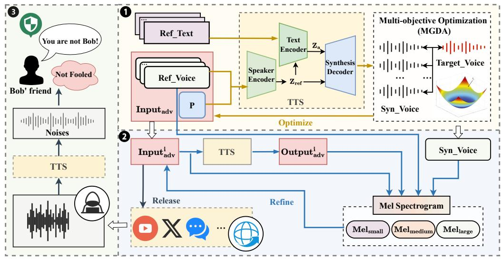
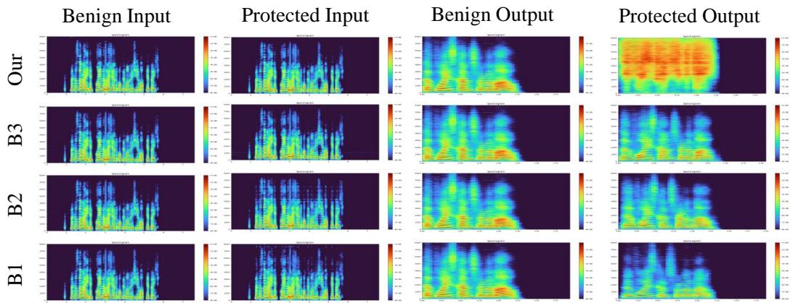
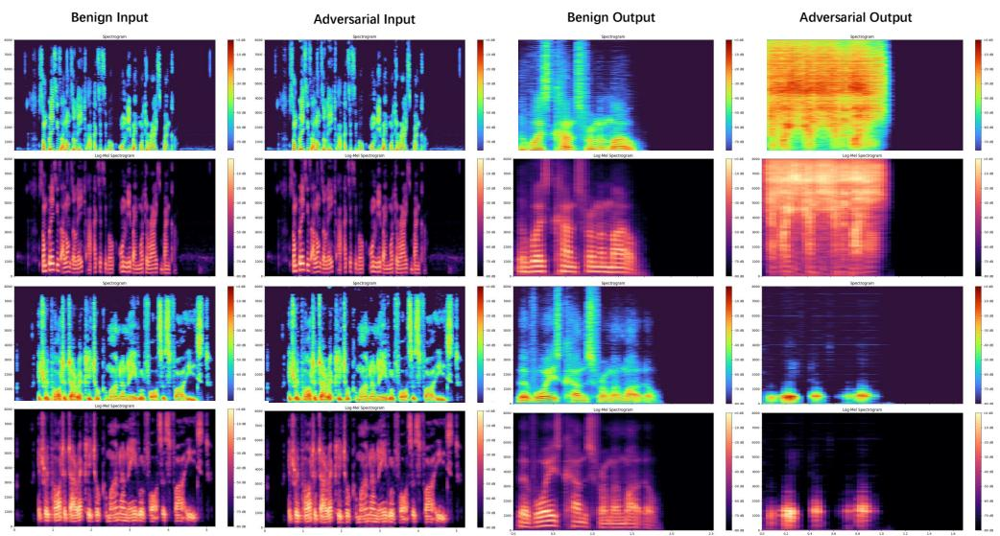
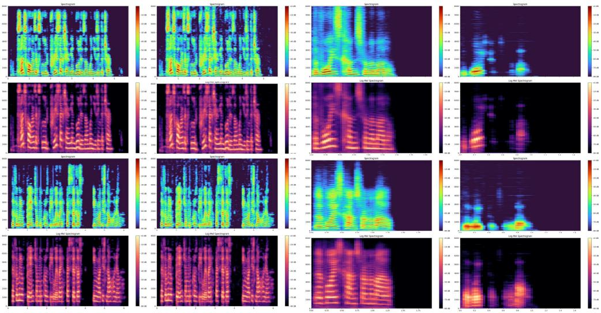

# CloneShield: A Framework for Universal Perturbation Against Zero-Shot Voice Cloning

Renyuan Li† Zhibo Liang†

Haichuan Zhang Tianyu Shi† Zhiyuan Cheng

Jia Shi

Carl Yang

Mingjie Tang† ∗

# Abstract

Recent breakthroughs in text-to-speech (TTS) voice cloning have raised serious privacy concerns, allowing highly accurate vocal identity replication from just a few seconds of reference audio, while retaining the speaker’s vocal authenticity. In this paper, we introduce CloneShield, a universal time-domain adversarial perturbation framework specifically designed to defend against zero-shot voice cloning. Our method provides protection that is robust across speakers and utterances, without requiring any prior knowledge of the synthesized text. We formulate perturbation generation as a multi-objective optimization problem, and propose Multi-Gradient Descent Algorithm (MGDA) to ensure the robust protection across diverse utterances. To preserve natural auditory perception for users, we decompose the adversarial perturbation via Mel-spectrogram representations and fine-tune it for each sample. This design ensures imperceptibility while maintaining strong degradation effects on zero-shot cloned outputs. Experiments on three state-of-the-art zero-shot TTS systems, five benchmark datasets and evaluations from 60 human listeners demonstrate that our method preserves near-original audio quality in protected inputs $( \mathrm { P E S Q } = 3 . 9 0 $ , $\mathrm { S R S } = 0 . 9 3$ ) while substantially degrading both speaker similarity and speech quality in cloned samples $( \mathrm { P E S Q } = 1 . 0 7 $ , ${ \mathrm { { S R S } } } =$ 0.08).

# 1 Introduction

Text-to-Speech (TTS) models are capable of producing natural and expressive speech by capturing essential acoustic characteristics [Jeong et al., 2021, Łajszczak et al., 2024, Li et al., 2024]. With the emergence of large-scale pre-trained generative models [Harshvardhan et al., 2020, Zeni et al., 2023, Spens and Burgess, 2024, Rombach et al., 2022], TTS systems now exhibit remarkable performance and have been widely deployed in various real-world scenarios, including customer service automation [Wang et al., 2023, Roslan and Ahmad, 2023], digital content creation, and accessibility technologies [Sun and Wang, 2024, Janokar et al., 2023]. A particularly powerful capability of modern TTS systems is zero-shot voice cloning [Dai et al., 2022, Guennec et al., 2023], which enables accurate replication of a speaker’s vocal characteristics and speaking style from just seconds of reference audio. Such advancement significantly lowers the barrier to vocal identity replication [Casanova et al., 2022, 2024, Deng et al., 2025, Tan et al., 2024]. However, the rise of voice synthesis technologies poses serious privacy and security threats. With only a few seconds of public audio, attackers can impersonate individuals for fraud or misinformation. Naturally, protecting against unauthorized voice cloning is more urgent than ever [Wang et al., 2025].

Despite recent advances in text-to-speech (TTS) and voice synthesis, existing voice protection techniques fall short in defending against zero-shot voice cloning. Although text-to-speech (TTS) and voice synthesis technologies have made significant strides, current voice protection techniques remain inadequate, especially against zero-shot voice cloning attacks. Prior approaches such as audio watermarking [Liu et al., 2023, San Roman et al., 2024], adversarial perturbations targeting ASR systems [Le et al., 2024], and defenses designed for voice conversion (VC) [Li et al., 2023, Huang et al., 2021a], either operate post-synthesis, require paired training data, or depend on prior knowledge of the input content. These assumptions break down in open-domain cloning scenarios, where attackers can clone arbitrary voices without access to transcripts or aligned corpora. Consequently, there remains a pressing need for proactive and content-agnostic protection mechanisms tailored to the zero-shot setting.

In this paper, we propose a proactive defense method that disrupts zero-shot voice cloning during the inference stage of TTS models. As shown in Figure 1, the core idea is inspired by adversarial audio techniques: By injecting carefully crafted perturbations into a group of benign speech clips, we significantly impair the quality of cloned speech while preserving the naturalness and intelligibility of the original audio for human listeners. However, crafting such perturbations is inherently challenging. At first, even when targeting a single utterance from a specific speaker, crafting an effective perturbation to resist voice cloning is non-trivial. It requires carefully injecting imperceptible noise that degrades the cloned output while preserving perceptual quality. In addition, in realistic deployment scenarios, protecting each utterance individually is inefficient and computationally expensive. Therefore, we take a step further: we aim to defend a batch of utterances from different speakers using a shared perturbation strategy. While final perturbations may still be fine-tuned per sample, they are all derived from a common base update, which introduces a much more difficult problem—ensuring consistent protection effectiveness across diverse speaker identities, speaking styles, and acoustic conditions. Second, the perturbation must remain imperceptible to human listeners, such that the protected audio is acoustically indistinguishable from the original in terms of naturalness, intelligibility, and overall quality. Naturally, introducing adversarial noise—no matter how subtle—can still degrade perceptual quality, resulting in audible artifacts or distortions. To mitigate this, we introduce a lightweight post-processing step that smooths the perturbed audio and restores fidelity without compromising its protective effect. This step helps preserve a high-quality listening experience while maintaining robustness against cloning attacks.

To address these challenges, our method introduces two key innovations. First, we employ a multiobjective optimization strategy to derive a universal perturbation across multiple samples. Second, we refine the perturbation in the perceptual-frequency domain to strike a balance between attack strength and perceptual transparency. In summary, we make the following contributions.

• We propose a framework that generates a single, imperceptible time-domain perturbation to protect a group of utterances against zero-shot voice cloning attacks. The perturbation generalizes across multiple utterances and does not require access to target texts or cloned output.   
• We formulate the generation of universal perturbations as a multi-objective optimization problem and adopt the Multi-Gradient Descent Algorithm (MGDA) to jointly optimize the perturbation across multiple audio samples, ensuring effective speaker protection while maintaining audio fidelity.   
• To further preserve the perceptual quality of protected audios, we introduce a perceptualfrequency domain refinement strategy that decomposes the perturbation for each protected utterance, enabling adaptive adjustments that preserve human listening quality while maintaining defense success.   
• We conducted extensive experiments on five benchmark datasets under three TTS models. The results show that the protected audios remain perceptually close to the original speaker (speaker recognition similarity (SRS): 0.93), while the cloned outputs exhibit significantly disrupted speaker identity (SRS: 0.08), and our defense success rate (DSR) is $1 0 0 \%$ .   
• We discuss the ethical considerations and broader societal impacts of our proposed defense, highlighting its role in promoting responsible voice AI development and privacy protection.

  
Figure 1: Overview of our CLONESHIELD framework. We inject imperceptible perturbations to disrupt the unauthorized voice replication. The system consists of ❶Universal protective perturbation generation via multi-objective optimization. ❷Perceptual-frequency domain refinement/fine-tune using mel-spectrogram decomposition. ❸Real-world deployment scenarios showcasing how the perturbation thwarts unauthorized voice replication.

# 2 Related Works

# 2.1 Text-to-Speech Models

The emergence of large language models (LLMs) has accelerated the evolution of text-to-speech systems from traditional pipeline architectures to end-to-end neural approaches, and more recently to LLM-powered zero-shot cloning systems [Naveed et al., 2023, Chang et al., 2024, Popov et al., 2021, Touvron et al., 2023a,b, Popov et al., 2021, Mehta et al., 2024]. Early neural models such as Tacotron 2 [Elias et al., 2021] and FastSpeech [Ren et al., 2020] introduced sequence-to-sequence frameworks with attention and duration prediction, significantly improving speech quality and synthesis speed. Later, VITS [Kim et al., 2021] proposed a fully end-to-end probabilistic model that integrates text encoding, duration modeling, and waveform generation into a single variational framework, enabling faster inference and more expressive speech. VITS became a foundational architecture for many subsequent TTS systems. Building on VITS, YourTTS [Casanova et al., 2022] introduced multilingual and zero-shot speaker adaptation capabilities. It demonstrated that highquality voice cloning can be achieved using just a few seconds of reference audio, without requiring speaker-specific training. YourTTS has since inspired numerous follow-up works. XTTS [Casanova et al., 2024] extended YourTTS with an autoregressive decoder, improving the naturalness and controllability of the generated speech. It supports multilingual voice cloning and is widely used in both academia and commercial platforms. Most recently, IndexTTS [Deng et al., 2025] achieved state-of-the-art performance by incorporating large language model features, FSQ-based quantization, and a conformer-based encoder. It outperforms previous models in both speaker similarity and speech quality under the zero-shot setting. These models represent the current frontier of zero-shot TTS and serve as strong benchmarks for evaluating voice cloning robustness and defenses.

Voice Replication Process. As shown in the middle area of $\bullet$ in Figure 1, the voice replication process involved three key parts of the TTS model: speaker encoder $\varepsilon _ { e n c o d e } \left( \cdot \right)$ , text encoder εcondition $( \cdot )$ , and Synthesis decoder $\varepsilon d e c o d e$ (·). We denote reference voice and reference text by $\mathrm { V } _ { r e f }$ and $\mathrm { T } _ { p t }$ , respectively. We first extract the embedding of the reference voice $\mathrm { z } _ { r e f } \ = \ \varepsilon _ { e n c o d e } \left( \mathrm { V } _ { r e f } ; \Theta _ { \varepsilon } \right)$ . $_ { \mathrm { Z } _ { r e f } }$ is used as condition to conduct alignment voice-text embedding $\mathrm { z } _ { a } = \varepsilon _ { c o n d i t i o r }$ 2 $( \mathrm { z } _ { r e f } , \mathrm { T } _ { p t } ; \dot { \Theta } _ { c t } )$ . $\Theta _ { \varepsilon }$ and $\Theta _ { c t }$ are pre-trained model parameters of speaker encoder and conditional text encoder. Then we use the decoder to synthesize the target speech: $\widehat { \mathrm { Y } } = \varepsilon _ { d e c o d e } \left( \mathrm { z } _ { a } ; \Theta _ { v } \right)$ . The decoder usually consists of a vocoder and linear layers, and $\Theta _ { v }$ denotes the parameters of the decoder.

In order to present process more intuitively, we merge the conditional encoder and decoder as synthesizer $\bar { \delta } _ { s y n t h e s i s } \left( \cdot \right)$ . The training process can be simplified as:

$$
\begin{array} { r } { \Theta _ { \delta } = \arg \operatorname* { m i n } _ { \Theta } \mathbb { E } _ { ( \mathrm { T } _ { p t } , \mathrm { V } _ { r e f } , \mathrm { V } _ { g t } ) \sim D } \mathcal { L } ( \delta _ { s y n t h e s i s } } \\ { ( \mathrm { T } _ { p t } , \varepsilon _ { e n c o d e } ( \mathrm { V } _ { r e f } ) ; \Theta ) , \mathrm { V } _ { g t } ) } \end{array}
$$

where $\Theta$ is the initial parameter of the model, $\Theta _ { \delta }$ is the parameter after training, and $\mathrm { V } _ { g t }$ is ground truth voice. We formally define the inference process of voice cloning as:

$$
\widehat { \mathrm { Y } } = \delta _ { s y n t h e s i s } \left( \varepsilon _ { e n c o d e } \left( \mathrm { V } _ { r e f } ; \Theta _ { \varepsilon } \right) , \mathrm { T } _ { p t } ; \Theta _ { \delta } \right)
$$

# 2.2 Voice Privacy Protection

Audio privacy threats arise during both training and inference stages of zero-shot voice cloning systems. During training, incorporating private data can lead to overfitting and vulnerability to backdoor attacks. This risk can be mitigated using unlearnable samples [Ye and Wang, 2024, Huang et al., 2021b], membership inference detection [Miao et al., 2019, Hu et al., 2022], or differential privacy techniques [Hassan et al., 2019].

However, inference-time threats are often more immediate and pervasive, due to the accessibility and low cost of zero-shot voice cloning. Existing inference-time defenses can be grouped into three categories: audio watermarking [Hua et al., 2016, Liu et al., 2024, Salah et al., 2024, Singh et al., 2024], adversarial perturbations targeting ASR or speaker identification [Bhanushali et al., 2024, Fang et al., 2024, Patel et al., 2025], and defenses against voice conversion (VC) [Kang, 2022, Li et al., 2023, Gao et al., 2025, Huang et al., 2021a]. While each offers partial protection, none sufficiently addresses the broad threat posed by modern zero-shot voice cloning systems. Audio Watermarking. Methods like Timbre Watermarking and AudioSeal embed imperceptible signatures into speech to support post-hoc attribution or clone detection [San Roman et al., 2024, Liu et al., 2023]. These approaches require prior watermark embedding and robustness to signal transformations, and become ineffective once unmarked audio is leaked or modified. Adversarial Perturbations for ASR and Speaker ID. Other works add perturbations to obscure identity or transcription, such as VoiceBox [Le et al., 2024]. However, these methods are often model-specific, fragile to architecture shifts or preprocessing, and can degrade perceptual quality, limiting practical deployment. VC-based defenses introduce perturbations to hinder voice conversion attacks [Li et al., 2023]. For instance, VoiceGuard uses time-domain adversarial noise guided by psychoacoustic principles to disrupt zero-shot VC. However, such defenses rely on known source-target pairs and cannot be generalized to arbitrary prompt-driven voice cloning, limiting their scope. In summary, current methods are retrospective, brittle, or narrowly scoped. Our work fills this gap by proactively perturbing raw speech to defend against zero-shot voice cloning, without assumptions about the attacker’s model or prompt.

# 3 Method

In this section, we first introduce the overall framework of perturbation-based defense against malicious speech cloning. In $\ S 3 . 2$ , we present a multi-objective optimization strategy that generates a universal perturbation by jointly considering a group of target audios. Then, we introduce a perceptual-frequency domain refinement method in $\ S 3 . 3$ that further improves the imperceptibility of the perturbation, ensuring that protected audio remains natural and indistinguishable to human listeners.

# 3.1 Perturbation-Based Voice Clone Defense Framework

We introduce CloneShield, a perturbation-based defense framework that aims to protect a group of arbitrary audio samples from unauthorized voice cloning. The core idea is to inject imperceptible yet adversarially effective perturbations into a group of utterances, such that cloned outputs generated from these modified inputs suffer substantial degradation in speaker similarity and fidelity, while preserving naturalness for human listeners.

As illustrated in $\bullet$ and $\pmb { \varrho }$ of Figure 1, CloneShield operates in two sequential stages. In the first stage, we generate a shared universal perturbation by jointly optimizing over a batch of input samples from arbitrary speakers. This perturbation is crafted using a Multi-objective optimization algorithm that balances adversarial loss signals across samples [Gunantara, 2018], enabling generalized protection without the need for per-sample computation, It not only saves a lot of calculations, but also improves the versatility of protection. In the second stage, we refine this universal perturbation on a per-sample basis within the perceptual-frequency domain. Specifically, we leverage multi-scale Mel-spectrogram representations to minimize audible distortions while reinforcing the degradation of cloned outputs. This process yields a final set of personalized perturbations that combine strong defense performance with high perceptual quality. The technical details of both optimization stages are provided in $\ S 3 . 2$ and $\ S 3 . 3$ , respectively.

# 3.2 Universal Perturbation via Multi-Objective Optimization

# Algorithm 1 Compact MGDA-based Universal Perturbation Generation

1: Input: Model $f$ , inputs $\{ x _ { i } \} _ { i = 1 } ^ { n }$ , target $y _ { \mathrm { { t a r g e t } } }$ , perturbation length $L$ , perturbation bound ϵ, max   
iterations $T$ , learning rate $\eta$   
2: Output:Universal perturbation $\delta ^ { * }$   
3: $\delta \sim \mathsf { \bar { U } } ( - \epsilon , \epsilon ) ^ { L }$ , set requires_grad $\ c =$ True {▷ Initialize perturbation}   
4: for $t = 1$ to $T$ do   
5: $\mathcal { L } = [ \mathrm { L o s s } ( f ( x _ { i } + \delta [ : | x _ { i } | ] ) , y _ { \mathrm { t a r g e t } } ) ] _ { i = 1 } ^ { n }$ {▷ Compute losses}   
6: Solve $\begin{array} { r } { \operatorname* { m i n } _ { \alpha \in \Delta _ { n } } \left\| \sum _ { i = 1 } ^ { n } \alpha _ { i } \nabla _ { \delta } \mathcal { L } _ { i } \right\| _ { 2 } ^ { 2 } . } \end{array}$ {▷ MGDA: For minimizing gradient conflict}   
7: $\begin{array} { r } { { \mathcal { L } } _ { \mathrm { t o t a l } } = \sum _ { i } \alpha _ { i } { \mathcal { L } } _ { i } } \end{array}$ {▷ Aggregate weighted loss}   
8: $\mathcal { L } _ { \mathrm { t o t a l } }$ .backward()   
9: $\delta \gets \mathrm { c l i p } ( \delta - \eta \cdot \delta . \mathrm { g r a d } , - \epsilon , \epsilon )$ {▷ Update and clip}   
10: end for   
11: return $\delta ^ { * } = \delta$

In the first stage of CloneShield, as shown in $\bullet$ of Figure 1, we aim to craft a universal perturbation $\delta$ that protects an entire group of audio clips $\{ x _ { 1 } , x _ { 2 } , . . . , x _ { n } \}$ from zero-shot voice cloning. Unlike instance-specific perturbations, this shared $\delta$ enables efficient deployment while maintaining defense effectiveness across diverse utterances. However, designing such a universal perturbation is challenging, as it must generalize across samples with varied speakers, durations, and content.

We formalize this task as a multi-objective optimization problem. For each sample $x _ { i }$ , we define a task-specific loss $\mathcal { L } _ { i }$ that encourages the cloned output $f ( { \bar { x } } _ { i } + \delta [ : | x _ { i } | ] )$ to deviate from a pre-defined cloning target $y _ { \mathrm { { t a r g e t } } }$ :

$$
{ \mathcal { L } } _ { i } ( \delta ) = \operatorname { L o s s } ( f ( x _ { i } + \delta [ : | x _ { i } | ] ) , y _ { \mathrm { t a r g e t } } ) , \quad { \mathrm { f o r ~ } } i = 1 , . . . , n .
$$

The optimization seeks a shared $\delta$ that minimizes all losses simultaneously:

$$
\operatorname* { m i n } _ { \delta } \left\{ { \mathcal { L } } _ { 1 } ( \delta ) , { \mathcal { L } } _ { 2 } ( \delta ) , . . . , { \mathcal { L } } _ { n } ( \delta ) \right\} , \quad \mathrm { s . t . } \quad \| \delta \| _ { \infty } \leq \epsilon .
$$

Solving this directly is nontrivial due to potential gradient conflicts between objectives. We adopt the Multiple Gradient Descent Algorithm (MGDA) [Désidéri, 2012] to compute a convex combination of gradients $\{ \nabla { \mathcal { L } } _ { i } \}$ that optimizes all tasks fairly. At each iteration, MGDA finds weights $\left\{ \alpha _ { i } \right\}$ such that the combined update direction $\begin{array} { r } { \sum _ { i } \alpha _ { i } \nabla \dot { \mathcal { L } } _ { i } } \end{array}$ minimizes the maximum per-task loss increase, ensuring balanced progress.

Algorithm 1 outlines the procedure. We initialize a trainable perturbation vector $\delta \sim \mathcal { U } ( - \epsilon , \epsilon ) ^ { L }$ (Line 3), where $L$ is the perturbation length aligned with the shortest audio input. In each iteration, we apply $\delta$ to each input and compute the loss vector (Line 5), then we compute MGDA weights (Line 6). The aggregated loss $\mathcal { L } _ { \mathrm { t o t a l } }$ is backpropagated to update $\delta$ (Line 8). Then we clip the perturbation and clear the gradients before the next iteration. After $T$ steps, the resulting $\delta ^ { * }$ serves as the basis for perceptual refinement in Section 3.3.

# 3.3 Mel-Spectrogram Domain Optimization for Imperceptibility

Although the universal perturbation $\delta ^ { * }$ obtained in Stage 1 successfully disrupts voice cloning, it may introduce minor artifacts that affect perceptual quality. To enhance imperceptibility without sacrificing adversarial effectiveness, we propose a second-stage refinement process that operates in the mel-spectrogram domain, which serves as a perceptual proxy aligned with human auditory sensitivity, as shown in $\pmb { \varrho }$ of Figure 1.

1: Input: TTS model $M$ , benign inp s $\{ x _ { i } \} _ { i = 1 } ^ { n }$ , adversarial inputs $\{ x _ { i } ^ { \mathrm { a d v } } \} _ { i = 1 } ^ { n }$ , steps $T$   
$\delta ^ { * }$   
3: $\delta \gets x _ { i } ^ { \mathrm { a d v } } - x _ { i }$ , set requires_grad $\ c =$ True $\{ \triangleright$ Initialize perturbation}   
4: Initialize ring buffers ref[5] $ 0$ , out $[ 5 ]  0$ {▷ Buffers for dynamic loss weighting}   
5: for $i = 1$ to $n$ do   
6: for $t = 1$ to $T$ do   
7: $c \gets t$ mod 5 {▷ Circular buffer index}   
8: $x _ { i } ^ { \mathrm { a d v } }  x _ { i } + \delta [ :$ $| x _ { i } | ]$ {▷ Update adversarial input}   
9: $\begin{array} { r } { \mathcal { L } _ { \mathrm { r e f } }  \sum _ { s \in \{ 5 1 2 , 1 0 2 4 , 2 0 4 8 \} } } \end{array}$ } $\| \mathbf { M e l } _ { s } ( x _ { i } ^ { \mathrm { a d v } } ) - \mathbf { M e l } _ { s } ( x _ { i } ) \| _ { 1 }$ {▷ Multi-scale Mel similarity}   
10: $\mathcal { L } _ { \mathrm { o u t } }  \mathrm { D i s t } ( M ( x _ { i } ^ { \mathrm { a d v } } )$ , $M ( x _ { i } ) ) \vartriangleright$ Output-level divergence   
11: if ref $[ c ] > 0$ and out $[ c ] > 0$ then   
12: $w \gets :$ Softmax $\langle \vert \mathcal { L } _ { \mathrm { r e f } } / \mathbf { r e f } [ c ]$ , $\mathcal { L } _ { \mathrm { o u t } } / \mathsf { o u t } [ c ] ] ,$ {▷ Dynamic weight adjustment}   
13: else   
14: ${ \pmb w } \gets [ 0 . 5 , 0 . 5 ]$ {▷ Equal weights at initialization}   
15: end if   
16: $( w _ { \mathrm { r e f } } , w _ { \mathrm { o u t } } )  w$ {▷ Split weight vector}   
17: $\mathcal { L }  w _ { \mathrm { r e f } } \cdot \mathcal { L } _ { \mathrm { r e f } } + w _ { \mathrm { o u t } } \cdot \mathcal { L } _ { \mathrm { o u t } }$ {▷ Weighted total loss}   
18: $\tt r e f [ c ] \gets \mathcal { L } _ { \mathrm { r e f } }$ , $\mathsf { o u t } [ c ] \gets \mathcal { L } _ { \mathrm { o u t } }$ {▷ Store current losses}   
19: end for   
20: add $\delta$ to $\delta ^ { * }$   
21: end for   
22: return $\delta ^ { * } \left\{ \right.$ Return refined perturbation list}

The key idea is to fine-tune $\delta$ such that (i) the perturbed audio remains close to the original input in perceptual space, and (ii) the synthesized outputs remain far apart to ensure continued attack efficacy. Formally, for each input $x _ { i }$ , we define two competing objectives:

• Reference loss $\mathcal { L } _ { \mathrm { r e f } }$ : the $L _ { 1 }$ distance between mel-spectrograms of $x _ { i }$ and $x _ { i } + \delta _ { i }$ , encouraging imperceptibility;   
• Output loss ${ \mathcal { L } } _ { \mathrm { o u t } }$ : the divergence between model outputs $M ( x _ { i } )$ and $M ( x _ { i } + \delta _ { i } )$ , encouraging defense success.

To capture both fine-grained temporal and coarse-grained spectral discrepancies, we adopt a multi-resolution mel-spectrogram decomposition using three Fourier transform scales with $n _ { \mathrm { { f f t } } } ~ \in$ $\{ 5 1 2 , 1 0 2 4 , 2 0 4 8 \}$ and the corresponding hop sizes. This allows the refinement process to consider perceptual similarity across multiple time-frequency granularities.

As outlined in Algorithm 2, stage 2 enhances the imperceptibility of adversarial perturbations through a multi-scale, perceptually aligned optimization process. Starting with the difference between each adversarial input and its benign counterpart (line 3), the algorithm iteratively updates this perturbation over $T$ steps for each sample. In each iteration (lines 4–19), it computes two key losses: a reference loss mathca $L *$ ref (line 9), measuring multi-resolution mel-spectrogram similarity across window sizes 512, 1024, 2048, and an output loss $\mathcal { L } \ast$ out (line 10), measuring the divergence between TTS model outputs. A dynamic weighting mechanism (lines 11–14) uses a circular buffer to adaptively balance these losses, enabling optimization that maintains speech quality while preserving adversarial effectiveness. The final refined perturbation for each input is collected in a list $\delta ^ { * }$ (lines 20) and returned for deployment.

# 4 Evaluation

We evaluated CLONESHIELD on three representative zero-shot TTS models and five benchmark datasets, comparing against three strong baselines. The results confirm the effectiveness (4.2), superior performance (4.3) of our method. Additional experimental results, extended analyses, ablation study, and visualizations are provided in the appendix A for completeness.

# 4.1 Experiment Setup

Model Selection. We evaluated CLONESHIELD on three state-of-the-art (SOTA) zero-shot TTS models: YourTTS [Casanova et al., 2022], XTTSv2 [Casanova et al., 2024], and IndexTTS [Deng et al., 2025]. YourTTS and XTTSv2 are among the most influential open-source models in the community, with the Coqui TTS framework receiving over 40K GitHub stars, demonstrating their widespread adoption. YourTTS builds on VITS and supports multilingual, zero-shot voice cloning. XTTSv2 improves on this with commercial-grade zero-shot performance using only 2–6 seconds of reference audio. IndexTTS is the latest SOTA architecture now, achieving highly realistic zero-shot voice synthesis and setting new benchmarks in voice fidelity and speaker similarity.

Dataset Selection. We used five widely adopted English speech datasets in our experiments. VCTK [Veaux et al., 2017], LibriSpeech ASR [Panayotov et al., 2015], LibriTTS-R [Koizumi et al., 2023], LJSpeech [Ito, 2017], and Common Voice [Ardila et al., 2019]. These datasets cover a broad range of speaker diversity, recording conditions, and sampling rates, providing a comprehensive evaluation setting for our proposed method. From each dataset, we randomly select 450 utterances, ensuring diversity in speaker identity and content. These are organized into batch configurations of 1-per-batch, 3-per-batch, and 5-per-batch, with 50 batches per setting. This setup enables a systematic study of our method’s performance under different generalization pressures. To evaluate robustness against real-world cloning scenarios, we assign distinct text prompts to each dataset. These prompts are used as target phrases during voice cloning defense scenarios, allowing us to test the perturbation effectiveness under diverse phonetic and lexical conditions.

Metric Selection. To better examine the effectiveness of CLONESHIELD, we introduce a comprehensive suite of evaluation metrics. We use Pyannote.audio model [Bredin et al., 2020] to conduct Speaker Recognition Similarity (SRS) between original data and adversarial data. Signal-to-Distortion Ratio (SDR) [Yamamoto et al., 2017] is applied for waveform distortion metric. We use Log Spectral Distance (LSD) [Swamy et al., 2020] and Mel Cepstral Distortion (MCD) [Brandt et al., 2017] as the metrics for estimating spectral similarity, to evaluate the destructiveness of adversarial data on timbre. The Perceptual Evaluation of Speech Quality (PESQ) [Martin-Donas et al., 2018] is employed to indicate naturalness of voice. Short-Time Objective Intelligibility (STOI) [Andersen et al., 2017] and Signal-to-Noise Ratio (SNR) [Peng et al., 2020] are measures of perceptual-Level sample-level clarity intelligibility. We additionally apply SpeechRecognition 3.11.0 to count Character Error Rate (CER) of inputs and synthesized results. In addition, we also introduce the defense success rate to measure CLONESHIELD’s generalizability on different speakers. We define a defense as successful if the DSR of the synthesized result falls below 0.50.

# 4.2 Effectiveness against Zero-Shot Cloning

As shown in Table 1, CLONESHIELD achieves strong protection against zero-shot voice cloning while preserving high perceptual quality on the protected inputs. Key metrics such as PESQ (up to 3.89), STOI (up to 0.977), and SDR (up to 18.75) indicate that the perturbations introduce minimal distortion, maintaining near-original naturalness and intelligibility.

In contrast, cloned outputs from these protected inputs show a substantial decline in quality: PESQ drops below 1.15, STOI falls below 0.22, and SDR becomes strongly negative (e.g., $- 2 0 . 5$ for LibriTTS-R / YourTTS), confirming the effectiveness of perturbations in degrading synthesis. These trends are consistent across all evaluated models, including YourTTS, XTTSv2, and IndexTTS. For identity leakage, the Speaker Recognition Similarity (SRS) remains above 0.9 on inputs, confirming perceptual fidelity for benign users. However, cloned outputs exhibit dramatically lower SRS scores (as low as 0.046), indicating that the synthesized voices no longer resemble the target speaker. Defense Success Rate (DSR) reaches $100 \%$ for most cases and exceeds $92 \%$ for XTTSv2 and IndexTTS, showing consistent and robust defense across architectures and datasets. To further evaluate the perceptual quality and the imperceptibility of our perturbations, we conducted Mean Opinion Score (MOS) tests. Detailed quantitative MOS results are provided in the Appendix A. In addition to numerical ratings, qualitative feedback indicated that approximately $9 5 \%$ of listeners perceived the perturbed audio as considerably close to the original audio in terms of both sound quality and timbre.

It is worth noting that these results are obtained under a challenging multi-utterance setting, where each perturbation is jointly optimized over a batch of five diverse utterances. This is more difficult than single-utterance defenses and reflects realistic deployment conditions. Additionally, due to space limits, we report three representative datasets here. Further results, including per-sample and variable-batch settings, are provided in Appendix A, and confirm the generalization capability of CLONESHIELD under different data and task scales.

Table 1: Evaluation of CLONESHIELD across three zero-shot TTS models and three benchmark datasets. We report performance on both the protected input audios (Input) and their corresponding cloned outputs (Output). Input metrics evaluate audio quality preservation (e.g., PESQ, STOI, SNR), while output metrics reflect cloning disruption effectiveness (e.g., increased CER, decreased speaker similarity). All results are averaged over batches of 5 utterances, representing a challenging and realistic defense scenario. CER1 is the word error rate of the original input/output, and CER2 is the word error rate of the protected input/output. A downward arrow indicates that the lower the indicator, the better the audio quality.   

<table><tr><td>Model</td><td>Dataset</td><td>Type Input</td><td>CER1↓</td><td>CER2↓ 0.157</td><td>MCD↓ 3.261</td><td>PESQ↑ 3.710</td><td>STOI↑</td><td>SDR↑</td><td>LSD↓</td><td>SNR↑</td><td>SRS</td><td>DSR</td></tr><tr><td rowspan="6">YourTTS [Casanova et al., 2022]</td><td colspan="10">Common Voice [Ardila et al., 2019]</td><td>9.952</td><td>0.914 0.053</td><td>0.000</td></tr><tr><td></td><td>Output</td><td>0.053</td><td>0.839</td><td>20.341</td><td>1.113</td><td>0.117</td><td>-16.224</td><td>6.280</td><td>-2.790</td><td></td><td></td><td>1.000</td></tr><tr><td>LibriSpeech ASR [Panayotov etal.,2015]</td><td>Input</td><td>0.057</td><td>0.060</td><td>3.097</td><td>3.899</td><td>0.976</td><td>18.031</td><td></td><td>0.906</td><td>10.070</td><td>0.926</td><td>0.000</td></tr><tr><td></td><td>Output</td><td>0.068</td><td>0.853</td><td>20.004</td><td>1.074</td><td>0.165</td><td>-20.572</td><td></td><td>8.095</td><td>-2.297</td><td>0.079</td><td>1.000</td></tr><tr><td>LibriTTS-R[Koizumi etal.,3]</td><td>Input Output</td><td>0.039 0.012</td><td>0.042 0.834</td><td>3.344 21.197</td><td>3.816 1.143</td><td>0.977 0.122</td><td>17.882 -20.496</td><td></td><td>2.343 8.211</td><td>10.540 -2.398</td><td>0.924 0.046</td><td>0.000 1.000</td></tr><tr><td colspan="10"></td><td colspan="3"></td></tr><tr><td rowspan="4">XTTSv2 [Casanova et al., 2024]</td><td colspan="10">Common Voice</td><td></td><td></td><td></td></tr><tr><td>Input</td><td>0.131</td><td>0.183</td><td>2.094</td><td></td><td>2.494</td><td>0.962</td><td>17.237</td><td>4.114</td><td>15.546</td><td>0.878</td><td></td><td>0.000</td></tr><tr><td>Output</td><td></td><td>0.161 0.223</td><td></td><td>19.676</td><td>1.132</td><td>0.199</td><td>-17.193</td><td>7.022</td><td></td><td>-2.369</td><td>0.255</td><td>0.953</td></tr><tr><td>Input Output</td><td></td><td>0.056 0.066 0.148</td><td>0.203 19.944</td><td>2.432</td><td>2.504 1.122</td><td>0.955 0.224</td><td>16.610 -17.044</td><td>2.375 6.216</td><td></td><td>14.742</td><td>0.870</td><td>0.000</td></tr><tr><td colspan="10">LibriSpeech ASR</td><td colspan="10">-2.652</td></tr><tr><td rowspan="6"></td><td colspan="10">LibriTTS-R</td><td></td><td></td><td>0.258 0.903</td><td>0.960</td></tr><tr><td>Input</td><td></td><td>0.038</td><td>0.043</td><td>2.475</td><td>2.688</td><td>0.967 0.200</td><td>16.844</td><td></td><td>2.079</td><td>14.988</td><td></td><td>0.000</td><td></td></tr><tr><td></td><td>Output</td><td>0.046</td><td>0.191</td><td>20.416</td><td>1.059</td><td></td><td></td><td>-16.984</td><td>6.153</td><td>-2.890</td><td></td><td>0.237</td><td>0.927</td></tr><tr><td>Input</td><td></td><td>0.138</td><td>0.269</td><td>2.297</td><td>2.448</td><td></td><td>0.952</td><td>16.489</td><td>4.335</td><td></td><td>15.123</td><td>0.815</td><td>0.000</td></tr><tr><td>Output</td><td></td><td>0.007</td><td>0.172</td><td>19.310</td><td>1.191</td><td></td><td>0.169</td><td>-17.909</td><td>4.698</td><td></td><td>-3.387</td><td>0.332</td><td>0.848</td></tr><tr><td></td><td>Input</td><td>0.058 0.001</td><td>0.089 0.161</td><td>2.530 14.287</td><td>2.491 1.083</td><td></td><td>0.944 0.248</td><td>16.238 -15.137</td><td>2.317 2.823</td><td>14.504 -3.988</td><td></td><td>0.795</td><td>0.020</td></tr><tr><td colspan="10"></td><td colspan="10"></td></tr><tr><td rowspan="4">IndexTTS</td><td colspan="10">LibriSpeech ASR LibriTTS-R</td><td></td><td></td><td></td><td></td><td>0.793</td></tr><tr><td></td><td>Output</td><td>0.039</td><td>0.060</td><td>2.537</td><td>2.761</td><td></td><td></td><td></td><td>1.296</td><td></td><td>14.816</td><td>0.379 0.837</td><td>0.000</td></tr><tr><td></td><td>Input Output</td><td>0.001</td><td>0.148</td><td>18.138</td><td></td><td></td><td>0.959 0.264</td><td>16.546 -14.187</td><td>2.589</td><td></td><td>-6.512</td><td>0.288</td><td></td></tr><tr><td></td><td></td><td></td><td></td><td></td><td>1.057</td><td></td><td></td><td></td><td></td><td></td><td></td><td></td><td>0.860</td></tr></table>

# 4.3 Comparison with Existing Defense Baselines

As shown in Table 2, Overall, our method achieves the best tradeoff between imperceptibility and defense robustness. On the input side, CLONESHIELD maintains high audio quality and intelligibility, with PESQ, STOI, and SDR scores close to or exceeding those of the original input. Compared to watermarking approaches, which leave cloned outputs relatively unaffected, our method significantly degrades the TTS outputs. For example, on XTTSv2, our defense increases MCD to 19.88 and reduces STOI to 0.205, while AudioSeal and Timbre Watermarking remain below MCD 15 and above STOI 0.25.

On the output side, CLONESHIELD consistently lowers Speaker Recognition Similarity (SRS), outperforming both adversarial and watermark-based baselines. Our method reduces SRS to as low as 0.053 and achieves $100 \%$ defense success rate (DSR) for YourTTS, with strong performance maintained on other models. In contrast, AudioSeal and Timbre Watermarking fail to alter speaker identity features, resulting in zero DSR.

It is worth noting that when our method is compared with these three baselines, the quality of the protected input is on par with these three baselines, but the defense results are indeed far better. The visual comparison of the audio sample spectrogram is shown in Figure 2. Additional breakdowns by dataset and other batch configurations are provided in Appendix A.

# 5 Ethics and Policy Discussion

# 5.1 Ethics and Policy Needs for AI Development.

Currently, CLONESHIELD achieves strong performance when tailored to individual TTS models. However, the fragmented architectures and proprietary nature of many large-scale voice synthesis systems limit the generalizability of defenses. A scalable solution requires support from TTS model providers to expose standardized defensive hooks—such as embedding-space APIs or modular encoder access—enabling unified, model-agnostic protection mechanisms. These interfaces could allow privacy-preserving perturbations to be generated without accessing internal synthesis pipelines, thereby facilitating secure, interoperable defenses without compromising model confidentiality. Realizing this vision requires policy coordination and active collaboration among AI developers, platform maintainers, and regulators.

Table 2: Comparison of CLONESHIELD with three representative baselines: VoiceBox [Le et al., 2024], AudioSeal [San Roman et al., 2024], and Timbre Watermarking [Liu et al., 2023], evaluated under three TTS models. For each method, we report the impact on protected inputs (In) and the effectiveness of defense on cloned outputs (Out). CER1 and CER2 is the same meaning of above table. A downward arrow indicates that the lower the indicator, the better the audio quality.   

<table><tr><td>Model</td><td>Method</td><td>Type</td><td>CER1↓</td><td>CER2↓</td><td>MCD↓</td><td>PESQ↑</td><td>STOI↑</td><td>SDR↑</td><td>LSD↓</td><td>SNR↑</td><td>SRS</td><td>DSR</td></tr><tr><td rowspan="6">YourTTS</td><td>Voicebox [Le et al.,2024]</td><td>In Out</td><td>0.142 0.045</td><td>0.232 0.055</td><td>2.357 14.068</td><td>3.685 1.153</td><td>0.940 0.224</td><td>13.331 -14.727</td><td>5.200 2.695</td><td>12.771 -3.111</td><td>0.636 0.539</td><td>0.067 0.333</td></tr><tr><td>AudioSeal [San Roman et al.,2024]</td><td>I</td><td>0.129</td><td>0.141</td><td>0.514</td><td>4.318</td><td>0.998</td><td>29.076</td><td>5.255</td><td>28.375</td><td>0.999</td><td>0.000</td></tr><tr><td></td><td>Out</td><td>0.045 0.129</td><td>0.040 0.155</td><td>10.842 0.803</td><td>1.246 3.673</td><td>0.395 0.994</td><td>-9.580 31.242</td><td>1.763 2.283</td><td>-2.828 30.782</td><td>0.751 0.973</td><td>0.000 0.000</td></tr><tr><td>Timbre Watermarking[Liu etal.,023]</td><td>In Out</td><td>0.045</td><td>0.076</td><td>11.257</td><td>1.187</td><td>0.375</td><td>-10.294</td><td>1.914</td><td>-2.967</td><td>0.722</td><td>0.000</td></tr><tr><td>Ours</td><td>In Out</td><td>0.132 0.045</td><td>0.193 0.733</td><td>4.061 18.003</td><td>3.407 1.103</td><td>0.967 0.130</td><td>18.310 -17.134</td><td>5.226 5.568</td><td>7.536 -1.793</td><td>0.878 0.053</td><td>0.000 1.000</td></tr><tr><td rowspan="6">XTTSv2</td><td>Voicebox</td><td>In Out</td><td>0.142 0.063</td><td>0.232 0.095</td><td>2.357 13.937</td><td>3.685 1.166</td><td>0.940 0.258</td><td>13.331 -13.723</td><td>5.200 3.448</td><td>12.771 -2.788</td><td>0.636 0.547</td><td>0.067 0.267</td></tr><tr><td>AudioSeal</td><td>In</td><td>0.129</td><td>0.141</td><td>0.514</td><td>4.318</td><td>0.998</td><td>29.076</td><td>5.255</td><td>28.375</td><td>0.999</td><td>0.000</td></tr><tr><td>Timbre Watermarking</td><td>Out In</td><td>0.046 0.129</td><td>0.070 0.155</td><td>15.444 0.803</td><td>1.172 3.673</td><td>0.251 0.994</td><td>-14.959 31.242</td><td>3.720 2.283</td><td>-2.880 30.782</td><td>0.752 0.973</td><td>0.000 0.000</td></tr><tr><td rowspan="2">Ours</td><td rowspan="2">Out In</td><td>0.055</td><td>0.110</td><td>14.831</td><td>1.132</td><td>0.256</td><td>-14.116</td><td>3.416</td><td>-3.083</td><td>0.730</td><td>0.000</td></tr><tr><td>0.136 0.101</td><td>0.169 0.189</td><td>2.302 19.884</td><td>2.438 1.084</td><td>0.960 0.205</td><td>16.826 -17.717</td><td>4.802</td><td>15.575</td><td>0.868</td><td>0.000</td></tr><tr><td colspan="10">Voicebox</td><td></td></tr><tr><td rowspan="6">IndexTTS</td><td colspan="10"></td><td>7.318</td><td></td><td>1.000</td></tr><tr><td colspan="10"></td><td></td><td></td><td>0.202</td></tr><tr><td colspan="10"></td><td></td></tr><tr><td colspan="10"></td><td></td></tr><tr><td colspan="10"></td><td></td></tr><tr><td colspan="10"></td></tr><tr><td colspan="10"></td></tr><tr><td colspan="10"></td><td></td><td></td><td>-2.200</td><td></td></tr><tr><td colspan="10"></td><td></td><td></td><td></td><td></td></tr><tr><td colspan="10"></td><td>13.331 5.200</td><td>12.771</td><td>0.636</td><td>0.067</td></tr><tr><td colspan="10"></td><td>-13.086</td><td></td><td></td><td></td></tr><tr><td colspan="10">AudioSeal</td><td>2.542</td><td>-3.386</td><td></td><td></td></tr><tr><td colspan="10"></td><td></td><td></td><td>0.592</td><td></td></tr><tr><td colspan="10"></td><td></td><td></td><td></td><td></td></tr><tr><td colspan="10"></td><td></td><td></td><td></td><td></td></tr><tr><td colspan="10"></td><td></td><td>28.375</td><td>0.999</td><td>0.000 0.000</td></tr><tr><td colspan="10">Timbre Watermarking</td><td>29.076 -13.365 2.895</td><td></td><td></td><td></td></tr><tr><td colspan="10"></td><td></td><td></td><td></td><td></td></tr><tr><td colspan="10"></td><td></td><td></td><td></td><td></td></tr><tr><td colspan="10"></td><td></td><td></td><td></td><td></td></tr><tr><td colspan="10"></td><td></td><td></td><td></td><td></td></tr><tr><td colspan="10"></td><td>5.255</td><td></td><td></td><td></td></tr><tr><td colspan="10"></td><td></td><td></td><td></td><td></td></tr><tr><td colspan="10"></td><td></td><td></td><td></td><td></td></tr><tr><td colspan="10"></td><td></td><td></td><td></td><td></td></tr><tr><td colspan="10"></td><td></td><td></td><td></td><td></td></tr><tr><td colspan="10"></td><td></td><td></td><td></td><td></td></tr><tr><td colspan="10"></td><td></td><td></td><td></td><td></td></tr><tr><td colspan="10"></td><td></td><td></td><td></td><td>0.233</td></tr><tr><td colspan="10"></td><td></td><td></td><td></td><td></td></tr><tr><td colspan="10"></td><td></td><td></td><td></td><td></td></tr><tr><td colspan="10"></td><td></td><td></td><td></td><td></td></tr><tr><td colspan="10"></td><td></td><td></td><td></td><td></td></tr><tr><td colspan="10"></td><td></td><td></td><td></td><td></td></table>

  
Figure 2: We selected an audio sample for spectrogram visualization. B1, B2, and B3 represent three baseline methods: VoiceBox, AudioSeal, and Timbre Watermarking, respectively. It can be observed that our method introduces almost no perceptible difference between the protected and original audio. In contrast, the substantial discrepancy between the output of our method and the attacked output highlights the effectiveness of our defense.

# 5.2 Lightweight Encoder-Level Perturbations for Real-World Adoption

Deploying full pipeline-level defenses across diverse TTS models can introduce significant engineering burden and concerns over system access. To balance protection and practicality, we propose an alternative encoder-only defense strategy. Rather than intervening in the complete text-to-speech path, this strategy selectively introduces perturbations that influence the encoder’s intermediate speaker representations. It reduces integration overhead (from the full $\left. \Theta _ { \varepsilon } , \Theta _ { \delta } \right.$ pipeline to encoder-only $\Theta _ { \varepsilon }$ access) and avoids dependency on synthesized text, making it more feasible for real-world deployments. While this may incur a slight trade-off in defense strength, it aligns better with privacypreserving objectives and modular deployment constraints. Future work can further explore hybrid frameworks that enable scalable, cross-model, and ethically aligned voice protection.

# 6 Conclusion

In this paper, we present CLONESHIELD, a proactive and generalizable defense framework designed to protect speaker identities against zero-shot voice cloning. Experiments on multiple state-of-the-art TTS systems and datasets demonstrate that CLONESHIELD maintains naturalness and intelligibility in protected speech while significantly degrading the effectiveness of cloned outputs. We hope this work encourages further exploration into privacy-preserving voice technologies that empower individuals to retain control over their vocal identity. The main limitation of this work is twofold: (1) testing is conducted primarily on publicly available zero-shot TTS models, and (2) evaluations are limited to offline cloning scenarios without considering real-time or few-shot attacks, both of which remain for future research.

# References

Asger Heidemann Andersen, Jan Mark de Haan, Zheng-Hua Tan, and Jesper Jensen. A non-intrusive short-time objective intelligibility measure. In 2017 IEEE International Conference on Acoustics, Speech and Signal Processing (ICASSP), pages 5085–5089. IEEE, 2017.

Rosana Ardila, Megan Branson, Kelly Davis, Michael Henretty, Michael Kohler, Josh Meyer, Reuben Morais, Lindsay Saunders, Francis M Tyers, and Gregor Weber. Common voice: A massively-multilingual speech corpus. arXiv preprint arXiv:1912.06670, 2019.

Kaito Baba, Wataru Nakata, Yuki Saito, and Hiroshi Saruwatari. The t05 system for the voicemos challenge 2024: Transfer learning from deep image classifier to naturalness mos prediction of high-quality synthetic speech. In 2024 IEEE Spoken Language Technology Workshop (SLT), pages 818–824. IEEE, 2024.

Amisha Rajnikant Bhanushali, Hyunjun Mun, and Joobeom Yun. Adversarial attacks on automatic speech recognition (asr): A survey. IEEE Access, 2024.

Erika Brandt, Frank Zimmerer, Bistra Andreeva, and Bernd Möbius. Mel-cepstral distortion of german vowels in different information density contexts. In Interspeech, pages 2993–2997, 2017.

Hervé Bredin. pyannote. audio 2.1 speaker diarization pipeline: principle, benchmark, and recipe. In 24th INTERSPEECH Conference (INTERSPEECH 2023), pages 1983–1987. ISCA, 2023.

Hervé Bredin, Ruiqing Yin, Juan Manuel Coria, Gregory Gelly, Pavel Korshunov, Marvin Lavechin, Diego Fustes, Hadrien Titeux, Wassim Bouaziz, and Marie-Philippe Gill. Pyannote. audio: neural building blocks for speaker diarization. In ICASSP 2020-2020 IEEE International Conference on Acoustics, Speech and Signal Processing (ICASSP), pages 7124–7128. IEEE, 2020.

Edresson Casanova, Julian Weber, Christopher D Shulby, Arnaldo Candido Junior, Eren Gölge, and Moacir A Ponti. Yourtts: Towards zero-shot multi-speaker tts and zero-shot voice conversion for everyone. In International Conference on Machine Learning, pages 2709–2720. PMLR, 2022.

Edresson Casanova, Kelly Davis, Eren Gölge, Görkem Göknar, Iulian Gulea, Logan Hart, Aya Aljafari, Joshua Meyer, Reuben Morais, Samuel Olayemi, et al. Xtts: a massively multilingual zero-shot text-to-speech model. arXiv preprint arXiv:2406.04904, 2024.

Milos Cernak and Milan Rusko. An evaluation of synthetic speech using the pesq measure. In Proc. European Congress on Acoustics, pages 2725–2728, 2005.

Yupeng Chang, Xu Wang, Jindong Wang, Yuan Wu, Linyi Yang, Kaijie Zhu, Hao Chen, Xiaoyuan Yi, Cunxiang Wang, Yidong Wang, et al. A survey on evaluation of large language models. ACM Transactions on Intelligent Systems and Technology, 15(3):1–45, 2024.

Qi Chen, Mingkui Tan, Yuankai Qi, Jiaqiu Zhou, Yuanqing Li, and Qi Wu. V2c: Visual voice cloning. In Proceedings of the IEEE/CVF Conference on Computer Vision and Pattern Recognition (CVPR), pages 21242–21251, June 2022.

Dongyang Dai, Yuanzhe Chen, Li Chen, Ming Tu, Lu Liu, Rui Xia, Qiao Tian, Yuping Wang, and Yuxuan Wang. Cloning one’s voice using very limited data in the wild. In ICASSP 2022-2022 IEEE International Conference on Acoustics, Speech and Signal Processing (ICASSP), pages 8322–8326. IEEE, 2022.

Wei Deng, Siyi Zhou, Jingchen Shu, Jinchao Wang, and Lu Wang. Indextts: An industrial-level controllable and efficient zero-shot text-to-speech system. arXiv preprint arXiv:2502.05512, 2025.

Jean-Antoine Désidéri. Multiple-gradient descent algorithm (mgda) for multiobjective optimization. Comptes Rendus Mathematique, 350(5-6):313–318, 2012.

Isaac Elias, Heiga Zen, Jonathan Shen, Yu Zhang, Ye Jia, RJ Skerry-Ryan, and Yonghui Wu. Parallel tacotron 2: A non-autoregressive neural tts model with differentiable duration modeling. arXiv preprint arXiv:2103.14574, 2021.

Zheng Fang, Tao Wang, Lingchen Zhao, Shenyi Zhang, Bowen Li, Yunjie Ge, Qi Li, Chao Shen, and Qian Wang. Zero-query adversarial attack on black-box automatic speech recognition systems. In Proceedings of the 2024 on ACM SIGSAC Conference on Computer and Communications Security, pages 630–644, 2024.

Jie Gao, Haiyun Li, Zhisheng Zhang, and Zhiyong Wu. Black-box adversarial defense against voice conversion using latent space perturbation. In ICASSP 2025-2025 IEEE International Conference on Acoustics, Speech and Signal Processing (ICASSP), pages 1–5. IEEE, 2025.

Augustine H. Gray and John D. Markel. Distance measures for speech processing. IEEE Transactions on Acoustics, Speech, and Signal Processing, 24(5):380–391, oct 1976. doi: 10.1109/TASSP.1976.1162849.

David Guennec, Lily Wadoux, Aghilas Sini, Nelly Barbot, and Damien Lolive. Voice cloning: Training speaker selection with limited multi-speaker corpus. In 12th ISCA Speech Synthesis Workshop (SSW2023), pages 170–176. ISCA, 2023.

Nyoman Gunantara. A review of multi-objective optimization: Methods and its applications. Cogent Engineering, 5(1):1502242, 2018.

GM Harshvardhan, Mahendra Kumar Gourisaria, Manjusha Pandey, and Siddharth Swarup Rautaray. A comprehensive survey and analysis of generative models in machine learning. Computer Science Review, 38: 100285, 2020.

Muneeb Ul Hassan, Mubashir Husain Rehmani, and Jinjun Chen. Differential privacy techniques for cyber physical systems: A survey. IEEE Communications Surveys & Tutorials, 22(1):746–789, 2019.

Hongsheng Hu, Zoran Salcic, Lichao Sun, Gillian Dobbie, Philip S Yu, and Xuyun Zhang. Membership inference attacks on machine learning: A survey. ACM Computing Surveys (CSUR), 54(11s):1–37, 2022.

Guang Hua, Jiwu Huang, Yun Q Shi, Jonathan Goh, and Vrizlynn LL Thing. Twenty years of digital audio watermarking—a comprehensive review. Signal processing, 128:222–242, 2016.

Chien-yu Huang, Yist Y Lin, Hung-yi Lee, and Lin-shan Lee. Defending your voice: Adversarial attack on voice conversion. In 2021 IEEE Spoken Language Technology Workshop (SLT), pages 552–559. IEEE, 2021a.

Hanxun Huang, Xingjun Ma, Sarah Monazam Erfani, James Bailey, and Yisen Wang. Unlearnable examples: Making personal data unexploitable. arXiv preprint arXiv:2101.04898, 2021b.

Keith Ito. The lj speech dataset, 2017. URL https://keithito.com/LJ-Speech-Dataset/.

Sagar Janokar, Soham Ratnaparkhi, Manas Rathi, and Alkesh Rathod. Text-to-speech and speech-to-text converter—voice assistant. In Inventive Systems and Control: Proceedings of ICISC 2023, pages 653–664. Springer, 2023.

Myeonghun Jeong, Hyeongju Kim, Sung Jun Cheon, Byoung Jin Choi, and Nam Soo Kim. Diff-tts: A denoising diffusion model for text-to-speech. arXiv preprint arXiv:2104.01409, 2021.

Wonjune Kang. Speaker anonymization using end-to-end zero-shot voice conversion. PhD thesis, Massachusetts Institute of Technology, 2022.

Jaehyeon Kim, Jungil Kong, and Juhee Son. Conditional variational autoencoder with adversarial learning for end-to-end text-to-speech. In International Conference on Machine Learning, pages 5530–5540. PMLR, 2021.

Yuma Koizumi, Heiga Zen, Shigeki Karita, Yifan Ding, Kohei Yatabe, Nobuyuki Morioka, Michiel Bacchiani, Yu Zhang, Wei Han, and Ankur Bapna. Libritts-r: A restored multi-speaker text-to-speech corpus. arXiv preprint arXiv:2305.18802, 2023.

Mateusz Łajszczak, Guillermo Cámbara, Yang Li, Fatih Beyhan, Arent van Korlaar, Fan Yang, Arnaud Joly, Álvaro Martín-Cortinas, Ammar Abbas, Adam Michalski, et al. Base tts: Lessons from building a billionparameter text-to-speech model on 100k hours of data. arXiv preprint arXiv:2402.08093, 2024.

Matthew Le, Apoorv Vyas, Bowen Shi, Brian Karrer, Leda Sari, Rashel Moritz, Mary Williamson, Vimal Manohar, Yossi Adi, Jay Mahadeokar, et al. Voicebox: Text-guided multilingual universal speech generation at scale. Advances in neural information processing systems, 36, 2024.

Jingyang Li, Dengpan Ye, Long Tang, Chuanxi Chen, and Shengshan Hu. Voice guard: Protecting voice privacy with strong and imperceptible adversarial perturbation in the time domain. In IJCAI, pages 4812–4820, 2023.

Yinghao Aaron Li, Cong Han, Vinay Raghavan, Gavin Mischler, and Nima Mesgarani. Styletts 2: Towards human-level text-to-speech through style diffusion and adversarial training with large speech language models. Advances in Neural Information Processing Systems, 36, 2024.

Chang Liu, Jie Zhang, Tianwei Zhang, Xi Yang, Weiming Zhang, and Nenghai Yu. Detecting voice cloning attacks via timbre watermarking. arXiv preprint arXiv:2312.03410, 2023.

Hongbin Liu, Moyang Guo, Zhengyuan Jiang, Lun Wang, and Neil Gong. Audiomarkbench: Benchmarking robustness of audio watermarking. Advances in Neural Information Processing Systems, 37:52241–52265, 2024.

Juan Manuel Martin-Donas, Angel Manuel Gomez, Jose A Gonzalez, and Antonio M Peinado. A deep learning loss function based on the perceptual evaluation of the speech quality. IEEE Signal processing letters, 25(11): 1680–1684, 2018.

Shivam Mehta, Ruibo Tu, Jonas Beskow, Éva Székely, and Gustav Eje Henter. Matcha-tts: A fast tts architecture with conditional flow matching. In ICASSP 2024-2024 IEEE International Conference on Acoustics, Speech and Signal Processing (ICASSP), pages 11341–11345. IEEE, 2024.

Yuantian Miao, Minhui Xue, Chao Chen, Lei Pan, Jun Zhang, Benjamin Zi Hao Zhao, Dali Kaafar, and Yang Xiang. The audio auditor: user-level membership inference in internet of things voice services. arXiv preprint arXiv:1905.07082, 2019.

Humza Naveed, Asad Ullah Khan, Shi Qiu, Muhammad Saqib, Saeed Anwar, Muhammad Usman, Naveed Akhtar, Nick Barnes, and Ajmal Mian. A comprehensive overview of large language models. arXiv preprint arXiv:2307.06435, 2023.

Alan V. Oppenheim, Ronald W. Schafer, and John R. Buck. Discrete-Time Signal Processing. Prentice Hall, 2nd edition, 1999.

Vassil Panayotov, Guoguo Chen, Daniel Povey, and Sanjeev Khudanpur. Librispeech: an asr corpus based on public domain audio books. In 2015 IEEE international conference on acoustics, speech and signal processing (ICASSP), pages 5206–5210. IEEE, 2015.

Umang Patel, Avik Hati, and Shruti Bhilare. Black-box adversarial defense for enhancing robustness in speaker recognition systems with multimodel consensus. In Seventeenth International Conference on Machine Vision (ICMV 2024), volume 13517, pages 449–456. SPIE, 2025.

Yan Peng, Chenjun Shi, Yiming Zhu, Min Gu, and Songlin Zhuang. Terahertz spectroscopy in biomedical field: a review on signal-to-noise ratio improvement. PhotoniX, 1:1–18, 2020.

Alexis Plaquet and Hervé Bredin. Powerset multi-class cross entropy loss for neural speaker diarization. arXiv preprint arXiv:2310.13025, 2023.

Vadim Popov, Ivan Vovk, Vladimir Gogoryan, Tasnima Sadekova, and Mikhail Kudinov. Grad-tts: A diffusion probabilistic model for text-to-speech. In International Conference on Machine Learning, pages 8599–8608. PMLR, 2021.

Daniel Povey, Arnab Ghoshal, Gilles Boulianne, Lukáš Burget, Ondˇrej Glembek, Nagendra Goel, Mirko Hannemann, Petr Motlícek, Yanmin Qian, Petr Schwarz, Jan Silovský, Georg Stemmer, and Karel Veselý. ˇ The Kaldi Speech Recognition Toolkit. In IEEE 2011 Workshop on Automatic Speech Recognition and Understanding, pages 1–8, dec 2011. Although this paper appears in ASRU 2011 proceedings, the actual content matches the widely circulated Kaldi white paper. The exact page numbers in official proceedings can vary or might not be conventionally cited for this specific paper; it’s often cited as a general toolkit description.

Colin Raffel, Brian McFee, Eric J. Humphrey, Justin Salamon, Oriol Nieto, Dawen Liang, and Daniel P. W. Ellis. mir_eval: A Transparent Implementation of Common MIR Metrics. In Proceedings of the 15th International Society for Music Information Retrieval Conference (ISMIR 2014), pages 367–372, Taipei, Taiwan, 2014.

Yi Ren, Chenxu Hu, Xu Tan, Tao Qin, Sheng Zhao, Zhou Zhao, and Tie-Yan Liu. Fastspeech 2: Fast and high-quality end-to-end text to speech. arXiv preprint arXiv:2006.04558, 2020.

Robin Rombach, Andreas Blattmann, Dominik Lorenz, Patrick Esser, and Björn Ommer. High-resolution image synthesis with latent diffusion models. In Proceedings of the IEEE/CVF conference on computer vision and pattern recognition, pages 10684–10695, 2022.

Fatin Aqilah Binti Mohamad Roslan and Norliza Binti Ahmad. The rise of ai-powered voice assistants: Analyzing their transformative impact on modern customer service paradigms and consumer expectations. Quarterly Journal of Emerging Technologies and Innovations, 8(3):33–64, 2023.

Euschi Salah, Zermi Narima, Amine Khaldi, and Kafi Med Redouane. Survey of imperceptible and robust digital audio watermarking systems. Multimedia Tools and Applications, pages 1–47, 2024.

Robin San Roman, Pierre Fernandez, Hady Elsahar, Alexandre Défossez, Teddy Furon, and Tuan Tran. Proactive detection of voice cloning with localized watermarking. In International Conference on Machine Learning, volume 235, 2024.

International Telecommunication Union. Telecommunication Standardization Sector. Methods for subjective determination of transmission quality. International Telecommunication Union, 1996.

Mayank Kumar Singh, Naoya Takahashi, Weihsiang Liao, and Yuki Mitsufuji. Silentcipher: Deep audio watermarking. arXiv preprint arXiv, 2406:03822, 2024.   
Eleanor Spens and Neil Burgess. A generative model of memory construction and consolidation. Nature human behaviour, 8(3):526–543, 2024.   
Xiyang Sun and Zhuo Wang. Intelligent english automatic translation system based on tts technology. In 2024 3rd International Conference on Artificial Intelligence and Autonomous Robot Systems (AIARS), pages 687–692. IEEE, 2024.   
K Ayyappa Swamy, Samuda Prathima, N Padmaja, and C Sushma. Dual threshold log spectral distance voice activity detector based effective statistical speech enhancement. International Journal of Advanced Science and Technology, 29(03):5640–5653, 2020.   
Cees H Taal, Richard C Hendriks, Richard Heusdens, and Jesper Jensen. An algorithm for intelligibility prediction of time–frequency weighted noisy speech. IEEE Transactions on audio, speech, and language processing, 19(7):2125–2136, 2011.   
Xu Tan, Jiawei Chen, Haohe Liu, Jian Cong, Chen Zhang, Yanqing Liu, Xi Wang, Yichong Leng, Yuanhao Yi, Lei He, et al. Naturalspeech: End-to-end text-to-speech synthesis with human-level quality. IEEE Transactions on Pattern Analysis and Machine Intelligence, 2024.   
Hugo Touvron, Thibaut Lavril, Gautier Izacard, Xavier Martinet, Marie-Anne Lachaux, Timothée Lacroix, Baptiste Rozière, Naman Goyal, Eric Hambro, Faisal Azhar, et al. Llama: Open and efficient foundation language models. arXiv preprint arXiv:2302.13971, 2023a.   
Hugo Touvron, Louis Martin, Kevin Stone, Peter Albert, Amjad Almahairi, Yasmine Babaei, Nikolay Bashlykov, Soumya Batra, Prajjwal Bhargava, Shruti Bhosale, et al. Llama 2: Open foundation and fine-tuned chat models. arXiv preprint arXiv:2307.09288, 2023b.   
Christophe Veaux, Junichi Yamagishi, and Kirsten MacDonald. CSTR VCTK Corpus: English Multi-speaker Corpus for CSTR Voice Cloning Toolkit [sound], 2017. URL https://doi.org/10.7488/ds/1994.   
Kun Wang, Meng Chen, Li Lu, Jingwen Feng, Qianniu Chen, Zhongjie Ba, Kui Ren, and Chun Chen. From one stolen utterance: Assessing the risks of voice cloning in the aigc era. In 2025 IEEE Symposium on Security and Privacy $( S P )$ , pages 4277–4295. IEEE Computer Society, 2025.   
Lingli Wang, Ni Huang, Yili Hong, Luning Liu, Xunhua Guo, and Guoqing Chen. Voice-based ai in call center customer service: A natural field experiment. Production and Operations Management, 32(4):1002–1018, 2023.   
Katsuhiko Yamamoto, Toshio Irino, Toshie Matsui, Shoko Araki, Keisuke Kinoshita, and Tomohiro Nakatani. Predicting speech intelligibility using a gammachirp envelope distortion index based on the signal-to-distortion ratio. In INTERSPEECH, pages 2949–2953, 2017.   
Jingwen Ye and Xinchao Wang. Ungeneralizable examples. In Proceedings of the IEEE/CVF Conference on Computer Vision and Pattern Recognition, pages 11944–11953, 2024.   
Claudio Zeni, Robert Pinsler, Daniel Zügner, Andrew Fowler, Matthew Horton, Xiang Fu, Sasha Shysheya, Jonathan Crabbé, Lixin Sun, Jake Smith, et al. Mattergen: a generative model for inorganic materials design. arXiv preprint arXiv:2312.03687, 2023.

# A Appendix

# A.1 Experimental Setup

Defense setting In the initial experimental phase, adversarial perturbations were initialized as tensors, with their elements uniformly sampled from the interval $[ - 0 . 1 , 0 . 1 ]$ . Throughout the iterative defense process, the $L _ { \infty }$ norm of the generated perturbations was constrained to a maximum of 0.15. For defenses conducted on three distinct models, the number of iterations was consistently set to 60.

In the second stage of the defense, we set different initial coefficients for the loss. For YourTTS, the initial coefficients for the reference loss and output loss were set to [7/200] and [1/600], respectively. For XTTSv2, the initial coefficients for the reference loss and output loss were set to [1/100] and [3/1000], respectively. For IndexTTS, we set the coefficients for the reference loss and output loss to [3/25] and [13/100], respectively.we also set different saving strategies for different models. For YourTTS, we directly saved the noise after 300 iterations. For XTTSv2, we set a threshold for the reference loss at 1.65 and then saved the result that achieved the minimum output loss among those iterations where the reference loss was below this threshold. For IndexTTS, we saved the result with the minimum output loss from the final thirty iterations. For these second-stage defense experiments on all three models, the number of iterations was set to 60. Additionally, a uniform initial learning rate of 0.001 was applied across all three models. The learning rate was managed by an identical StepLR (Step Learning Rate) scheduler for these experiments, configured to reduce the learning rate by a factor of 0.7 every 30 steps . For the computation of the loss on the Mel spectrogram representation of the input audio, we utilized three distinct configurations for the transformation. These configurations were designed to capture features at different resolutions. Subsequent to generating the Mel spectrograms with each configuration—which inherently represent spectral power—these were converted into a decibel (dB) scaled representation. This conversion employed a value of 80.0 to effectively manage the dynamic range, yielding the features upon which the loss was computed. The configurations are detailed as follows:

Large Mel Spectrogram Configuration This transform employed a Fast Fourier Transform (FFT) window size of 2048 points, with a hop length of 512 samples between successive frames. The number of Mel filterbanks was set to 80.

Small Mel Spectrogram Configuration For this setting, while maintaining the same number of 80 Mel filterbanks, the FFT window size was reduced to 512 points, and the hop length was set to 128 samples.

Medium Mel Spectrogram Configuration The medium configuration used $8 0 \ \mathrm { M e l }$ filterbanks. The FFT window size was further reduced to 1024 points, with a corresponding hop length of 256 samples. These varying parameters for FFT window size and hop length allow for the analysis of the audio signal at different time-frequency resolutions, which can be beneficial for robust loss calculation.

# A.2 Comprehensive experimental results

Ablation Study for Varying Perturbation Magnitudes In the initial phase of our experiments, we conducted an ablation study to assess the impact of varying perturbation magnitudes. The corresponding results are presented below. These findings led to the selection of 0.15 as the final perturbation magnitude for subsequent experiments.Based on an empirical evaluation of various perturbation strengths, as detailed in Table 3, we selected a perturbation strength of $\epsilon = 0 . 1 5$ for our primary experiments. This value was determined to strike an optimal balance between maintaining the quality of the perturbed input audio and achieving the desired level of content and speaker identity obfuscation in the subsequent Text-to-Speech (TTS) output. Specifically, at the $\epsilon = 0 . 1 5$ strength, the perturbed input audio (designated as Type ’in’ in Table3) consistently demonstrated higher perceptual quality and fidelity compared to inputs generated with other tested strengths. For instance, across different batch configurations, inputs at $\epsilon = 0 . 1 5$ generally exhibited higher PESQ scores (approx. 4.17–4.26), higher SRS values (approx. 0.954–0.957) indicating better preservation of the original speaker’s characteristics in the perturbed input, and lower MCD values (approx. 3.1–3.5) suggesting less spectral distortion relative to a clean signal baseline. These metrics collectively indicate minimal perceptible difference introduced at the input stage at this perturbation level. Concurrently, the TTS outputs generated from these $\epsilon = 0 . 1 5$ perturbed inputs (designated as Type ’out’) achieved a highly effective degree of obfuscation. This was evidenced by substantially degraded output quality metrics (e.g. $\mathrm { P E S Q } \approx 1 . 0 7 – 1 . 0 9$ ) and, critically, significantly lower SRS scores (approx. 0.269–0.289). These low output SRS values signify a strong deviation from the original speaker identity, thereby fulfilling our content protection objectives. This level of output modification was comparable to, or in some aspects such as output SRS, more effective than that achieved with other perturbation strengths, especially when considering the superior quality and lower perceptibility of the perturbation at the $\epsilon = 0 . 1 5$ input stage. Thus, $\epsilon = 0 . 1 5$ was chosen for its ability to deliver effective output transformation while minimizing alterations to the input audio. Further examination of the TTS output characteristics (designated as Type ’out’ in Table 3) when the input audio is perturbed at the $\epsilon = 0 . 1 5$ strength reinforces this selection as optimal. The primary goal for the output is effective content and speaker identity obfuscation. At $\epsilon = 0 . 1 5$ , metrics assessing the synthesized speech demonstrate a profound transformation. For instance, PESQ scores for the output are consistently low (approx. 1.07–1.09 across batch configurations at $\epsilon = 0 . 1 5$ ), and STOI values are substantially negative (approx. -16 to -14), both indicating significant degradation in perceptual quality and intelligibility, which is a desired outcome for the defense. More critically, the speaker recognition similarity (SRS) for these outputs at $\epsilon = 0 . 1 5$ is markedly low (ranging from approximately 0.269 to 0.289). This is comparable to, and in several configurations, lower (i.e., better for obfuscation) than the output SRS values achieved at other perturbation strengths (e.g., average SRS for $\epsilon = 0 . 1$ ’out’ is $\approx 0 . 3 0$ ; for $\epsilon = 0 . 3$ ’out’ is $\approx 0 . 2 9$ ; for $\epsilon = 0 . 5$ ’out’ is $\approx 0 . 2 9 ,$ ). This demonstrates a highly effective scrambling of the original speaker’s vocal characteristics. While all tested perturbation strengths lead to substantially altered outputs, the $\epsilon = 0 . 1 5$ level achieves this strong defensive posture for the output with a compellingly low degree of alteration to the input audio itself. This combination solidifies $\epsilon = 0 . 1 5$ as the perturbation strength that provides the most advantageous trade-off for robust content protection.

Ablation Study for Second Optimization Stage Furthermore, we conducted an ablation study to investigate the impact of the second optimization stage on the characteristics of the adversarial perturbations. As detailed in Table 4 and Table 5, the results indicate that the inclusion of this second stage significantly enhances both the imperceptibility of the perturbations and their defense effectiveness against the target TTS model.

# A.3 Subjective audio evaluation

# A.3.1 Evaluation of Perceptual Quality using Mean Opinion Score (MOS)

To assess the perceptual quality of audio signals in our study, we employ the Mean Opinion Score (MOS). MOS is a widely recognized and standardized subjective measure that quantifies the humanperceived quality of speech and audio[Sector, 1996]. It relies on human listeners to rate the quality of test samples. These ratings are typically provided on a five-point Absolute Category Rating (ACR) scale. The final MOS for a given audio sample or condition is then calculated as the arithmetic mean of the scores assigned by the panel of listeners. If $S _ { k }$ represents the score given by the $k$ -th listener for a particular audio sample, and there are $N$ listeners in total, the MOS is calculated as:

$$
\mathsf { M O S } = \frac { 1 } { N } \sum _ { k = 1 } ^ { N } S _ { k }
$$

This metric provides a direct and intuitive measure of subjective quality. In this work, we comprehensively evaluate perceptual quality by employing both traditional subjective MOS listening tests with human participants and objective quality estimations derived from the advanced DNN-based audio predictor, UTMOSv2[Baba et al., 2024]. The specific experimental settings for each of these evaluation methodologies are detailed in the subsequent sections.

Participants and Listening Environment Sixty participants $\left( \mathrm { N } { = } 6 0 \right)$ ), primarily undergraduate and graduate students from the Computer Science Department at our university, were recruited for this study. All participants reported normal hearing. Prior to the main experiment, each participant listened to a short English audio segment from a blog to ensure adequate comprehension of the language used in the test stimuli, as our source audio content was in English. The listening tests were conducted in a professional recording studio on the university campus, providing a controlled acoustic environment with minimal ambient noise $( < 3 0$ dBA). Participants used high-quality, noise-canceling headphones Sony WH-1000XM5 for audio playback, with volume levels calibrated to a comfortable and consistent listening level across all sessions.

Table 3: Evaluation Metrics under Various Perturbation Settings, $\epsilon$ is the bound of perturbation   

<table><tr><td>Batch</td><td>Type</td><td>MCD</td><td>PESQ</td><td>STOI</td><td>SDR</td><td>LSD</td><td>SNR</td><td>SRS</td></tr><tr><td colspan="9">∈= 0.1</td></tr><tr><td>1 per batch</td><td>in out</td><td>3.851 14.722</td><td>2.974 1.110</td><td>0.964 0.235</td><td>10.925 -14.086</td><td>2.426 4.794</td><td>7.619 -4.773</td><td>0.897 0.336</td></tr><tr><td>3 per batch</td><td>in out</td><td>3.999 15.786</td><td>3.156 1.105</td><td>0.969 0.134</td><td>11.934 -16.171</td><td>2.360 5.490</td><td>7.789 -4.563</td><td>0.902 0.279</td></tr><tr><td>5 per batch</td><td>in out</td><td>3.640 15.329</td><td>3.087 1.079</td><td>0.969 0.166</td><td>11.667 -14.994</td><td>2.392 5.559</td><td>8.180 -4.863</td><td>0.899 0.284</td></tr><tr><td colspan="9">∈= 0.15</td></tr><tr><td>1 per batch</td><td>in out</td><td>3.324 15.978</td><td>4.202 1.091</td><td>0.987 0.153</td><td>18.376 -14.957</td><td>2.382 4.832</td><td>10.449 -5.290</td><td>0.957 0.289</td></tr><tr><td>3 per batch</td><td>in out</td><td>3.502 15.890</td><td>4.259 1.066</td><td>0.990 0.127</td><td>19.392 -15.578</td><td>2.323 5.380</td><td>9.924 -4.760</td><td>0.956 0.269</td></tr><tr><td>5 per batch</td><td>in out</td><td>3.143 15.499</td><td>4.174 1.072</td><td>0.989 0.172</td><td>19.071 -14.386</td><td>2.349 5.504</td><td>10.650 -5.004</td><td>0.954 0.275</td></tr><tr><td colspan="9">e = 0.3</td></tr><tr><td>1 per batch</td><td>in out</td><td>3.853 14.993 3.995</td><td>2.941 1.102 3.158</td><td>0.963 0.218 0.969</td><td>10.877 -13.756 11.949</td><td>2.426 4.870 2.359</td><td>7.614 -4.853 7.811</td><td>0.892 0.339 0.903</td></tr><tr><td>3 per batch</td><td>in out in</td><td>15.765 3.666</td><td>1.076 3.053</td><td>0.123 0.968</td><td>-15.233 11.647</td><td>5.702 2.393</td><td>-4.627 8.163</td><td>0.267 0.900</td></tr><tr><td>5 per batch</td><td>out</td><td>15.346</td><td>1.083</td><td>0.173 e= 0.5</td><td>-14.858</td><td>5.735</td><td>-4.954</td><td>0.270</td></tr><tr><td colspan="9">3.881 2.947 0.962 10.896</td></tr><tr><td>1 per batch</td><td>out in</td><td>15.903 4.007</td><td>1.117 3.155</td><td>0.147 0.969</td><td>-14.280 11.922</td><td>5.348 2.360</td><td>-4.822 7.788</td><td>0.335 0.901</td></tr><tr><td>3 per batch</td><td>out</td><td>15.633</td><td>1.076</td><td>0.152</td><td>-15.235</td><td>5.447</td><td>-4.599</td><td>0.272</td></tr><tr><td>5 per batch</td><td>in out</td><td>3.652 15.514</td><td>3.054 1.094</td><td>0.969 0.158</td><td>11.660 -15.161</td><td>2.393 5.555</td><td>8.179 -4.974</td><td>0.899 0.271</td></tr></table>

Table 4: Comparison of Evaluation Metrics Before Stage2 under Different Datasets, Word Error Rate(WER)   

<table><tr><td>Dataset</td><td>Batch</td><td>Type</td><td>WER</td><td>CER Before Stage2</td><td>MCD</td><td>PESQ</td><td>STOI</td><td>SDR</td><td>LSD</td><td>SNR</td><td>SRS</td></tr><tr><td colspan="10"></td></tr><tr><td rowspan="4">LibriSpeech</td><td>1 per batch</td><td>in out</td><td>0.226 0.250</td><td>0.073 0.109</td><td>1.602 5.686</td><td>2.045 1.071</td><td>0.962 0.207</td><td>18.573 -16.109</td><td>1.132 3.844</td><td>16.534 -0.013</td><td>0.726 0.347</td></tr><tr><td>3 per batch</td><td>in out</td><td>0.669 0.175</td><td>0.608 0.090</td><td>2.621 5.149</td><td>2.289 1.100</td><td>0.969 0.171</td><td>19.094 -15.958</td><td>1.087 2.519</td><td>12.031 -0.057</td><td>0.805 0.501</td></tr><tr><td>5 per batch</td><td>in out</td><td>0.436 0.118</td><td>0.328 0.057</td><td>3.262 4.560</td><td>2.344 1.108</td><td>0.972 0.193</td><td>19.620 -14.881</td><td>1.099 2.920</td><td>10.624 -0.094</td><td>0.807 0.569</td></tr><tr><td>1 per batch</td><td>in out</td><td>0.393 0.033</td><td>0.212 0.019</td><td>1.948 16.692</td><td>1.643 1.083</td><td>0.949 0.189</td><td>18.366 -15.802</td><td>5.683 2.927</td><td>16.512 -0.024</td><td>0.624 0.439</td></tr><tr><td rowspan="2">CommonVoice</td><td>3 per batch</td><td>in out</td><td>0.315 0.053</td><td>0.160 0.022</td><td>2.913 16.695</td><td>1.680 1.122</td><td>0.948 0.167</td><td>18.445 -16.489</td><td>5.296 2.609</td><td>11.044 -0.093</td><td>0.664 0.591</td></tr><tr><td>5 per batch</td><td>in out</td><td>0.375 0.012</td><td>0.201 0.005</td><td>3.344 16.587</td><td>1.709 1.112</td><td>0.955 0.184</td><td>18.594 -15.742</td><td>5.299 2.884</td><td>9.176 -0.157</td><td>0.686 0.642</td></tr><tr><td rowspan="2">LibriTTS</td><td>1 per batch</td><td>in out</td><td>0.179 0.028</td><td>0.056 0.013</td><td>1.971 15.598</td><td>2.088 1.050</td><td>0.970 0.194</td><td>18.523 -15.117</td><td>2.535 3.020</td><td>16.351 -0.008</td><td>0.720 0.357</td></tr><tr><td>3 per batch</td><td>in out</td><td>0.144 0.073 0.152</td><td>0.043 0.042 0.049</td><td>2.827 15.036</td><td>2.137 1.062</td><td>0.973 0.164</td><td>18.982 -15.917</td><td>2.480 2.694</td><td>12.433 -0.059</td><td>0.765 0.523</td></tr><tr><td rowspan="2">VCTK</td><td>5 per batch</td><td>in out</td><td>0.011 0.119</td><td>0.008 0.040</td><td>3.632 14.636</td><td>2.215 1.070 1.715</td><td>0.975 0.183 0.901</td><td>19.002 -15.107</td><td>2.601 2.458</td><td>9.538 -0.100</td><td>0.784 0.566</td></tr><tr><td>1 per batch</td><td>in out</td><td>0.020 0.107</td><td>0.004 0.040</td><td>1.504 14.402 2.762</td><td>1.087 1.804</td><td>0.232 0.904</td><td>18.219 -18.191 18.376</td><td>2.483 2.959 2.565</td><td>16.503 -0.026 9.792</td><td>0.630 0.421 0.688</td></tr><tr><td rowspan="2"></td><td>3 per batch</td><td>in out</td><td>0.027 0.115</td><td>0.008 0.045</td><td>14.296</td><td>1.085</td><td>0.218</td><td>-17.379</td><td>2.668</td><td>-0.140</td><td>0.553 0.714</td></tr><tr><td>5 per batch</td><td>in out in</td><td>0.044 0.101</td><td>0.012 0.043</td><td>3.246 14.095 2.257</td><td>1.851 1.103 1.664</td><td>0.918 0.219 0.963</td><td>18.415 -16.979 17.991</td><td>2.619 2.332 2.685</td><td>7.948 -0.161 15.155</td><td>0.585 0.665</td></tr><tr><td rowspan="2">LJSpeech</td><td>1 per batch</td><td>out in</td><td>0.006 0.110</td><td>0.002 0.054</td><td>16.996 2.596</td><td>1.072 1.812</td><td>0.202 0.970</td><td>-15.378 18.282</td><td>3.376 2.702</td><td>-0.011 13.219</td><td>0.414 0.762</td></tr><tr><td>3 per batch</td><td>out in</td><td>0.041 0.123</td><td>0.040 0.044</td><td>15.961 2.734</td><td>1.067 1.872</td><td>0.212 0.972</td><td>-15.923 18.482</td><td>2.783 2.713</td><td>-0.088 12.487</td><td>0.604 0.787</td></tr><tr><td></td><td>5 per batch</td><td>out</td><td>0.000</td><td>0.000</td><td>15.330</td><td>1.087</td><td>0.209</td><td>-15.162</td><td>2.505</td><td>-0.149</td><td>0.662</td></tr></table>

Stimuli and Experimental Design The original English speech segments used as the basis for our evaluation were randomly selected from our dataset. For the listening tests, we then focused on evaluating only the following specific versions derived from each of these selected original audio segments:

1. Original Audio (O): The unprocessed, clean speech signal (referred to as the "original dataset" sample).   
2. Audio Perturbed by Our Method (P-Ours): Audio signals with imperceptible perturbations added by our proposed adversarial perturbation method (referred to as the "input of our method").   
3. TTS Synthesized Speech from Original Audio (TTS-O): Speech synthesized by the target Text-to-Speech (TTS) model using the Original Audio as input (referred to as the "model’s original output").   
4. TTS Synthesized Speech from Our Perturbed Audio (TTS-P-Ours): Speech synthesized by the target Text-to-Speech (TTS) model using the audio perturbed by our method (P-Ours) as input (referred to as the "model’s output using our method’s input").

Table 5: Comparison of Evaluation Metrics After Stage2 under Different Datasets   

<table><tr><td>Dataset</td><td>Batch</td><td>Type</td><td>WER</td><td>CER</td><td>MCD</td><td>PESQ</td><td>STOI</td><td>SDR</td><td>LSD</td><td>SNR</td><td>SRS</td></tr><tr><td colspan="10"></td></tr><tr><td rowspan="3">LibriSpeech</td><td>1 per batch</td><td>in out</td><td>0.220 1.108</td><td>0.069 0.850</td><td>After Stage2 3.177 18.480</td><td>3.624 1.123</td><td>0.968 0.145</td><td>17.026 -21.977</td><td>0.933 8.587</td><td>10.037 -0.789</td><td>0.909 0.074</td></tr><tr><td>3 per batch</td><td>in out</td><td>0.211 1.093</td><td>0.063 0.803</td><td>2.948 20.145</td><td>3.887 1.078</td><td>0.975 0.169</td><td>18.013 -20.310</td><td>0.933 8.098</td><td>10.854 -2.344</td><td>0.923 0.076</td></tr><tr><td>5 per batch</td><td>in out</td><td>0.214 1.144</td><td>0.067 0.823</td><td>3.163 20.033</td><td>3.912 1.081</td><td>0.976 0.166</td><td>18.205 -20.150</td><td>0.945 8.034</td><td>10.205 -2.483</td><td>0.927 0.078</td></tr><tr><td rowspan="3">CommonVoice</td><td>1 per batch</td><td>in out</td><td>0.376 0.947</td><td>0.210 1.043</td><td>3.692 17.932</td><td>3.430 1.132</td><td>0.967 0.127</td><td>18.348 -18.444</td><td>5.011 5.700</td><td>8.751 -1.808</td><td>0.880 0.050</td></tr><tr><td>3 per batch</td><td>in out</td><td>0.321 1.150</td><td>0.174 0.971</td><td>3.228 20.129</td><td>3.644 1.106</td><td>0.972 0.126</td><td>18.638 -16.798</td><td>4.577 6.235</td><td>10.105 -2.618</td><td>0.906 0.055</td></tr><tr><td>5 per batch</td><td>in out</td><td>0.346 1.010</td><td>0.175 0.860</td><td>3.382 20.390</td><td>3.711 1.129</td><td>0.974 0.119</td><td>18.811 -16.534</td><td>4.501 6.244</td><td>9.679 -2.794</td><td>0.914 0.056</td></tr><tr><td rowspan="3">LibriTTS</td><td>1 per batch</td><td>in out</td><td>0.177 1.008</td><td>0.058 0.861</td><td>3.864 19.488</td><td>3.654 1.210</td><td>0.970 0.119</td><td>17.077 -22.413</td><td>2.328 8.875</td><td>9.506 -1.139</td><td>0.905 0.036</td></tr><tr><td> 3 per batch</td><td>in out</td><td>0.141 1.056</td><td>0.042 0.821</td><td>3.591 20.760</td><td>3.820 1.215</td><td>0.976 0.136</td><td>17.821 -19.885</td><td>2.321 8.249</td><td>9.878 -2.205</td><td>0.917 0.039</td></tr><tr><td>5 per batch</td><td>in out</td><td>0.152 1.034</td><td>0.047 0.813</td><td>3.458 21.213</td><td>3.821 1.136</td><td>0.977 0.128</td><td>17.872 -20.386</td><td>2.373 8.210</td><td>10.287 -2.388</td><td>0.924 0.041</td></tr><tr><td rowspan="3">VCTK</td><td>1 per batch</td><td>in out</td><td>0.105 1.288</td><td>0.034 0.945</td><td>2.586 17.497</td><td>3.530 1.188</td><td>0.937 0.122</td><td>17.187 -22.881</td><td>2.325 8.093</td><td>10.540 -1.855</td><td>0.863 0.055</td></tr><tr><td>3 per batch</td><td>in out</td><td>0.104 0.289</td><td>0.037 0.132</td><td>2.380 13.986</td><td>4.179 1.115</td><td>0.965 0.228</td><td>18.561 -14.565</td><td>2.314 4.726</td><td>10.535 -4.664</td><td>0.946 0.483</td></tr><tr><td>5 per batch</td><td>in out</td><td>0.116 1.154</td><td>0.047 0.851</td><td>2.721 19.429</td><td>3.902 1.138</td><td>0.953 0.182</td><td>17.701 -17.119</td><td>2.323 7.662</td><td>9.703 -4.117</td><td>0.913 0.050</td></tr><tr><td rowspan="3">LJSpeech</td><td>1 per batch</td><td>in out</td><td>0.106 0.988</td><td>0.045 0.648</td><td>3.596 18.912</td><td>3.292 1.123</td><td>0.971 0.110</td><td>17.779 -18.361</td><td>2.629 8.274</td><td>10.006 -0.323</td><td>0.893 0.011</td></tr><tr><td> 3 per batch</td><td>in out</td><td>0.115 0.899</td><td>0.054 0.558</td><td>3.693 20.455</td><td>3.589 1.105</td><td>0.979 0.159</td><td>18.554 -18.511</td><td>2.665 7.416</td><td>9.490 -1.999</td><td>0.924 0.040 0.928</td></tr><tr><td>5 per batch</td><td>in out</td><td>0.119 0.924</td><td>0.043 0.558</td><td>3.574 20.949</td><td>3.702 1.112</td><td>0.981 0.166</td><td>18.957 -17.952</td><td>2.661 7.063</td><td>9.823 -2.712</td><td>0.045</td></tr></table>

Participants were presented with these stimuli in a randomized order to mitigate context and order effects. For each participant, 10 distinct sets, each containing these four types of audio samples derived from an original segment, were evaluated to ensure a comprehensive assessment.

Rating Procedure and Data Analysis Participants were tasked with evaluating the overall audio quality of each presented stimulus. Prior to commencing the evaluation, all participants received detailed instructions on the rating procedure and the 5-point Absolute Category Rating (ACR) Mean Opinion Score (MOS) scale, which is a classic international standard ITU-T P.800. The scale was explicitly defined as follows:

• 5: Excellent • 4: Good • 3: Fair • 2: Poor • 1: Bad

Listeners provided their rating for each audio sample immediately after its presentation. Specifically, this procedure was applied to assess the following two categories of stimuli:

1. The original unprocessed audio (O) and the audio perturbed by our proposed method (P-Ours).

2. The TTS synthesized speech outputs generated from the original audio (TTS-O) and from the audio perturbed by our method (TTS-P-Ours).

For each of these four conditions (O, P-Ours, TTS-O, TTS-P-Ours), Mean Opinion Scores (MOS) were calculated by averaging the scores from all participants. We also computed the $9 5 \%$ confidence intervals for these mean scores to indicate the precision of the subjective ratings. The $9 5 \%$ confidence interval (CI) for a mean MOS score is calculated using the formula:

$$
\mathbf { C I } = \left[ { \overline { { \mathbf { M O S } } } } - 1 . 9 6 \times { \frac { \sigma } { \sqrt { N } } } , { \overline { { \mathbf { M O S } } } } + 1 . 9 6 \times { \frac { \sigma } { \sqrt { N } } } \right]
$$

where $\mathrm { \overline { { M O S } } }$ is the calculated sample mean MOS, $\sigma$ is the standard deviation of the scores from the participants, and $N$ is the number of participants (in this case, $\Nu { = } 6 0$ ).The results are in Table 6

Table 6: Mean Opinion Scores (MOS) with $9 5 \%$ Confidence Intervals $\left( \mathrm { N } { = } 6 0 \right)$ )   

<table><tr><td>Evaluation Target</td><td>MOS Mean</td><td>95% CI Range</td></tr><tr><td>0</td><td>3.10</td><td>(2.94, 3.26)</td></tr><tr><td>P-Ours</td><td>2.80</td><td>(2.62,2.98)</td></tr><tr><td>TTS-P-Ours</td><td>0.20</td><td>(0.09, 0.31)</td></tr><tr><td>TTS-O</td><td>3.05</td><td>(2.88, 3.22)</td></tr></table>

# A.3.2 Objective MOS Prediction with UTMOSv2

For objective evaluation of speech synthesis quality, we employed UTMOSv2, an advanced Mean Opinion Score (MOS) prediction system specifically designed for assessing the naturalness of highquality synthetic speech[Baba et al., 2024]. UTMOSv2 adopts a sophisticated approach by combining features from diverse sources. It leverages a pretrained Self-Supervised Learning (SSL) model (wav2vec 2.0) to extract speech representations and, distinctively, incorporates a pretrained deep image classifier (EfficientNetV2) to capture subtle differences in speech spectrograms. These SSLbased and spectrogram-based features are then integrated through a feature fusion mechanism and a multi-stage fine-tuning strategy to optimize MOS prediction accuracy.

The performance of UTMOSv2 has been rigorously evaluated in competitive benchmarks. Notably, in the VoiceMOS Challenge 2024 Track 1, which focused on predicting MOS for high-quality synthetic speech, particularly in "zoomed-in" listening test scenarios, the UTMOSv2 system demonstrated state-of-the-art results. It achieved first place in 7 out of the 16 official evaluation metrics and secured second place in the remaining 9 metrics[Baba et al., 2024]. This top-tier performance was reported to be significantly better than systems ranked third or lower, underscoring its effectiveness (Abstract and Section 1 of[Baba et al., 2024]. Further ablation studies within the original work confirmed that the fusion of spectrogram and SSL features was crucial for improving correlationbased evaluation metrics with human judgments (Section 4.4.2 of[Baba et al., 2024]). This strong empirical performance highlights UTMOSv2’s capability to provide reliable and accurate objective MOS predictions, making it a valuable tool for automated assessment in demanding speech synthesis evaluation contexts. The results calculated using UTMOSv2 are in Table 7.

# A.4 Audio objective index details

Objective Evaluation Metrics To comprehensively assess the impact of our proposed method on audio signals, we employed a suite of objective metrics targeting various aspects of speech: content intelligibility, audio quality/distortion, and speaker identity.

Word Error Rate (WER) and Character Error Rate (CER) WER and CER are standard metrics for evaluating the accuracy of Automatic Speech Recognition (ASR) systems[Povey et al., 2011]. They quantify the discrepancies between the reference transcript and the ASR hypothesis; lower scores indicate better intelligibility and content preservation. Both metrics are derived from the Levenshtein distance, computed as the sum of substitutions (S), deletions (D), and insertions (I) required to transform the hypothesis into the reference, normalized by the total number of words $( N _ { W } )$ or characters $( N _ { C } )$ in the reference transcript:

$$
\mathrm { W E R } = { \frac { S _ { W } + D _ { W } + I _ { W } } { N _ { W } } }
$$

Table 7: Detailed UTMOS Scores for Various Systems and Conditions (30 Samples and Average)   

<table><tr><td></td><td colspan="2">Benign</td><td colspan="2">Voicebox</td><td colspan="2">AudioSeal</td><td colspan="2">Timbre Watermarking</td><td colspan="2">Ours</td></tr><tr><td>Sample #</td><td>In</td><td>Out</td><td>In</td><td>Out</td><td>In</td><td>Out</td><td>In</td><td>Out</td><td>In</td><td>Out</td></tr><tr><td>1</td><td>3.1309</td><td>2.7070</td><td>2.4590</td><td>1.9697</td><td>2.5527</td><td>2.3281</td><td>3.0996</td><td>2.2813</td><td>2.0078</td><td>0.5103</td></tr><tr><td>2</td><td>3.2324</td><td>2.0313</td><td>3.1855</td><td>1.9219</td><td>3.4648</td><td>2.3477</td><td>3.5723</td><td>2.0527</td><td>2.0898</td><td>0.4543</td></tr><tr><td>3</td><td>2.2188</td><td>2.6836</td><td>1.8242</td><td>2.0020</td><td>2.3906</td><td>2.8516</td><td>2.8301</td><td>2.0098</td><td>1.7217</td><td>0.5298</td></tr><tr><td>4</td><td>1.6387</td><td>1.6963</td><td>1.4473</td><td>3.2559</td><td>2.2793</td><td>1.9219</td><td>1.7021</td><td>1.9795</td><td>1.7002</td><td>0.4333</td></tr><tr><td>5</td><td>2.5410</td><td>3.0078</td><td>2.3027</td><td>2.1426</td><td>3.0840</td><td>2.6094</td><td>2.8711</td><td>2.6406</td><td>1.7227</td><td>0.5425</td></tr><tr><td>6</td><td>2.7012</td><td>2.4355</td><td>1.7695</td><td>2.7012</td><td>2.1641</td><td>2.4727</td><td>1.9678</td><td>2.2129</td><td>1.9844</td><td>0.0186</td></tr><tr><td>7</td><td>3.3184</td><td>2.7285</td><td>3.3008</td><td>2.4238</td><td>3.3633</td><td>2.8125</td><td>3.0625</td><td>2.7461</td><td>3.1289</td><td>0.4353</td></tr><tr><td>8</td><td>2.3496</td><td>2.8047</td><td>2.1504</td><td>2.3066</td><td>1.9785</td><td>2.1621</td><td>2.1895</td><td>2.3223</td><td>1.9766</td><td>0.0666</td></tr><tr><td>9</td><td>2.9453</td><td>3.4473</td><td>3.1680</td><td>2.6602</td><td>3.1602</td><td>2.7324</td><td>3.1426</td><td>2.9668</td><td>2.6387</td><td>0.4346</td></tr><tr><td>10</td><td>1.3076</td><td>2.6348</td><td>1.7002</td><td>2.4766</td><td>1.2803</td><td>2.2520</td><td>1.9932</td><td>2.0430</td><td>1.6904</td><td>0.5586</td></tr><tr><td>11</td><td>2.2910</td><td>2.7930</td><td>2.1211</td><td>2.8281</td><td>2.1738</td><td>2.5039</td><td>2.2715</td><td>2.4707</td><td>1.8047</td><td>0.1163</td></tr><tr><td>12</td><td>3.1191</td><td>3.3438</td><td>2.6445</td><td>2.0664</td><td>2.7461</td><td>2.7910</td><td>2.8203</td><td>2.8691</td><td>2.2227</td><td>0.1260</td></tr><tr><td>13</td><td>1.8994</td><td>2.3145</td><td>1.7402</td><td>2.5547</td><td>2.4043</td><td>2.4141</td><td>2.3262</td><td>2.7109</td><td>1.6416</td><td>0.5601</td></tr><tr><td>14</td><td>2.6211</td><td>2.9785</td><td>2.4648</td><td>2.3750</td><td>2.6992</td><td>2.6992</td><td>2.2734</td><td>3.2969</td><td>1.9883</td><td>0.2944</td></tr><tr><td>15</td><td>2.8027</td><td>1.9189</td><td>2.2656</td><td>2.4336</td><td>2.3984</td><td>2.5742</td><td>2.6055</td><td>2.5234</td><td>1.9395</td><td>0.1857</td></tr><tr><td>16</td><td>2.2891</td><td>2.3242</td><td>2.5645</td><td>2.2656</td><td>2.8184</td><td>2.6816</td><td>2.4668</td><td>2.2578</td><td>2.0781</td><td>0.0252</td></tr><tr><td>17</td><td>1.7793</td><td>2.7090</td><td>1.4453</td><td>2.9824</td><td>2.0605</td><td>2.5313</td><td>1.4375</td><td>2.8672</td><td>1.5117</td><td>0.5352</td></tr><tr><td>18</td><td>1.9355</td><td>3.0195</td><td>1.4268</td><td>2.0117</td><td>2.3203</td><td>2.8086</td><td>2.1387</td><td>2.7988</td><td>1.8770</td><td>0.5444</td></tr><tr><td>19</td><td>3.0898</td><td>2.2109</td><td>3.0918</td><td>2.5664</td><td>2.9785</td><td>2.9688</td><td>2.9316</td><td>1.8281</td><td>2.4316</td><td>0.2620</td></tr><tr><td>20</td><td>2.9863</td><td>2.9297</td><td>2.9551</td><td>2.8359</td><td>2.9180</td><td>2.8438</td><td>1.8447</td><td>1.7783</td><td>2.5742</td><td>0.1594</td></tr><tr><td>21</td><td>2.5020</td><td>2.3887</td><td>2.5410</td><td>2.3184</td><td>2.6113</td><td>2.7148</td><td>1.9766</td><td>2.2656</td><td>2.1348</td><td>-0.1055</td></tr><tr><td>22</td><td>2.8633</td><td>2.0938</td><td>3.0801</td><td>1.9854</td><td>2.8672</td><td>2.2363</td><td>2.8887</td><td>2.3340</td><td>2.0176</td><td>0.0286</td></tr><tr><td>23</td><td>2.2656</td><td>2.0742</td><td>2.5156</td><td>2.4199</td><td>1.9658</td><td>1.9033</td><td>1.8506</td><td>1.6104</td><td>2.1660</td><td>0.0836</td></tr><tr><td>24</td><td>2.2266</td><td>2.0313</td><td>2.1113</td><td>2.6387</td><td>2.2773</td><td>2.4082</td><td>1.8447</td><td>2.4531</td><td>1.9961</td><td>0.2161</td></tr><tr><td>25</td><td>2.1387</td><td>2.2148</td><td>1.4609</td><td>3.0488</td><td>1.7041</td><td>1.5215</td><td>1.8418</td><td>1.8643</td><td>1.5156</td><td>0.3398</td></tr><tr><td>26</td><td>2.1719</td><td>2.3340</td><td>1.9941</td><td>1.8926</td><td>2.2930</td><td>2.6719</td><td>1.8604</td><td>2.4688</td><td>1.9600</td><td>0.1970</td></tr><tr><td>27</td><td>2.4004</td><td>1.5137</td><td>1.8906</td><td>2.8027</td><td>2.5234</td><td>1.6807</td><td>2.4180</td><td>2.0371</td><td>1.5742</td><td>0.1722</td></tr><tr><td>28</td><td>2.0605</td><td>1.7979</td><td>1.5840</td><td>2.3262</td><td>1.6934</td><td>2.1016</td><td>1.6025</td><td>1.6914</td><td>1.4053</td><td>0.3416</td></tr><tr><td>29</td><td>1.8965</td><td>2.2148</td><td>1.4492</td><td>3.0273</td><td>2.3125</td><td>2.1230</td><td>1.9365</td><td>2.0156</td><td>1.8457</td><td>0.8618</td></tr><tr><td>30</td><td>2.0020</td><td>2.4727</td><td>1.7998</td><td>2.9434</td><td>2.0234</td><td>1.8652</td><td>1.9922</td><td>2.0273</td><td>1.8994</td><td>0.5972</td></tr><tr><td>Average</td><td>2.4242</td><td>2.4727</td><td>2.2151</td><td>2.4728</td><td>2.4502</td><td>2.4178</td><td>2.3263</td><td>2.3141</td><td>1.9748</td><td>0.3174</td></tr></table>

$$
\mathrm { C E R } = { \frac { S _ { C } + D _ { C } + I _ { C } } { N _ { C } } }
$$

In our experiments, ASR was performed using the OpenAI Whisper ’base’ model. WER and CER were then computed using the jiwer library by comparing the ASR outputs (of original and processed audios) against the reference transcripts.

Mel-Cepstral Distortion (MCD) Mel-Cepstral Distortion (MCD) is a widely adopted objective metric for quantifying the spectral dissimilarity between two audio signals, particularly in evaluating the timbral quality of synthesized or converted speech against a reference. It operates by comparing the Mel Frequency Cepstral Coefficients (MFCCs) extracted from the two signals. A lower MCD value signifies a higher degree of spectral similarity, indicating that the processed speech is closer in timbral characteristics to the reference speech[Chen et al., 2022].

The calculation involves extracting MFCC vectors, $\mathcal { C } = \{ c _ { 1 } , c _ { 2 } , \ldots , c _ { T } \}$ from the processed audio and $\mathcal { C } ^ { \prime } = \{ c _ { 1 } ^ { \prime } , c _ { 2 } ^ { \prime } , . . . , c _ { T } ^ { \prime } \}$ from the reference audio, where $T$ is the number of frames (assuming both signals are aligned or processed to have the same number of frames). For each frame $t$ , the Euclidean distance $d ( c _ { t } , c _ { t } ^ { \prime } )$ between the corresponding $K$ -dimensional MFCC vectors (typically $K = 1 3$ , excluding the 0th coefficient) is computed. The overall MCD is then the average of these per-frame distances:

$$
\mathbf { M C D } ( \mathcal { C } , \mathcal { C } ^ { \prime } ) = \frac { 1 } { T } \sum _ { t = 1 } ^ { T } d ( c _ { t } , c _ { t } ^ { \prime } ) = \frac { 1 } { T } \sum _ { t = 1 } ^ { T } \sqrt { \sum _ { k = 1 } ^ { K } ( c _ { t , k } - c _ { t , k } ^ { \prime } ) ^ { 2 } }
$$

where $\boldsymbol { c } _ { t , k }$ and $c _ { t , k } ^ { \prime }$ represent the $k$ -th coefficient of the MFCC vectors at frame $t$ for the processed and reference speech, respectively. In our experiments, this metric was calculated between two audio using the pymcd library (“plain” mode), which aligns with this formulation when input lengths are matched. This metric was calculated between the original reference audio and the processed test audio using the pymcd library.

Perceptual Evaluation of Speech Quality (PESQ) PESQ is an objective metric standardized in ITU-T Recommendation P.862 for predicting the subjective listening quality of speech[Cernak and Rusko, 2005]. It is widely used for evaluating speech codecs and transmission networks, with higher scores indicating better perceptual quality. PESQ compares a reference signal to a degraded signal. This process involves several stages, including temporal alignment, level equalization, and a psychoacoustic model to transform the signals into an internal representation that mimics human auditory perception. The differences in this domain are then mapped to a quality score, typically ranging from -0.5 to 4.5. Our PESQ scores were computed between the original reference audio and the processed test audio using the pesq library, operating in wideband (’wb’) mode with audio signals at $1 6 \mathrm { k H z }$ .

Short-Time Objective Intelligibility (STOI) STOI is an objective measure designed to predict the intelligibility of speech degraded by additive noise or distortions. Higher STOI scores, ranging from 0 to 1, correlate with better speech intelligibility. STOI operates by comparing the short-time temporal envelope correlations between the clean reference and the degraded speech signals across several one-third octave frequency bands.[Taal et al., 2011]The average of these correlations forms the STOI score. We calculated STOI between the original reference audio and the processed test audio using the pystoi library. Signals were processed at $1 6 \mathrm { k H z }$ , and the standard STOI formulation (extended $\cdot ^ { = }$ False) was used.

Signal-to-Distortion Ratio (SDR) SDR quantifies the level of a target signal relative to unwanted distortions, which can include noise, interference, and artifacts introduced by processing. It is a common metric in audio source separation and speech enhancement, where higher SDR values (in dB) indicate less distortion. SDR is computed by decomposing the processed signal into components corresponding to the true target signal, interference, noise, and artifacts. It is the ratio of the power of the target signal component to the power of the sum of the other undesired components. SDR was calculated using the bss_eval_sources function from the mir_eval library[Raffel et al., 2014], comparing the original reference audio against the processed test audio, with signals at $1 6 \mathrm { k H z }$ .

Log-Spectral Distance (LSD) LSD, also known as log-spectral distortion, measures the average dissimilarity between the log-magnitude spectra of two audio signals[Gray and Markel, 1976]; lower values indicate greater spectral similarity and less distortion. LSD is computed by taking the root mean square error (RMSE) between the log-magnitude spectra of the reference and test signals, typically averaged over frames and frequency bins. Given the short-time Fourier transforms $S _ { 1 } ( t , f )$ and $S _ { 2 } ( t , f )$ for two signals:

$$
\mathrm { L S D } = \operatorname { m e a n } _ { t } \left( \sqrt { \operatorname { m e a n } _ { f } \left( ( \log | S _ { 1 } ( t , f ) | - \log | S _ { 2 } ( t , f ) | ) ^ { 2 } \right) } \right)
$$

The values are often reported in dB. LSD was computed between the original reference audio and the processed test audio using STFTs generated by librosa (FFT window: 2048, hop length: 512).

Signal-to-Noise Ratio (SNR) SNR is a fundamental measure of signal strength relative to background noise[Oppenheim et al., 1999], with higher SNR values (in dB) indicating a cleaner signal with less noise contamination. In our context, the reference signal is considered the clean signal, and the difference between the reference and the degraded signal is treated as noise. SNR is then calculated as:

$$
\mathrm { S N R } = 1 0 \log _ { 1 0 } \left( \frac { P _ { \mathrm { s i g n a l } } } { P _ { \mathrm { n o i s e } } } \right) = 1 0 \log _ { 1 0 } \left( \frac { \sum \vert s _ { \mathrm { r e f } } ( n ) \vert ^ { 2 } } { \sum \vert s _ { \mathrm { r e f } } ( n ) - s _ { \mathrm { d e g } } ( n ) \vert ^ { 2 } } \right)
$$

SNR was calculated between the original reference audio and the processed test audio, with signals processed at $1 6 \mathrm { k H z }$ .

Speaker Reconition Similarity (SRS) SRS is a metric designed to quantify the speaker identity similarity between two audio samples. This is particularly relevant for assessing whether an defense alters speaker characteristics or if TTS outputs retain the target speaker’s voice; higher scores indicate greater speaker similarity. We employed a pre-trained speaker embedding model (pyannote/embedding)[Plaquet and Bredin, 2023][Bredin, 2023] to extract embeddings from the original reference audio and the processed test audio (using pyannote.audio with the “whole” window setting). The SRS is then computed as the cosine similarity between these two speaker

embedding vectors:

$$
\mathrm { S R S } = \frac { \mathbf { e } _ { 1 } \cdot \mathbf { e } _ { 2 } } { \| \mathbf { e } _ { 1 } \| \| \mathbf { e } _ { 2 } \| }
$$

where $\mathbf { e } _ { 1 }$ and $\mathbf { e } _ { 2 }$ are the speaker embeddings. Scores range from -1 to 1, with values closer to 1 indicating higher confidence in identical or very similar speaker identities.

# A.5 Additional Spectrograms

This section contains additional spectral visualizations to supplement the main paper. The figures include standard Spectrograms,showing the log-magnitude STFT on a linear frequency scale (dB), and Log-Mel Spectrograms, showing the log-power on a mel frequency scale. To aid in visual differentiation in the presented figures, the standard Spectrograms are rendered with a lighter, more varied color palette, while the Log-Mel Spectrograms utilize a darker, sequential color palette. These figures provide further examples of the audio features analyzed.

  
Figure 3: Additional Spectrograms